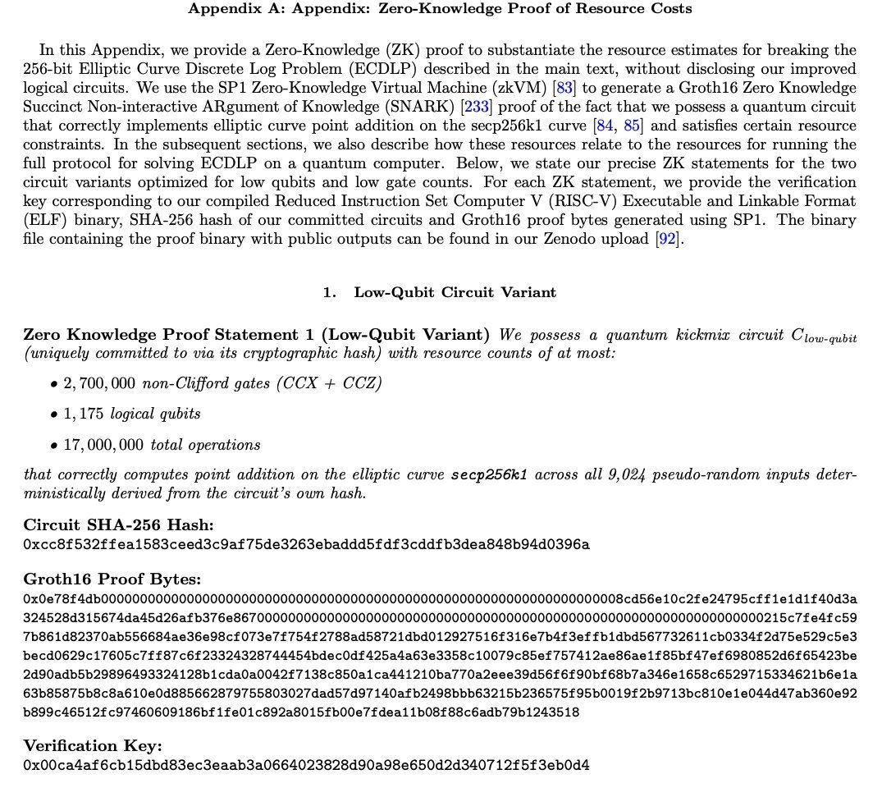

# 2026-04-02

## 1

@瑞达利欧

发表于：2026-04-02 01:41

来源：微博

链接：https://m.weibo.cn/status/5282847495293176

原则

一个决策团队，如果内部有人因为决策没有达到自己的需求而持续斗争，肯定要遭遇败绩——在公司、机构，甚至政治体系和国家，这样的例子比比皆是。我不是说人们要假装喜欢相关决策，或者未来不可再对相关问题重新讨论。我的意思是，为了提高有效性，所有集体合作的团队必须遵照规定，为分歧解决预留时间，同时，要让持不同意见的少数派明白，一旦他们的观点被推翻，整个团队的一致性要优先于个人的喜好。

团队比个人更重要，要避免破坏既定路径的行为。

## 2

@风云学会陈经

发表于：2026-04-02 01:41

来源：微博

链接：https://m.weibo.cn/status/5282854483266270

战争大概率要结束了，伊朗赢大了，美国和以色列输大了

1. 说实在的，2026年伊朗和美以大战一场，完全想不到，忽然一下就打起来了。更想不到的是，伊朗居然要赢了，赢得特别大的那种。而美国和以色列输大了。

2. 现在特朗普显然意兴阑珊了，疲劳了，不想在中东再耗下去了，一堆破事要折腾。有人说，是假装要结束，实际是调地面部队准备搞大行动，是放话和谈掩护。这全球人都看着，就算登陆也没有任何突然性了。而且一共就万把人，能干啥？只要人扎堆，导弹、小摩托、光纤无人机就会过来团灭。地面战在俄乌战争中已经证明很不好搞了，没有奇袭的可能性，就是血肉磨盘。伊朗百万人备战，会兴奋地等美国人到地面送死，在天上还不好打，山地地形是最不利于攻方的。

3. 特朗普虽然善变，但情绪还是能看出来，肯定不太好，不是感觉良好。一个是豪赌地面战，一个是跑路。但从美股市场、全球舆论看，跑路的可能性非常大了。就算最后来一把，几千人搞个行动，也不可能搞出什么名堂，颠覆不了伊朗政权。除非准备30-50万人规模的部队，像1991年沙漠风暴、2003年伊拉克战争那样，才有可行性，但这种规模的调兵根本没有迹象。美军武器数量不足，军备老化，内部乱套，很可能已经失去这个能力了。

4. 最关键一点，决定胜负的判据，就是对霍尔木兹海峡的控制。目前看，伊朗控制了，不听话的船被打了好几艘。而美国完全想不到武力恢复的办法，只能把伊朗放行10艘20艘当成“进展”。特朗普甚至发贴让别的国家自己去恢复海峡航运，美国自己不用从海湾运油。因此，有相当大可能，伊朗会武力把“霍尔木兹海峡收费站”运行起来，美国没办法，全球也没啥办法。

5. 如果是这个结果，那伊朗就赢大了。这与道德无关，世道就这样了，力量更为关键。伊朗通过决死斗争，武力控场了，掐住了世界经济的命脉。这就是一种权力，世界必须面对。再就是伊朗政权挺过了美以的攻击，意义极大，因为主要是靠伊朗自己40多年准备实现的成果，这更值得尊重，在中东伊朗就是能放话威胁别人的，实力暴增。关键是，伊朗获得了自主发展的信心，不再犹豫，全力发展导弹无人机不对称实力，很可能会把核弹也造出来。伊朗还能够要求过海峡的石油用人民币贸易，种种手段不少，有影响全球格局的实力，在全球算是相当强大的国家了。

6. 美国打成这个鬼样，输大了，不是面子问题，是实力被看穿了。连伊朗都搞不定，还想压制更强大的国家？还有石油美元、中东资金转向，很多事都要漏。特朗普中期选举也完了，很可能内乱。这会成为美国霸权结束的标志性事件，一次非常明确的失败。

7. 以色列也输大了，是生死存亡问题。以色列偷袭炸死伊朗领导人，道义上站在全球对立面，在全球名声臭了。有的欧洲国家如西班牙，都和以色列互撤大使了。从加沙开始的一系列倒行逆施，把以色列多年来的全球宣传都弄成了笑话。另一个大损失是在美国内部，美国这次大败，最大责任是以色列，引诱特朗普掉坑里了，美国内部反以情绪也会起来。而且伊朗会发展核武器，和以色列不死不休了，等发展出更精确的导弹，或者微型无人机炸弹之类的致命武器，周边真主党、哈马斯、胡塞武装来攻击，以色列国土太小很难抗住。而且以后以色列被炸惨了，也不会有人同情。

## 3

@sven_shi

发表于：2026-04-02 01:41

来源：微博

链接：https://m.weibo.cn/status/5282832754935923

像上野千鹤子在我们舆论当中的形象是被媒体彻底改造过的。她的真实故事和你在媒体当中读到的完全不同。比如这几天讲到的上野千鹤子谈养老，我国的年轻编辑，改编了一个故事，说上野多年照顾一个比她大23岁的异性“朋友”色川大吉，然后遇到了系列问题，积累了很多经验。

这当然是假的啊。那么多的女权意见领袖，上野千鹤子能被选中推到国内来，就是因为她和色川大吉的那段不伦恋。她的很多女性角度的文章，也都是从这段不伦恋引发出来的。

她是年轻时遇到了比她大23岁，早已功成名就并且已婚的色川大吉，并陷入热恋。但是色川大吉的原配对她一直不接受，并且拒绝离婚。就导致上野和色川一直处于不伦恋的情况下。那么她在职场和学术界的很多提升和成就，自然而然也会遭受很多的质疑。

后期色川大吉老了也一直和她一起，让她照顾。是直到男方的原配死亡，上野才和男方登记结婚并且以妻子的身份继承了男方的财产。在照顾男方的过程中，因为男方长期有法定的妻子和孩子，她在日本社会里没有“名份”，所以自然而然就遭遇到了很多困难。

你知道了这一段，再去看上野千鹤子的书，就能理解她讲的女人“嫉妒”女人到底是怎么回事了。她书里讲的，就是她情人色川大吉的老婆，不去抱怨老公不爱自己，而是嫉妒她这个“同性的女人”。

她的经历，就活脱脱是一个日本版的琼瑶。

就是因为这段独特的经历，她才能被选中推荐进入大家的视野。

可是真把她选进来之后，她的这些故事就被大规模的改编，在媒体上变成了另外一个样子。

## 4

@升值计

发表于：2026-04-01 23:40

来源：微博

链接：https://m.weibo.cn/status/5282797126421634

张雪机车夺冠，你不应该问，为什么东大摩托能夺冠，而是应该问：

为什么到现在，东大的摩托才夺冠？

因为以咱们世界第一工业国，全球最全工业体系的工业实力，我们夺冠的时间，应该在90年代末，最晚21世纪初。

为啥没有呢？

因为禁摩啊，因为中国的几乎所有城市都是禁摩的。因为大多数城市看不上摩托车这种东西，有汽车工业的要发展汽车工业，没有汽车工业的，希望自己的城市漂亮。

为啥张雪机车能成？

除了张雪本身向内求的坚韧，自强不息，还因为，他在重庆。

重庆是中国大城市里头，唯一一个不禁摩的。

重庆为啥不禁摩？

因为重庆有无数的摩托车厂，摩托车配件厂，是曾经中国唯二的摩托车生产基地，属于当地的支柱产业，百万漕工，衣食所系。

重庆的摩托车行业为啥牛逼？

因为重庆是军工重地，有很多军事工业，改开后被迫军转民，最后共同选择了摩托车这个行业，并带动了当地摩托车产业链，张雪是其中后起之秀的后起之秀。重庆当年，百摩大战本田，隆鑫、力帆、建设，风头一时无两，这些摩托车公司，即使不是原来军改民的底子，技术人员，也是原来军事工业的工程师和技师。

另外一个摩托车生产比较厉害的基地，是浙江，

浙江摩托车产业同样也是军工底子，

但是浙江本地是没有军事工业的。

他们很多技术人员都来自，河南洛阳。

洛阳北易。

当年的中国兵器集团和泰国合资的产业，很多技术人员被浙江企业挖走，成就了浙江的摩托车产业。

重庆的军工为啥牛逼？

因为三线建设。

当年中苏关系紧张，要在三线地区，大力建设军工产业，重庆是作为战时陪都和军事工业基地建造的，是世界大战的备份，所以有大量军工产业。

洛阳同理。

这才是张雪机车夺冠的全部故事，也是张雪成功的外部性。

重庆出现一个摩托车公司，赢过日本乃至全球的摩托车公司，是必然的，没有张雪也一定会有李雪王雪。

只是不该这么晚。

我原来去东南亚，最大的感触是，这些国家都是不禁摩的，我在海南住了几年，感觉最适合这里的交通工具，就是摩托车，可以说，别的地方不好说，至少整个长江以南，最适合居民出行的交通工具，本来就是摩托车。

小电驴和摩托，才应该是一个发展中国家家庭的标配。

但是，大多数城市，包括县城是没有摩托车，特别是大排量摩托车的生存空间的。

这才是张雪之所以是张雪，不是王雪也不是李雪，他能在一个看起来没有前途的行业，硬是凭着爱好，走了一条路出来。

## 5

@蚁工厂

发表于：2026-04-02 01:41

来源：微博

链接：https://m.weibo.cn/status/5282872560715251

速度真快啊。Claude Code 源码刚发布没几个小时，这就有解析的书搞出来了

github.com/sawzhang/deep-dive-claude-code

应该是让AI模仿《Elasticsearch 源码解析与优化实战》《深入理解 Linux 内核》《C++ 编程思想》等经典技术书籍的架构风格，写了一本从源码层面系统剖析 Claude Code 代码的书。AI味较浓，仅供参考，下为介绍。

----------------

Claude Code 是 Anthropic 推出的命令行 AI 编程助手，也是目前业界最复杂的终端 AI Agent 实现之一。本书从源码层面，参考《Elasticsearch 源码解析与优化实战》《深入理解 Linux 内核》《C++ 编程思想》等经典技术书籍的架构风格，系统剖析 Claude Code 的设计思想与工程实践。

核心特色：

所有分析基于真实源码引用，非泛泛而谈

101 个 Mermaid 图表（架构图、时序图、状态机、流程图）

467 个 TypeScript 代码块，带语法高亮和注释

深入到设计决策和工程权衡，不止于 API 描述

目录概览如图。

## 6

@李建秋的世界

发表于：2026-04-02 01:42

来源：微博

链接：https://m.weibo.cn/status/5282885569613478

小提示：很多人觉得美帝拉了，所以S3不存在。

其实不一样，如果美帝速通反而可能没有S3。

正是因为拉了，才会有更多国家蠢蠢欲动，

大国觉得中等强国土鸡瓦犬，中等强国觉得大国徒有其表。

## 7

@蚁工厂

发表于：2026-04-02 01:42

来源：微博

链接：https://m.weibo.cn/status/5282881073059831

Sebastian Raschka对Claude Code 源码的分析：

------------------------

Claude Code 真正的核心优势（很可能）不在模型本身

今天似乎曝出了 Claude Code 的源码。我在 GitHub 上看到了几份 TypeScript 代码库的快照。出于法律原因，我不想在这里放链接，但里面确实有一些值得学习的细节。

当然，大家大概都知道，Claude Code 在编程任务上比 Claude 网页聊天更强，原因并不是“给聊天界面外面套了一层 shell”，而是它本质上更像一个经过精心设计的工具系统，并且在提示词和上下文处理上做了不少优化。

我也得说明，很多定性的编程能力当然还是来自模型本身；但我认为，Claude Code 之所以这么强，更关键的是这套软件层的“支撑框架（software harness）”。也就是说，如果把其他模型——比如 DeepSeek、MiniMax 或 Kimi——接进来，再针对这些模型做一些优化，同样也可能得到非常强的编程表现。

下面这些点，主要是出于学习目的，帮助理解代码代理（coding agent）是怎么工作的。

1. Claude Code 会构建实时仓库上下文

这点可能最直观：当你开始输入提示时，Claude 会加载主分支、当前分支、最近的提交记录等信息，还会把 CLAUDE.md 一并纳入上下文。

2. 激进地复用 Prompt 缓存

里面似乎有一种“边界标记”机制，用来区分静态内容和动态内容。也就是说，那些静态部分会被全局缓存起来，以保证稳定性，也避免每次都重新构建和重新处理那些开销很大的内容。

3. 它的工具链，比“上传文件后聊天”强得多

从提示内容看，系统会引导模型优先使用专门的 Grep 工具，而不是通过 Bash 去调用 grep 或 rg。原因大概是，这种专用工具在权限控制上更好，而且结果收集机制也可能更完善。

另外，它还有专门的 Glob 工具用于文件发现；还有一个 LSP（Language Server Protocol，语言服务器协议）工具，用来做调用层级分析、查找引用等。这相较于普通聊天界面是很大的增强——因为聊天界面里，代码更像是“静态文本”，而不是可被语义化理解和导航的程序结构。

4. 尽量减少上下文膨胀

处理代码仓库时，最大的一个问题当然是上下文窗口有限。尤其当你和代理来回多轮交互、反复读取文件、加入日志文件、长 shell 输出时，这个问题会更明显。

Claude Code 里有不少底层机制专门用来压缩这部分负担。比如，它会做文件读取去重：如果文件没有变化，就不再重复处理。

另外，如果某些工具输出太大，它会把结果写到磁盘里，而在上下文中只保留预览内容和文件引用。

当然，和现代 LLM 界面类似，它也会自动截断过长上下文，并在必要时触发自动压缩/摘要。

5. 结构化的会话记忆

Claude Code 会为当前对话维护一个结构化的 Markdown 文件，其中包含类似这样的分区：

会话标题

当前状态

任务说明

文件与函数

工作流

错误与修正

代码库与系统文档

学到的内容

关键结果

工作日志

这其实很像人类写代码时的习惯：会记笔记、做摘要、保留阶段性结论。

6. 它会使用 Fork 和子代理

这点应该不算意外：Claude Code 会通过子代理并行处理任务。很长一段时间里，这几乎就是它相对 Codex 的卖点之一（直到 Codex 最近也开始支持子代理）。

在这里，fork 出来的代理会复用父代理的缓存，同时又能感知或处理可变状态。这样系统就可以把摘要、记忆提取、后台分析之类的旁路工作分出去做，而不会污染主代理循环的上下文。

为什么它用起来、效果上都比网页 UI 里的编程体验更好

总的来说，Claude Code 之所以比纯网页 UI 更好用，不是因为提示词工程更强，也不只是因为模型更强，而是因为上面这些零碎但关键的性能优化和上下文管理机制共同叠加出来的效果。

当然，易用性本身也是一部分原因：所有内容都在本机上，组织得更清晰，而不是把文件上传到一个聊天界面里去处理。

## 8

@薛凯-又重名了

发表于：2026-04-02 01:42

来源：微博

链接：https://m.weibo.cn/status/5282875470515288

一个用户数足够多的平台，是不可能自发成为某极端主义思潮把控的舆论阵地的，除非平台自己控制舆论。当年的 Twitter 是左派和政治正确的大本营，你说任何触犯政治正确的言论都会被删除甚至封号，马一龙收购之后，把那群控制舆论的人裁了，完全用机器学习来做推荐算法，现在的 X 再也不是白左阵地了。小红书现在演变成反人类的言论阵地，要不是官方的言论管控才怪了。公司老板这么玩舆论，某天被重拳砸碎了，就是活该。

## 9

@薛凯-又重名了

发表于：2026-04-02 14:21

来源：微博

链接：https://m.weibo.cn/status/5282875470515288

4-1 04:52 来自 华为 Mate X7

一个用户数足够多的平台，是不可能自发成为某极端主义思潮把控的舆论阵地的，除非平台自己控制舆论。当年的 Twitter 是左派和政治正确的大本营，你说任何触犯政治正确的言论都会被删除甚至封号，马一龙收购之后，把那群控制舆论的人裁了，完全用机器学习来做推荐算法，现在的 X 再也不是白左阵地了。小红书现在演变成反人类的言论阵地，要不是官方的言论管控才怪了。公司老板这么玩舆论，某天被重拳砸碎了，就是活该。

## 10

@伊利达雷之怒

发表于：2026-04-01 07:50

来源：微博

链接：https://m.weibo.cn/status/5282920433977043

该说不该说的，家庭生活中，妻子和丈夫的地位如果不平等，小孩容易捡样，并且在未来和自己伴侣相处的时候表现出来。比如视频中这种情况，小孩打自己的爸爸，不及时制止和纠正，长偏是大概率事件。只是很多爸爸自诩“女儿奴”自以为是和孩子关系好而忽视和放纵。妈妈又觉得孩子多懂事啊知道保护妈妈。

当然了，源头肯定不在小孩身上，她大概率是跟她妈学的。她妈平时对她爸呼来喝去，非打即骂。她爸没有人格和尊严，小孩三观不成熟，学不到应该尊重自己的父亲和丈夫。

你在网上看到那么多感觉心理有问题的人，她们的童年大概率也是这么过来的。而且比大家想象的要普遍。这些人只不过是把她母亲如何对待父亲的模式复刻到陌生人身上。遇到问题就尖叫，感觉到被冒犯就发飙，完全不控制自己情绪，俗称社会化程度不够。

---

## 11

@刘新征

发表于：2026-04-01 13:23

来源：微博

链接：https://m.weibo.cn/status/5283004173782872

说一下最近在vibe Coding的几个项目：1.截屏日志系统，每一秒钟对电脑截个屏，然后把截屏内容给结构化，让大模型来分析个人行为习惯和兴趣漂移，每一天看的是行为分析，再和前两周做对比，每一周看的是作息规律与兴趣汇总，每月看兴趣趋势漂移。2.跨程序的AI记忆系统：因为Claude Code Pro半天就用完了，为了无缝可以切换到国内的各种龙虾们，搞了一套独立的记忆系统，而且直接上云，类似于这两天被泄露的Claude Code的Dream Agent。3.录音洞察系统，一个基于Electron的录音管理软件，对个人深度谈话进行长期跟踪，一为了管理，二为了涌现在谈话的时候，自己没有发现的一些关联和想法。4.拐点系统，一个中期趋势研判的Agent集。以及一些纯线下项目的管理和推进。晚上跟人喝酒，聊我这些项目，被人笑话了半天………

## 12

@图老板赛博札记

发表于：2026-04-01 14:22

来源：微博

链接：https://m.weibo.cn/status/5283019063824793

守株待兔。春秋时，宋国有个农民。有一天，他在耕作的时候，看到了一只兔子在奔跑中忽然撞到了一棵树桩上，当场死了。于是他毫不费吹灰之力的就得到了一只兔子。他想，如果天天这样，我就不用辛苦的锄地了。从此以后，他就天天守在这根树桩旁，希望能再得到撞死的兔子。他等啊等，再也没有见到撞死的兔子。结果不仅兔子没有得到，连庄稼都双荒芜了。守株待兔，株是露出地面的树桩，比喻死守狭隘的经验而不知道变通，或抱着侥幸心理妄想不劳而获。语出自《韩非子·五蠹》，兔走触株，折颈而死。

## 13

@宝玉xp

发表于：2026-04-01 06:37

来源：微博

链接：https://m.weibo.cn/status/5282901949153782

Claude Code 也算是正面回应代码泄漏的事情了，还是值得点赞👍

直面问题，没有怪到人头上，也没因此开除谁。

（哪些号称刚加入 Anthropic 搞出这问题被开除都是蹭热度的营销号）。

Boris：

> 工作中，犯错总是在所难免。但作为一个团队，最重要的是要达成一种共识：出了问题绝不该怪罪到某个人头上。真正的“罪魁祸首”往往是我们的流程设计、团队文化，或者是底层的基础设施 (infra)。

>

> 就拿这次的事故来说吧，问题出在一个本该实现自动化 (automated)，却仍然由人工手动操作的部署 (deploy) 环节上。痛定思痛，为了避免下次重蹈覆辙，我们的团队已经对自动化流程进行了几项立竿见影的优化，并且还有更多的改进措施正在紧锣密鼓地推进中。

---

## 14

@物理芝士数学酱

发表于：2026-04-01 15:08

来源：微博

链接：https://m.weibo.cn/status/5283030466823774

前两天 谷歌研究院展示了一种效率提升约20倍的Shor算法实现方案 网页链接/，该方案可以使用约50万个物理量子比特在几分钟内破解ECDSA密钥。

Shor算法是\#量子计算\#领域最著名的算法之一，由数学家Peter Shor 在 1994 年提出。它能够在量子计算机上高效分解大整数。

给定一个大整数 𝑁，找到它的质因数分解。这在经典计算机上没有已知的多项式时间算法，所以这也是现代密码学（如 RSA）的安全基础。

但Shor算法利用量子并行性和量子傅里叶变换，可以在多项式时间内完成分解。

如今，谷歌对2029年实现后量子时代转型更有信心。

他们认为自己的发现可能引发非常严重的后果，所以没有公布原文，展示具体算法。相反，他们发布了一份零知识证明（ZKP），证明他们知道具有这些特性的量子电路。这非常不寻常，表明谷歌认为这件事非同小可。

那什么是零知识证明？

它是密码学 中一个极其精妙且反直觉的概念。如今又和量子计算与计算复杂性学科相关。

简单来说，它的核心定义是：你可以向别人证明你满足某个条件，或掌握某个信息，但在证明的过程中，你绝对不会向对方泄露任何额外的具体数据。

设想现在网络上有两个人A和B互喷，他们称彼此为低收入loser。他们要想分出胜负，就需要公开自己的收入，但两个人都不想暴露具体的收入。那么要怎么分出高下呢？

这就是密码学界非常出名，姚期智的百万富翁问题（Yao's Millionaires' Problem）。它本质上属于“安全多方计算”，但其背后的防泄密精神与零知识证明是一脉相承的。

我可以构造一套纯数学的、由AB两人提供的已知信息构建的系统。在这个系统里，存在一个函数f（x，y） ，两人只要自己私下把收入数据带入x或y，而无需向对方展示，f（x，y）就能计算出x-y是否大于0！

但是这部分太抽象，虽然这个帖子本身就很抽象了，但实际数学构造还要抽象百倍。

所以我们借助物理现实来构建这个系统。

假设有一个房间，里面有 100 个带有“投信口”的储物柜，编号从 1 到 100，分别代表月薪 1 万到 100 万。柜子的钥匙则是经典推理小说里的设定：短时间内无法复制，而且特征明显，一看就知道是这些柜子的钥匙。

现在，A（月薪 50 万）和 B（月薪 30 万）要争论谁的收入更高，但谁都不想说出自己的底牌。

操作步骤如下：

B 作为这 100 个柜子的所有者，拥有所有的钥匙。他的月薪是 30 万，于是他悄悄拔下第30号柜子的钥匙装进口袋，然后将剩下 99 把钥匙在门口当着A的面彻底销毁。

现在只能打开 30 号这一个柜子。

然后B离场，A进场： 房间里只有一个人，他不知道 B留下了哪把钥匙。

A的月薪是50万。于是写了 100 张纸条，分别塞进这 100 个柜子的投信口里：

在 1 号到 49 号柜子里，塞入的纸条写着：“我的收入比这个柜子的编号高。”

在 50 号到 100 号柜子里，塞入的纸条写着：“我的收入比这个柜子的编号低（或等于）。”

A离场，B再次进场。用他手里唯一的那把钥匙，打开了 30 号柜子。他拿出里面的纸条，上面清晰地写着：“我的收入比这个柜子的编号高。”

这就构造了基于物理系统的“零知识”证明。此时零知识有赖于物理系统的可靠性。

此外需要注意，说谎的情况是没有讨论意义的，如果一个人对只有自己知道的秘密说谎，那外人无论无论用到何种高深的数学都无法知道真相。此时需要的是刑讯逼供或吐真剂一类的东西。

言归正传所以谷歌相当于在没有提供信息的情况下，向外界证明自己确实优化了Shor算法。

如果想对零知识证明有更“体贴”的感受，可以做做我以前出的一个问题。相当于要求构建一个“很少”知识证明系统。

————————

你和其他15个人，参加类似于鱿鱼游戏的真人秀节目。你们每个人都有一个身份ID，是一个9到15位数。这个是自己最大的秘密。因为游戏里原则上每个人都是潜在的竞争对手，如果被他人知道了自己的ID，在后面的环节里就有可能直接被对方淘汰出局。比如说，某个关卡有个奖励道具是死亡笔记，只要把ID写上去，对应的玩家就直接出局。

另一方面，与人共享ID信息就可以结盟，并带来巨大的好处，比如说得分翻倍。所以，如果玩家之间存在场下的亲密关系(如夫妻，亲友等)，天然存在互信的基础，结盟就能给自己带来巨大优势。但结盟与否，其他玩家是不可见的。显然，结盟的人也不会自己四处宣扬。

现在的问题是，你自己有没有信得过的人，你自己最清楚。同时，你也不知道其他人有没有盟友。

现在，你们16个人卡在某一环节上。

过关条件是：打开并通过一道密码门，密码是你们所有人的ID之和。

现在，你能否设计出一个相对简单的算法(一套操作流程，必要的时候可以向组织者索要各种简单工具)，既算出所有人的ID之和，同时保护自己(和其他玩家)的ID不为彼此所知？

此时，假如其他15个人已在私下结盟，那你无论如何都无法守住自己ID。但让我们乐观一点，不考虑如此极端的情况——否则还不如直接退出游戏回家。但可以肯定的是，其他玩家肯定有若干人已经结盟。

---

## 15

@图老板赛博札记

发表于：2026-04-02 14:22

来源：微博

链接：https://m.weibo.cn/status/5280472125151003

黄粱一梦。唐朝时，有个书生叫卢生。有一年，他进京赶考，半路投宿在旅店时，遇上一个道士。这个道士送给他一个青瓷枕。晚上，旅店店主煮了一锅黄粱米饭。卢生在一旁枕着青瓷枕睡着了。在梦里，卢生梦见自己升官发财，娶妻生子，心里舒服极了。可是到他80岁时，得了重病，眼看就要死了。就在此时，卢生大叫一声，从梦里醒来。这时他才发现，原来这是一场梦。而此时，店主人的高粱米饭还没有煮熟呢。黄粱一梦，黄粱是小米，比喻好事成空或者幻想破灭。

## 16

@图老板赛博札记

发表于：2026-04-02 14:22

来源：微博

链接：https://m.weibo.cn/status/5279618493842280

看见一切，而非统治一切：Palantir 本体论与技术哲学的深层呼应

在聊完 Palantir 这个名字背后的真知晶石与至尊魔戒的隐喻之后，我们很自然会走到一个更核心的问题面前：这家公司究竟用什么样的技术，实现了它所宣称的“看见而非统治”。答案藏在一个听起来有些哲学意味的词汇里——Ontology，也就是我们常说的本体论。这个词并非空洞的概念包装，而是 Palantir 数据模型的根基，更是它从文学意象走向现实技术的完整落地，与我们之前谈到的权力逻辑、信息模式形成了严丝合缝的呼应。

在大多数传统的数据体系里，信息的组织方式是零散且固化的。企业会为不同的业务搭建独立的数据库，为不同的部门设计专属的表格与字段，人、设备、事件、流程被切割在互不连通的系统中，同样一个现实对象，在不同端口会被冠以不同的名称、遵循不同的规则。这种模式本质上是为了适配单一功能，而非理解完整的世界，就像我们手中握着一堆破碎的地图碎片，能看清局部，却永远无法拼凑出全局。而这也恰好是“魔戒式”技术逻辑的隐性体现：以控制为目的，以边界为手段，将数据囚禁在固定的结构里，最终服务于特定的、封闭的目标。

Palantir 的本体论完全跳出了这样的框架。它不先从表格与字段出发，而是试图还原现实世界本身的逻辑，先定义真实存在的对象、对象之间的关系、发生过的事件，以及可以对这些对象执行的动作。它不强行改造数据源，也不要求所有系统统一格式，而是将来自不同端口、不同形态的数据，映射到一套统一的语义体系之中。在这个体系里，一架飞机、一名工程师、一次维修、一批备件，都有唯一且清晰的指向，无论数据来自ERP、传感器、文档还是外部接口，系统都能识别出它们指向的是同一个现实存在。更重要的是，这套模型不只是用来“查看”数据，而是可以直接在对象上完成操作、执行流程、留下记录，让数据从静态的报表，变成可感知、可运用的业务本体。

这种设计，几乎是对真知晶石意象的技术复刻。托尔金笔下的帕兰提尔，作用是连通远方、呈现全貌、揭示隐秘，它不扭曲世界本身，只将分散的景象整合为统一的视野；Palantir 的本体论所做的，也是打破数据的壁垒，消除信息的割裂，让原本隐藏在各个系统中的关联变得可见，让使用者能够穿透碎片化的信息，触摸到业务的全貌。它不试图控制业务的走向，不强迫使用者遵循固定的流程，只是提供一套理解世界、观察世界的统一语言，这与“看见而非统治”的理念完全一致。

我们可以再次将它与至尊魔戒的逻辑做一次对照。至尊魔戒追求的是唯一、垄断与绑定，要用一种力量统治所有存在，对应到技术中，便是以大一统的系统绑架所有业务，以封闭的生态锁定所有数据，让使用者不得不依附于单一的体系。而 Palantir 的本体论从根源上拒绝了这种路径，它不做覆盖一切的控制者，而是做连接一切的观察者；不强行定义世界应该如何运行，而是还原世界原本的关联与结构。它的价值不在于占有数据，而在于疏通数据；不在于支配业务，而在于清晰呈现业务。

当然，就像真知晶石本身不具备善恶，只会被更强的意志所影响，Palantir 的本体论也始终保持着工具的中立性。它可以呈现完整的事实，也可能放大片面的关联；它能辅助理性的决策，也可能成为偏见的载体。技术本身不会替人判断，不会替人负责，它只是把世界看得更清楚，而判断与选择的权力，始终留在使用者手中。这也是 Palantir 从名字到技术一以贯之的清醒：它不提供绝对的正确，只提供绝对的视野；不追求主宰一切的力量，只追求理解一切的可能。

从文学隐喻到技术模型，Palantir 始终在回答同一个问题：在信息与数据愈发庞大的时代，技术究竟应该走向控制，还是走向理解。它用本体论给出了自己的答案，也让真知晶石的意象不再只是一个名字，而是一套可落地、可验证的技术哲学。在充斥着垄断与扩张的技术环境里，这种克制的、以洞察为核心的路径，或许恰好是对“力量”本身最理性的诠释。

## 17

@小互AI

发表于：2026-04-02 14:22

来源：微博

链接：https://m.weibo.cn/status/5283198873637066

牛P

Claude Code 发布了 NO_FLICKER 模式

一个全新的终端渲染方案

- 终端不再闪烁，而且可以直接用鼠标了

-不再闪烁 不再跳跃，内存和CPU使用率也大幅下降

- 终端里能用鼠标了

这是 NO_FLICKER 模式附带的惊喜：完整的鼠标操作支持。

现在可以通过鼠标点击来移动输入框内的光标。其他一些界面元素现在也可以点击了。

点击输入框定位光标位置，不用再按方向键一格格挪

点击折叠的工具调用结果展开查看完整输出，再点一下收起来

点击 URL 直接在浏览器里打开，点文件路径在默认编辑器里打开

拖拽选中文字，松开鼠标自动复制到剪贴板（可在 /config 里关掉）

鼠标滚轮翻看对话历史

双击选词，三击选行。在支持 kitty 键盘协议的终端（kitty、WezTerm、Ghostty、iTerm2）里，选中状态下 Ctrl+C 是复制而不是取消操作。

开启方式就一行：

CLAUDE_CODE_NO_FLICKER=1 claude

详细内容：网页链接 小互AI的微博视频

---

## 18

@水晶苍蝇拍

发表于：2026-04-02 14:22

来源：微博

链接：https://m.weibo.cn/status/5283236323527404

昨天看了一个纪录片《开盘》，讲的是21年河南一个恒大楼盘上市销售过程里几个销售顾问的故事。在片子前半部分，主要是楼盘造势开盘，当时市场还有最后的余热，在公司残酷的淘汰制度的鞭打催促下，销售们没日没夜的揽客和催单，开盘时候也呈现了短暂的抢购风潮，到这里似乎还是个励志的故事。

在项目开盘当日的现场，除了曾经熟悉的人头攒动和主持人不断销售额报喜的热闹，墙上还挂着一些当时比较流行的推销横幅，比如“错过这套房，后悔一辈子”。

随后几个月过去，楼盘突然大降价，从开盘的6000元均价跳水到3000元（其实就是恒大现金流断了），然后就是老客户上门维权把售楼处占领了。在这个过程里，公司又号召销售们去推销高回报的公司内部理财，甚至不少销售为了达到业绩标准自己认购内部理财，不过这个小团队的领导还是不错，提醒自己下面人不要买，宁愿被罚款。

纪录片的最后是快21年末了，所有理财产品全部暴雷，老客户也不来闹了，因为发现现在不是买贵了的问题，而是楼盘都要烂尾了，售楼处早已人去楼空。而且最终销售们的佣金也没拿到，忙死忙活大半年，最后所有人都灰头土脸的离开，走向未知的迷茫，这里面从销售到管理层，再到客户，所有人从头到尾可能也不知道为什么会这样。

结合最新的万科巨亏800多亿的年报，和跌了5年多后当下死鱼一般的房地产市场，让人感慨真是人生如梦。

## 19

@李楠或kkk

发表于：2026-04-02 14:23

来源：微博

链接：https://m.weibo.cn/status/5283235879716694

很多没有去过主要列强国家，比如日本的同学可能不理解。

贩卖中国崩溃论，是一门类似 ktv 陪酒小姐的生意。

而且这门生意对海外华人特别友好，因为外国人

第一不熟悉情况，

第二中国的事情，还是中国人信用更好。

美国有章家敦，日本有石平，然后收集一些负面，如果没有负面正面其实也可以，就比如北京举办奥运会。。。

然后怎么推导不重要，关键结论要清楚：中国经济要崩溃。

书就大卖，钱就赚到。。。

这就是一个 ktv 陪酒小姐的活，你们说的我不懂，我说的你也不信，但是，我可以知道你想听什么，我编个故事哄你开心赚点小钱钱而已。

所以其实这种书出的很规律，一两年就一本。有什么改变不重要，重要的是，ktv 小姐手头紧了。。。

但是时间长了，这种鬼话说多了。。。

日本人也就信以为真了。。。

---

## 20

@挨踢牛魔王

发表于：2026-04-02 14:23

来源：微博

链接：https://m.weibo.cn/status/5283234617493282

字节跳动最新出了一个可以在手机上跑的图像模型。

这个东西过于离谱了，是图像生成和图像编辑统一的模型。

就是说，你可以用这个模型生图，也能编辑。

关键是这个模型的大小，参数只有区区的0.39B，看评分，居然还超过了黑森林工作室早期出的kontext 12B的模型。

可以在手机上跑，就意味着，你不用连云端，不用消耗云端的token，你就用手机本地的算力，想怎么跑就怎么跑。

速度也非常快，Phone 17 Pro，4秒就能出图。

这说明现在图像模型的水分还很大，6B，9B，12B这种级别的模型还有很大的压榨空间，性能提升的空间也很大。

就是说，这类模型，在消费级显卡跑，应该可以做到覆盖大部分图像场景。

这对于设计师们是一个利好，就是将来可能本地模型就够完成大部分任务，而不用去用nano banana这种昂贵的模型。

项目官方说明：

DreamLite，一种紧凑统一的设备内扩散模型（0.39B），支持单一网络内的文本转图像生成和文本引导图像编辑。

DreamLite 建立在修剪的移动 U-Net 骨干上，并通过上下文空间连接在潜在空间中统一条件条件。

通过采用步进蒸馏，DreamLite实现了四步推断，在iPhone 17 Pro上使用4位Qwen VL和fp16 VAE+UNet，在约3秒内生成或编辑1024×1024图像——完全在设备上，无需云端。

看计划，是准备把模型和代码都开源的，现在还没有开源。

项目主页：carlofkl.github.io/dreamlite/\#

---

