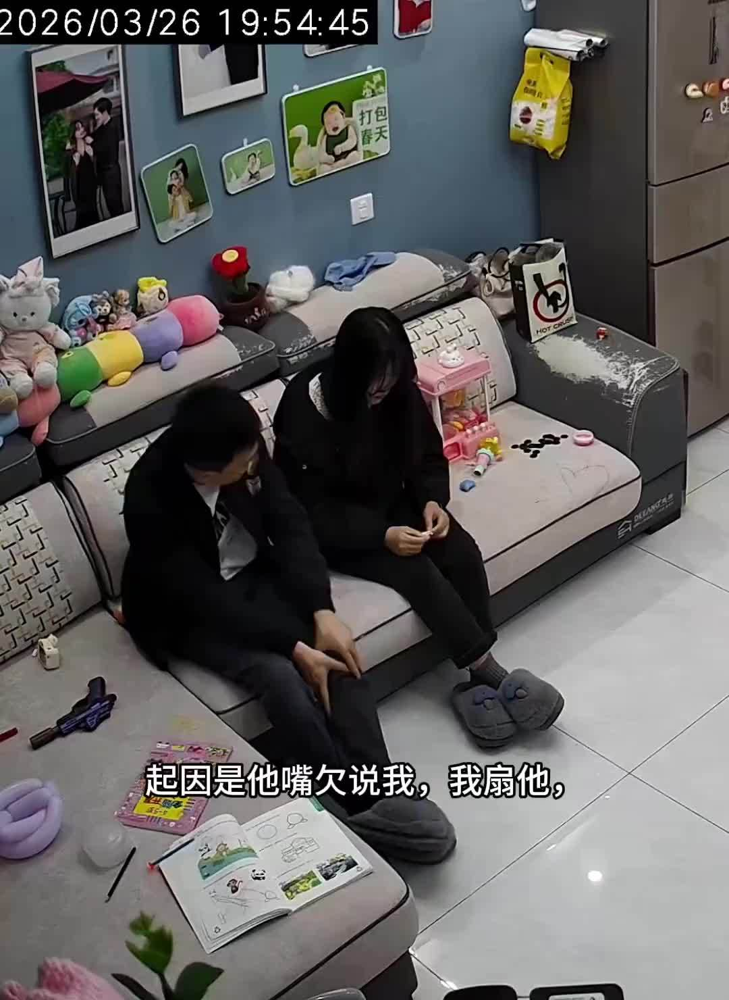
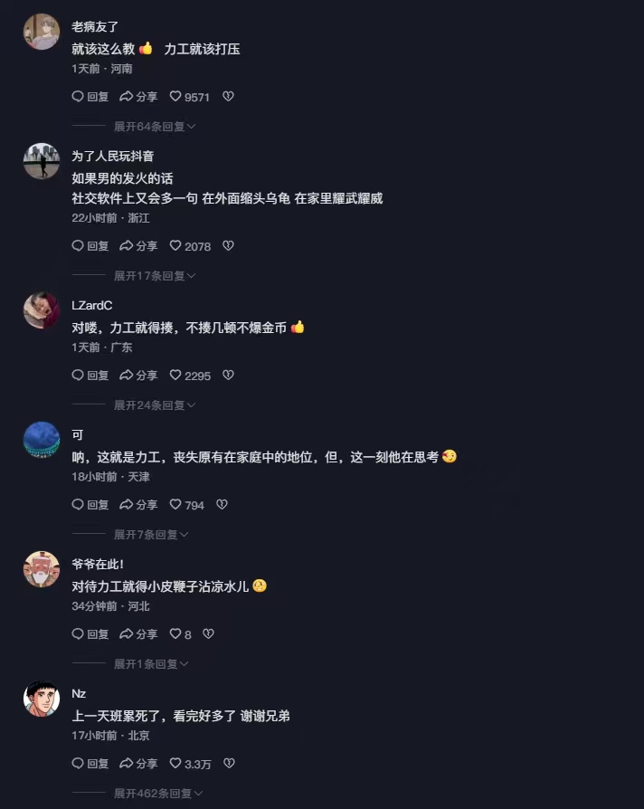

@伊利达雷之怒
发表于：2026-04-01 07:50
来源：微博
链接：https://m.weibo.cn/status/5282920433977043

该说不该说的，家庭生活中，妻子和丈夫的地位如果不平等，小孩容易捡样，并且在未来和自己伴侣相处的时候表现出来。比如视频中这种情况，小孩打自己的爸爸，不及时制止和纠正，长偏是大概率事件。只是很多爸爸自诩“女儿奴”自以为是和孩子关系好而忽视和放纵。妈妈又觉得孩子多懂事啊知道保护妈妈。
当然了，源头肯定不在小孩身上，她大概率是跟她妈学的。她妈平时对她爸呼来喝去，非打即骂。她爸没有人格和尊严，小孩三观不成熟，学不到应该尊重自己的父亲和丈夫。
你在网上看到那么多感觉心理有问题的人，她们的童年大概率也是这么过来的。而且比大家想象的要普遍。这些人只不过是把她母亲如何对待父亲的模式复刻到陌生人身上。遇到问题就尖叫，感觉到被冒犯就发飙，完全不控制自己情绪，俗称社会化程度不够。

---

