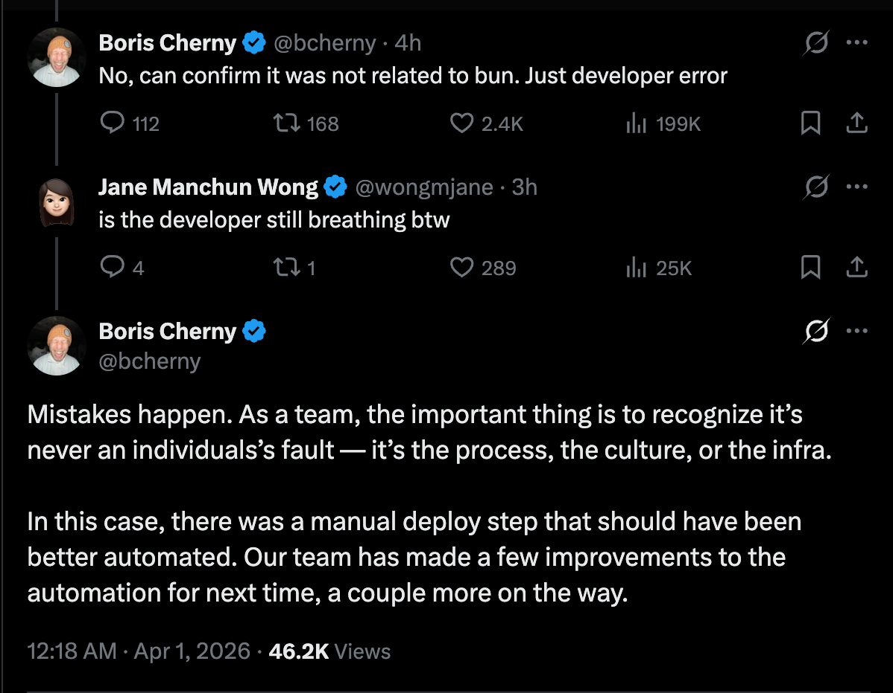

@宝玉xp
发表于：2026-04-01 06:37
来源：微博
链接：https://m.weibo.cn/status/5282901949153782

Claude Code 也算是正面回应代码泄漏的事情了，还是值得点赞👍
直面问题，没有怪到人头上，也没因此开除谁。
（哪些号称刚加入 Anthropic 搞出这问题被开除都是蹭热度的营销号）。

Boris：
> 工作中，犯错总是在所难免。但作为一个团队，最重要的是要达成一种共识：出了问题绝不该怪罪到某个人头上。真正的“罪魁祸首”往往是我们的流程设计、团队文化，或者是底层的基础设施 (infra)。
>
> 就拿这次的事故来说吧，问题出在一个本该实现自动化 (automated)，却仍然由人工手动操作的部署 (deploy) 环节上。痛定思痛，为了避免下次重蹈覆辙，我们的团队已经对自动化流程进行了几项立竿见影的优化，并且还有更多的改进措施正在紧锣密鼓地推进中。

---

