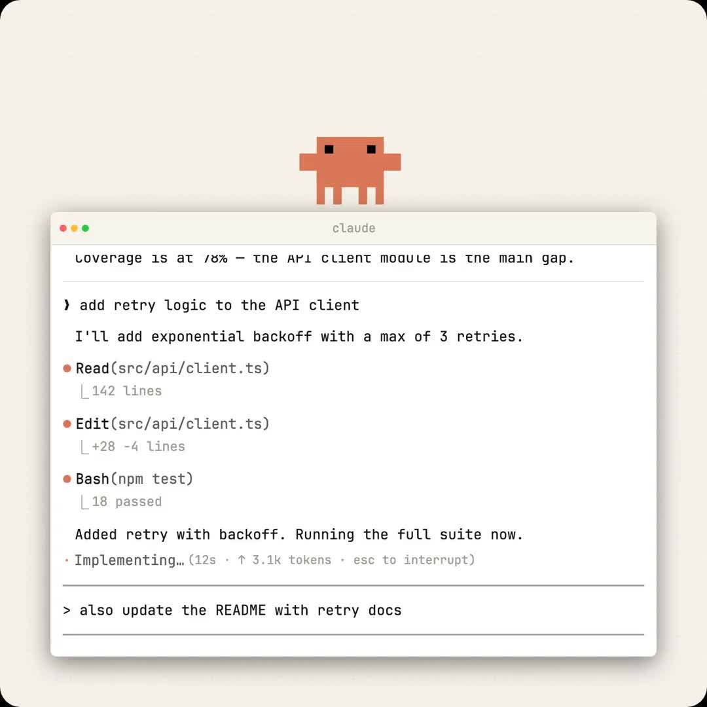

@小互AI
发表于：2026-04-02 14:22
来源：微博
链接：https://m.weibo.cn/status/5283198873637066

牛P

Claude Code 发布了 NO_FLICKER 模式

一个全新的终端渲染方案

- 终端不再闪烁，而且可以直接用鼠标了

-不再闪烁 不再跳跃，内存和CPU使用率也大幅下降

- 终端里能用鼠标了

这是 NO_FLICKER 模式附带的惊喜：完整的鼠标操作支持。

现在可以通过鼠标点击来移动输入框内的光标。其他一些界面元素现在也可以点击了。

点击输入框定位光标位置，不用再按方向键一格格挪

点击折叠的工具调用结果展开查看完整输出，再点一下收起来

点击 URL 直接在浏览器里打开，点文件路径在默认编辑器里打开

拖拽选中文字，松开鼠标自动复制到剪贴板（可在 /config 里关掉）

鼠标滚轮翻看对话历史

双击选词，三击选行。在支持 kitty 键盘协议的终端（kitty、WezTerm、Ghostty、iTerm2）里，选中状态下 Ctrl+C 是复制而不是取消操作。

开启方式就一行：

CLAUDE_CODE_NO_FLICKER=1 claude

详细内容：网页链接 小互AI的微博视频

---

