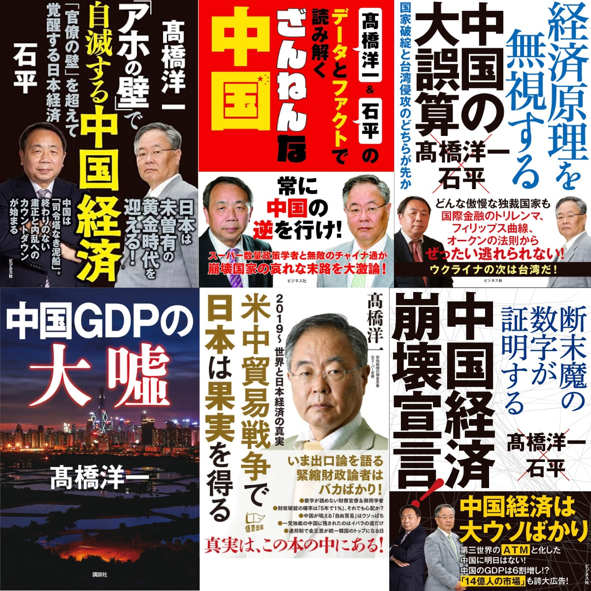

@李楠或kkk
发表于：2026-04-02 14:23
来源：微博
链接：https://m.weibo.cn/status/5283235879716694

很多没有去过主要列强国家，比如日本的同学可能不理解。

贩卖中国崩溃论，是一门类似 ktv 陪酒小姐的生意。

而且这门生意对海外华人特别友好，因为外国人
第一不熟悉情况，
第二中国的事情，还是中国人信用更好。

美国有章家敦，日本有石平，然后收集一些负面，如果没有负面正面其实也可以，就比如北京举办奥运会。。。

然后怎么推导不重要，关键结论要清楚：中国经济要崩溃。

书就大卖，钱就赚到。。。

这就是一个 ktv 陪酒小姐的活，你们说的我不懂，我说的你也不信，但是，我可以知道你想听什么，我编个故事哄你开心赚点小钱钱而已。

所以其实这种书出的很规律，一两年就一本。有什么改变不重要，重要的是，ktv 小姐手头紧了。。。

但是时间长了，这种鬼话说多了。。。

日本人也就信以为真了。。。

---

