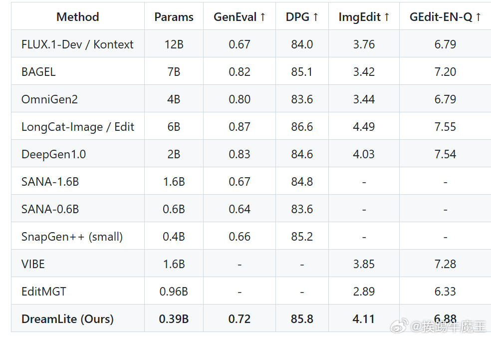
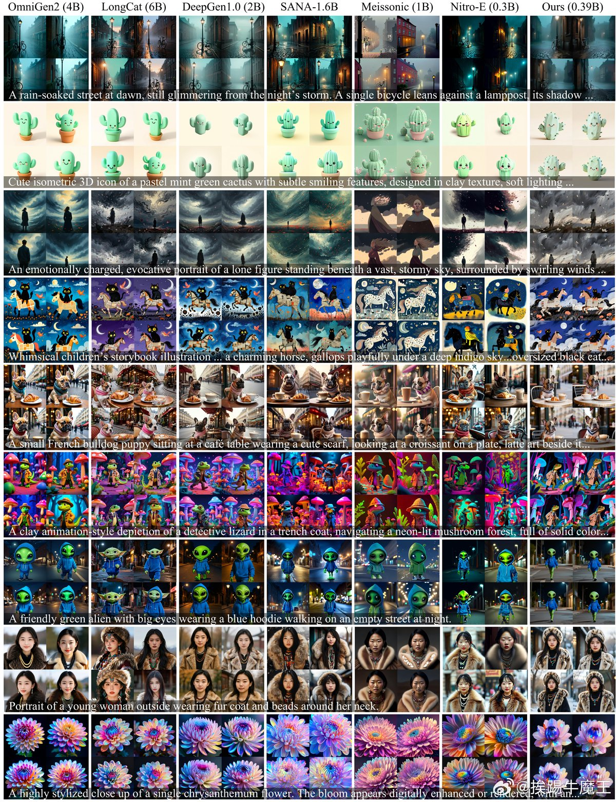
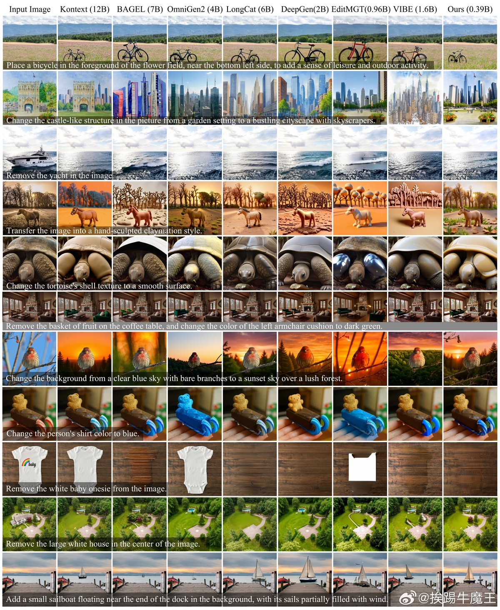

@挨踢牛魔王
发表于：2026-04-02 14:23
来源：微博
链接：https://m.weibo.cn/status/5283234617493282

字节跳动最新出了一个可以在手机上跑的图像模型。
这个东西过于离谱了，是图像生成和图像编辑统一的模型。
就是说，你可以用这个模型生图，也能编辑。

关键是这个模型的大小，参数只有区区的0.39B，看评分，居然还超过了黑森林工作室早期出的kontext 12B的模型。
可以在手机上跑，就意味着，你不用连云端，不用消耗云端的token，你就用手机本地的算力，想怎么跑就怎么跑。
速度也非常快，Phone 17 Pro，4秒就能出图。

这说明现在图像模型的水分还很大，6B，9B，12B这种级别的模型还有很大的压榨空间，性能提升的空间也很大。
就是说，这类模型，在消费级显卡跑，应该可以做到覆盖大部分图像场景。
这对于设计师们是一个利好，就是将来可能本地模型就够完成大部分任务，而不用去用nano banana这种昂贵的模型。

项目官方说明：
DreamLite，一种紧凑统一的设备内扩散模型（0.39B），支持单一网络内的文本转图像生成和文本引导图像编辑。
DreamLite 建立在修剪的移动 U-Net 骨干上，并通过上下文空间连接在潜在空间中统一条件条件。
通过采用步进蒸馏，DreamLite实现了四步推断，在iPhone 17 Pro上使用4位Qwen VL和fp16 VAE+UNet，在约3秒内生成或编辑1024×1024图像——完全在设备上，无需云端。

看计划，是准备把模型和代码都开源的，现在还没有开源。

项目主页：carlofkl.github.io/dreamlite/\#

---

