# 2026-04-03

## 1

@36氪

发表于：2026-04-03 13:34

来源：微博

链接：https://m.weibo.cn/status/5283613509946600

【\#小米调价\#，卢伟冰回应：内存涨价近4倍】

据IT之家消息，4月3日，小米官宣调整部分在售产品建议零售价。受全球存储芯片价格持续大幅飙升影响，自2026年4月11日0时起，REDMI K90 Pro Max上调200元，Turbo 5、Turbo 5 Max取消新春特惠，512G大内存继续补贴200元。

对此，小米集团总裁卢伟冰回应称，本轮内存涨价力度远超预期，同版本内存价格相比去年Q1飙升近4倍。以12GB+256GB为例，低价时约30美元，现在约120美元，上涨近90美元。12GB+512GB涨价约1500元，16GB+1TB涨幅更离谱。这对以极致性价比定价的REDMI影响很大，因此不得不小幅上调价格或恢复原价，恳请用户理解。

卢伟冰此前在MWC 2026上表示，本轮存储涨价为长周期，预计持续到2027年底，影响整个消费电子行业，所有玩家无一幸免。

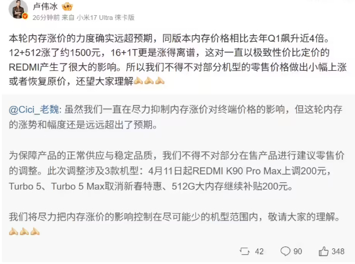

---

## 2

@图老板赛博札记

发表于：2026-04-03 13:34

来源：微博

链接：https://m.weibo.cn/status/5283614091904088

中美探月进程开启

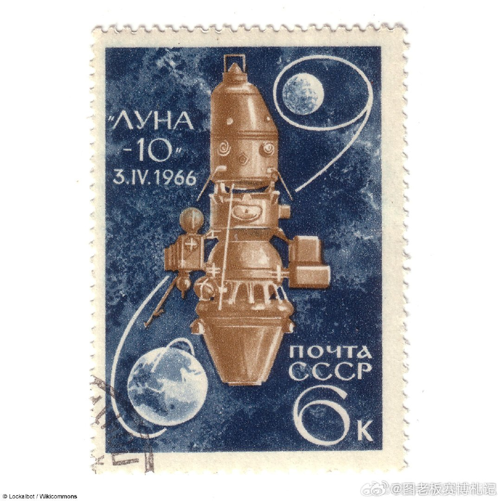

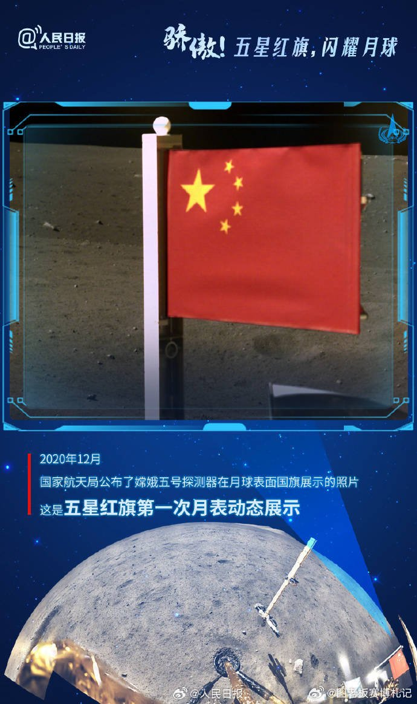

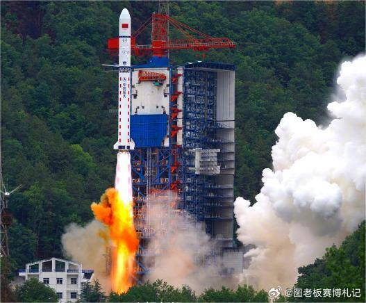

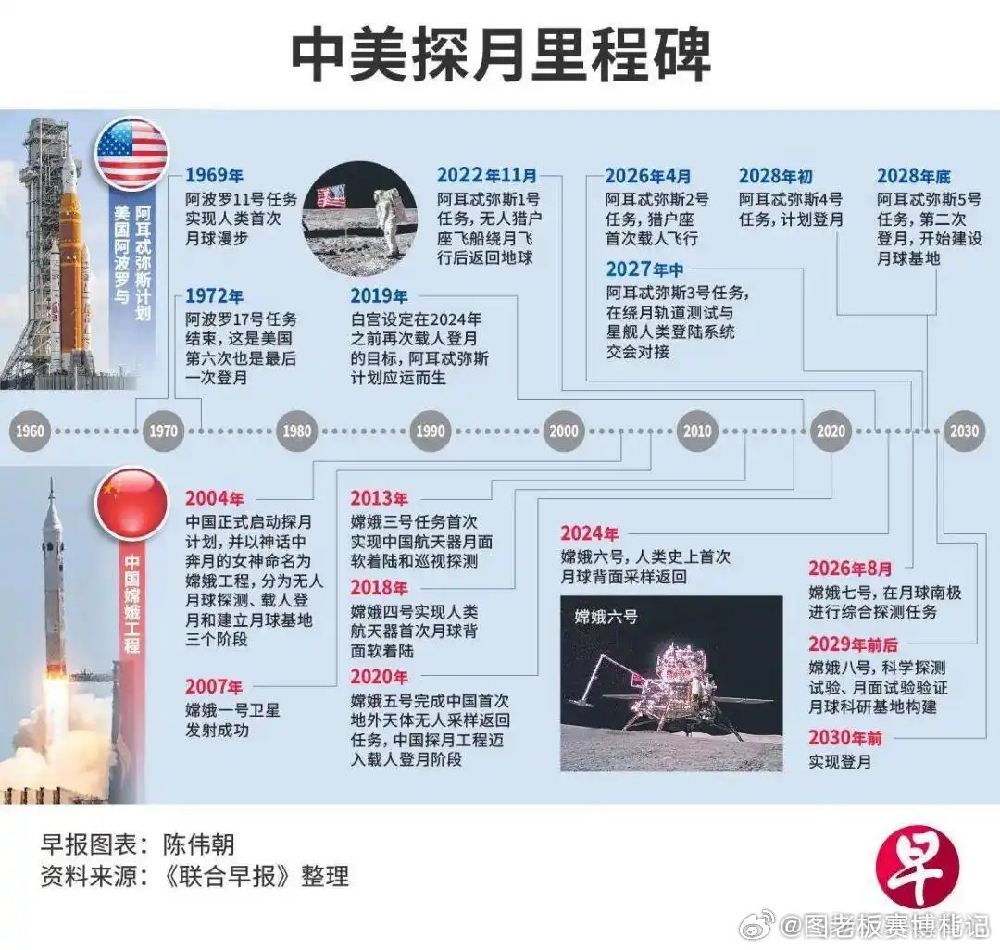

---

## 3

@财联社APP

发表于：2026-04-02 14:42

来源：微博

链接：https://m.weibo.cn/status/5283386341984863

昨天 14:42

财联社4月2日电，伊朗方面称，与阿曼起草霍尔木兹海峡通行的协议。\#美以伊最新局势\#

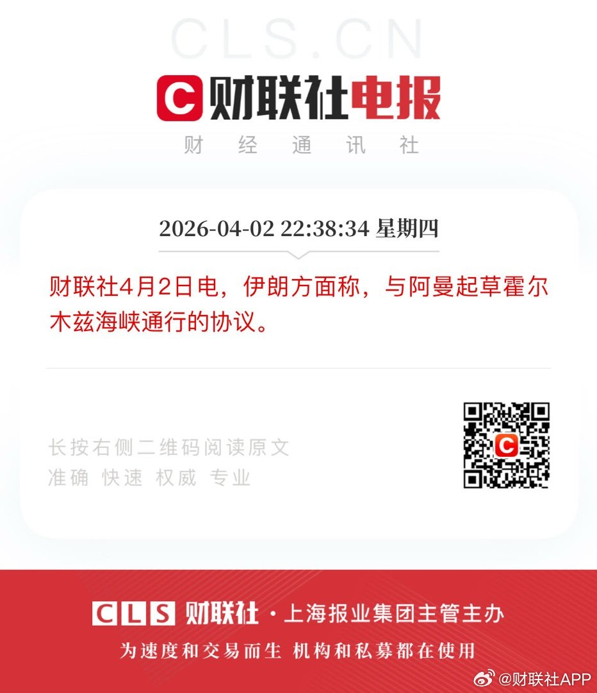

---

## 4

@物理芝士数学酱

发表于：2026-04-02 15:08

来源：微博

链接：https://m.weibo.cn/status/5283392855212924

有人让一台 Commodore 64 连续运行了三天半。它执行了 870 亿条指令，运行了 3030 亿个时钟周期，测试了 590 万个候选设置。

它在不知道明文任何字符的情况下，破解了一条德语的 Enigma 密码。

当年英国布莱切利园的Bombe依赖已知明文（如天气报告开头的“WETTER”）来排除错误设定。

IC 分析由密码学家 William Friedman 在 1922 年提出，它通过统计字母频率来判断解密结果是否像语言而非随机噪声。

英文 IC ≈ 0.0667

德文 IC ≈ 0.0762

随机文本 IC ≈ 0.0385

IC 不受插线板（plugboard）影响，因为它只关心字母频率分布，而不是具体字母。

这里的Commodore 64 是一台非常著名的 家用个人电脑，由美国公司 Commodore International 在 1982 年推出。它在 1980 年代成为全球销量最高的单一型号电脑之一，估计卖出了超过 1700 万台。

搜索空间：336 种转子排列 × 17576 种位置 = 5905536 候选。

每个候选需完整解密 60 个字符并统计频率，总计约 3.5 亿次加密调用。

耗时在 1 MHz 的 C64 上运行约 82 小时（3.4 天）。

正确答案（转子 III-I-V，位置 M-C-Q）在第 87 个排列时出现，约 21 小时即可打印出可读的德文天气报告。

阈值选择IC ≥ 0.050（对应 IC sum ≥ 177）能过滤掉大部分随机结果，但仍留下数百候选。

正确解密，得到德文文本：\#

“WETTERVORHERSAGEBISKAYAHEUTEREGENMITWINDSTAERKEFUENFAUSOSTEN”（天气预报：比斯开湾，今日有雨，东风五级）。

排名：在 18165 个候选中，正确答案排名第 42，靠人工识别德文才确认。

网页链接

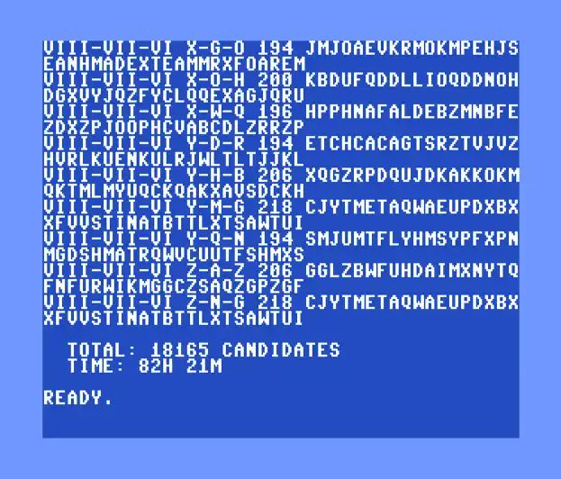

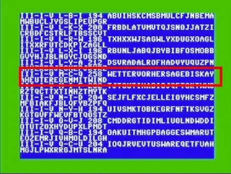

---

## 5

@少年伯爵

发表于：

来源：微博

链接：https://m.weibo.cn/status/5088323787295843

2024-10-11 来自 iPhone 12 Pro Max 已编辑

大佬东山再起的金手指——仪式感

朋友问：“那个被美国法院判了退钱（退给消费者5000万美元）的保健品，家里长辈吃了好像真的有用啊，这到底怎么回事呢？”

我的回答——这类保健品的真实严谨临床效果未知，但是它们的商业模式本质上就是➠【我们自己掏钱买自己人体产生的安慰剂效应】。

说白了就是花钱买个自己安心。

而安心是真有用的，因为它的背后就是真实客观存在的【人体安慰剂效应】。

这个安慰剂效应之强（有时候达到骇人的30%，给患者吃淀粉假药片，结果30%的患者真的很快出现改善效果，和自愈不一样），这足以干扰正常的药物临床试验结果。

\#伯爵冷知识\# 更离奇的地方在这里➠网页链接 瘾症性失明，只需言语暗示就能让“盲人”恢复到视力1.0……

人体在精神安慰剂效应下（相信和暗示）真的会产生一定程度的治疗效果（中枢神经➠激素分泌（包括mRNA重编）➠细胞自我修复等）。

因此临床试验被迫采用大规模双盲随机对照的模式。

所以某些保健品，即便只是用淀粉+甜味剂压制出来的淀粉片，只要宣传文案足够花里胡哨和详实厚重，仪式感拉满，潜在的安慰剂效应也会拉满……

患者看了这场仪式，掏了重金，买回家，服用之后，30%的概率确实能治病。

……现在大家明白某些大佬东山再起的金手指是卖保健品的原因了吧。

借花献佛。

花是我们，佛也是我们。

商人负责在中间搞一场仪式感。

这也是古往今来无数富人最核心的那层窗户纸。

0讨论 0阅读

---

## 6

@蚁工厂

发表于：2026-04-02 11:54

来源：微博

链接：https://m.weibo.cn/status/5283344041378719

港科大开源的项目OpenHarness，可以理解为轻量级的Claude Code

github.com/HKUDS/OpenHarness

• OpenHarness（oh）是 Claude Code 的超轻量级替代方案，完全用 Python 实现

• OpenHarness 提供约 80% 的核心Agent功能

• OpenHarness 仅用 Claude Code 3% 的代码量即可实现上述功能

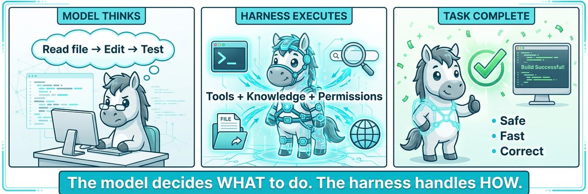

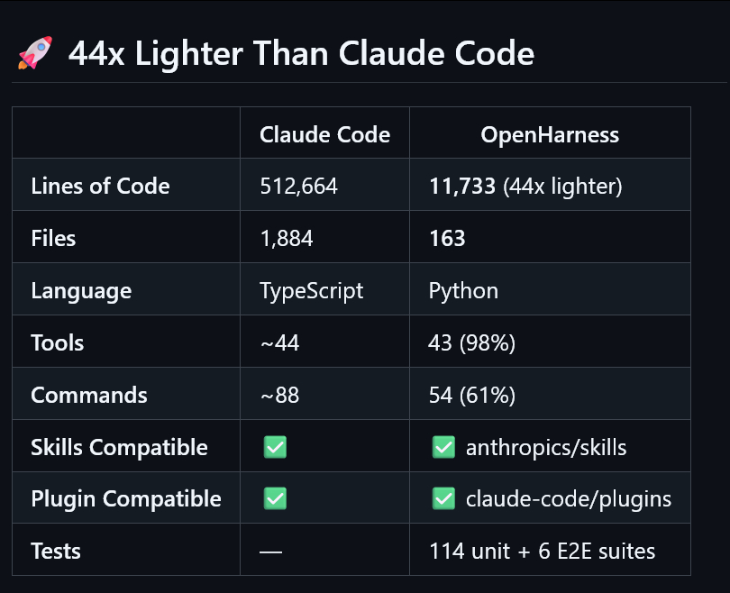

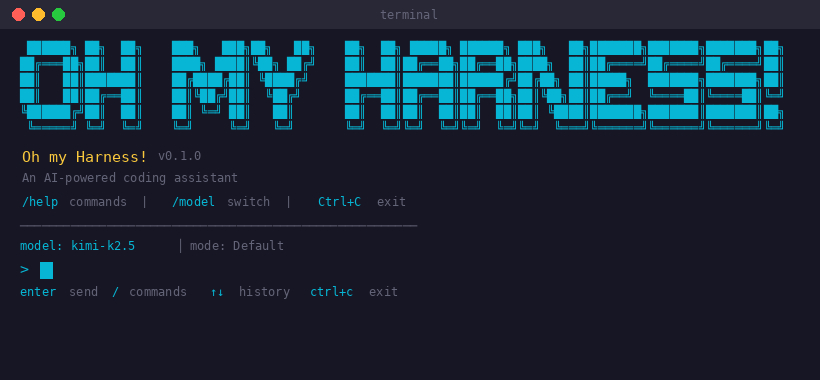

---

## 7

@飞扬军事铁背心

发表于：2026-04-02 11:56

来源：微博

链接：https://m.weibo.cn/status/5283344574055481

精准的翻译是一种平民化的祛魅。

中文的传统是以熟释新：电话——电传的话、计算机——计算之机器、词元——信息的基础单位，这种命名哲学天然是反神秘主义的，所有新概念被翻译为中文后就被拽回到已知的经验网络里。

激烈反对翻译“token”的人，真正害怕的不是“词元”这个词好不好，害怕的是技术平权。

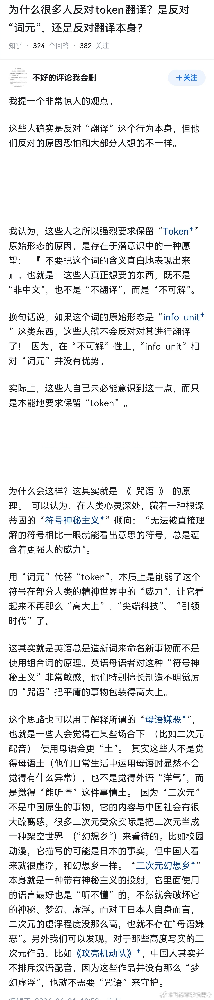

---

## 8

@新浪科技

发表于：2026-04-02 11:49

来源：微博

链接：https://m.weibo.cn/status/5283342945618700

【\#豆包Token日均消耗量两年翻1000倍\#】\#曝TOP5大厂有两家在接洽豆包\#\#曝豆包二代AI手机二季度发布\#4月2日，火山引擎总裁谭待在业务进展分享中提到，豆包大模型日均Token使用量超120万亿，过去三个月内增长一倍，较2024年5月发布时的1200亿水平增长1000倍。目前，火山引擎上累计Token使用量超一万亿的企业从去年底的100家增至140家。谭待指出，Token使用量是衡量AI发展速度的核心指标，豆包大模型使用量高速增长主要受AI视频创作爆发与AI智能体加速普及驱动，字节旗下ArkClaw智能体服务及Seedance2.0视频模型参与推动这一趋势。（三言科技）

---

## 9

@菜鸟耶夫斯基

发表于：2026-04-02 10:50

来源：微博

链接：https://m.weibo.cn/status/5283327959631452

昨天 10:50 已编辑

“阿耳忒弥斯2号”载人绕月任务，固体火箭助推器分离的瞬间。

---

## 10

@2049年的世界

发表于：2026-03-04 23:59

来源：微博

链接：https://m.weibo.cn/status/5273017397543540

3-4 23:59 来自 微博网页版 已编辑

这个问题我以前论述过，高考英语降分数是可行的。但是后续不要把有限的教育资源投入到强化“听说”，恰恰相反，要强化“读写”。高考英语可以只考阅读理解和作文。

英语听说的教育太“昂贵”，而且没有语境导致学了就忘，投入产出比太差了，效率很低。而如果不出国，大部分用到的就是读写技能。就算出国，有了读写技能，转听说也是很快的。而且你学读写的时候，也不可能完全不听说，只是不考察而已。

哑巴英语是非常合适高效的高考英语考察方式，从社会层面看投入产出比最高，也没有必要弄一堆什么外教到中国来。

0讨论 0阅读

---

## 11

@庆丰

发表于：2026-03-14 17:08

来源：微博

链接：https://m.weibo.cn/status/5276537731680401

最近OpenClaw为啥这么火，作为做技术的，之前我是非常不理解的。最近仔细研究学习了下，总结来看：好产品并不需要多牛的技术、多大的创新。多个看似不起眼的"小"创新叠在一起，就能形成差异化，让产品脱颖而出。

比如，OpenClaw它没有自研大模型，没有提出什么颠覆性概念，"AI 助手"这个赛道也早已拥挤不堪，但它就是在短时间出圈成为现象级项目，刚看了一眼， GitHub上已经31万Star了。周末从产品角度又研究了下，我认为它赢在以下几个层面的"小"创新组合。

1、入口创新：不做新 App，寄生在现有 IM 里

很多 AI 产品都在做独立客户端，OpenClaw 反其道而行——直接嵌入Discord、Telegram、WhatsApp等。技术上没什么门槛，但这个选择直接干掉了用户的迁移成本。用户不需要学习新界面、不需要切换习惯，在最熟悉的聊天框里就能用。这不是技术创新，是"用户路径"层面的创新。

2、记忆机制：用 Markdown 文件代替数据库

OpenClaw 用 SOUL.md 定义人格，用 MEMORY.md 存储记忆和偏好。听起来很"土"，甚至有点简陋。但正因为是纯文本文件，用户打开就能看、能改、能理解——透明感和掌控感直接拉满。对比那些把记忆藏在黑盒数据库里的产品，这种"低技术方案"反而建立了更强的用户信任。

3、架构选择：本地优先策略

当很多产品都在往云端挤的时候，OpenClaw 选择本地部署优先。精准击中了用户对隐私和数据主权的焦虑。这一条单独拿出来不算什么，但和前面的"透明记忆"机制组合起来，就形成了一个完整的"用户信任链"。

4、能力边界：从"能聊"到"能干活"

大多数 AI 助手止步于对话。OpenClaw 多走了一步——能发邮件、整理文件、控制浏览器、执行定时任务。技术实现上无非是工具调用和权限打通，但这一步把产品从"聊天工具"拉到了"执行系统"，价值感完全不同。（当然，单从干活能力来看，它可能比不过Claude Code或Cowork，但和其他组合起来就不一样了）

5、生态策略：开源 + Skills 插件机制

能力做不完怎么办？开放插件体系，让社区来补。这是开源世界的经典打法，谈不上新。但在 AI Agent 这个品类里，OpenClaw 是较早把"Skills 插件化"做得足够简洁、足够易用的，这决定了它能快速积累生态。

总结来看，这是"小"创新的复利效应，上面5条没有哪一条是"颠覆性"的。入口选择、记忆方案、部署策略、执行能力、生态机制——每1条单拿出来，都不足以构成壁垒。但当它们组合在一起，形成的是一个完整的、自洽的产品体验闭环。

最近也在关注产品，这个案例给了我很好的启发：做产品不需要"一招制胜"的大创新，把用户旅程上的每个触点都做好，每个环节比竞品多想一步，这些 80 分的"小"创新叠加起来，产生的复利效应，往往比一个 100 分的技术突破更有竞争力。

---

## 12

@图老板赛博札记

发表于：2026-03-17 04:37

来源：微博

链接：https://m.weibo.cn/status/5277436084490345

\#碎片线索整理-社交媒体

最近看到一些关于喜剧本质的探讨，觉得挺有意思，整理出来和大家分享一下。陈佩斯在早年的喜剧课程中曾经提出过一个核心观点，他认为优越感是喜剧产生笑声的根本机制。简单来说，它的作用原理就是当观众观察到故事中的人物处于一种不如自己的状态时，心理上会产生一种优势，这种优势感就会引发笑声。我们看喜剧时常常觉得角色滑稽笨拙，其实就是这个机制在起作用。

顺着这个思路，有人总结了喜剧接受的双轨模型，把喜剧分为了本能驱动和认知评价两个层面。本能驱动层主要是一些比较基础的喜剧表现形式，它们直接刺激人类原始的生理反应，触发快速发笑的机制。这类喜剧通常依赖角色降格来制造观众的优越感。

而认知评价层则是相对高级的喜剧，它更多是通过文化符号、逻辑结构等引发智力上的共鸣，从而产生持久的满足感。这两种喜剧的关键差异在于，前者依靠人物的狼狈让我们觉得自己高明，后者则是通过认知上的提升和逻辑上的巧妙设计来实现共鸣。了解这些机制后，以后看喜剧作品时，大概就能明白自己到底是在为什么而笑了，有空看喜剧的时候可以留意一下。

---

## 13

@前HR本人

发表于：2026-03-18 05:30

来源：微博

链接：https://m.weibo.cn/status/5277811578766590

3-18 05:30

中国最早工业化的两个地方（东北和上海）生育率最低。

可以说中国人均GDP最高之一的上海和中国人均GDP最低之一黑龙江，生育率最低。

中国房价最高之一的上海和中国房价最低之一黑龙江，生育率最低。

所以人均GDP和房价，其实不是影响生育率最关键原因。我一直认为当前养老金没有对养育孩子的因素纳入，才是影响生育的原因，养儿防老的机制被取消了。

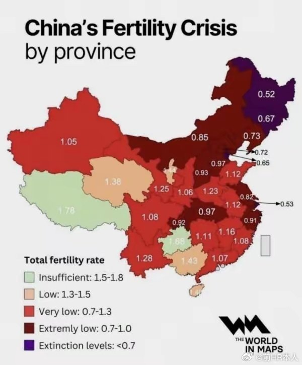

---

## 14

@七九三一

发表于：2026-03-20 15:00

来源：微博

链接：https://m.weibo.cn/status/5278679995257657

宇树机器人的招股书发出来，我的第一想法是——

可能所有做人形机器人的公司都要接受投资者的拷问，为什么宇树研发费用一年只花这么多？为什么他们人也就这么点？

一，宇树机器人的人形机器人出货量超过5500台，世界第一，断层式领先。

什么概念呢？他们说世界上能超过1000的都没几个。（图1）

顺便，他们在招股书里吐槽了一下波士顿动力，说他们量产的都没几个，谈不上商用。（图2）

二，宇树机器人竟然盈利了。

从传统的观点上看，这类新兴科技公司很难在短时间内盈利，都是先烧钱换市场、换技术，然后才能开始盈利。

——但宇树机器人从2024年就开始盈利了，2025年赚的更多。（图3）

不过宇树机器人还是找个好会计吧，他们的扣非净利润跟归母净利润差这么多，主要原因是算错了股权激励应该划在哪。

三，宇树机器人的控制权牢牢掌握在王兴兴手里，这个事非常重要。

宇树机器人采用的是AB股的形式，表决权和分红权分离。所以王兴兴虽然手上的股权只有不到24，但是表决权有63。这也就意味着在很长一段时间内，这家公司的走向、技术研发投入，都不会被外部股东所影响。（图4）

特别是考虑到其他股东的表决权加起来不到34％这条死线。

34% 的表决比例，大体上你可以理解成坏事权。

虽然不能成事，但是在重大事项上，根据公司法的规定，具有否决权。

王兴兴加上海宇翼，后者是员工持股平台，有超过68% 的表决权，也就意味着这家公司在很长一段时间内，走向都只由自己来定，这点再次强调，非常重要。

四，90后挑大梁。

宇树机器人的董事会及几个董事成员都是90后。（图5）

这一点上我觉得不用我多说了。

五，研发效率非常高。

有多高呢？宇树机器人加起来只有175个研发人员。（图6）

一年的研发费用，即使是今年到年底，估计也就一个来亿。

去年一整年才7000万。（图7）

这个数字还是非常夸张的。我怀疑现在市场上的投资人都在拷打他们投过的人形机器人团队，你们要这么多钱到底是干啥？你们研发钱到底投到哪去了？

六，人形机器人的单价下降非常快。

2023年宇树发的第一款人形机器人，当年销量只有5台。我估计大部分零部件也是手搓出来的，所以单价卖到了接近60万。

2024年宇树机器人的人形机器人开始量产，单价跌了一半多，到了26万，卖了410台。

2025年宇树机器人卖了3551台人形机器人，单价降到了16.76万。（图8）

另外我还得提一句，宇树机器人的毛利率有差不多60%。

换句话说，就是这些人形机器人的硬件成本，对于宇树机器人这家公司来说，也就是六七万块钱。

而这个硬件成本还是只有几千台级别的量产情况下实现的。如果未来到万到几十万，我估计硬件成本还会进一步大幅下降。

七，好产品真的得卖好价钱。

宇树机器人的招股书里把毛利率和另外两家也涉及人形机器人的公司，一家是优必选，一家是越疆机器人，做了对比。

优必选2024年的毛利率不到30，越江高一些，是46.56%。但越疆机器人相对来说是做偏工业的工业臂，以及协作机器人多一些，人形机器人占的整体业务比较少。（图9）

而作为对比，宇树机器人有接近60的毛利率。

换句话说，就是有些产品可能只能在宇树这买得到，你在别家多花一倍的钱都可能买不到更好的。

八，核心的确实是硬件，以及软件

从普通人的角度来看，人形机器人可能更重要的是大脑，但没有硬件哪来的软件发挥空间呢？

宇树机器人的核心竞争优势之一，就在于全站自研机械设计体系和硬件优势。他们在电机、减速机、驱动器以及电池热管理等等这些方面，也是人形机器人最最最基础的方面，做了很大的突破。（图10）

这块其实我之前在知乎上给他们的春晚武Bot这个节目上聊过。

因为人的瞬时功率是很大的，人的肌肉的突然发力是能有几千瓦的瞬时功率。所以人形机器人想要做到像人，就需要有很大的瞬时功率和扭矩。

但是目前电池技术又限制了人形机器人身上大概只能背一度电，如果功率太大，很快就没电了。

同时，人形机器人的关节又得做到尽量跟人一样，这又导致电机的体积不能太大，而电机的体积不能太大又进一步限制了功率和扭矩。

所以要让人形机器人像人，能够有大的瞬时功率和扭矩，就需要去干这块的硬件。

九，当然，这并不是说大脑不重要。

宇树机器人做的路线是VLA和世界模型。

宇树自己开源了两个，一样一个。（图11）

但宇树机器人自己还有一个没开源的，走的是世界模型的路线。

当然，从我个人角度，我觉得这块可能需要端云结合一下。

毕竟还是上面提到的，机器人身上只能背一度电。你要给机器人装一块H100，算上机器人本体的电量消耗，不到一个小时就躺那了。

所以在招股书里，宇树也提到要募20亿做大脑和小脑相关模型（图12）

这个事还挺重要的，小脑可能就是一个零点几B级别的模型，但是大脑起码是几B甚至几十B的模型，不管是数据还是算力，都得花很多钱。

当然，换句话说，其实是宇树已经走到了无人区，他们需要自己去探索新的路线。这个事是当下最花钱的。

最后我想说，宇树机器人的招股书发出来。

可能所有做人形机器人的公司都要接受投资者的拷问。为什么宇树研发费用一年只花这么多？为什么他们人也就这么点？

牛逼的

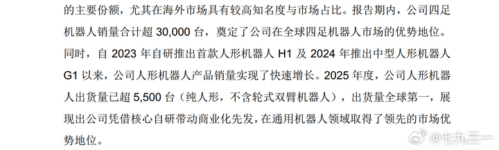

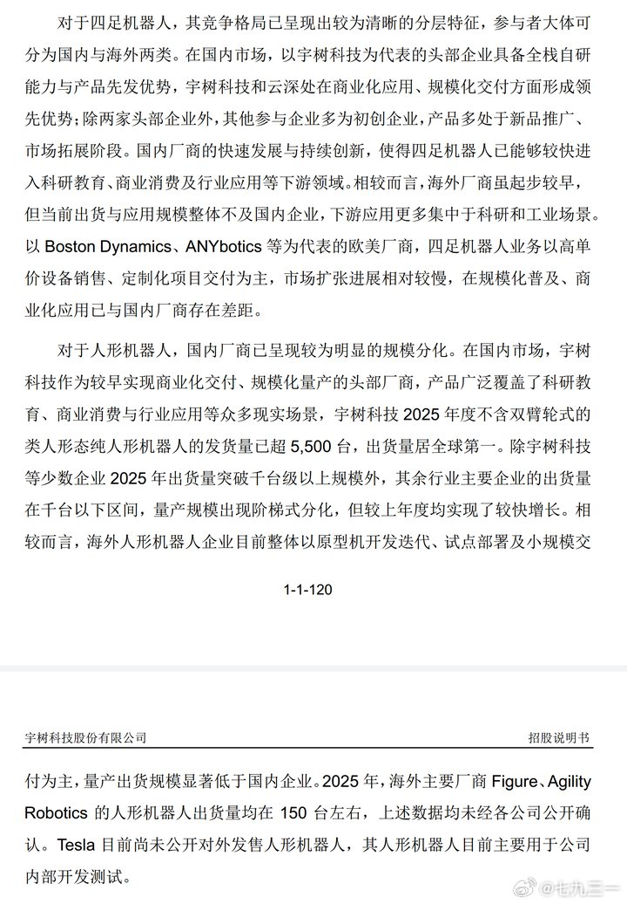

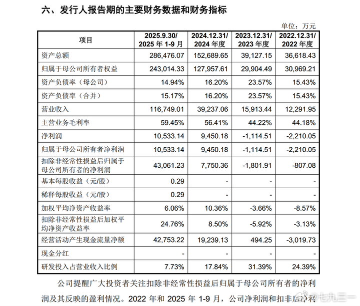

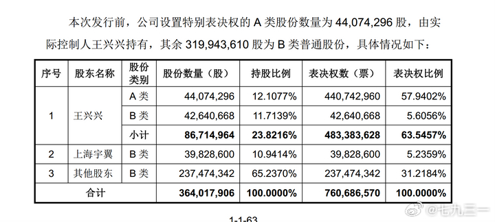

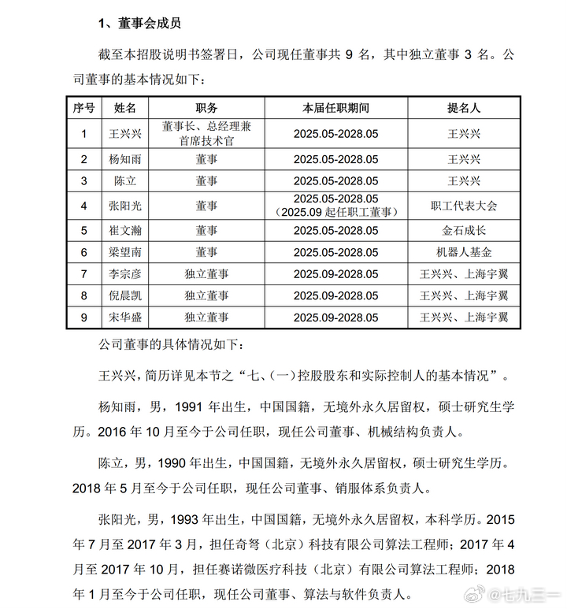

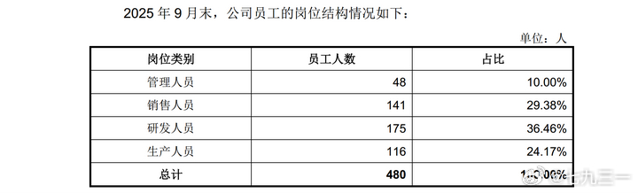

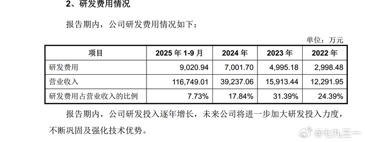

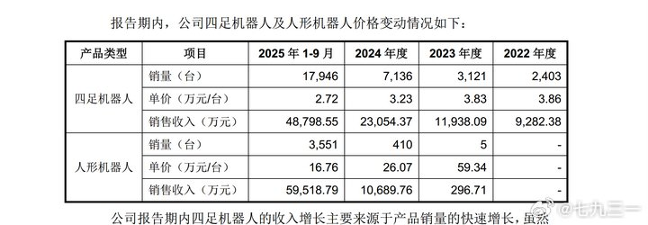

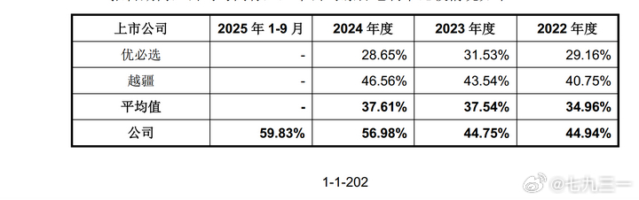

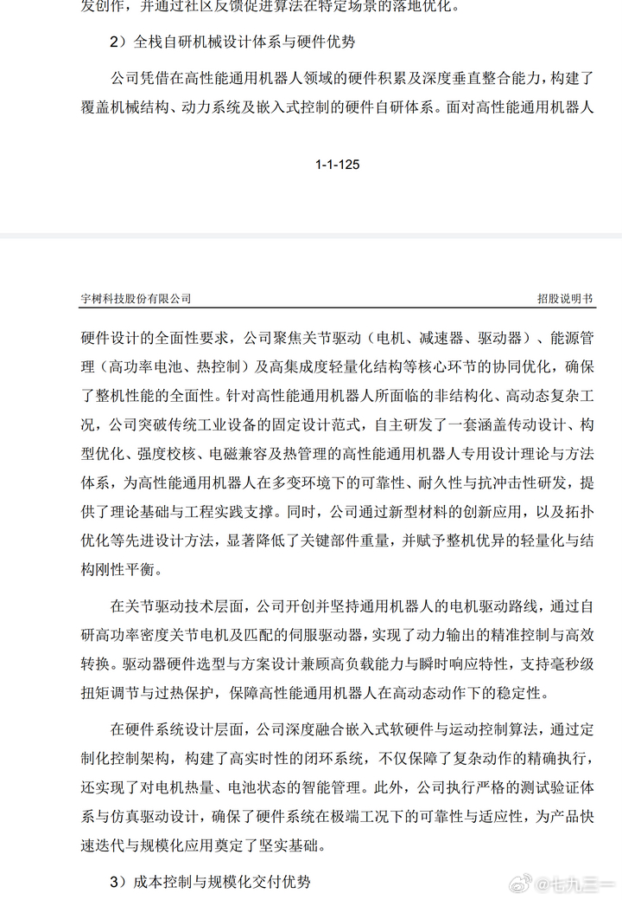

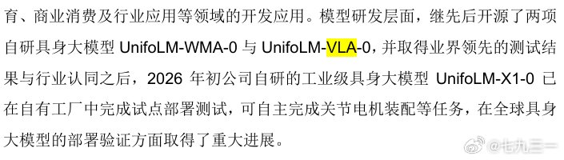

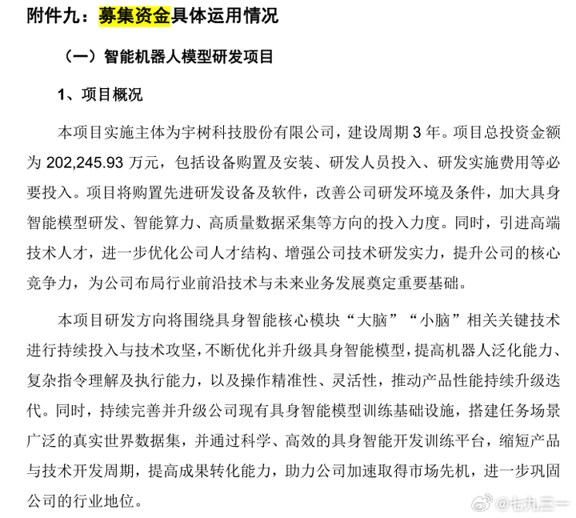

---

## 15

@图老板赛博札记

发表于：2026-03-23 05:07

来源：微博

链接：https://m.weibo.cn/status/5279617913198498

看见一切，而非统治一切：Palantir 背后的魔戒隐喻

很多人第一次听到 Palantir 这家公司，都会好奇它的名字从何而来。只要稍微了解《指环王》，就会认出这并非凭空创造的词汇，而是托尔金笔下极具象征意义的宝物——帕兰提尔，也就是真知晶石。它不是武器，不是王权象征，也不是征服世界的工具，只是一颗能够远望、窥探隐秘、连接远方的水晶。但在整个中土世界的叙事里，它所承载的意义，远比许多利器更为复杂。而以它命名的科技公司，也几乎完整继承了这一意象的全部内涵。

硅谷从不缺少文学化的命名，但像 Palantir 这样把意象贯彻到商业模式与价值主张里的并不多见。创始人团队都是《指环王》的深度读者，他们不只是借用一个听起来神秘的单词，而是真正把晶石的能力、边界与风险，转化成了对数据技术的理解。在科技行业里，人们总喜欢把巨头的野心比作至尊魔戒，“One ring to rule them all”几乎成为垄断与控制的代名词，但 Palantir 从一开始就选择了另一条路径，它所追求的不是统治，而是洞察。

我们都很熟悉至尊魔戒的逻辑。它的目标直白而冰冷：统治一切、寻找一切、将一切纳入黑暗之中绑定。它代表的是绝对的控制，是将所有资源、权力与意志收拢于单一主体。戴上魔戒，意味着支配、隐形、操控与臣服。这与我们熟悉的互联网巨头逻辑高度重合：追求唯一、追求垄断、用生态绑定用户、用数据占据入口、用规模实现不可替代。它的核心是拥有、支配与强制，是让世界围绕自己运转。在托尔金的设定里，这种权力最终只会走向腐蚀与毁灭，这一隐喻放在技术领域，至今依然有效。

Palantir 所代表的模式则完全不同。真知晶石由精灵费艾诺打造，名字本身的含义就是“远观之物”，它的设计初衷是守望与沟通，而非统治。它可以跨越距离看见真相，可以整合分散的信息，可以让不同位置的人获得同一视角，但它本身不具备强制力，不控制意志，不施加束缚，只提供视野与信息。对应到现实中，Palantir 的业务也始终围绕这一点展开：它不面向普通用户做平台，不做流量生意，不构建封闭生态，而是把零散、异构、难以解读的数据整合为可感知的全局视图，帮助使用者做出判断。它提供的是看见的能力，而非控制的工具。

但托尔金的设定从来没有非黑即白的力量，Palantir 的隐喻也自带清醒的边界。晶石本身没有立场，只呈现画面，不解释因果，更不判断善恶。更强的意志可以透过晶石扭曲信息、引导情绪、甚至操控认知。萨鲁曼、迪耐瑟都因它走向偏执与毁灭，并非晶石本身邪恶，而是使用者被信息与视角所困。这一点恰好也是 Palantir 作为一家数据公司从未回避的现实：数据与洞察可以揭示真相，也可以强化偏见；可以辅助决策，也可以带来误导。技术的能力越强，对使用者的责任与理性要求就越高，力量本身不决定善恶，使用方式才是关键。

这也是为什么 Palantir 始终与“一统天下”的魔戒式叙事保持距离。它不追求统治信息世界，不追求控制用户，也不追求成为所有人的必需品，而是专注于提供穿透信息迷雾的能力。在一个大量技术公司都在朝着唯一、全面、不可替代的方向扩张时，Palantir 选择了更克制的定位：做守望者，而非征服者；做洞察工具，而非权力中枢。

从文学隐喻回到现实，Palantir 与魔戒的对比，其实是两种技术价值观的选择。一种以控制与垄断为目标，把权力建立在占有与绑定之上；另一种以信息与视野为核心，把价值建立在理解与判断之上。魔戒的逻辑是拥有全世界，而 Palantir 的逻辑是看清全世界。对于技术行业而言，这两种路径的差异，远比表面看起来更为深远。

真正决定技术走向的，从来不是能力的上限，而是对权力边界的理解。这大概也是托尔金留在故事里，最冷静的一条启示。

---

## 16

@刘晓光Savvy

发表于：2026-03-26 13:25

来源：微博

链接：https://m.weibo.cn/status/5280830265495772

好莱坞的演员和导演风险都很高，如果扑街一部作品，以后就很难起来，如果连续扑街两部，基本这辈子都不太可能翻身了。

但是好莱坞并不是导演负责制，也不是明星流量制。

它是制片人制度。

制片人权力特别大，基本可以一言堂，自己决定剧本走向和如何剪辑。

按理来说这么大权力的人应该负责最多。

偏偏不是如此。

接二连三搞砸电影ip的纸片人，可以继续逍遥快活。

比如漫威这几年的制片人，她是犯了众怒才被开掉，开的理由也不是业绩不行，而是有毒的职场文化。

华纳就盖了帽了，扑街无数，但制片人一直稳居高位。

再比如毁掉《黑衣人》这个ip的制片人，全球大扑街，他还是继续公司高管做着。

美国的制片人给我感觉有点像中国的明星，连续多次扑街却总是稳居高位。

---

## 17

@图老板赛博札记

发表于：2026-03-28 06:53

来源：微博

链接：https://m.weibo.cn/status/5281456512304746

实测飞书OpenClaw新插件：搞懂它的核心逻辑，再也不用踩配置坑

最近飞书推出了OpenClaw官方插件，身边不少玩AI智能体的朋友都试了，都说扫码就能安装，用起来特别方便，但真正用的时候，多多少少都会有疑惑：它到底和之前配置OpenClaw飞书通道有啥不一样？会不会要暴露公网端口？配置怎么备份？指令又是怎么跑起来的？

我自己折腾了好几遍，也一步步捋清了里面的逻辑，特意把最核心的内容整理出来，不讲晦涩的术语，就用普通人能听懂的话，把这个插件的底层逻辑、配置要点、运作方式说透，就算是刚接触OpenClaw的新手，也能一看就明白。

先说说最开始大家都会遇到的安装误区。之前用OpenClaw对接飞书，都是走传统的IM通道配置，在OpenClaw的初始化引导里，要手动选飞书频道，还要去飞书开放平台创建应用，复制App ID、App Secret，一步步填进去，稍微填错一个参数就用不了，流程特别繁琐。但这次飞书新出的官方插件，完全不用这么麻烦，终端运行一条命令，弹出二维码用飞书一扫，就能自动创建应用、配置权限、完成绑定，全程不用手动填任何密钥，这也是很多人觉得便捷的地方，但也正因为太简便，反而让人好奇：它到底在OpenClaw里写了什么配置？

其实大家完全不用纠结，飞书这个新插件，并不会像传统通道那样，把一堆应用密钥、连接信息写入OpenClaw的配置文件。它只是在OpenClaw的核心配置文件 openclaw.json 里，在plugins板块加了一行简单的启用标记，记录下“openclaw-lark这个插件已经开启”，除此之外，没有任何敏感信息、没有连接地址、没有密钥凭证。这也就回答了备份的问题，想要备份OpenClaw的相关配置，只需要备份整个 .openclaw 文件夹，或者单独备份这个 openclaw.json 文件就行，恢复的时候把文件放回原位置，启动网关，插件就能自动重连，不用重新扫码配置，非常省心。

我一开始最担心的，也是很多人都会顾虑的问题：飞书插件要控制OpenClaw，是不是得把本地的OpenClaw网关暴露到公网？毕竟之前很多工具对接第三方平台，都要做端口映射、内网穿透，不然外部连不上本地服务，不仅麻烦，还存在安全风险。但深入了解后发现，这个担心完全是多余的，飞书OpenClaw新插件的运作逻辑，和传统的对接方式完全是两个方向，这也是它最核心、最巧妙的地方。

咱们可以把整个链路拆成两部分来看，第一部分是飞书客户端和飞书云端的连接，这部分是飞书本身自带的长连接，不管有没有OpenClaw插件，飞书客户端都会和官方服务器保持通信，用来接收消息、同步数据，这部分和OpenClaw没有任何关系，完全是飞书自身的基础能力。第二部分，也是最关键的部分，是本机的飞书插件和本地OpenClaw网关的交互，这一段全程都在咱们自己的电脑内部运行，只访问本地的localhost地址和固定端口，数据从来不会离开本机，更不会走到局域网或者公网里。

简单来说，就是我们在飞书里给插件发指令，消息先通过飞书自身的云端长连接传到本机的飞书客户端，客户端里的OpenClaw插件收到指令后，直接通过本地内网RPC的方式，把指令发送给本地运行的OpenClaw网关，网关处理完指令、算出结果后，再通过本地连接把结果回传给飞书插件，最后插件把内容展示在聊天界面里。整个过程，OpenClaw网关始终只在本地运行，不需要对外开放任何端口，不需要公网IP，也不用做任何网络穿透，既保证了操作的便捷性，又最大程度保障了本地数据和网络的安全，就算电脑断开外网，只要本地网关和飞书客户端都开着，本地的指令交互依然能正常运行。

对比之前的传统IM通道，就能更清晰地看出区别。传统方式是OpenClaw主动去连接飞书的机器人服务器，需要配置大量的应用凭证，依赖Webhook或者WebSocket长连接，消息要经过飞书服务器中转；而新插件是反向连接，飞书客户端主动连接本地OpenClaw，没有多余的配置，指令和结果都在本地闭环处理，不用依赖飞书服务器中转消息，延迟更低，也更安全。

还有很多人在OpenClaw初始化的时候，会看到IM插件配置的选项，纠结要不要配置飞书IM通道。其实用这个新插件的话，这一步完全可以直接跳过，不用勾选任何IM频道，不用配置任何通道信息，只需要在初始化的时候配置好AI模型的密钥，保证OpenClaw网关正常启动就行。因为新插件和传统通道是完全独立的两套体系，互不干扰，走插件的链路，就不需要传统通道的任何配置，这也是很多人安装完插件，不用管OpenClaw侧的通道配置，就能直接使用的原因。

其实玩这类AI智能体工具，最怕的就是不懂底层逻辑，遇到问题不知道从哪排查，要么担心配置错了，要么担心网络不安全。但飞书这个OpenClaw新插件，把复杂的配置都简化了，逻辑也很清晰：本地闭环通信，不暴露公网，配置极简易备份，指令本地处理。对于我们普通用户来说，不用去深究复杂的RPC、事件总线这些技术细节，只要记住它是飞书客户端内嵌的一个“本地遥控器”，通过本机内部连接操控OpenClaw，不用额外做网络配置，备份好核心配置文件就行。

从实际使用体验来说，这个新插件确实解决了之前OpenClaw对接飞书的痛点，不用再对着教程一步步填密钥，不用折腾网络配置，扫码就能用，而且全程本地交互，用起来也更安心。对于刚接触OpenClaw的新手，也不用再被繁琐的配置劝退，只要搞懂这个核心逻辑，就能轻松上手，不用担心踩坑。

后续使用的时候，只要保证OpenClaw是最新版本、网关正常运行，飞书插件就能稳定连接，不用额外做特殊配置，备份也只需要管好那一个配置文件，不管是换电脑还是重装环境，都能快速恢复。把这些核心逻辑理清楚，再用这个插件，就会觉得格外顺手，也不用再被各种疑问困扰了。

---

## 18

@图老板赛博札记

发表于：2026-04-01 14:18

来源：微博

链接：https://m.weibo.cn/status/5283018082354029

4-1 14:18 来自 微博轻享版

三顾茅庐。东汉末年，刘备为了壮大自己的力量，求贤若渴，广纳人才。当他听说隐居在隆中茅草小屋中的诸葛亮是个奇人，就带着关羽、张飞前往隆中，请诸葛亮出山辅佐他。可是那天不巧，诸葛亮不在家里。过了几天，刘备他们又去隆中拜访，可又是没有见到诸葛亮。刘备毫不气馁，第三次又去了，这才见到诸葛亮。诸葛亮被刘备的精神所感动，于是答应出山相助。后来诸葛亮果然帮助刘备建立了蜀国。三顾茅庐，顾是拜访的意思，茅庐是草房子，比喻诚心诚意地请人帮助。语出自诸葛亮《出师表》，三顾臣于草庐之中。

---

## 19

@李建秋的世界

发表于：2026-04-02 09:24

来源：微博

链接：https://m.weibo.cn/status/5283306449143360

其实三国的台词如果要现代化也不是不行。

只是新三国的台词看起来别扭。

举个例子：“宁教我负天下人，休教天下人负我。”

修改成：“信任是一种成本，在这个局面下，我付不起。”

“挟天子以令诸侯”

“合法性不是用来相信的，是用来使用的。”

“我乃汉室宗亲，不忍百姓受苦。”

“他们不需要我是谁，他们需要一个可以相信的故事。”

“孤承父兄之业，当守江东。”

“他们不是忠于我，他们只是暂时需要我。”

0讨论 0阅读

---

## 20

@阑夕

发表于：2026-04-02 09:26

来源：微博

链接：https://m.weibo.cn/status/5283306895573050

就在DeepSeek V4山雨欲来的前夜，晚点LatePost的更新爆了不少料：

- 最近半年，DeepSeek的核心员工，包括DeepSeek第一代模型作者王炳宣、DeepSeek-OCR系列作者魏浩然、DeepSeek-R1作者郭达雅、Janus-Pro贡献者阮翀等人，都被各家大厂给挖走了，更不用说已经在小米做出了成果的前研究员罗福莉；

- 尽管如此，DeepSeek依然不怎么卷，同行的每周工作时间都奔着80小时去了，DeepSeek的大多数员工还是遵循着早上不打卡、下午6-7点走人的规律，因为老板梁文锋相信一个人每天高质量输出的时间不会超过8小时，加班疲劳产生的昏庸判断，反而会浪费宝贵的算力资源；

- 搞AI和做量化之间的关系其实相当紧密，2016年，DeepMind的创始人哈萨比斯就组建过量化团队，希望能为刚刚脱离Google的公司创收，结果没赚到钱，而幻方则是倒过来的，也是在同一年开始用GPU的深度学习算力去干实盘交易，成功让梁文锋以30岁的年纪实现财富自由，再才组建了DeepSeek；

- 2023年的时候，梁文锋小范围见过一些投资人，但提出的构想类似OpenAI和微软的投资协议，投资方需要接受一个回报上限，这在投资者看来是没道理的，所以见完一轮之后，没有任何机构愿意投DeepSeek，而在大模型火了之后，梁文锋把和投资人建联的通道直接关闭了；

- 在公司里，梁文锋参与最多的是基模架构工作，然后就是充当不同团队之间的粘合剂，DeepSeek内部鼓励交叉协作，一个团队的周会也会向其他团队开放，这种开放组织很容易被规模扩张给破坏，所以DeepSeek对于核心团队的增加相当谨慎；

- 去年以来，外部世界发生巨变，既有DeepSeek-V3/R1的一炮走红，也有竞争烈度的大幅升级，DeepSeek没有加入任何战局，依然在自己重视的效率优化（注意力机制）、架构改进（mHC）和非主流探索（OCR）上面努力，梁文锋甚至招进了一些神经科学和脑科学背景的顾问，对人脑原理兴趣大增；

- 这也意味着DeepSeek错过了去年最重要的两条主线，一个是AI Coding，这里不只有商业价值的爆发，还引发了以龙虾为代表的Agentic应用形态，DeepSeek-V3.2完全被其他国产模型盖过了风头，另一个是多模态生成，从GPT-4o到Nano Banana再到Seedance 2.0，全都颠覆性的创造了海量增长，但梁文锋认为多模态「不是智能的主线」；

- 外界期待DeepSeek每次出手都能像去年年初那样石破天惊，这可能有些强人所难，也未必是梁文锋的目标，而他也需要稳定团队抗拒财富诱惑的心力，猎头给DeepSeek员工开出2-3倍的薪水，而且这还是建立在DeepSeek本身工资就不低的前提下，确实也有员工做出了跳槽去参与更确定性的、持续参与业界最强模型工作的选择；

- 留下的人当然还是占了大多数，他们习惯了相对宽松的研究氛围，也愿意做非竞争驱动的探索，在DeepSeek的价值体系里，原创的排序是要比最强更靠前的，它们本质上并不冲突，有时候实现了原创也就自然实现了最强，但在进入Agentic版本后，工程能力变得更重要了，而这正好进入了DeepSeek没有过多投入的地方；

- 于是梁文锋也比较少见的做出了应变回应，最近一段时间，他开始启动了对公司的估值，这意味着可以给团队更有刺激性的财富预期，同时也开始招揽模型策略产品经理，明确要求深度使用过Claude Code、OpenClaw、Manus；

- 坚持该坚持的，改变该改变的，至于什么是该坚持的、什么是该改变的，这个判断还是得由梁文锋来拿捏，「奇迹之所以是奇迹，就是因为它不常发生，是小概率事件。在中国这个崇尚竞争和结果说话的环境里，敢于追求独特目标的 DeepSeek 的存在本身，是一个令人惊喜的小概率事件。」

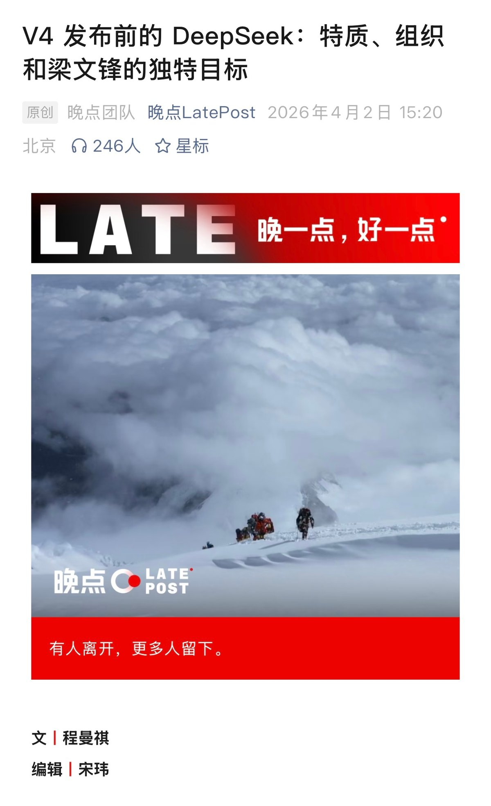

---

## 21

@_村西边老王_

发表于：2026-03-29 11:36

来源：微博

链接：https://m.weibo.cn/status/5281890154058597

现在就是买房最好的时候。

中国当年两个最大的房V，一个是公众号上的欧成效，一个是微博上的深房理。后来当然是一个被封号、一个被抓起来了。

但这两个人跟我都很熟。

我说这个东西是想告诉你，即使在行情最好、而且最大的两个房V我都很熟、而且我本人一直都在深圳、当年深圳的房产有多火懂的人都懂。我要想靠输出房产赚钱太容易了。

但我都没有通过自媒体、从房地产这个领域赚过一分钱。因为这个政策风险太大。

君子不立危墙之下。

所以我说的关于买房的话肯定是不为赚钱的。就单纯是我的认知。

从投资本身的属性来讲。投资是不鼓励杠杆行为的。所以大多数人默认的贷款买房的模式我们本身就不认可。我们自己买房也纯粹就是自住或者钱多没地方放而已。都是全款买的。

不靠房价涨跌赚钱。

但是我想告诉你的是，如果你是贷款买房、但租金如果超过月供。就应该买房。租金小于月供。就应该租房。

请注意。这个和房价本身高低是无关的。只是为了降低边际成本而已。

如果全款买我们是支持的。

房子本身就是一个长周期行业。你不要指望买到最低点。也不要在一直下跌的时候那么没有信心。如果一下跌你就没信心，那也说明你不看好它的未来。那你就别买了。

至少一线城市的房子在10年或者15年左右之后我认为有很大概率超过2021年的高点。这个哪怕是日本经济一直不太好也超过以前的最高点了。

现在整个价格都低过了2016年。

那就很值得。

房子这个东西其实并不是很好的投资标的。但它的好处其实恰恰是它真的可以去住。

假设你每个月租金1.2万、一年就是15万。10年就是150万。那么10年后你租房子和买房子的区别是。你租房子你的租金是白交的。你自己的房子、只要拿过来成本不高、还贷款不多。大概率是白嫖这个房子的。

产权其实很重要。

没有产权就没有超额收益。就只是消费而已。而且自己的房子居住体验肯定远高于租的房子。

---

## 22

@图老板赛博札记

发表于：2026-04-01 14:11

来源：微博

链接：https://m.weibo.cn/status/5283016299774040

小树小树请求农夫帮它把周围的大树砍掉，农夫答应了吗？小树最终的结局是什么样的？路过的蛇是怎么样评价小树的行为的？在一片茂密的树林里，有一棵细弱的小树。它被周围茂盛的大树给遮住了，阳光被挡在了外面。小树很不乐意。有一天，一个农夫带着斧头从它旁边经过。小树赶紧拦住了他，恳求道，好心人，请你帮帮我吧！把我周围的大树都砍光吧！你看看我在这里被它们挡得严严实实的，一点阳光都看不到，风也吹不进来，我连一点新鲜的空气也呼吸不到，就连我的根都找不到伸展的地方。这些大树就像在我头上编织了一张网一样，阻碍着我生长。我保证，如果没有这些大树妨碍我，一年之后我一定会成为这一带最茂盛的大树。农夫听了觉得小树很可怜，就答应了它。农夫挥起了手中的斧子，小树周围的大树咔嚓咔嚓地都倒下了。小树的周围空出了好大一大片空地，小树感到舒服了，它伸了伸小树枝，又看了看蓝天，高兴地说，真是太感谢您了，我的朋友。可是好景不长，晴朗的夏天，火辣辣的阳光直射在小树身上，小树感到自己马上就要干枯了。寒冷的冬天，大雪纷纷落下，小树冻得瑟瑟发抖。一天，一阵狂风吹过，小树终于抵挡不住了，它的小树干被吹断了，倒在了地上。这时，住在附近的一条蛇爬了过来，它目睹了这里发生的一切，感慨地说，小树苗啊，你真是太愚蠢了，这一切都是你咎由自取呀！如果你在大树的庇护下多生活些日子，它们会为你遮风挡雨，当你长得像它们一样粗壮茂盛的时候，这样的大风还能算得了什么呢？你就不会落得今天这样的下场了。这个故事告诉我们，小树只看到大树遮挡了它的阳光，却没有看到大树为它遮风挡雨。任何事物都有两面性，我们不能只看到其中的一面，要充分全面地思考问题。

---

## 23

@财联社APP

发表于：2026-04-02 09:26

来源：微博

链接：https://m.weibo.cn/status/5283306909206296

【溴素价格创新高：供给短缺，上市公司无库存只供应长协客户】财联社4月2日电，财联社记者采访产业链多家企业获悉，今年以来，国内供给短缺叠加海外供应不畅，溴素价格进入上行通道。进入3月，溴素价格曲线变得极为陡峭，最新成交价已涨至7.8万元/吨，月涨幅高达90%。从溴素到溴系阻燃剂，业内企业几乎均处于零库存状态，下游刚性需求难以满足。“公司目前没有库存，不对外报价，溴素产能有限，只能给长协客户供应。”滨化股份销售人员表示。有溴系阻燃剂企业产品报价从年初的6万元/吨涨至目前的13.5万元/吨，产量有限仅能供应核心客户。（财联社记者 肖良华）

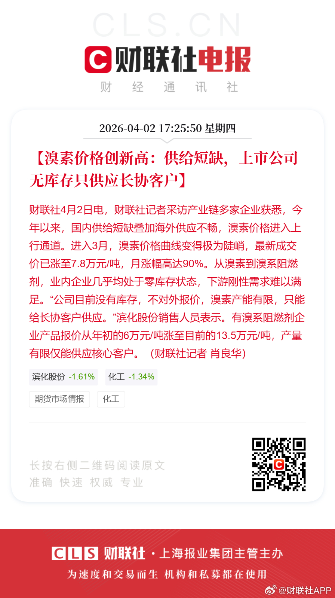

