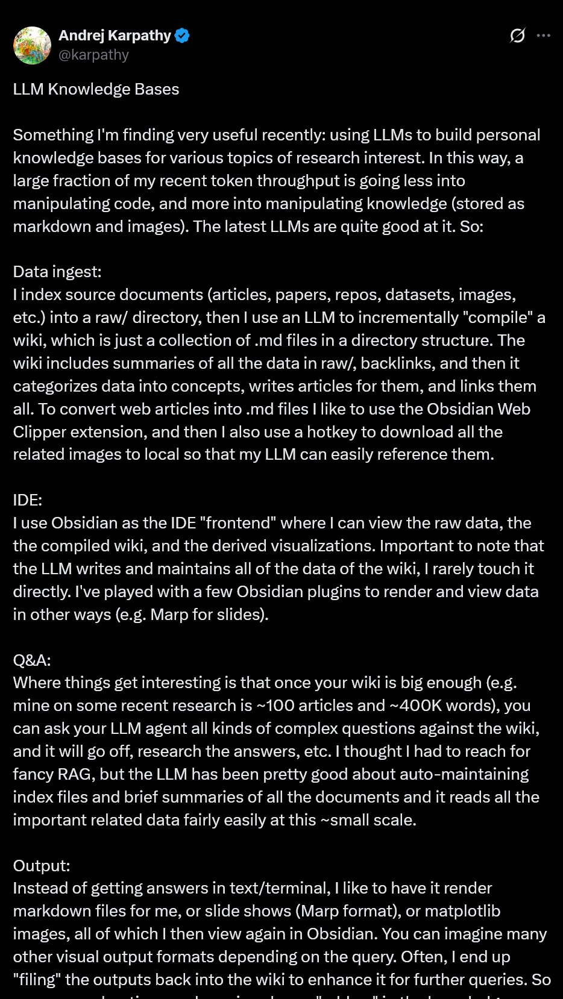
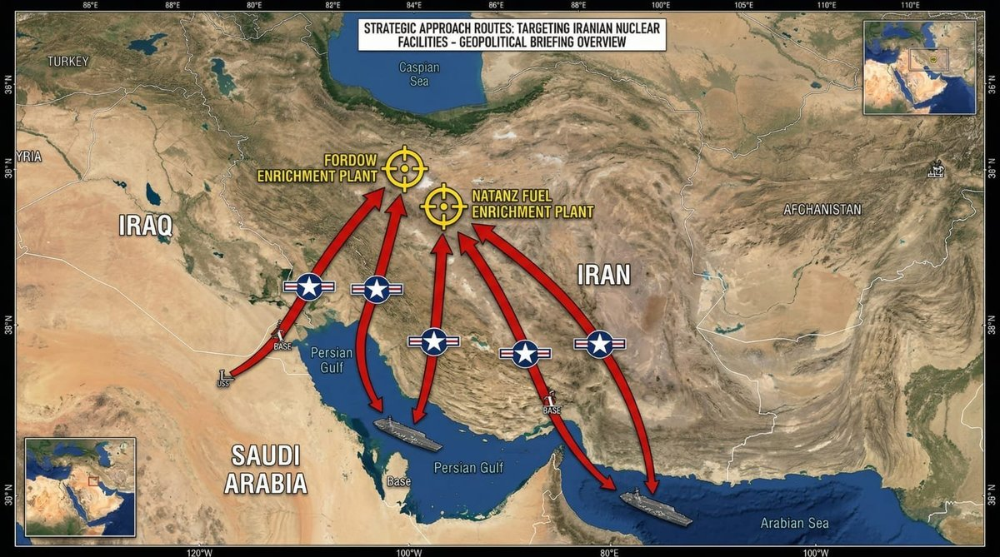
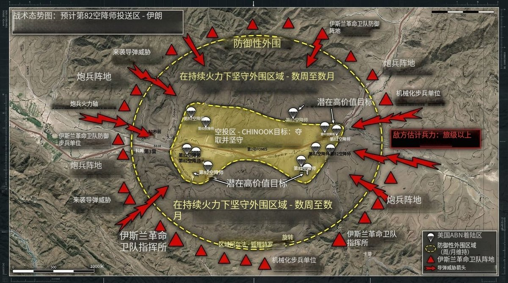

# 2026-04-04

## 1

@人服以德猫怪

发表于：2026-03-30 11:38

来源：微博

链接：https://m.weibo.cn/status/5282252943530288

也谈“车厢”还是“车箱”

从汉语演变来说，无疑“车箱”是正确的，这个从古代起就是作为车上的舆的一种称呼，在文献中多见。

“厢”字，专指两侧之房，那么，厢字是如何逐步获得现在的“车厢”这样的含义的呢？

一个关键结点是，“包厢”一词的出现。“包厢”被建于戏台（多位于二楼）两侧，用侧房之意，故称“厢”，有专门的门，因此称“包厢”。这一戏台格局，在国外也有，除少数建于正后方以外，多数包厢均布置于戏台二楼的两侧。

包厢一词的使用，影响到了马车车箱一词向车厢的演变，以其皆为可容座位之封闭（半封闭）式小间。据他人统计，《申报》中车箱和车厢两词并见，车箱仍占主流，但车厢已为人所接受。

但车上空间，在旧时之术语，如火车车箱，一般标准术语仍用“箱”字，无论从形状和传统而言，均无误。但日常文章中，已出现箱／厢混用之情况。

解放后的辞书，1960年以前的辞书，车箱均沿用以“箱”字为标准用法。1960年以后，开始始用“车厢”这一形式，但“车箱”仍以“同厢”这样的释义保留了用法。

关于后备箱，现行关于汽车外形的国家标准，都称为“载货箱”，为“后备箱”之别名。

因此，个人意义，从尊重传统、尊重现实的角度而言，车箱车厢两形不必非要分个你死我活出来，互见即可。但后备箱，在正式使用的时候，仍当遵循现行国标，用“箱”为宜。

---

## 2

@Steed的围脖

发表于：2026-04-03 21:43

来源：微博

链接：https://m.weibo.cn/status/5283738661425488

NASA官X发布了阿尔忒弥斯2号宇航员发回的一些照片。随着他们正式踏上月球转移轨道，完整的地球出现在了舷窗外面。除了猎户座飞船里的4人组以外，所有人类都在这张照片上了。图源：NASA

---

## 3

@物理芝士数学酱

发表于：2026-04-03 22:43

来源：微博

链接：https://m.weibo.cn/status/5283746183643789

\#今天要来点物理吗？\# 各大\#实验室\# 

刚才提到了摄影，现在来看看 2025年度全球物理\#摄影\# 漫步比赛的获奖作品

这是由全球16个粒子物理实验室合作举办的比赛，涵盖美国、法国和日本。数十名业余和专业摄影师受邀在力场和亚原子粒子的无形世界中发现美，这些力场仅在几分之一秒内闪现，蕴藏着关于宇宙起源和命运的秘密。每个参赛实验室都提交了三张图像参加全球竞赛，获胜作品由评委和公众投票选出。

图一 第一名作品，INFN COLD 实验室

摄影师马尔科·东吉亚（Marco Donghia）

在INFN的低温探测器实验室（COLD），拉斐拉·东吉亚（Raffaella Donghia）操作低温容器，将材料冷却至几千分之一K 。在这样的温度下，科学家可以寻找暗物质——将星系粘合在一起的神秘物质。摄影师Marco Donghia计划纹身，描绘他在这张获奖比赛照片中捕捉到的场景。

摄影师马尔科·东吉亚是拉斐拉的兄弟，本身是一名婚礼摄影师。这一次被拉斐拉不情不愿地叫过来给她的实验室拍摄照片。结果被评审选为年度物理第一名。

图二 第三名作品 CPPM/法国国家科学研究中心

摄影师Hugo Pardini-Lira

立方公里级中微子望远镜（KM3NeT）锚定在法国海岸外2500米深的水深处，将利用数千个光学传感器模块捕捉与中微子相互作用时发出的闪光，这些幽灵般的粒子可能有助于解释宇宙中所有物质的存在。评委们将其中的张切伦科夫光传感器的图片评为第三名，该传感器使用蜘蛛网形状的滤镜更好地聚焦捕获的信号。

关于切伦科夫光传感器 网页链接

图三 Cédric Favero

在日内瓦附近的CERN高温超导实验室，一台接线机将数十股铌-锡线结合起来，制造出用于在高能粒子加速器中产生强磁场所需的卢瑟福铌锡线缆。

图四 Andrea Giuliani

该硅条探测器被用于NA50实验，该实验是CERN超级质子同步加速器上的一项研究，提供了新物质态——夸克-胶子等离子体存在的证据。

图五 Matteo Monzali

位于意大利莱尼亚罗的INFN国家实验室的先进伽马跟踪阵列（AGATA）光子探测器和PRISMA磁谱仪，探索了由重离子碰撞产生的奇异核的结构。

图六 Adam Tomjack

南达科他州桑福德地下研究设施（SURF）最近发掘的扩展漂流坑或隧道。这是SURF计划为下一代中微子、稀有过程和暗物质实验创造更多地下空间的第一阶段。

图七 Yannig Van der Wall

公众投票第一名 法国卡昂大型重离子国家加速器研究中心。图中服务走廊贯穿SPIRAL2超导直线加速器，提供连接其组件的各种系统，包括冷却电路连接、真空泵和系统状态监测器。

图八 Yannig Van der Wall 

评委投票第二名的作品 

摄影师在法国卡昂的大型重离子国家加速器找到一个有趣的图案。他对一根帮助维持SPIRAL2线性加速器设施的真空管外壳的艺术特。

图九 日本筑波超级KEKB粒子加速器的弯曲地下通道。高能加速器研究组织（KEK）的旗舰电子-正电子对撞机于2020年实现了全球碰撞束加速器最高的瞬时亮度。

图十 Candice Torgeman

交换路由器使法国国家科学研究中心IN2P3计算中心的数千台服务器之间的存储和处理平台之间能够进行数据交换。路由器每天处理数百TB数据传输，其中大部分数据来自大型强子对撞机的实验。

图十一 Hisahiro Suganuma

在东海地区的日本质子加速器研究综合体为近中微子探测器挖掘了一个深达33.5米的空腔。在这片广阔的腔体内有一个离轴探测器，是近探测器复合体的一部分，旨在测量为T2K（东海至神冈）实验产生的中微子束的强度、轮廓和方向。

图十二 Antonella Di Paolo

DarkSide-20k工业气瓶，这是意大利INFN格兰萨索国家实验室正在建设中的暗物质探测实验。实验的核心是时间投影舱，将使用50吨液态氩气探测高质量弱相互作用大质量粒子（WIMPs）。

---

## 4

@巍克思

发表于：2026-04-03 22:43

来源：微博

链接：https://m.weibo.cn/status/5283748397716801

今天份的新月地球。

自 1972 年来的半世纪后，人类终于再一次看到这个情景

\#阿尔忒弥斯二号\#

---

## 5

@挨踢牛魔王

发表于：2026-04-03 20:43

来源：微博

链接：https://m.weibo.cn/status/5283713976108223

从原理上来说，claude code和openai的codex，谷歌的gemini cli，都是一个水平上的，大家对于原理的理解，没有差多少。

但是为什么就是claude code的体验这么好呢？

就像发动机的原理就在书上写着，但是为什么做一个好的发动机那么难呢？

都在细节，比如说一些材料，一些参数的调教。

今天说一个细节。

比如说编辑文件，就是改文件的某处，有几种方案。

一种是，让大模型记住行号，改第几行。

但是大模型经常记不住，老是搞错，改起来错漏百出。

另外，如果有几个操作同时编辑，比如说前面的操作加了一行，后面的操作的时候，那个行号就变了，那也容易改错。

还有一种，就是不管了，让大模型重新生成新的，全量写回去。

这个倒是不会出错，但是消耗token太大了。

还有什么看修改前后差异diff，然后再进行修改的。

最开始，各家都采用上面的这些不同的方案。

这些都有问题。

claude code怎么做的呢？

他们认为，编辑，就是一个替换，一个replace，用新的字符串把老的字符串换掉，编辑就完成了。

那么在编辑的时候，就搜索old_string，必须只能是1处，如果是0，说明大模型把这个字符串搞错了，要重来，如果是多处，说明搜索的唯一性不足，有相似的地方，这个时候，就把这个old_string扩大，把左右的地方在包含一些进来。

比如一个文本是“hello，world”，原本你是想把“hello”改成“hi”，搜“hello”到多处了，那不行，把后面的“，world”包含进old_string，直到搜索的时候，只发现一处，然后用“hi，world”做整体替换。

就这个方法，编辑文件可以做到非常精准，也尽量少消耗token。

这还没完，既然编辑就是替换，就大量训练claude模型替换文本的能力啊。

这样一来，模型和claude code整体能力不就提升了么？

如果你这个细节没搞对，你用这个编码智能体连claude的模型，你用不上它替换的能力，你的编码智能体就不行。

你用claude code去连别的模型，别的模型在替换上没有强化训练，那效果也不行。

总之，左右就是不行。

---

## 6

@高飞

发表于：2026-04-03 11:44

来源：微博

链接：https://m.weibo.cn/status/5283580239677588

\#模型时代\# 世界是一个草台班子的又一个实例。

刚看到推上再热炒另一起AI安全事件，一家估值100亿美元的AI独角兽，被黑客从供应链上游一路打穿，4TB数据摆上暗网拍卖，搞得特别大，起码比Claude Code被开源严重多了。

不过消息比较分散，很杂，非安全领域的人看起来有点困难。所以花了点时间，捋了一下，看完就一个感觉，我们经常说现在的AI是锯齿AI，有些能力特别强，有些行为特别弱智。

但有些AI公司，可以说也是锯齿AI公司。高大上的东西很厉害，但基础设施极其薄弱，估计会有一波补课吧。我对安全技术也不够熟，供参考。

剧情如下：

1、Mercor 是谁

Brendan Foody、Adarsh Hiremath、Surya Midha，三个湾区高中辩论队队友，2023年从哈佛和乔治城辍学创业，拿了 Thiel Fellowship（PayPal 联合创始人 Peter Thiel 设立的奖学金，专门资助辍学创业的年轻人，每人10万美元），做了一个AI招聘平台。最初帮印度程序员对接美国公司，后来转型成AI训练的人力中枢：替 OpenAI、Anthropic、Google DeepMind 这些实验室招募医生、律师、银行家，让领域专家给大模型做训练和评估。

跟 Scale AI 这类传统数据标注公司不同，Mercor 走的是高端专家路线。Scale 标注员平均时薪30美元，Mercor 的平均时薪95美元。据陆三金老师的一个微博，提到42章经对 Mercor 首位中国工程师的采访，他们招过时薪400美元、推荐费5000美元的皮肤科医生。这意味着 Mercor 系统里存的不是廉价众包劳动力的信息，而是各行业高资质专业人士的完整档案。

转折点在2025年6月。Meta 花143亿美元入股 Scale AI，OpenAI 和 Google 据报道因此切断了跟 Scale AI 的合作。Mercor 吃下这波溢出需求，增速起飞。CEO Foody 去年9月在 X 上晒过一组数字：年化营收从100万做到1亿美元用了11个月，从100万到5亿美元只用了17个月，7月周环比增长11%，8月18%，9月19%，还在加速。同年10月 C 轮融3.5亿美元，估值100亿，三个22岁的创始人成了全球最年轻的白手起家亿万富翁。平台管着3万名承包商，每天发出超150万美元薪酬。

这是一家刚刚把油门踩到底的公司。增长这么快的创业公司，团队分散、服务器散布在多个云平台上，需要一个办法让所有机器像在同一间办公室里一样互相通信。Mercor 用的是 Tailscale，一个在创业公司中很流行的组网工具。它的原理是在所有设备之间建一层加密的虚拟内网，不管服务器在旧金山还是在印度，装上 Tailscale 就能互相直连。好处是配置极简、上手快，特别适合人手紧张的高速成长期团队。代价是，一旦有人拿到了 Tailscale 的认证密钥，整个内网就全通了。

大家记一下这个组网工具，是重要考点。

2、攻击是怎么发生的

Mercor 不是被黑客正面突破的。

打个比方帮你理解整条链路：黑客没有撬 Mercor 的门，而是先在锁匠的工具箱里下了毒。锁匠（安全扫描工具 Trivy）上门给软件商店（LiteLLM）做例行检查时，毒就带进去了。软件商店被感染后，它的货架上摆出了带毒的商品。Mercor 的系统自动从货架上取了货，毒就进了 Mercor 的家门。

这种手法叫供应链攻击。不打目标本身，先感染目标依赖的上游软件工具，等目标自动更新时恶意代码搭便车进去。

具体每一步是怎么发生的：

第一步，3月19日，一个叫 TeamPCP 的黑客组织先拿下了 Aqua Security 的 Trivy。Trivy 是开发者广泛使用的开源安全扫描器，专门检查代码里有没有已知漏洞。对，看门的保安先被放倒了。他们篡改了 Trivy 在 GitHub（全球最大代码托管平台）上的发布标签，往里面塞了凭证窃取代码。也就是说，从这一刻起，谁用了新版 Trivy，谁的密码和密钥就会被偷偷传回给攻击者。

第二步，3月23日，同一套手法打掉了 Checkmarx KICS，又一个安全检测工具。两个安全工具连着倒，为第三步铺好了路。

第三步，3月24日，最关键的一击。目标是 LiteLLM。LiteLLM 是一个AI统一网关库，开发者用它一套代码就能同时调用 OpenAI、Anthropic 等上百家大模型的接口。每天340万次下载，36%的云环境里都有它。

LiteLLM 跟 Trivy 有什么关系？LiteLLM 每次发布新版本时，有一条自动化管道（业内叫 CI/CD 流水线）负责打包、检测、上传。这条管道里恰好用了 Trivy 来做安全扫描，而且没有锁定 Trivy 的版本号。所以管道自动拉取了已经被感染的新版 Trivy，Trivy 在扫描过程中顺手偷走了 LiteLLM 在 PyPI 上的发布密码。PyPI 是 Python 官方软件包仓库，相当于 iPhone 用户眼里的 App Store。

攻击者拿着偷来的密码和 LiteLLM 创始人被盗的账号，往 PyPI 上传了两个含后门的 LiteLLM 版本（1.82.7 和 1.82.8）。全球数千家公司的系统会自动拉取最新版本。

后门装进去之后干三件事：先把服务器上的 SSH 密钥（远程登录的钥匙）、云平台密码、API 密钥等各种凭证打包偷走；再利用这些凭证在 Kubernetes（管理公司服务器集群的系统）里横向扩散，从一台机器跳到更多机器；最后装一个持久化后门，确保被发现了还能留条路回来。

恶意包上线大约40分钟到3小时后被 PyPI 下架。但自动下载已经发生了。

第四步，Mercor 中招。Mercor 的系统恰好在这个窗口里自动拉取了被投毒的 LiteLLM。后门启动，开始扫荡 Mercor 服务器上能找到的一切凭证。

这个后门不挑食。根据多家安全公司的技术分析，它会无差别地收割 SSH 密钥、云平台密码、API 密钥、环境变量文件、Kubernetes 配置，见什么偷什么。而 LiteLLM 和 Tailscale 虽然是两个毫不相关的软件，但它们装在同一台服务器上。Tailscale 客户端运行时会在本地保存认证信息，所以 Tailscale 的钥匙大概率也在后门的收割清单里，一起被传回给了攻击者。

还记得前面说的吗？Mercor 的服务器、数据库、存储桶全部通过 Tailscale 串在一个内网里。拿到 Tailscale 的钥匙，就等于拿到了这个内网的万能门禁卡。

据 Lapsus$ 声称（Mercor 未确认这一细节），他们就是这样接入 Mercor 内网，把4TB数据批量搬走的。

有人在推文下面问了个好问题："一家营收5亿美元的公司，安全预算到底是多少？"

3、泄露了什么

Lapsus$，曾经干过微软、英伟达、三星的勒索组织，跟 TeamPCP 联手，把从 Mercor 偷到的数据直接挂到暗网（需要特殊工具才能访问的隐匿网络）上公开拍卖。

据 Lapsus$ 声称，总量4TB。Fortune 给了个直观换算：大约相当于1000小时视频或1000套大英百科全书。

具体分三块：939GB 平台源代码，包括AI匹配模型和 API 密钥；211GB 数据库，里面有候选人简历、个人身份信息、AI评估分数、雇主合同；3TB 存储桶数据，塞着视频面试录像、护照驾照扫描件、Google Cloud Function 源码。TechCrunch 拿到并审查了泄露样本，确认其中有 Slack 通讯记录、工单数据，以及承包商跟 Mercor AI 系统的对话视频。

更敏感的在后头。社交媒体上流传的样本里，出现了 Amazon、Meta、Apple 等大客户的信息，还有代号"Athena""Aphrodite"的内部项目数据。Mercor 帮这些大厂做AI招聘评估时采集的东西，一锅端了。Fortune 跟进追问时，Mercor 拒绝就 Lapsus$ 的具体声明作出回应。

4、这件事为什么重要

Mercor 存了大量求职者的面试视频、护照扫描件、面部和声音数据。密码泄露了你可以改，人脸和声纹改不了。这批生物识别数据一旦流入黑市，身份盗用的风险是永久性的。

再看攻击路径本身。LiteLLM 作为大模型 API 统一网关，一个实例里集中保存着多家模型提供商的 API 密钥。你可以理解为打开各家AI服务大门的钥匙，全挂在同一个钥匙扣上。攻破一个 LiteLLM 实例拿到的凭证，比攻破一个普通应用多得多。一个安全扫描器被渗透，一路打穿到AI训练平台的核心数据，中间经过的每一跳都是自动化完成的。这条路径暴露出的问题比 Mercor 本身大得多。

最后是 TeamPCP 自己说的话。他们在 Telegram 上放了句狠的："这些公司本来是用来保护你们供应链安全的，却连自己都保护不了……我们正在跟其他团队合作，你们喜欢的安全工具和开源项目在未来几个月都会被盯上。"FBI 网络部门助理主任 Brett Leatherman 随后在 LinkedIn 上公开警告：预计未来数周还会有更多泄露和后续入侵。

同一周，Anthropic 的源代码也因同一波供应链攻击泄露了。

AI行业跑得太快，安全的账迟早要还。这一周，账单到了。

---

## 7

@挨踢牛魔王

发表于：2026-04-03 20:44

来源：微博

链接：https://m.weibo.cn/status/5283718793005529

\#上海夫妇被假将军女儿骗走近半亿\#

每次看到这种新闻，我就疑惑，他们这么容易被骗，那些钱是怎么来的？

其实，每个人都有盲点，都可能被骗。

你要不信，我就说一个例子。

比如说魔术，你能看出所有魔术后面的技巧和机关吗？

你看不出来，你就是被骗了。

有些魔术，其实根本就没什么机关，完全就是手快，手快到你看不出来。

当然，魔术是一开始就告诉你，这是假的，这是表演。

很多骗子可不会先告诉你这个是假的。

---

## 8

@图老板赛博札记

发表于：2026-03-06 15:19

来源：微博

链接：https://m.weibo.cn/status/5273611221074599

"端午节不能说快乐，只能说安康"这一说法，并非传统文化的真实面貌，而是一个诞生于约2015年、流传不足十年的网络谣言。其源头是某营销号以"非遗专家杨光宇教授"之名发布的内容，称端午为祭祀节日，故不宜言"快乐"。此内容随即在家长群、老乡群等圈层中迅速扩散，并被部分媒体和博主跟风传播。

历史文献对此有明确记载，古人端午言"快乐"的例子不胜枚举：

- 唐玄宗《端午三殿宴群臣探得神字并序》中有"美君臣之相乐""自足为乐"等语

- 苏轼《浣溪沙·端午》描绘节日欢愉景象，毫无忌讳

- 十年前《人民日报》、新华社等央媒报道均使用"端午快乐"

- 2006年马来西亚总理亦以"端午快乐"向华人致贺

北京大学中文系教授张颐武等学者多次公开辟谣，明确指出"端午快乐"在传统文化中完全正当。然而辟谣的声音远不及谣言传播的速度与广度。

这一事件揭示了公众记忆被系统性涂改的完整机制：首先，有人炮制一个虚假的"传统"，遮蔽真实的历史；随后，大众记忆在短时间内被清洗并植入伪造内容；最终，部分人开始主动捍卫这个从未存在过的"传统"，并将纠正者斥为"没有文化"。谣言之所以往往胜过真相，在于它利用的是人性的弱点，而辟谣依赖的是良知——后者在传播效率上天然处于劣势。

---

## 9

@图老板赛博札记

发表于：2026-03-05 03:45

来源：微博

链接：https://m.weibo.cn/status/5273074219879078

罗马盛衰原因论里面的一些比较有趣的段落

最近在看孟德斯鸠的罗马盛衰原因论，里面有一些段落，读来很有趣味，这里摘抄整理如下,历史有时候就是这样惊人的轮回着

    ...在消灭了一个国王的军队之后，他们便用极为苛酷的税收或一种贡物来搞垮他的财政，借口是要他支付战费：这是一种新的暴政，这种暴政使他不得不去迫害自己的臣民，从而失去了臣民对自己的爱戴。

    ...当某一个国家或某一个民族拒绝服从自己的主人的时候，他们便立刻给他以罗马人民的同盟者的头街；这样他们就使他成为神圣不可浸犯的了：结果就没有一个国王，不拘他是多么伟大的人物，能够一时一刻对他自己的臣民，甚至对他自己的家人放心了。

    ...尽管罗马人的同盟者这个头街是一种奴役，但人们对这个头街仍旧是十分向往的；因为这样人们就可以确信，他们今后只受罗马人的侮辱了，而且他们也就有理由指望这种侮辱不会是很严厉的。因此，各民族和国王便不惜提供各种服务，不惜做出各种低三下四的事情，以便取得这一头街。

    ...罗马人有各种各样的同盟者。对于一些同盟者，他们是用给予特权和分享胜利成果的办法加以维系的，如拉丁人和埃尔尼克人等便是这样的同盟者；另外一些，例如他们的各殖民地，它们从建立时起就具有同盟者的身分；

    ...当他们把自由给予某些城市的时候，他们很快地就在那里制造两个派别：一派维护本地法律和自由，另一派则承认只有罗马人的意志才是他们的法律。既然后面的一派总是比对方要强得多，因此我们就可以清楚地看到，这种自由不过是一个虚名罢了。

     ...为了使那些大君主永远无法强大起来，罗马人不愿意使他们和那些已和罗马结盟的国家结成联盟。由于他们从不拒绝和强大国王的任何一个邻国结成同盟，结果和约中的这一条款便使他失去了一切同盟者。

     ...当他们征服了某一个大国国王的时候，他们就在条约中载明，在他和罗马的同盟者（通常就是指他的全部邻人）发生争端时，不得诉诸战争而是要请求罗马的仲裁：这就使他在今后再也不能使用军事力量。

   ...为了自己保存宣战的全权，他们剥夺了甚至是他们的同盟者的这一项权利：只要同盟者一发生什么纠纷，他们就派使节去迫使他们缔结和约。我们只要看一看他们如何中止阿塔路斯和普鲁西亚司之间的战争就可以明白了。

   ...当某一个国王取得一次常常是耗尽了本身力量的胜利的时候，罗马的使节就立刻出现在他那里，把胜利从他的手里夺走。

   ...罗马人既然知道欧洲各族人民是何等适于战争，他们便通过一项法律，根据这项法律，亚细亚的国王谁都不许进入欧洲和征服那里的随便哪一个民族。他们对米特利达特宣战所提出的主要理由，就是他破坏了这个禁例...

   ...如果罗马人看到两个民族相互作战，而他们和其中任何一方都不是同盟者，同时和其中任何一方也没有纠葛的时候，他们仍然不放过出场的机会；他们总是参加到较弱的一方面去。哈里卡尔拿苏的狄奥尼西乌斯说，这是罗马人的一个古老的习惯：永远帮助那乞求帮助的人。

   ...当某一个国家里发生了某种争论时，他们立刻就来进行审判...

   ... 在他们出发作战的时候，他们一定要事先保证在他们进攻的敌人近旁取得某一个同盟者，为的是从这个同盟者那里可以得到支援的队伍；而且，既然罗马的军队从来就不是人数众多的，因而他们总是注意到在离敌人最近的行省里，配置第二支罗马军队。第三支军队则配置在罗马，这支军队随时都准备着出征。这样看来，他们不过是把他们军队的很小一部分派出来，可是他们的敌人却把他们的全部军队都拿出来碰运气。

---

## 10

@物理芝士数学酱

发表于：2026-04-02 15:25

来源：微博

链接：https://m.weibo.cn/status/5283397133664884

\#今天要来点数学吗？\# \#数学史\# 人工智能 

继续刚才的内容，从密码进入到大语言模型

有人说，最早的大语言模型LLM出自 1913年圣彼得堡，俄国数学家安德烈·安德烈耶维奇·马尔科夫(Andrey Andreyevich Markov)之手。就是马尔科夫过程的那位马尔科夫。

当时他在书房里翻看着亚历山大·普希金(Alexander Pushkin)的诗歌小说《叶甫盖尼·奥涅金》(Eugene Onegin)。

但是，马尔科夫并不是在欣赏诗歌。相反，他拿起一支笔，在草纸上抄录下诗歌的前20000个字母——去掉所有标点和空格。然后，他将字母串等分成200节，每节100个字母按10×10规格罗列成矩阵，开始对每一行和每一列中的元音计数。

在旁观者看来，马尔科夫举止诡异。为何有人会以这种方式解构文学天才的作品？但是马尔科夫并不打算从诗歌中体悟人生和命运的真相。他正在寻找文本的基本数学结构。

分离元音和辅音，马尔科夫希望检验从1909年发展起来的概率论。在当时，概率理论主要用于分析分析轮盘赌或硬币翻转之类的现象，历史事件不会改变当前事件的概率。但是马尔科夫认为，大多数事件具有因果关系，先发生的事件往往影响到之后的事件。他想要找出这种关系的数学模型。

他认为，语言文本就是一个例子——过去部分地决定了当前。为了证明这一点，他想统计出，普希金小说中，前一个字母在多大程度上决定了之后字母的选择。

经过简单计数，他发现43％的字母是元音，而57％是辅音。然后，马尔科夫将这20000个字母分成成对的元音和辅音组合：他发现有1104个元音-元音对，3827个辅音-辅音对和15069个元音-辅音和辅音-元音对。从统计学上讲，这表明，对于普希金文本中的任何给定字母，如果它是元音，则下一个字母很大程度上会是辅音，反之亦然。

马尔科夫证明，普希金的《叶甫盖尼·奥涅金》中的字母不仅不是随机分布，而且还具有可以建模的基本统计质量。遗憾的是，他就此写成的论文却埋没在历史中，直到2006年才被翻译成英文。

概率和语言的核心思想，最终在克劳德·香农(Claude Shannon)于1948年发表的极具影响力的论文《传播的数学理论》中得到了重新阐释。

香农的论文概述了一种精确测量文本信息量的方法，从而为开启数字时代的信息理论奠定了基础。香农是当时为数不多阅读了马尔科夫的论文的人，他非常欣赏马尔科夫的观点：在给定的文本中，可以估计出某个字母或单词出现的可能性。像马尔科夫一样，香农利用若干文本，通过直接实验建立语言的统计模型，然后进一步尝试借助模型的统计规则生成文本。

最初的控制实验，他首先从27个符号(26个字母，加上一个空格)中随机抽取字符来生成句子，输出结果如下：

XFOML RXKHRJFFJUJ ZLPWCFWKCYJ FFJEYVKCQSGHYD QPAAMKBZAACIBZLHJQD

香农说，它们毫无意义，因为当我们交流时，我们不会随机选择。正如马尔科夫的发现，辅音比元音更有可能出现。但是在更高的粒度级别上，E比S更为普遍，S比Q更为普遍。为了解决这个问题，Shannon在初始可选列表中添加了若干重复的字母，以便更精确地模拟英语字母的出现概率——E的可能性比Q的可能性高11％。新一轮实验，结果比之前稍好：

OCRO HLI RGWR NMIELWIS EU LL NBNESEBYA THEI EEI ALHENHTTPA OOBTTVA NAH BRL。

经过一系列的后续实验，香农证明，当统计模型越来越复杂时，结果就越来越像是正常的语句。沿着马尔科夫的思路，香农揭示出英语的统计框架，并表明，如果统计规则足够详尽，那实际上可以利用数学模型生成自然语言。

在随后用单词进行的实验里，香农最终生成了下面的句子：

THE HEAD AND IN FRONTAL ATTACK ON AN ENGLISH WRITER THAT THE CHARACTER OF THIS POINT IS THEREFORE ANOTHER METHOD FOR THE LETTERS THAT THE TIME OF WHO EVER TOLD THE PROBLEM FOR AN UNEXPECTED.

对于香农和马尔科夫而言，为人类的语言建立统计模型的尝试，为他们正在研究的更广泛的问题，提供了一种全新的思路。

对于马尔可夫来说，它把随机性扩展到了相互独立的事件之外，为新时代的概率论铺平了道路。对于香农，受它启发，找出了精确定义信息单位的方法——最终改变了整个世界。但是，仅就语言建模和生成语句的统计方法本身而言，它开辟了自然语言处理新时代。

最有趣的是，马尔可夫二元语法模型和 GPT-5 的核心思想完全相同——根据前面的词元预测下一个词元。

人类投入了112年的工程技术、起码千亿美元资金和一百万个GPU，就为了让概率稍微再准确一点。

---

## 11

@风云学会陈经

发表于：2026-04-03 10:44

来源：微博

链接：https://m.weibo.cn/status/5283565902236146

\#伊朗袭击美甲骨文和亚马逊数据中心\#

伊朗战争进入收尾期，几个判断

1. 昨特朗普国家讲话扯了20分钟，伊朗也有官方发声，加上以色列阴沉着搞阴谋炸炸炸，非常混乱。但应该进入收尾期了，美国退出意图明显。

2. 第一个重大判断，不会有渲染了很久的“地面部队”。之前是说让库尔德人派兵，根本没有任何动静，都知道不行，几个导弹炸过去库尔德人就不敢动了。美军82空降师、的黎波里两栖战斗舰，吆喝了万把人。但就按以前的老观念，空降师、登陆舰，需要后面几十倍的兵力跟上，没有自己独自空投进去送死的。1991年海湾战争50万人，2003年伊拉克战争30万人，现在万把人绝对无法实现任何大的战略目标。

3. 再一个判断，虽然有猛烈轰炸，但程度可控。一个很可怕的前景是，美以就如特朗普威胁的那样，不答应无理谈判要求，就把伊朗民用电厂、油气设备炸出人道主义危机。伊朗已经公开说了反制办法，会把海湾国家的油气设备、电厂等对等设施炸毁。以色列远一些，伊朗也会有很多重型导弹炸过去，现在应该有所保留。伊朗的威胁是可信的，真敢炸，而且没法防备，领导人炸死了下面中层军人会报复，拦截武器已经被证明挡不住。还有国际金融，油价暴涨、美股与全球股市大跌、美债利率大涨、大通胀预期、美国经济衰退预期这些事，都是特朗普害怕的，要不然也不会定下2-3周就跑的目标。

4. 霍尔木兹海峡会如何？美以会去炸，但是不足以解除威胁，大船在海峡里慢慢开，伊朗隔着1000公里导弹过来也能炸到。伊朗吃了这么大的亏，怎么也要得到一些东西，肯定会把霍尔木兹海峡管起来。分级管理，美以的不给过，美以同伙交大钱，友好国家安全过，人民币支付，都有放风了。如果霍尔木兹海峡要开，应该就是这办法，武力无法解决问题。

5. 能源价格会如何？短期中期应该都会短缺，供应已经受到打击了。目前就算海峡恢复，一些油气田已经被炸了，伊朗和卡塔尔共有的世界最大天然气田损失了部分产能，卡特尔已经宣布不可抗力了。而且霍尔木兹海峡不会完全恢复，还有俄罗斯出口能力也被乌克兰打击，委内瑞拉也在调整。能源通胀不可避免，就是程度问题，不搞到原油150以上都算没彻底失控。新能源转型必然加速。

6. 以色列会如何？会不会美国跑了，以色列继续炸个没完没了？以色列是没办法独立灭掉伊朗的，单独和伊朗互相拿板砖爆头，除非用核武器，长期来说伊朗会占上风。在这种威胁下，以色列也得过日子，就只好和伊朗控制对爆力度。长远来说以色列很为难，这次没灭掉伊朗，后面会被伊朗组织周边势力用各种进攻性武器打很惨。

7. 全球会大受震撼，纷纷调整，巨大的影响刚开始。例如西方阵营面临解体危机。而发展中国家会得到巨大的鼓舞，看到美西方的虚弱。

---

## 12

@头条新闻

发表于：2026-04-03 09:44

来源：微博

链接：https://m.weibo.cn/status/5283555771158726

【\#吴柳芳称转行做主播是迫于家庭生计\#】\#吴柳芳称至今都不敢看私信\# 退役后成为“网红”的运动员不在少数，但陷入“擦边”争议的，吴柳芳或是唯一一个。

在那些视频里，她常穿着清凉，跳一些展示身材的舞蹈，这引发了同样曾为体操队国手、奥运冠军的管晨辰的质疑。2024年11月，一场奥运冠军和世界冠军的隔空互呛迅速引发舆论关注，吴柳芳的冠军头衔和视频内容遭到审判，有人批她给国家队丢了人，担忧此举有可能导致对女子体操运动员集体的污名化，也有人力挺她称，退役运动员应有谋生的自由，既往的荣光不该成为她的枷锁。

事件发酵后，吴柳芳的账号因“违反社区规定”禁止被关注，那些被质疑“擦边”“媚男”的视频也被隐藏。那段日子，有关她的谣言、恶评不断，几乎所有媒体都在试图接触她，吴柳芳却始终保持沉默。

风波背后，我们更想知道的是，一个体操世界冠军何以走向这一步？风波发生前，她究竟经历了什么？这些谜团，直至事发一年后才被解开。

今年春天，我们在北京见到了吴柳芳。面对镜头，她仍显得十分紧张，说话时声音都在颤抖。采访之外的时间，她便安静地坐在一旁，抱着平板电脑去翻采访提纲。

忆及当初，吴柳芳坦言，转行做主播是迫于家庭生计。和许多运动员的轨迹一样，出身寒门的吴柳芳从小苦练体操，她曾为国征战，数次获得世界冠军，但巅峰过后，当她开始直面退役后漫长的心理落差和经济困难时，做主播，挣快钱，或是那时为数不多的选择之一。这是她憋了一年多的话。

视频发布后，吴柳芳再度上了热搜，至今，仍不断有新的采访需求和商业合作找到她和她的家庭。尽管争议依然存在，但她明显感到外界的关注开始变得“比较正向”了，“大家更关注我本身的成长经历，而不是过往风波。”

如今，她说自己已从这段经历中走出，以前在赛场为国征战，现在她要为自己而战，重新做自己了。

以下是吴柳芳的讲述。

2023年，吴柳芳决心离开做了20多年的体育行业，转行去做网络主播。她的上一份工作是体校老师，没有编制的那种，有限的收入无法为她抵御家庭风险——无论是母亲的肿瘤、父亲的贷款，还是弟弟的学费，这让她觉得自己无路可走。

从国家队退役后，吴柳芳也曾沿着许多运动员的轨迹进入大学学习，毕业后没有留在省队，而是自主择业，这不仅因为体育市场前景广，更重要的是，能为她带来一笔退役费。于是，她用这笔钱凑够了买房的首付，为全家添置了第一间属于自己的房子，接着来到杭州一家体育公司做体操教练，其间曾参与关爱自闭症儿童的公益活动。

但市场化的环境远不如“铁饭碗”稳定。公司停摆后，她一边学舞蹈，一边寻找与体操相关的工作机会，却发现人家根本不看那些过去的辉煌，而是能力。这是一套与她习惯的追逐成绩、以夺取冠军为目标截然不同的评价系统。

当昔日的世界冠军被“打回”一名普通的求职者，巨大的落差之下，成为主播或是她得以帮家庭脱困的最快选择。接下来，便有了2024年末那些引发巨大风波的视频。

大家印象最深的视频是在街上拍的那条。我穿着大衣，里头穿了一双丝袜。其实当时本来是想拍一条比较飒的那种视频的，就是女生穿着大衣，踩着高跟鞋，头一撇，往前走特别帅那种，那段时间特别火。但当时我买的高跟鞋老拖脚，就没办法拍。当时摄影师、灯光师都在旁边，我衣服也换好了，那怎么办？大家就说能不能原地跳一些比较简单的舞，然后就临时换成了跳舞。

我就是一个互联网的小白，看大家发的那些视频都是跳舞穿搭，每一条都有很高的流量，我就会想去模仿她们，因为我也想要流量。

我也刷到过许多那种旅游转场、风景转场的视频，我也很喜欢，但是这些视频是需要成本的，比如要出去旅游，你需要花钱买机票去景点拍，但以我以前的收入是没有办法来做这些东西的。那个时候，最简单的拍摄就是去淘宝买一点小短裤、小吊带背心这些比较吸引流量的服装，成本不到50块钱就能完成一条视频了。

我退役以后工作了大概有5年这样子，中间换了几份工作，基本上都是从事教育工作，进过学校当过老师，但都是那种外聘的。当时在杭州那边，大概一月收入五六千元。

找工作的时候，别人其实是看你的能力，而不是你的头衔。比如像我这种在中间，不是最低也不是最高的这种头衔，就特别尴尬。

我发现我一直跟不上世界的脚步。不管是我做的几份工作，还有平时生活中做的一些事情，我感觉自己总是比别人差一点，心里会觉得，我以前这么辉煌，拿过那么多成绩，可到了找工作的时候，怎么都找不到自己满意的。

大家都想做自己喜欢的事，我也一样。我喜欢跳舞，之前也去过一些舞蹈培训的店里咨询过，因为参加一些路演的工作可能会有一些收入。但一进去他们就给我推课，价格还挺贵的，然后给我推一些商演，都是在什么庄园、邮轮上，我想这好像不大靠谱，就没有去做这个事情。

后来之所以选择做自媒体，也跟我真正了解了家里面的情况有关。

小时候爸妈不会跟我说家里具体的情况，但有一次他们都生病了，想找我要钱，而我也有点给不出，这让我非常难受。加上那时候我爸贷款给我妈做手术，我能感觉到我们家是真的没有（经济）能力（去维系）了。而我是我们家的长姐，我还有个弟弟，那时刚考上大学还没有工作，所以我觉得我应该撑起这份责任。

之前最困难的时候，我真的想不到还有什么赚钱的路子了，甚至想去夜场跳舞，一晚上可能赚一点跳舞的费用，但最后还是没有去。

我做自媒体的时候，可能跟我爸妈提了一嘴，但是他们也不懂这方面的东西。那时候我自己研究适合什么样的风格，因为喜欢跳舞，就往这个方向走了。

视频爆了的时候，我当时在吃晚饭，还奇怪账号里面怎么有这么多评论，有好的也有不好的，然后我就看到有这么一条评论，感觉好眼熟的一个人，评论里还稍微带了一点刺的感觉，我还挺惊讶的。

碰上这件事情以后，我感觉不太真实，你从一个大家都不认识的状态下，两个晚上就达到了当时600多万粉，然后还频频上热搜，就觉得有点不可思议。当时身边的人都在说：“恭喜，你成为大网红了”，但我自己高兴不起来，因为大家对我的关注，我觉得都是因为舆论来的。

那段时间我其实情绪非常低落，有时候莫名其妙就会哭，我最在意的一点就是造谣。对已经发生的事情，大家怎么说我是认的，但造谣是我不能接受的，而我自己又没办法发声，当时挺难的。那时候舆论已经达到顶峰了，如果我再出来说话，舆论可能就停不下来了，所以选择了消失。

那时候我不敢出门，因为我真的会想象，一出门会不会有那些不喜欢我的人朝我扔臭鸡蛋？那时我父母每天都会打电话给我，确认我安全，他们怕我想不开。

至今为止我都不太敢点进去看私信，有时候会不小心瞄到几条。记得当时有一条评论说，冠军是我的荣耀，不应该成为我的枷锁，这句话在我印象里还是蛮深刻的。（凤凰周刊）

---

## 13

@皇城根下刀笔吏

发表于：2026-04-03 08:44

来源：微博

链接：https://m.weibo.cn/status/5283532462097767

另外，欧美女权有一些相对较为成熟的理论体系，比如平权派。

假设一个男性跟一个平权派女权主义者一起吃饭的话，在没有经过对方事先同意的情况下，不能随便给对方买单。

否则，会被这个女权主义者认为是歧视。

未经事先告知和同意，便擅自给对方买单，属于歧视这个女性。

人家可能会因此而相当不满。

所以，不是所有的欧美女性，都是女权主义者。有些女性会明确表示，自己不是女权主义者。因为承认自己是女权主义者的话，相当于说是认可这些理论体系。不是所有的女性，都认可这些理论体系。

中国的女权主义发展到现在，按我自己的观察和理解，有点像是“公主病”。

没有什么特别成体系的理论。

主要是要规则特权、两性特权，如果你反驳几句的话，对方便可能嘤嘤呜呜，觉得你在欺负她，或者质疑的人多了之后，便说受到网暴。\#女权主义运动\#\#热点观点\#

---

## 14

@蚁工厂

发表于：2026-04-03 23:58

来源：微博

链接：https://m.weibo.cn/status/5283526418105108

Andrej Karpathy刚分享了他用LLM来做知识库管理的心得：

-------------------------------

LLM 知识库

我最近发现一个非常有用的做法：用 LLM 为自己感兴趣的研究主题构建个人知识库。这样一来，我最近消耗的大量 token，不再主要用于处理代码，而是更多用于处理知识本身（以 markdown 和图片形式存储）。最新一代 LLM 在这件事上已经相当强了。具体来说：

数据摄取：

我会先把源文档（文章、论文、代码仓库、数据集、图片等）索引到 raw/ 目录下，然后让 LLM 逐步“编译”出一个 wiki。本质上，它就是按目录结构组织的一组 .md 文件。这个 wiki 包含 raw/ 中所有数据的摘要、反向链接，然后再把这些数据归类到不同概念下，为这些概念撰写条目，并把它们互相链接起来。

把网页文章转换成 .md 文件时，我喜欢用 Obsidian Web Clipper 插件；同时我还会用一个快捷键，把相关文章里的所有图片下载到本地，这样 LLM 就能更方便地引用它们。

IDE：

我用 Obsidian 作为 IDE 的“前端”，在里面查看原始数据、编译后的 wiki，以及派生出来的可视化结果。需要强调的是，wiki 里的所有数据基本都由 LLM 来编写和维护，我几乎不会直接手改。我也试过一些 Obsidian 插件，用其他方式渲染和查看数据，比如用 Marp 做幻灯片。

问答：

真正有意思的地方在于：当你的 wiki 足够大之后（例如我最近某个研究主题的库，大约有 100 篇文章、40 万词），你就可以围绕这个 wiki 向 LLM agent 提各种复杂问题，它会自行展开研究、整理答案等等。

我原以为这里必须上更复杂的 RAG，但实际情况是：只要 LLM 能自动维护索引文件，以及每份文档的简要摘要，在这种“小规模”下，它已经很擅长读出关键相关信息了。

输出：

我不太喜欢让答案只停留在文本终端里，我更希望它直接为我生成 markdown 文件、幻灯片（Marp 格式），或者 matplotlib 图片，然后我再回到 Obsidian 里查看它们。根据查询类型，其实还可以扩展出很多别的可视化输出格式。

而且很多时候，我最后会把这些输出重新“归档”回 wiki，继续增强这个知识库，以便支持后续查询。也就是说，我自己的探索和提问，都会不断沉淀进知识库里。

Lint / 质检：

我还会让 LLM 对整个 wiki 跑一些“健康检查”，比如发现不一致的数据、补全缺失信息（借助网页搜索）、挖掘有意思的关联以生成新的候选条目等，从而持续清理 wiki、提升整体数据一致性和完整性。

LLM 也很擅长提出接下来值得追问、值得继续研究的问题。

额外工具：

我发现自己会不断开发一些辅助工具来处理这些数据。比如我随手 vibe code 了一个很小、很朴素的 wiki 搜索引擎。我既会直接用它（通过一个 web UI），但更多时候，是把它作为 CLI 工具交给 LLM 调用，用于处理更大的查询任务。

进一步探索：

随着仓库不断变大，一个很自然的方向就是继续思考：能不能通过合成数据生成 + 微调，让你的 LLM 直接把这些数据“学进参数”里，而不是只依赖上下文窗口来读取。

TL;DR：

把若干来源的原始数据收集起来，交给 LLM 编译成一个 .md wiki；再由 LLM 通过各种 CLI 工具围绕这个 wiki 做问答、持续增强知识库；所有内容都可以在 Obsidian 中查看。你几乎不再需要手工编写或编辑 wiki，它基本已经成为 LLM 的工作域。

我觉得这里完全有机会长出一个很强的新产品，而不只是一个由各种脚本勉强拼起来的 hack。

\#How I AI\#

---

## 15

@伊利达雷之怒

发表于：2026-04-03 09:45

来源：微博

链接：https://m.weibo.cn/status/5283551152177468

什么人才会觉得，张雪和张雪峰的路线是矛盾的？

为啥张雪峰不建议某些学生考某些大学和专业？因为这些学生的诉求是，我想读个适合我的大学和专业，然后安安稳稳找个好工作。最终落脚点还是，安安稳稳。

如果这些学生一上来就说，我就是热爱这个行业，我不考虑其他的。那张雪峰也不会帮他打退堂鼓啊......

怎么在某些人嘴里，张雪峰只会功利性地推荐大学和专业啊？他会不会这样推荐？会，但前提是你咨询他就抱着功利性的目的啊。但凡你说你是想追梦，那他也会给出适合追梦的建议。如果张雪去咨询张雪峰，说我就是想追梦，我要做摩托车，做属于中国的超一流品牌，张雪峰也只会提供建议，告诉张雪，你去重庆吧，那里的摩托车产业链齐全，人才梯度建设较好。

---

## 16

@新浪科技

发表于：2026-04-03 09:45

来源：微博

链接：https://m.weibo.cn/status/5283554419278620

【\#AI应用营销投入飙升63.6%\#】QuestMobile报告显示，2025年AI应用营销投入快速增长，硬广投放费用TOP10品牌集中度持续提升，用户规模迎来爆发式增长。

头部AI企业不再只拼技术，而是靠生态构建获客闭环：元宝深度绑定微信生态，重合率92.0%；千问接入阿里系应用，重合率90.4%；豆包依托抖音生态，重合率88.7%，分别主打社交裂变、场景深耕、内容创作+购物入口。

媒介策略上，头部品牌通过大曝光抢占新用户，从“技术谁更强”转向“生态谁更强”。

---

## 17

@风中的厂长

发表于：2026-04-03 17:45

来源：微博

链接：https://m.weibo.cn/status/5283668957334864

评论区外贸网友抱怨订单多但是利润薄，我说说自己的故事吧。我以前追求“订单多”，厂里排单必须3个月以上才有安全感，经常和别人打价格战，整天担惊受怕，生活质量变差，疫情后我开窍了，我宁愿少做点，价格高一点，员工待遇提高一点，业务员不再疲于奔命，我不是还剩一个服装厂嘛，厂里夏天没订单就放假，这些年工伤事故一次都没有，我们现在做精品，生活质量变高了，还能笑看同行卷，自己有更多时间做喜欢的事情，每天按时回家陪孩子吃饭，每周和家人出去露营。思路变一下，海阔天空，不要追求“多大快”了，“小慢精”才是王道。

---

## 18

@刘晓光Savvy

发表于：2026-04-03 16:45

来源：微博

链接：https://m.weibo.cn/status/5283665261366672

刚刚的微博又有小网友表示不同意见：

她认为毕业回老家的人不是啃老，而是帮助照顾父母。

我这里可以非常明确的告诉你：

凡是啃老的，没有能够把父母照顾好的。

反而把父母照顾好的，年轻时候一般都不怎么啃老。

为什么？

因为照顾父母的人，「尽责性」都比较高。

「尽责性」高的人，啃老就不太厉害。

大学毕业22岁，父母即便30岁生他，也就才52岁。

52岁的老年人，绝大部分都身强力壮，远远达不到失能的程度。

这个时候需要哪门子「照顾」？

到底是谁照顾谁？

是子女在家家务包办，

还是一日三餐都父母做好了，子女只需要按时吃饭，最多最多，拖个地洗个碗，大概率甚至洗碗都没有。

所以到底谁照顾谁？

在这种情况下，能说出不是啃老，是为了照顾父母的人。

「虚伪性」也是拉满的

尽责性差，虚伪性高，这种人怎么可能会在父母失能时候照顾好？

---

## 19

@999战报速递

发表于：2026-04-03 08:45

来源：微博

链接：https://m.weibo.cn/status/5283544869896551

据美国《纽约时报》报道，俄罗斯、⏰和法国在联合国安理会阻止了一项由阿拉伯国家支持的决议，该决议旨在授权对伊朗采取军事行动以重新开放霍尔木兹海峡，理由是决议的措辞允许使用武力。

这项由巴林在海湾国家支持下起草的决议，将允许各国采取一切必要手段，确保通过霍尔木兹海峡的海上运输安全。该海峡承载着全球约五分之一的石油和天然气供应。

预计，联合国安理会将于周五（4月3日）对这项决议进行表决，但安理会常任理事国和非常任理事国之间仍对此存在分歧。  

\#美伊以冲突\#\#伊朗公布最新战果\#\#伊朗袭击美甲骨文和亚马逊数据中心\#

---

## 20

@南海的浪涛

发表于：2026-04-03 16:45

来源：微博

链接：https://m.weibo.cn/status/5283658987475614

美国有史以来考虑过的最疯狂的军事计划 \#美伊以冲突\# 

五角大楼向特朗普简要介绍了抢走伊朗核材料的计划。以下是该计划的具体步骤：

第一步：将数百名特种兵空投至伊朗内陆深处。

第二步：将第82空降师空降到特种兵已经夺取的阵地上，布置防线。

第三步：在伊朗陆军、伊朗革命卫队和防空部队试图消灭所有人时，确保周边安全。

第四步：从零开始，在敌占区，在遭受攻击的情况下，修建一条野战机场跑道。

第五步：空运重型工程设备降落。

第六步：施工，挖开福尔多或纳坦兹——这些设施埋在地下80~90米的加固山岩中，隧道已被美军炸垮。

第七步：提取约450公斤高浓缩铀——放射性气态物质，如果处理不当会致命。

第八步：将其装载到运输机上，然后飞出伊朗领空。

---

## 21

@风中的厂长

发表于：2026-04-03 20:45

来源：微博

链接：https://m.weibo.cn/status/5283712988349346

捋了下最近几个食品安全事件：

椰子水，首先是一个现象级单品，被瑞幸咖啡的生椰拿铁带火，主打健康概念，5年市场规模翻了十倍，然后今年2月暴雷。里面乱加科技。正常来说生产1升纯椰子水需消耗3-4颗椰青，原料成本超30元，但电商平台充斥9.9元/升的“100%椰子水”，明显违背经济逻辑。结果一查发现，全军覆没，没一个通过检测的。

活鱼打麻药，热搜的时候我没说这话题，因为我家品牌是卖冷冻鱼为主，避免被人说为了利益蹭热度。等热度过了说一下：这个其实一直都普遍，直到最近被央视曝光。活鱼运输密度很高（成本考虑），一车几千斤鱼动来动去容易死，打麻药全程不动：不掉鳞不缺氧、死亡率几乎为零。但是违规使用丁香酚可是大问题。具体科普可以看@渔老板钓鱼 

工业漂白鸡爪，蜀福香、曾巧食品等多家企业用工业双氧水浸泡鸡爪，追求白净卖相。大家可以联想一下类似的其他产品，双氧水危害非常大的：破坏蛋白质，损伤肝肾，超量有可能危及生命。除了白净，口感很脆肉很多也是不正常，正常鸡爪哪里会那么肥那么Q弹，其实加了很多保水剂的。保水剂属于合法食品添加剂。少量保水剂可以调节口感，过量就是为了吸水增重多卖钱。而且也是不健康的。

