@物理芝士数学酱
发表于：2026-04-03 22:43
来源：微博
链接：https://m.weibo.cn/status/5283746183643789

\#今天要来点物理吗？\# 各大\#实验室\# 

刚才提到了摄影，现在来看看 2025年度全球物理\#摄影\# 漫步比赛的获奖作品

这是由全球16个粒子物理实验室合作举办的比赛，涵盖美国、法国和日本。数十名业余和专业摄影师受邀在力场和亚原子粒子的无形世界中发现美，这些力场仅在几分之一秒内闪现，蕴藏着关于宇宙起源和命运的秘密。每个参赛实验室都提交了三张图像参加全球竞赛，获胜作品由评委和公众投票选出。

图一 第一名作品，INFN COLD 实验室

摄影师马尔科·东吉亚（Marco Donghia）

在INFN的低温探测器实验室（COLD），拉斐拉·东吉亚（Raffaella Donghia）操作低温容器，将材料冷却至几千分之一K 。在这样的温度下，科学家可以寻找暗物质——将星系粘合在一起的神秘物质。摄影师Marco Donghia计划纹身，描绘他在这张获奖比赛照片中捕捉到的场景。

摄影师马尔科·东吉亚是拉斐拉的兄弟，本身是一名婚礼摄影师。这一次被拉斐拉不情不愿地叫过来给她的实验室拍摄照片。结果被评审选为年度物理第一名。

图二 第三名作品 CPPM/法国国家科学研究中心

摄影师Hugo Pardini-Lira

立方公里级中微子望远镜（KM3NeT）锚定在法国海岸外2500米深的水深处，将利用数千个光学传感器模块捕捉与中微子相互作用时发出的闪光，这些幽灵般的粒子可能有助于解释宇宙中所有物质的存在。评委们将其中的张切伦科夫光传感器的图片评为第三名，该传感器使用蜘蛛网形状的滤镜更好地聚焦捕获的信号。

关于切伦科夫光传感器 网页链接

图三 Cédric Favero

在日内瓦附近的CERN高温超导实验室，一台接线机将数十股铌-锡线结合起来，制造出用于在高能粒子加速器中产生强磁场所需的卢瑟福铌锡线缆。

图四 Andrea Giuliani

该硅条探测器被用于NA50实验，该实验是CERN超级质子同步加速器上的一项研究，提供了新物质态——夸克-胶子等离子体存在的证据。

图五 Matteo Monzali

位于意大利莱尼亚罗的INFN国家实验室的先进伽马跟踪阵列（AGATA）光子探测器和PRISMA磁谱仪，探索了由重离子碰撞产生的奇异核的结构。

图六 Adam Tomjack

南达科他州桑福德地下研究设施（SURF）最近发掘的扩展漂流坑或隧道。这是SURF计划为下一代中微子、稀有过程和暗物质实验创造更多地下空间的第一阶段。

图七 Yannig Van der Wall

公众投票第一名 法国卡昂大型重离子国家加速器研究中心。图中服务走廊贯穿SPIRAL2超导直线加速器，提供连接其组件的各种系统，包括冷却电路连接、真空泵和系统状态监测器。

图八 Yannig Van der Wall 

评委投票第二名的作品 

摄影师在法国卡昂的大型重离子国家加速器找到一个有趣的图案。他对一根帮助维持SPIRAL2线性加速器设施的真空管外壳的艺术特。

图九 日本筑波超级KEKB粒子加速器的弯曲地下通道。高能加速器研究组织（KEK）的旗舰电子-正电子对撞机于2020年实现了全球碰撞束加速器最高的瞬时亮度。

图十 Candice Torgeman

交换路由器使法国国家科学研究中心IN2P3计算中心的数千台服务器之间的存储和处理平台之间能够进行数据交换。路由器每天处理数百TB数据传输，其中大部分数据来自大型强子对撞机的实验。

图十一 Hisahiro Suganuma

在东海地区的日本质子加速器研究综合体为近中微子探测器挖掘了一个深达33.5米的空腔。在这片广阔的腔体内有一个离轴探测器，是近探测器复合体的一部分，旨在测量为T2K（东海至神冈）实验产生的中微子束的强度、轮廓和方向。

图十二 Antonella Di Paolo

DarkSide-20k工业气瓶，这是意大利INFN格兰萨索国家实验室正在建设中的暗物质探测实验。实验的核心是时间投影舱，将使用50吨液态氩气探测高质量弱相互作用大质量粒子（WIMPs）。

---

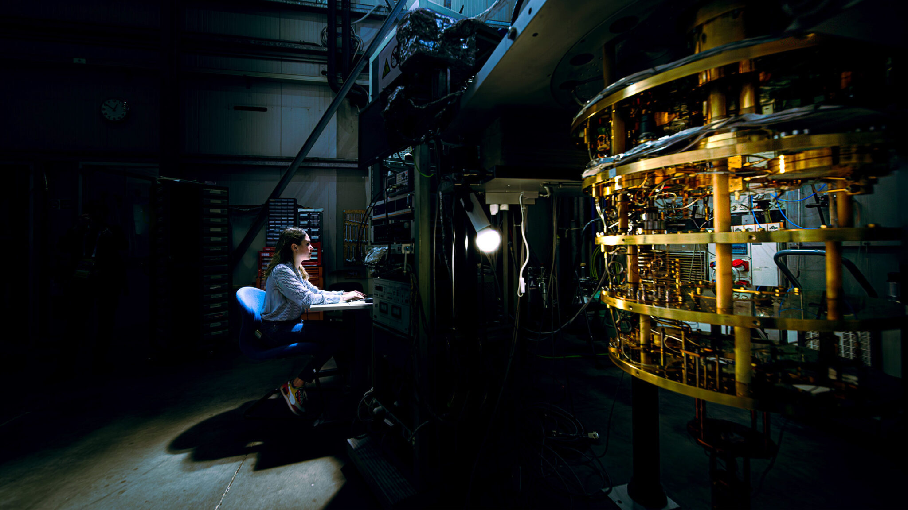

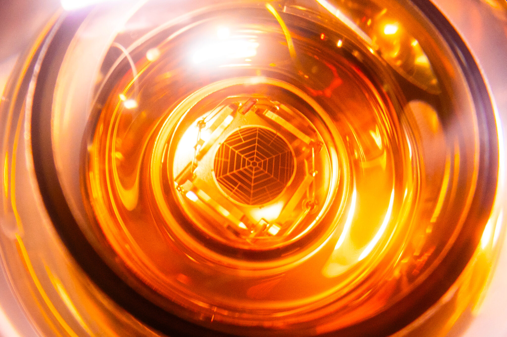

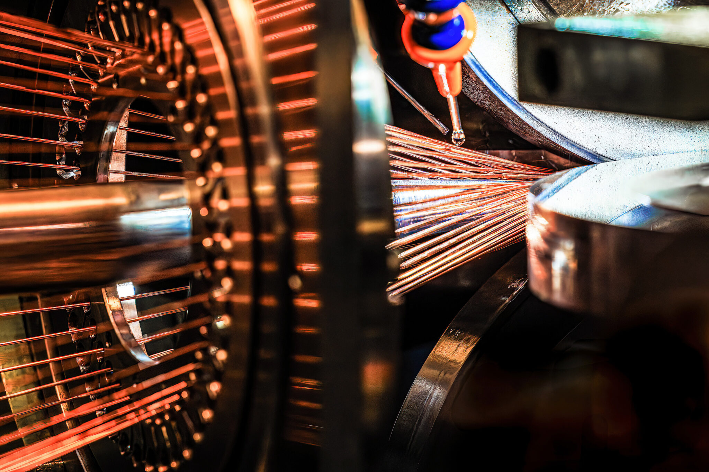

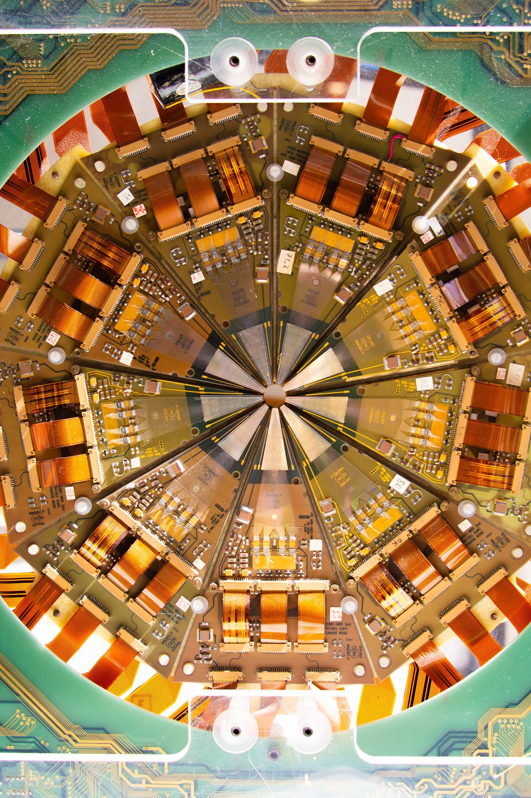

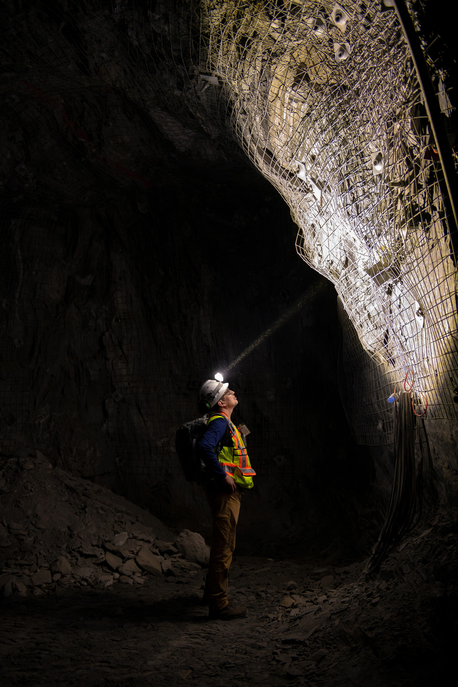

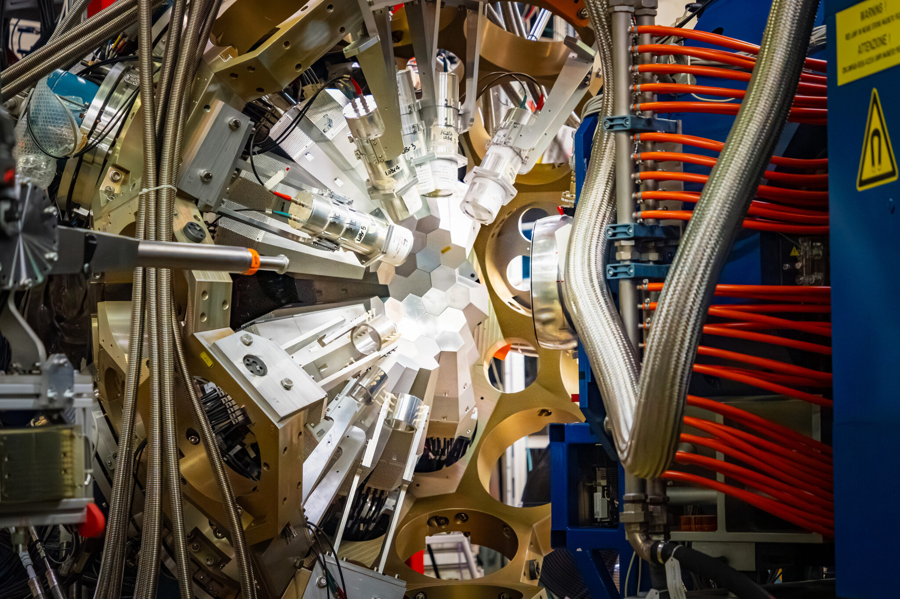

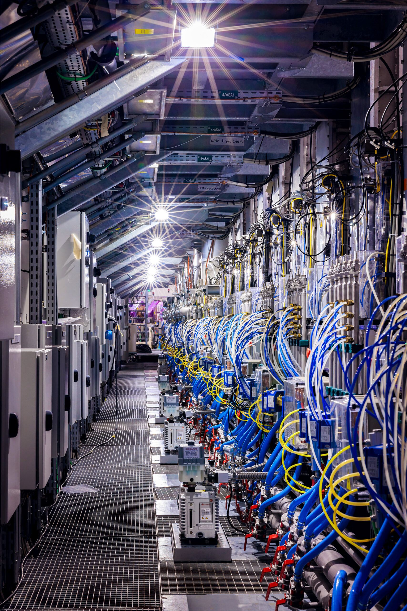

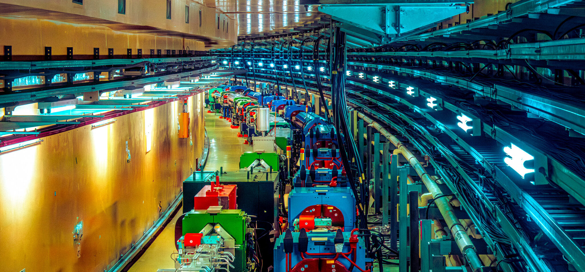

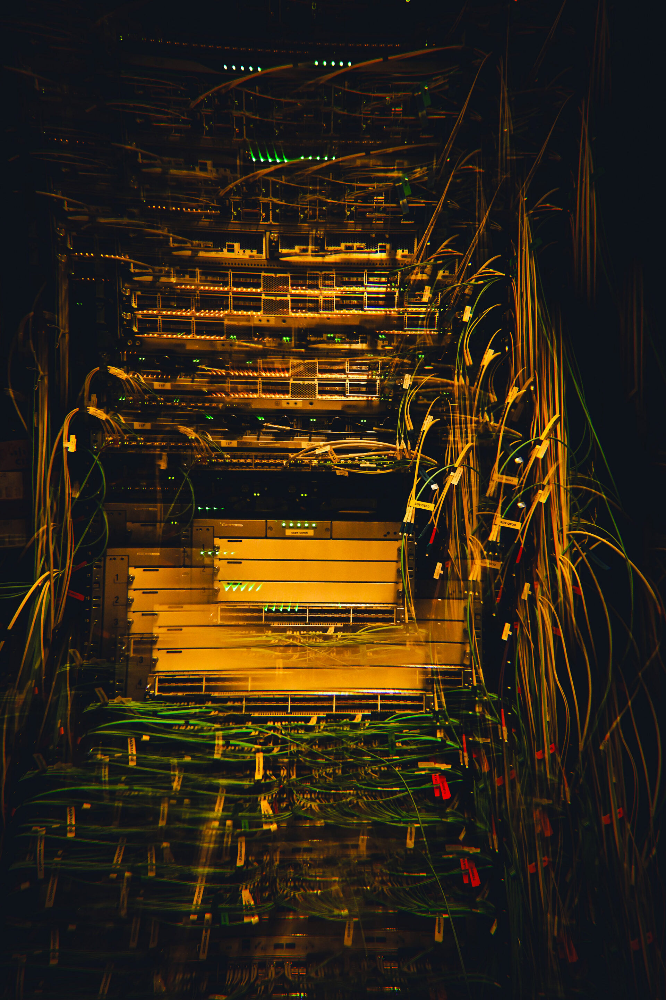

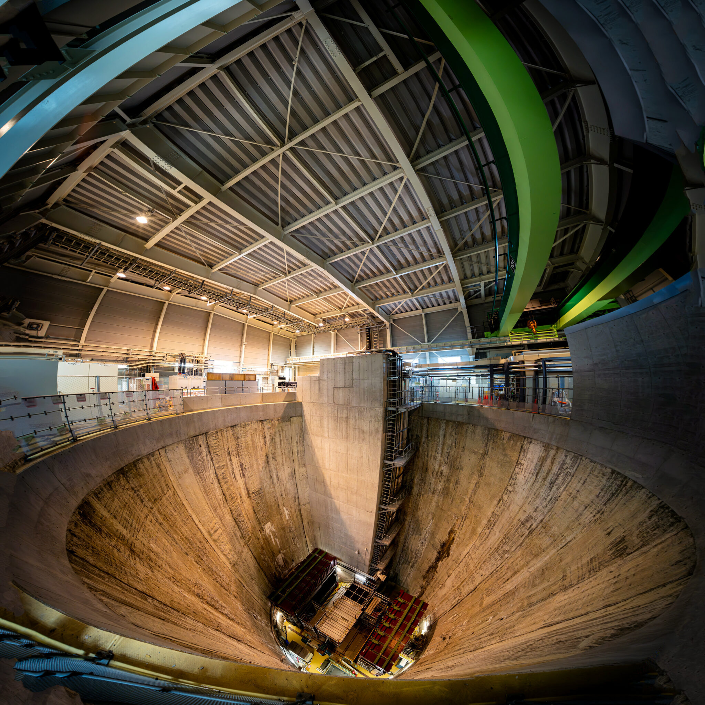

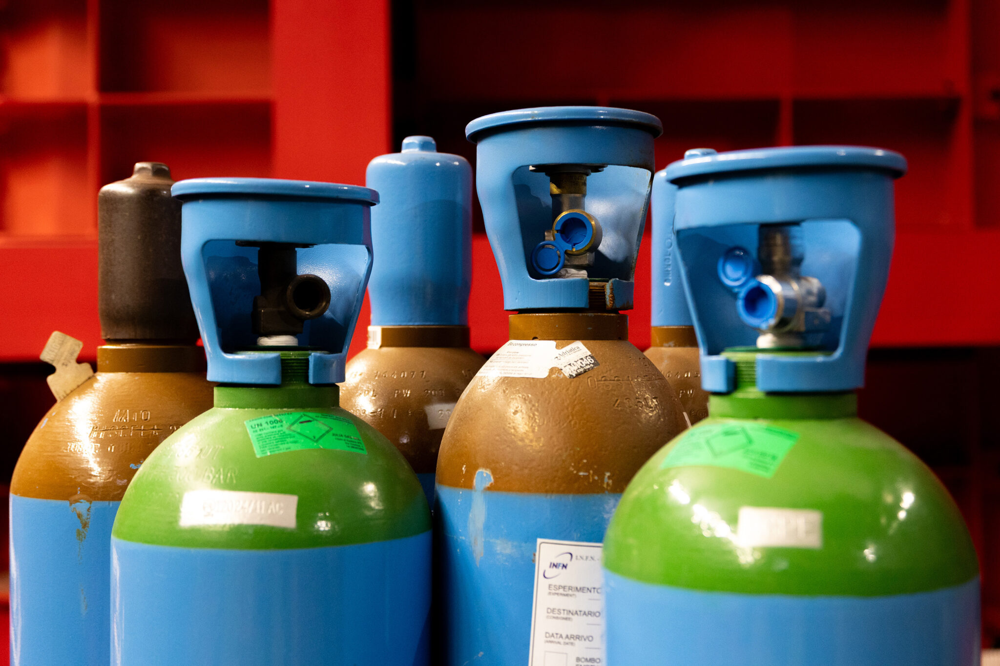
