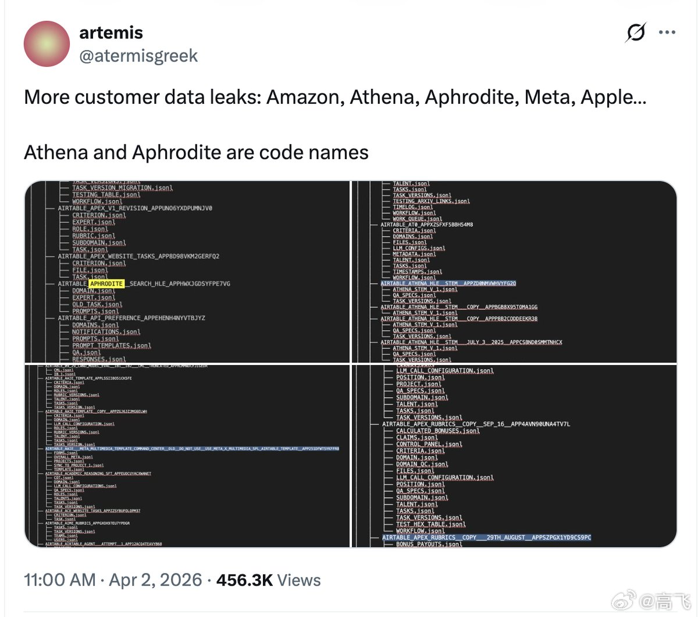
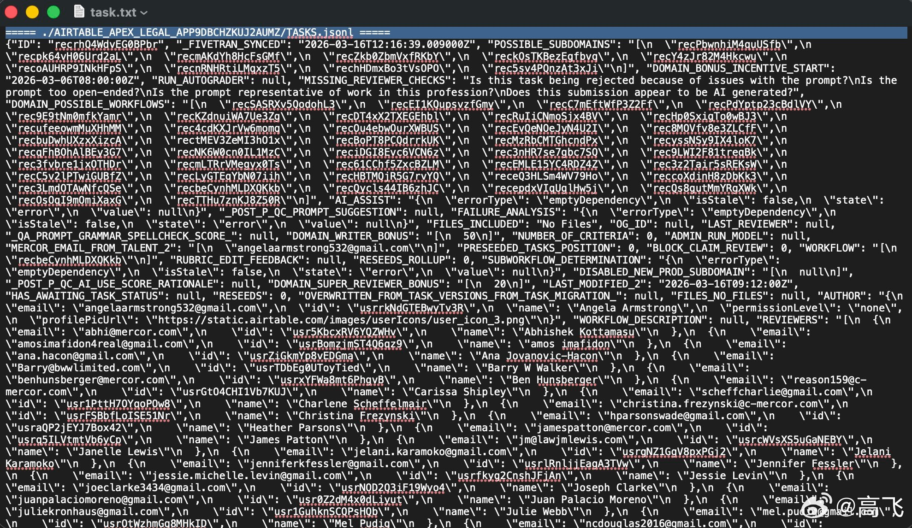

@高飞

发表于：2026-04-03 11:44

来源：微博

链接：https://m.weibo.cn/status/5283580239677588

\#模型时代\# 世界是一个草台班子的又一个实例。

刚看到推上再热炒另一起AI安全事件，一家估值100亿美元的AI独角兽，被黑客从供应链上游一路打穿，4TB数据摆上暗网拍卖，搞得特别大，起码比Claude Code被开源严重多了。

不过消息比较分散，很杂，非安全领域的人看起来有点困难。所以花了点时间，捋了一下，看完就一个感觉，我们经常说现在的AI是锯齿AI，有些能力特别强，有些行为特别弱智。

但有些AI公司，可以说也是锯齿AI公司。高大上的东西很厉害，但基础设施极其薄弱，估计会有一波补课吧。我对安全技术也不够熟，供参考。

剧情如下：

1、Mercor 是谁

Brendan Foody、Adarsh Hiremath、Surya Midha，三个湾区高中辩论队队友，2023年从哈佛和乔治城辍学创业，拿了 Thiel Fellowship（PayPal 联合创始人 Peter Thiel 设立的奖学金，专门资助辍学创业的年轻人，每人10万美元），做了一个AI招聘平台。最初帮印度程序员对接美国公司，后来转型成AI训练的人力中枢：替 OpenAI、Anthropic、Google DeepMind 这些实验室招募医生、律师、银行家，让领域专家给大模型做训练和评估。

跟 Scale AI 这类传统数据标注公司不同，Mercor 走的是高端专家路线。Scale 标注员平均时薪30美元，Mercor 的平均时薪95美元。据陆三金老师的一个微博，提到42章经对 Mercor 首位中国工程师的采访，他们招过时薪400美元、推荐费5000美元的皮肤科医生。这意味着 Mercor 系统里存的不是廉价众包劳动力的信息，而是各行业高资质专业人士的完整档案。

转折点在2025年6月。Meta 花143亿美元入股 Scale AI，OpenAI 和 Google 据报道因此切断了跟 Scale AI 的合作。Mercor 吃下这波溢出需求，增速起飞。CEO Foody 去年9月在 X 上晒过一组数字：年化营收从100万做到1亿美元用了11个月，从100万到5亿美元只用了17个月，7月周环比增长11%，8月18%，9月19%，还在加速。同年10月 C 轮融3.5亿美元，估值100亿，三个22岁的创始人成了全球最年轻的白手起家亿万富翁。平台管着3万名承包商，每天发出超150万美元薪酬。

这是一家刚刚把油门踩到底的公司。增长这么快的创业公司，团队分散、服务器散布在多个云平台上，需要一个办法让所有机器像在同一间办公室里一样互相通信。Mercor 用的是 Tailscale，一个在创业公司中很流行的组网工具。它的原理是在所有设备之间建一层加密的虚拟内网，不管服务器在旧金山还是在印度，装上 Tailscale 就能互相直连。好处是配置极简、上手快，特别适合人手紧张的高速成长期团队。代价是，一旦有人拿到了 Tailscale 的认证密钥，整个内网就全通了。

大家记一下这个组网工具，是重要考点。

2、攻击是怎么发生的

Mercor 不是被黑客正面突破的。

打个比方帮你理解整条链路：黑客没有撬 Mercor 的门，而是先在锁匠的工具箱里下了毒。锁匠（安全扫描工具 Trivy）上门给软件商店（LiteLLM）做例行检查时，毒就带进去了。软件商店被感染后，它的货架上摆出了带毒的商品。Mercor 的系统自动从货架上取了货，毒就进了 Mercor 的家门。

这种手法叫供应链攻击。不打目标本身，先感染目标依赖的上游软件工具，等目标自动更新时恶意代码搭便车进去。

具体每一步是怎么发生的：

第一步，3月19日，一个叫 TeamPCP 的黑客组织先拿下了 Aqua Security 的 Trivy。Trivy 是开发者广泛使用的开源安全扫描器，专门检查代码里有没有已知漏洞。对，看门的保安先被放倒了。他们篡改了 Trivy 在 GitHub（全球最大代码托管平台）上的发布标签，往里面塞了凭证窃取代码。也就是说，从这一刻起，谁用了新版 Trivy，谁的密码和密钥就会被偷偷传回给攻击者。

第二步，3月23日，同一套手法打掉了 Checkmarx KICS，又一个安全检测工具。两个安全工具连着倒，为第三步铺好了路。

第三步，3月24日，最关键的一击。目标是 LiteLLM。LiteLLM 是一个AI统一网关库，开发者用它一套代码就能同时调用 OpenAI、Anthropic 等上百家大模型的接口。每天340万次下载，36%的云环境里都有它。

LiteLLM 跟 Trivy 有什么关系？LiteLLM 每次发布新版本时，有一条自动化管道（业内叫 CI/CD 流水线）负责打包、检测、上传。这条管道里恰好用了 Trivy 来做安全扫描，而且没有锁定 Trivy 的版本号。所以管道自动拉取了已经被感染的新版 Trivy，Trivy 在扫描过程中顺手偷走了 LiteLLM 在 PyPI 上的发布密码。PyPI 是 Python 官方软件包仓库，相当于 iPhone 用户眼里的 App Store。

攻击者拿着偷来的密码和 LiteLLM 创始人被盗的账号，往 PyPI 上传了两个含后门的 LiteLLM 版本（1.82.7 和 1.82.8）。全球数千家公司的系统会自动拉取最新版本。

后门装进去之后干三件事：先把服务器上的 SSH 密钥（远程登录的钥匙）、云平台密码、API 密钥等各种凭证打包偷走；再利用这些凭证在 Kubernetes（管理公司服务器集群的系统）里横向扩散，从一台机器跳到更多机器；最后装一个持久化后门，确保被发现了还能留条路回来。

恶意包上线大约40分钟到3小时后被 PyPI 下架。但自动下载已经发生了。

第四步，Mercor 中招。Mercor 的系统恰好在这个窗口里自动拉取了被投毒的 LiteLLM。后门启动，开始扫荡 Mercor 服务器上能找到的一切凭证。

这个后门不挑食。根据多家安全公司的技术分析，它会无差别地收割 SSH 密钥、云平台密码、API 密钥、环境变量文件、Kubernetes 配置，见什么偷什么。而 LiteLLM 和 Tailscale 虽然是两个毫不相关的软件，但它们装在同一台服务器上。Tailscale 客户端运行时会在本地保存认证信息，所以 Tailscale 的钥匙大概率也在后门的收割清单里，一起被传回给了攻击者。

还记得前面说的吗？Mercor 的服务器、数据库、存储桶全部通过 Tailscale 串在一个内网里。拿到 Tailscale 的钥匙，就等于拿到了这个内网的万能门禁卡。

据 Lapsus$ 声称（Mercor 未确认这一细节），他们就是这样接入 Mercor 内网，把4TB数据批量搬走的。

有人在推文下面问了个好问题："一家营收5亿美元的公司，安全预算到底是多少？"

3、泄露了什么

Lapsus$，曾经干过微软、英伟达、三星的勒索组织，跟 TeamPCP 联手，把从 Mercor 偷到的数据直接挂到暗网（需要特殊工具才能访问的隐匿网络）上公开拍卖。

据 Lapsus$ 声称，总量4TB。Fortune 给了个直观换算：大约相当于1000小时视频或1000套大英百科全书。

具体分三块：939GB 平台源代码，包括AI匹配模型和 API 密钥；211GB 数据库，里面有候选人简历、个人身份信息、AI评估分数、雇主合同；3TB 存储桶数据，塞着视频面试录像、护照驾照扫描件、Google Cloud Function 源码。TechCrunch 拿到并审查了泄露样本，确认其中有 Slack 通讯记录、工单数据，以及承包商跟 Mercor AI 系统的对话视频。

更敏感的在后头。社交媒体上流传的样本里，出现了 Amazon、Meta、Apple 等大客户的信息，还有代号"Athena""Aphrodite"的内部项目数据。Mercor 帮这些大厂做AI招聘评估时采集的东西，一锅端了。Fortune 跟进追问时，Mercor 拒绝就 Lapsus$ 的具体声明作出回应。

4、这件事为什么重要

Mercor 存了大量求职者的面试视频、护照扫描件、面部和声音数据。密码泄露了你可以改，人脸和声纹改不了。这批生物识别数据一旦流入黑市，身份盗用的风险是永久性的。

再看攻击路径本身。LiteLLM 作为大模型 API 统一网关，一个实例里集中保存着多家模型提供商的 API 密钥。你可以理解为打开各家AI服务大门的钥匙，全挂在同一个钥匙扣上。攻破一个 LiteLLM 实例拿到的凭证，比攻破一个普通应用多得多。一个安全扫描器被渗透，一路打穿到AI训练平台的核心数据，中间经过的每一跳都是自动化完成的。这条路径暴露出的问题比 Mercor 本身大得多。

最后是 TeamPCP 自己说的话。他们在 Telegram 上放了句狠的："这些公司本来是用来保护你们供应链安全的，却连自己都保护不了……我们正在跟其他团队合作，你们喜欢的安全工具和开源项目在未来几个月都会被盯上。"FBI 网络部门助理主任 Brett Leatherman 随后在 LinkedIn 上公开警告：预计未来数周还会有更多泄露和后续入侵。

同一周，Anthropic 的源代码也因同一波供应链攻击泄露了。

AI行业跑得太快，安全的账迟早要还。这一周，账单到了。

---

