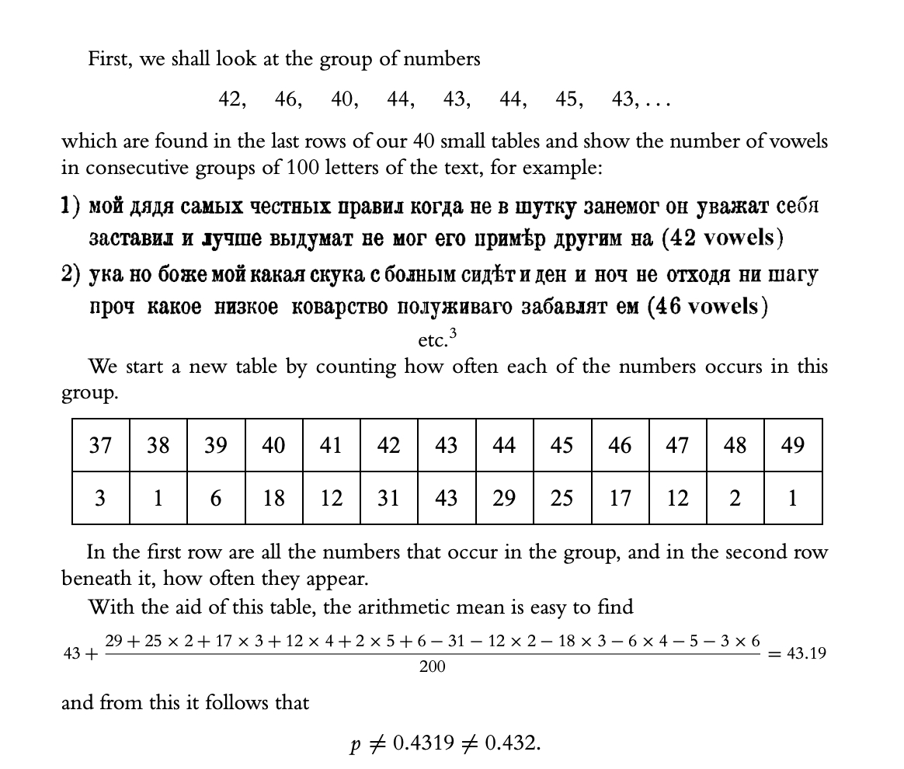
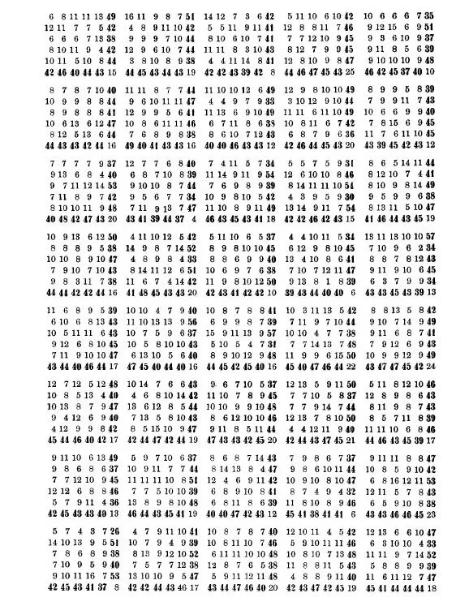

@物理芝士数学酱
发表于：2026-04-02 15:25
来源：微博
链接：https://m.weibo.cn/status/5283397133664884

\#今天要来点数学吗？\# \#数学史\# 人工智能 

继续刚才的内容，从密码进入到大语言模型

有人说，最早的大语言模型LLM出自 1913年圣彼得堡，俄国数学家安德烈·安德烈耶维奇·马尔科夫(Andrey Andreyevich Markov)之手。就是马尔科夫过程的那位马尔科夫。

当时他在书房里翻看着亚历山大·普希金(Alexander Pushkin)的诗歌小说《叶甫盖尼·奥涅金》(Eugene Onegin)。

但是，马尔科夫并不是在欣赏诗歌。相反，他拿起一支笔，在草纸上抄录下诗歌的前20000个字母——去掉所有标点和空格。然后，他将字母串等分成200节，每节100个字母按10×10规格罗列成矩阵，开始对每一行和每一列中的元音计数。

在旁观者看来，马尔科夫举止诡异。为何有人会以这种方式解构文学天才的作品？但是马尔科夫并不打算从诗歌中体悟人生和命运的真相。他正在寻找文本的基本数学结构。

分离元音和辅音，马尔科夫希望检验从1909年发展起来的概率论。在当时，概率理论主要用于分析分析轮盘赌或硬币翻转之类的现象，历史事件不会改变当前事件的概率。但是马尔科夫认为，大多数事件具有因果关系，先发生的事件往往影响到之后的事件。他想要找出这种关系的数学模型。

他认为，语言文本就是一个例子——过去部分地决定了当前。为了证明这一点，他想统计出，普希金小说中，前一个字母在多大程度上决定了之后字母的选择。

经过简单计数，他发现43％的字母是元音，而57％是辅音。然后，马尔科夫将这20000个字母分成成对的元音和辅音组合：他发现有1104个元音-元音对，3827个辅音-辅音对和15069个元音-辅音和辅音-元音对。从统计学上讲，这表明，对于普希金文本中的任何给定字母，如果它是元音，则下一个字母很大程度上会是辅音，反之亦然。

马尔科夫证明，普希金的《叶甫盖尼·奥涅金》中的字母不仅不是随机分布，而且还具有可以建模的基本统计质量。遗憾的是，他就此写成的论文却埋没在历史中，直到2006年才被翻译成英文。

概率和语言的核心思想，最终在克劳德·香农(Claude Shannon)于1948年发表的极具影响力的论文《传播的数学理论》中得到了重新阐释。

香农的论文概述了一种精确测量文本信息量的方法，从而为开启数字时代的信息理论奠定了基础。香农是当时为数不多阅读了马尔科夫的论文的人，他非常欣赏马尔科夫的观点：在给定的文本中，可以估计出某个字母或单词出现的可能性。像马尔科夫一样，香农利用若干文本，通过直接实验建立语言的统计模型，然后进一步尝试借助模型的统计规则生成文本。

最初的控制实验，他首先从27个符号(26个字母，加上一个空格)中随机抽取字符来生成句子，输出结果如下：

XFOML RXKHRJFFJUJ ZLPWCFWKCYJ FFJEYVKCQSGHYD QPAAMKBZAACIBZLHJQD

香农说，它们毫无意义，因为当我们交流时，我们不会随机选择。正如马尔科夫的发现，辅音比元音更有可能出现。但是在更高的粒度级别上，E比S更为普遍，S比Q更为普遍。为了解决这个问题，Shannon在初始可选列表中添加了若干重复的字母，以便更精确地模拟英语字母的出现概率——E的可能性比Q的可能性高11％。新一轮实验，结果比之前稍好：

OCRO HLI RGWR NMIELWIS EU LL NBNESEBYA THEI EEI ALHENHTTPA OOBTTVA NAH BRL。

经过一系列的后续实验，香农证明，当统计模型越来越复杂时，结果就越来越像是正常的语句。沿着马尔科夫的思路，香农揭示出英语的统计框架，并表明，如果统计规则足够详尽，那实际上可以利用数学模型生成自然语言。

在随后用单词进行的实验里，香农最终生成了下面的句子：

THE HEAD AND IN FRONTAL ATTACK ON AN ENGLISH WRITER THAT THE CHARACTER OF THIS POINT IS THEREFORE ANOTHER METHOD FOR THE LETTERS THAT THE TIME OF WHO EVER TOLD THE PROBLEM FOR AN UNEXPECTED.

对于香农和马尔科夫而言，为人类的语言建立统计模型的尝试，为他们正在研究的更广泛的问题，提供了一种全新的思路。

对于马尔可夫来说，它把随机性扩展到了相互独立的事件之外，为新时代的概率论铺平了道路。对于香农，受它启发，找出了精确定义信息单位的方法——最终改变了整个世界。但是，仅就语言建模和生成语句的统计方法本身而言，它开辟了自然语言处理新时代。

最有趣的是，马尔可夫二元语法模型和 GPT-5 的核心思想完全相同——根据前面的词元预测下一个词元。

人类投入了112年的工程技术、起码千亿美元资金和一百万个GPU，就为了让概率稍微再准确一点。

---

