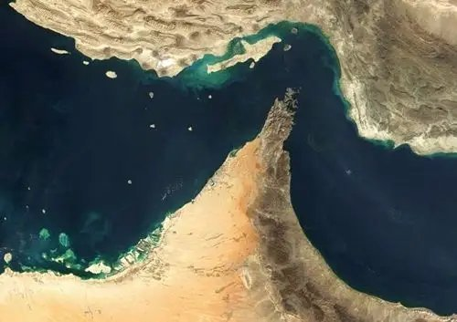

@风云学会陈经
发表于：2026-04-03 10:44
来源：微博
链接：https://m.weibo.cn/status/5283565902236146

\#伊朗袭击美甲骨文和亚马逊数据中心\#
伊朗战争进入收尾期，几个判断

1. 昨特朗普国家讲话扯了20分钟，伊朗也有官方发声，加上以色列阴沉着搞阴谋炸炸炸，非常混乱。但应该进入收尾期了，美国退出意图明显。

2. 第一个重大判断，不会有渲染了很久的“地面部队”。之前是说让库尔德人派兵，根本没有任何动静，都知道不行，几个导弹炸过去库尔德人就不敢动了。美军82空降师、的黎波里两栖战斗舰，吆喝了万把人。但就按以前的老观念，空降师、登陆舰，需要后面几十倍的兵力跟上，没有自己独自空投进去送死的。1991年海湾战争50万人，2003年伊拉克战争30万人，现在万把人绝对无法实现任何大的战略目标。

3. 再一个判断，虽然有猛烈轰炸，但程度可控。一个很可怕的前景是，美以就如特朗普威胁的那样，不答应无理谈判要求，就把伊朗民用电厂、油气设备炸出人道主义危机。伊朗已经公开说了反制办法，会把海湾国家的油气设备、电厂等对等设施炸毁。以色列远一些，伊朗也会有很多重型导弹炸过去，现在应该有所保留。伊朗的威胁是可信的，真敢炸，而且没法防备，领导人炸死了下面中层军人会报复，拦截武器已经被证明挡不住。还有国际金融，油价暴涨、美股与全球股市大跌、美债利率大涨、大通胀预期、美国经济衰退预期这些事，都是特朗普害怕的，要不然也不会定下2-3周就跑的目标。

4. 霍尔木兹海峡会如何？美以会去炸，但是不足以解除威胁，大船在海峡里慢慢开，伊朗隔着1000公里导弹过来也能炸到。伊朗吃了这么大的亏，怎么也要得到一些东西，肯定会把霍尔木兹海峡管起来。分级管理，美以的不给过，美以同伙交大钱，友好国家安全过，人民币支付，都有放风了。如果霍尔木兹海峡要开，应该就是这办法，武力无法解决问题。

5. 能源价格会如何？短期中期应该都会短缺，供应已经受到打击了。目前就算海峡恢复，一些油气田已经被炸了，伊朗和卡塔尔共有的世界最大天然气田损失了部分产能，卡特尔已经宣布不可抗力了。而且霍尔木兹海峡不会完全恢复，还有俄罗斯出口能力也被乌克兰打击，委内瑞拉也在调整。能源通胀不可避免，就是程度问题，不搞到原油150以上都算没彻底失控。新能源转型必然加速。

6. 以色列会如何？会不会美国跑了，以色列继续炸个没完没了？以色列是没办法独立灭掉伊朗的，单独和伊朗互相拿板砖爆头，除非用核武器，长期来说伊朗会占上风。在这种威胁下，以色列也得过日子，就只好和伊朗控制对爆力度。长远来说以色列很为难，这次没灭掉伊朗，后面会被伊朗组织周边势力用各种进攻性武器打很惨。

7. 全球会大受震撼，纷纷调整，巨大的影响刚开始。例如西方阵营面临解体危机。而发展中国家会得到巨大的鼓舞，看到美西方的虚弱。

---

