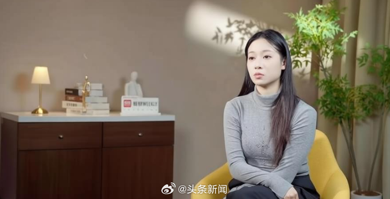

@头条新闻
发表于：2026-04-03 09:44
来源：微博
链接：https://m.weibo.cn/status/5283555771158726

【\#吴柳芳称转行做主播是迫于家庭生计\#】\#吴柳芳称至今都不敢看私信\# 退役后成为“网红”的运动员不在少数，但陷入“擦边”争议的，吴柳芳或是唯一一个。

在那些视频里，她常穿着清凉，跳一些展示身材的舞蹈，这引发了同样曾为体操队国手、奥运冠军的管晨辰的质疑。2024年11月，一场奥运冠军和世界冠军的隔空互呛迅速引发舆论关注，吴柳芳的冠军头衔和视频内容遭到审判，有人批她给国家队丢了人，担忧此举有可能导致对女子体操运动员集体的污名化，也有人力挺她称，退役运动员应有谋生的自由，既往的荣光不该成为她的枷锁。

事件发酵后，吴柳芳的账号因“违反社区规定”禁止被关注，那些被质疑“擦边”“媚男”的视频也被隐藏。那段日子，有关她的谣言、恶评不断，几乎所有媒体都在试图接触她，吴柳芳却始终保持沉默。

风波背后，我们更想知道的是，一个体操世界冠军何以走向这一步？风波发生前，她究竟经历了什么？这些谜团，直至事发一年后才被解开。

今年春天，我们在北京见到了吴柳芳。面对镜头，她仍显得十分紧张，说话时声音都在颤抖。采访之外的时间，她便安静地坐在一旁，抱着平板电脑去翻采访提纲。

忆及当初，吴柳芳坦言，转行做主播是迫于家庭生计。和许多运动员的轨迹一样，出身寒门的吴柳芳从小苦练体操，她曾为国征战，数次获得世界冠军，但巅峰过后，当她开始直面退役后漫长的心理落差和经济困难时，做主播，挣快钱，或是那时为数不多的选择之一。这是她憋了一年多的话。

视频发布后，吴柳芳再度上了热搜，至今，仍不断有新的采访需求和商业合作找到她和她的家庭。尽管争议依然存在，但她明显感到外界的关注开始变得“比较正向”了，“大家更关注我本身的成长经历，而不是过往风波。”

如今，她说自己已从这段经历中走出，以前在赛场为国征战，现在她要为自己而战，重新做自己了。
以下是吴柳芳的讲述。

2023年，吴柳芳决心离开做了20多年的体育行业，转行去做网络主播。她的上一份工作是体校老师，没有编制的那种，有限的收入无法为她抵御家庭风险——无论是母亲的肿瘤、父亲的贷款，还是弟弟的学费，这让她觉得自己无路可走。

从国家队退役后，吴柳芳也曾沿着许多运动员的轨迹进入大学学习，毕业后没有留在省队，而是自主择业，这不仅因为体育市场前景广，更重要的是，能为她带来一笔退役费。于是，她用这笔钱凑够了买房的首付，为全家添置了第一间属于自己的房子，接着来到杭州一家体育公司做体操教练，其间曾参与关爱自闭症儿童的公益活动。

但市场化的环境远不如“铁饭碗”稳定。公司停摆后，她一边学舞蹈，一边寻找与体操相关的工作机会，却发现人家根本不看那些过去的辉煌，而是能力。这是一套与她习惯的追逐成绩、以夺取冠军为目标截然不同的评价系统。

当昔日的世界冠军被“打回”一名普通的求职者，巨大的落差之下，成为主播或是她得以帮家庭脱困的最快选择。接下来，便有了2024年末那些引发巨大风波的视频。

大家印象最深的视频是在街上拍的那条。我穿着大衣，里头穿了一双丝袜。其实当时本来是想拍一条比较飒的那种视频的，就是女生穿着大衣，踩着高跟鞋，头一撇，往前走特别帅那种，那段时间特别火。但当时我买的高跟鞋老拖脚，就没办法拍。当时摄影师、灯光师都在旁边，我衣服也换好了，那怎么办？大家就说能不能原地跳一些比较简单的舞，然后就临时换成了跳舞。

我就是一个互联网的小白，看大家发的那些视频都是跳舞穿搭，每一条都有很高的流量，我就会想去模仿她们，因为我也想要流量。

我也刷到过许多那种旅游转场、风景转场的视频，我也很喜欢，但是这些视频是需要成本的，比如要出去旅游，你需要花钱买机票去景点拍，但以我以前的收入是没有办法来做这些东西的。那个时候，最简单的拍摄就是去淘宝买一点小短裤、小吊带背心这些比较吸引流量的服装，成本不到50块钱就能完成一条视频了。

我退役以后工作了大概有5年这样子，中间换了几份工作，基本上都是从事教育工作，进过学校当过老师，但都是那种外聘的。当时在杭州那边，大概一月收入五六千元。

找工作的时候，别人其实是看你的能力，而不是你的头衔。比如像我这种在中间，不是最低也不是最高的这种头衔，就特别尴尬。

我发现我一直跟不上世界的脚步。不管是我做的几份工作，还有平时生活中做的一些事情，我感觉自己总是比别人差一点，心里会觉得，我以前这么辉煌，拿过那么多成绩，可到了找工作的时候，怎么都找不到自己满意的。

大家都想做自己喜欢的事，我也一样。我喜欢跳舞，之前也去过一些舞蹈培训的店里咨询过，因为参加一些路演的工作可能会有一些收入。但一进去他们就给我推课，价格还挺贵的，然后给我推一些商演，都是在什么庄园、邮轮上，我想这好像不大靠谱，就没有去做这个事情。

后来之所以选择做自媒体，也跟我真正了解了家里面的情况有关。

小时候爸妈不会跟我说家里具体的情况，但有一次他们都生病了，想找我要钱，而我也有点给不出，这让我非常难受。加上那时候我爸贷款给我妈做手术，我能感觉到我们家是真的没有（经济）能力（去维系）了。而我是我们家的长姐，我还有个弟弟，那时刚考上大学还没有工作，所以我觉得我应该撑起这份责任。

之前最困难的时候，我真的想不到还有什么赚钱的路子了，甚至想去夜场跳舞，一晚上可能赚一点跳舞的费用，但最后还是没有去。

我做自媒体的时候，可能跟我爸妈提了一嘴，但是他们也不懂这方面的东西。那时候我自己研究适合什么样的风格，因为喜欢跳舞，就往这个方向走了。

视频爆了的时候，我当时在吃晚饭，还奇怪账号里面怎么有这么多评论，有好的也有不好的，然后我就看到有这么一条评论，感觉好眼熟的一个人，评论里还稍微带了一点刺的感觉，我还挺惊讶的。

碰上这件事情以后，我感觉不太真实，你从一个大家都不认识的状态下，两个晚上就达到了当时600多万粉，然后还频频上热搜，就觉得有点不可思议。当时身边的人都在说：“恭喜，你成为大网红了”，但我自己高兴不起来，因为大家对我的关注，我觉得都是因为舆论来的。

那段时间我其实情绪非常低落，有时候莫名其妙就会哭，我最在意的一点就是造谣。对已经发生的事情，大家怎么说我是认的，但造谣是我不能接受的，而我自己又没办法发声，当时挺难的。那时候舆论已经达到顶峰了，如果我再出来说话，舆论可能就停不下来了，所以选择了消失。

那时候我不敢出门，因为我真的会想象，一出门会不会有那些不喜欢我的人朝我扔臭鸡蛋？那时我父母每天都会打电话给我，确认我安全，他们怕我想不开。

至今为止我都不太敢点进去看私信，有时候会不小心瞄到几条。记得当时有一条评论说，冠军是我的荣耀，不应该成为我的枷锁，这句话在我印象里还是蛮深刻的。（凤凰周刊）

---

