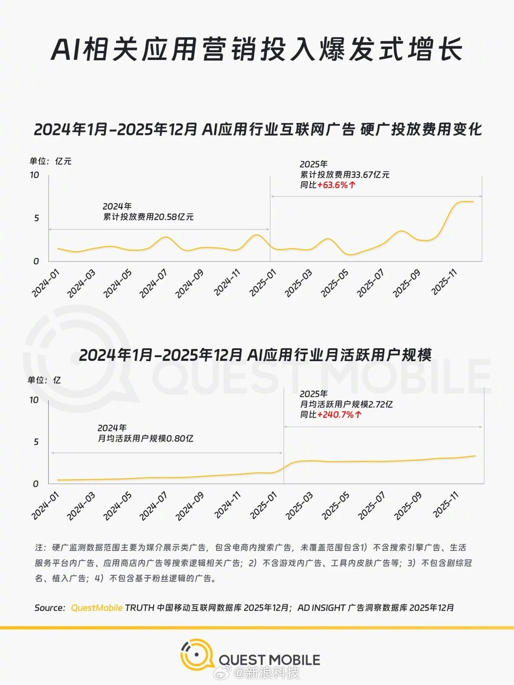

@新浪科技

发表于：2026-04-03 09:45

来源：微博

链接：https://m.weibo.cn/status/5283554419278620

【\#AI应用营销投入飙升63.6%\#】QuestMobile报告显示，2025年AI应用营销投入快速增长，硬广投放费用TOP10品牌集中度持续提升，用户规模迎来爆发式增长。

头部AI企业不再只拼技术，而是靠生态构建获客闭环：元宝深度绑定微信生态，重合率92.0%；千问接入阿里系应用，重合率90.4%；豆包依托抖音生态，重合率88.7%，分别主打社交裂变、场景深耕、内容创作+购物入口。

媒介策略上，头部品牌通过大曝光抢占新用户，从“技术谁更强”转向“生态谁更强”。

---

