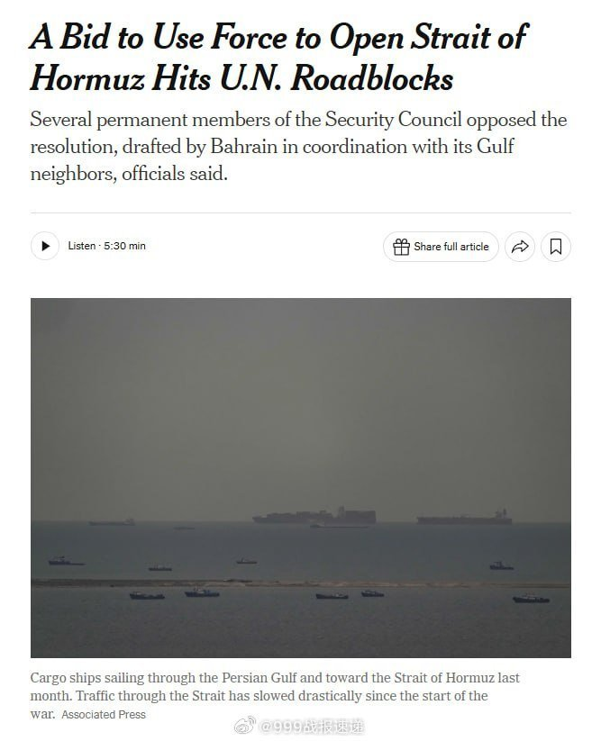

@999战报速递

发表于：2026-04-03 08:45

来源：微博

链接：https://m.weibo.cn/status/5283544869896551

据美国《纽约时报》报道，俄罗斯、⏰和法国在联合国安理会阻止了一项由阿拉伯国家支持的决议，该决议旨在授权对伊朗采取军事行动以重新开放霍尔木兹海峡，理由是决议的措辞允许使用武力。

这项由巴林在海湾国家支持下起草的决议，将允许各国采取一切必要手段，确保通过霍尔木兹海峡的海上运输安全。该海峡承载着全球约五分之一的石油和天然气供应。

预计，联合国安理会将于周五（4月3日）对这项决议进行表决，但安理会常任理事国和非常任理事国之间仍对此存在分歧。  

\#美伊以冲突\#\#伊朗公布最新战果\#\#伊朗袭击美甲骨文和亚马逊数据中心\#

---

