# 2026-04-05

## 1

@幻想狂劉先生

发表于：2026-04-04 22:47

来源：微博

链接：https://m.weibo.cn/status/5284111621296562

四年前有个人在我微博评论区追着一个女孩骂了十几楼，我就想看看这是个什么人，点进去一看近期内容全是支持新疆棉的。而仅仅因为陈述自己生活中遇到的实际困难就被他污蔑“递刀子”的姑娘，家里恰好就是他声称要支持和捍卫的棉农//@潘海天:转发微博

---

## 2

@硅谷陈源博士

发表于：2026-04-03 13:16

来源：微博

链接：https://m.weibo.cn/status/5283727229325825

英伟达最近的一篇技术博客，介绍了古老的BASIC编程语言也能使用GPU做并行计算，代码很简单。网页链接

这背后是CUDA新引入的CUDA Tile，把GPU 编程从需要管理线程、并行和索引，变成了只要描述计算本身，数据要做什么，其余由系统自动完成。

这让GPU并行计算正成为一种通用接口，任何编程语言都可以接入，包括古老的BASIC语言。结果就是，使用GPU的门槛大大降低，不需要是并行计算专家，也能写程序用上GPU算力。

不过现在都用AI写程序，who cares？😄

\#GPU编程\#\#英伟达\#\#古老的BASIC语言写GPU程序\#

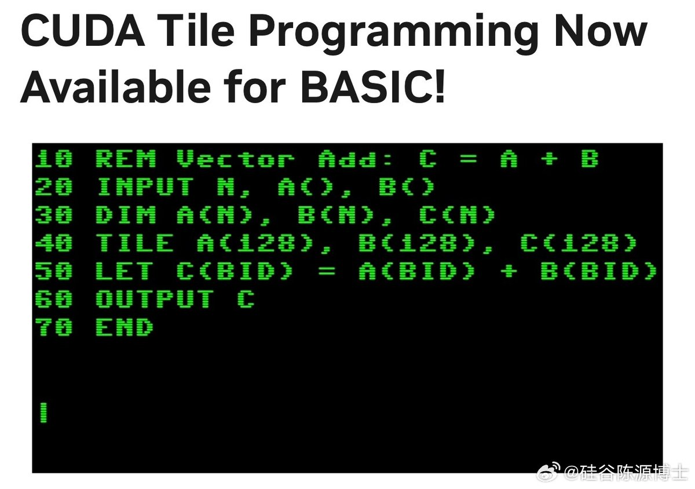

---

## 3

@斌叔OKmath

发表于：2026-04-01 15:29

来源：微博

链接：https://m.weibo.cn/status/5283036003566068

这些绝对疯狂的 LLM 专家现在正在尝试使用 Turboquant 不仅压缩 KV 缓存，而且现在还压缩整个模型本身。

该测试表明内存占用减少了 50% 以上，使得 Qwen 3.5-27B 可以在单个 RTX 5060 上以 3.15 位精度运行，且没有明显的性能下降。

这正好说明我们距离现有模型的完全优化还很远。我们可能还需要不到一年的时间，才能在小型设备上运行大型模型，并将性能影响降到最低。

在此期间，他们只会变得越来越好。

生活在这样一个时代真好。

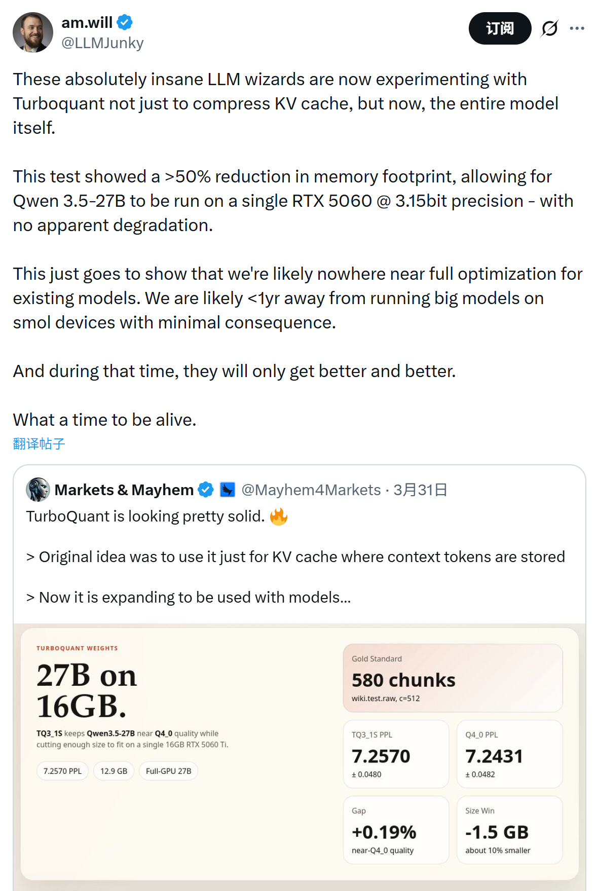

---

## 4

@物理芝士数学酱

发表于：2026-04-04 13:47

来源：微博

链接：https://m.weibo.cn/status/5283982558103506

为什么 Facebook上50%的语音流量来自柬埔寨？

2018年，Facebook 团队遇到了一个难题。根据Frances Haugen发布的文件，柬埔寨用户占 Messenger 语音功能全球总流量的近 50%，但该公司没有人知道原因。

根据世界其他地区看到的内部文件，一名员工建议进行一项调查，看是否与当地识字率有关？但柬埔寨的识字率约为80%。

那是Facebook 的问题吗？令人惊讶的是，答案与Facebook 无关，而更多地与高棉语言的复杂性有关。

在柬埔寨，从顺风车司机到当时的首相洪森，每个人都喜欢发送语音而非文字。

Facebook 的研究表明，不仅柬埔寨人喜欢语音信息，其他地方也都更喜欢发语音。在这项研究中，包括来自多米尼加共和国、塞内加尔、贝宁、科特迪瓦和那位柬埔寨人的 30 名用户，87% 的受访者表示，他们爱用语音。在受访者中最受欢迎的平台 WhatsApp 以及 Messenger 和 Telegram 上也是如此。

最常见的原因之一是。打字太难了。

就柬埔寨而言，从来没有一种简单的输入高棉语的方法。虽然高棉 Unicode 在 2006 年至 2008 年间很早就标准化了，但键盘本身却落后了。第一个高棉语计算机键盘的开发人员必须容纳该语言的 74 个字符，这是世界上所有语言系统中最多的。

这是一项艰巨的任务。哈维尔·索拉 (Javier Sola) 是西班牙出生、居住在金边的计算机 科学家，他是 2005 年从事最初高棉操作系统项目的团队的一员。科学研究

“高棉语中的符号比拉丁语中的符号多得多，”现任柬埔寨非政府组织开放研究所执行董事的索拉说。在拉丁键盘上，用户可以一次看到所有字母表，从而使打字变得直观。但在高棉语中，每个键都承载两个不同的字符，这需要在两个键盘层之间反复翻转。不仅如此，有限的字体意味着如果收件人的计算机缺少与发件人相同的字体，某些消息将无法显示。

Facebook 于 2009 年左右在柬埔寨流行起来，就在廉价智能手机和互联网接入的同时，这意味着它的使用量激增。今天，它仍然是该国最受欢迎的综合平台。但是在一个小的智能手机屏幕上，同样的打字系统几乎变得不可能。

美国国际开发署 2016 年的一份报告显示，智能手机用户更喜欢语音电话和语音信息，因为他们发现打字困难且耗时，或者因为他们对如何在设备上使用高棉语文字感到困惑。一些受访者甚至没有意识到他们的设备根本不支持这种语言。西方用户认为理所当然的其他功能——如准确的拼写检查或光学字符识别——在高棉语中仍然只有基本功能，这使得文本变得令人沮丧。

“现在有更先进的键盘，”索拉说，但它们没有预装在手机上——不像谷歌、三星和微软的键盘。多年来，习惯已经逐渐被接受。他说，在柬埔寨，语音信息“正是人们所做的”。

但依赖语音工具也会产生一系列问题。想必每个在微信上接收过父母语言信息的人都深有体会。

“许多年轻人，如果他们[确实]想打字，就会用拉丁文写出高棉语单词，”金边的软件工程师兼 POSCAR Digital 的首席运营官 Sok Pongsametrey 说。其他时候，如果一个字母太难拼写，他们可能会使用更容易获得的字符或带有省略号的单词缩写来错误地拼写单词，因为他们知道读者会理解隐含之意。

Sok 表示，这些变通方法使从事机器学习的工程师更难用该语言训练 AI 解读文字信息。他还担心，这些捷径将意味着年轻人将不再熟悉高棉文字。

“我用高棉语写作时非常小心，因为这是一门艺术，”他说。 “但是，年轻人，他们认为[使用拉丁文本]很容易。”

Javier Sola 指出，有更新的键盘，如 Microsoft SwiftKey，可以更轻松地输入高棉语，但许多柬埔寨人甚至不知道它们的存在。默认键盘“并不能真正适应用户行为。他们只是使用我们已经使用了近 20 年的标准，”Sok 说。

柬埔寨只是一个小市场，许多科技公司对开发更好的产品不感兴趣。 “他们在这里不赚钱，所以他们不没有动力，”索拉说。

---

## 5

@万年炎帝

发表于：2026-04-04 11:47

来源：微博

链接：https://m.weibo.cn/status/5283951948333978

🔻现在无人机对陆地战车载具的威胁这么大，除了传统安装主动防御系统转塔，近距离拦截之外，战车配备更远的多层拦截手段也是很有必要的。

🔻例如安装下面视频中展示的M134小火神速射机枪武器站，在几百米距离上可以拦截来袭无人机FPV什么的，或者安装编程榴弹机枪武器站，用空炸榴弹拦截无人机。

🔻甚至于携带图中展示的微型导弹巢，或者拦截型无人机蜂群，用于对抗敌方无人机蜂群。

🔻不这么干，就只能和 图1 乌克兰的艾布拉姆斯一样，硬接FPV了，而这是没什么前途的，既完成不了进攻任务，昂贵上千万美元的载具也会被简单摧毁掉。

\#伊朗被曝实施打了就跑战术\#\#烽火问鼎计划\#

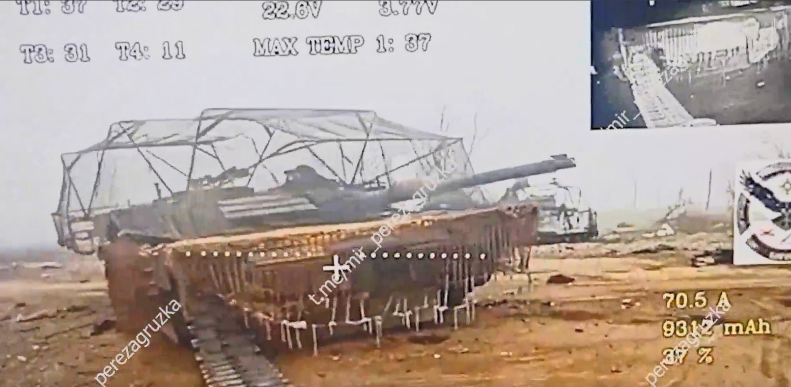

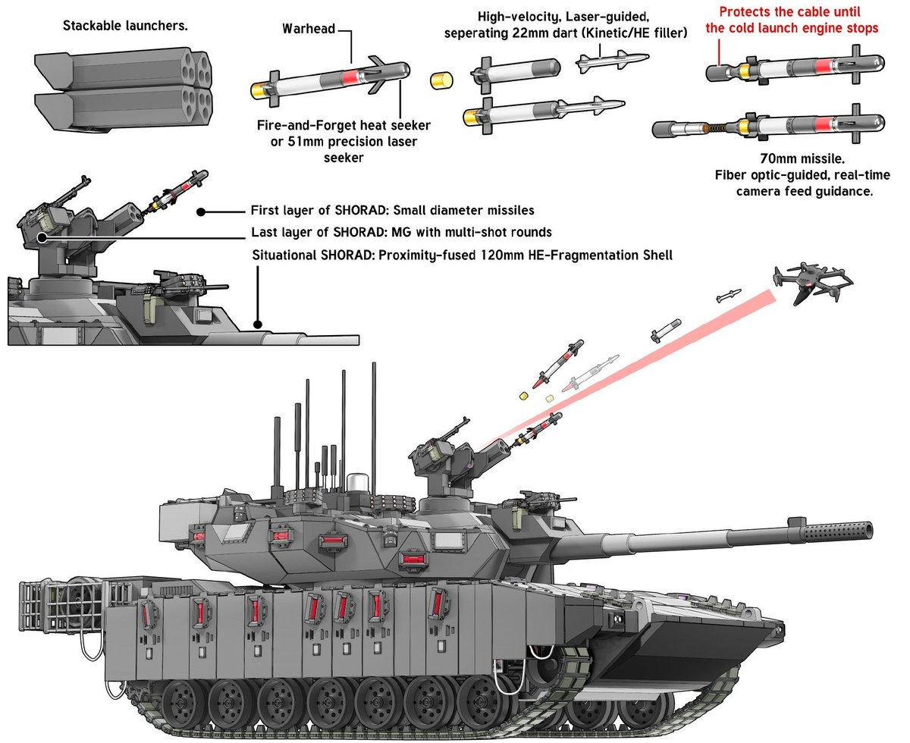

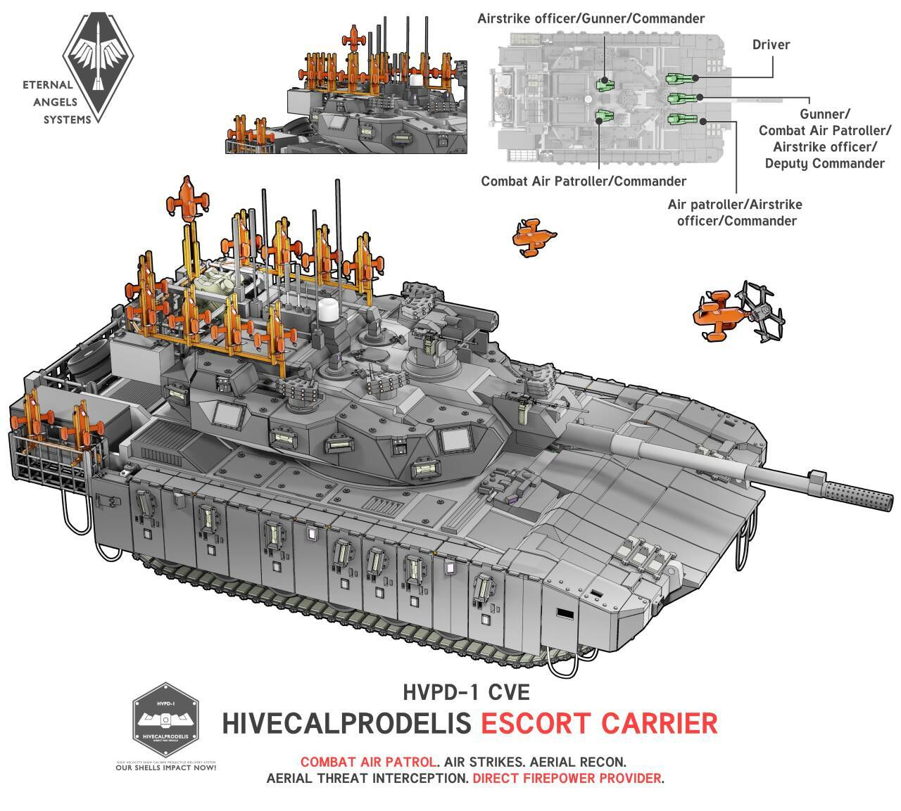

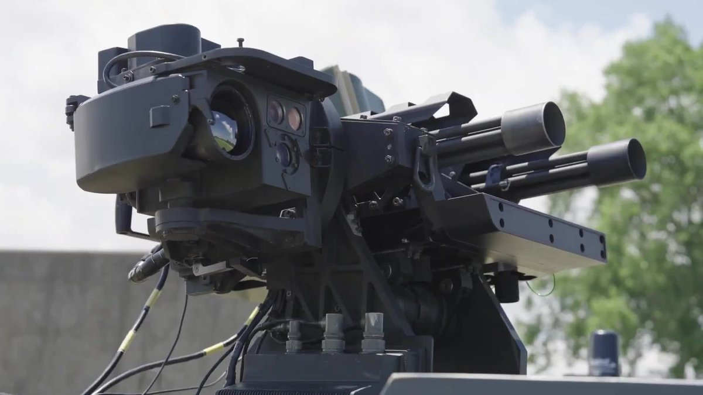

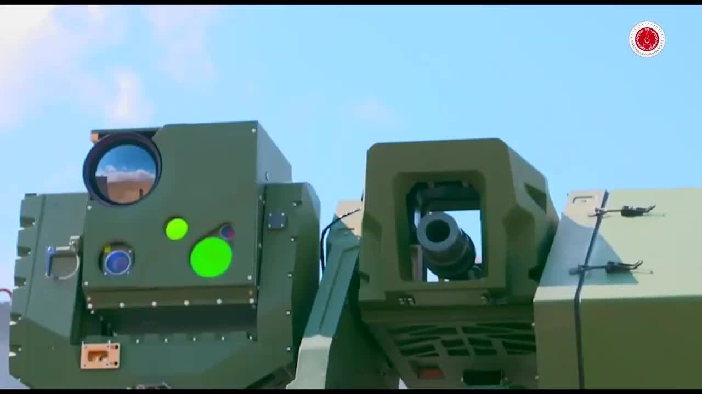

---

## 6

@寰亚SYHP

发表于：2026-04-04 13:47

来源：微博

链接：https://m.weibo.cn/status/5283979327705306

\#伊朗击落一架美军F-15战机\#\#伊朗击落一架美军A-10战机\# 美国前副国务卿温迪·谢尔曼：我们曾被许诺强大。

然而，我们却眼睁睁地看着国家历史上最严重的衰落正在上演。

我们的未来正被一点一点地出卖，换取一场原本就与我们无关的战争。

观看视频，自行判断。

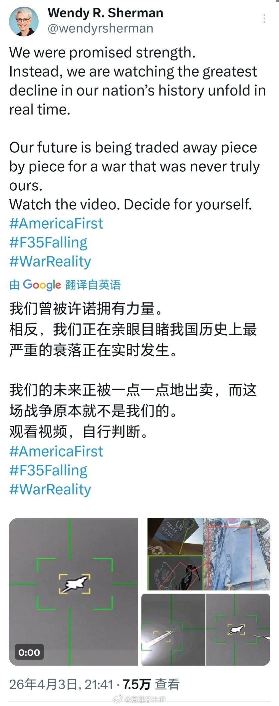

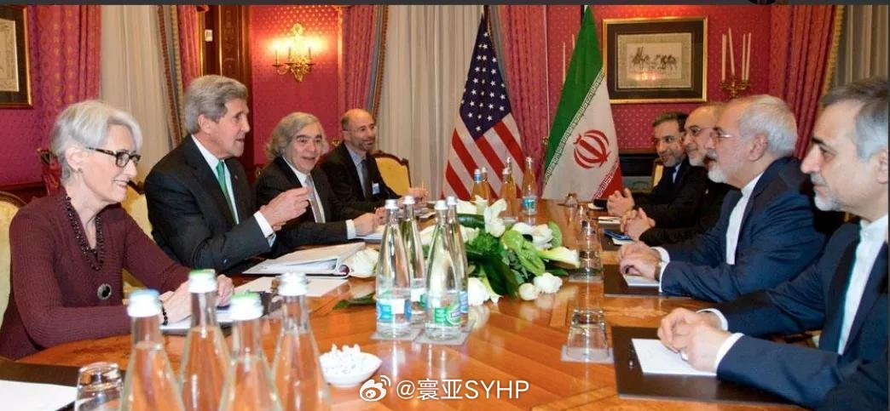

---

## 7

@Jeff的星空之旅

发表于：2026-04-04 13:47

来源：微博

链接：https://m.weibo.cn/status/5283972919855639

实在是太美了，Artemis II上宇航员Reid Wiseman回拍的地球。

这里可以点击下载原图

网页链接

---

## 8

@图老板赛博札记

发表于：2026-03-13 05:04

来源：微博

链接：https://m.weibo.cn/status/5275993285593381

话说在 2000 - 2001 年那会儿，杰克・多西随手画下的一张手稿，竟勾勒出了日后风靡全球的 Twitter 的雏形，而且早于 Twitter 正式立项约五年。这张手稿里的设计逻辑，在之后产品不断变化发展中，始终稳稳扎根，几乎没怎么变过。

那时候，这个项目最初叫 “STATUS” ，可不是现在的 “Twitter”。多西年轻时候对出租车、急救车的无线电调度系统特别着迷，你想啊，那些车辆不停地广播自己的位置和状态，多有意思。他就琢磨着，能不能把这一套用在人们日常生活里呢？最后就有了想法，不是写长篇大论的文章，也不是发布新闻，而是让朋友们随时都能知道 “你现在正在做什么”，这就是 Twitter 核心定位 —— 状态广播。

再看看手稿中央，一个大大的输入框特别醒目，里面用铅笔写着默认词 “reading”，右边就一个简简单单的按钮 “Set” 。这就是发推功能最早的样子啦，不用费劲想标题，也不用考虑排版，直接写下状态，然后按下发送就行。输入框上面的提示语，后来就变成了 Twitter 很标志性的 “What are you doing?” 。多西还在输入框下面写了俩示例状态 “in bed” 和 “going to park” ，这不就是 “微博客（Microblogging）” 概念的源头嘛，即时、碎片化，都不用怎么构思。

手稿左上方标注了 “authentication triples”，也就是身份验证三要素，对应名字、邮箱和电话号码，这里面手机号还特别加了星号。为啥呢？因为 Twitter 一开始是靠 SMS 运作的，用户给专用短号码发一条短信，系统就把状态更新到网页上，还能群发给关注者。这也就有了 140 字符的限制，国际标准短信上限是 160 字符，留出 20 字符给用户名，剩下 140 字符用来写内容。

手稿右下角画了几个小圆圈和箭头，旁边写着 “watch?” 。那时候主流即时通讯软件像 MSN、AIM，好友关系都是双向的，可多西想的 “watch” 是单向订阅，就是我能留意某人的状态，不需要对方回应。这个看似不起眼的词，后来就演变成了 Twitter 超有影响力的机制之一 —— Follow（关注）。

而且啊，手稿右侧写着 “email looks for jabber presence and sets” ，Jabber 是当时很流行的开源即时通讯协议，也就是现在的 XMPP 。这说明多西从一开始就设想了一套跨平台架构，不管你是发邮件、发短信，还是直接在页面输入，所有状态都能被统一捕捉到，然后同步分发出去，可不是只局限在一个入口。

从这张手稿能看出，一个伟大产品的诞生，最初的理念往往就蕴含着无限潜力。你觉得 Twitter 这些最初的设计理念，对后来社交媒体发展影响大吗？

\#Twitter \#产品设计 \#社交媒体历史

---

## 9

@图老板赛博札记

发表于：2026-03-11 22:31

来源：微博

链接：https://m.weibo.cn/status/5275531894327553

从福克斯新闻主播到五角大楼掌门人，皮特·赫格塞思的仕途堪称美国政坛的一段传奇。这位1980年出生于明尼苏达州的保守派人物，身上叠加了多重标签：普林斯顿大学毕业生、哈佛大学硕士、国民警卫队老兵、电视节目主持人，以及现在的美国国防部长。

赫格塞思的早期经历看似平顺。他在常春藤盟校读书时就展现出保守派倾向，创办过保守派刊物。毕业后加入陆军国民警卫队，被派往关塔那摩、伊拉克和阿富汗，获得过铜星勋章。但严格来说，他的军旅生涯并不显赫，军阶不高，也缺乏高级行政管理经验。2014年，他加入福克斯新闻成为主持人，这成为他人生的转折点。在主持岗位上，他坚定不移地支持特朗普，与其建立起深厚私交，2019年甚至选择在特朗普的高尔夫俱乐部举办婚礼。

2024年11月，特朗普胜选后出人意料地提名赫格塞思为国防部长，这一决定震惊华盛顿。但提名确认之路充满荆棘，赫格塞思被曝出2017年涉嫌性侵并支付了5万美元和解金，还有酗酒和财务管理不善等历史问题。更令人尴尬的是，在国会听证会上，他连东盟有几个成员国这类基础问题都答不上来。然而，2025年1月24日的参议院投票出现了50比50的罕见平局，最终由副总统万斯投下关键一票，赫格塞思才得以惊险过关，成为美国历史上第二位需副总统救场的内阁提名人。

上任后的赫格塞思延续了他的争议风格。最轰动的是他在民用聊天软件Signal上向包括妻子和弟弟在内的私人群聊，提前泄露了美军空袭也门的详细作战计划。他还被曝下令对一艘所谓贩毒船进行二次打击导致幸存者死亡，被质疑涉嫌战争罪。此外，他带无安全许可的妻子参加涉密会议，安排弟弟担任国防部联络员，在硫磺岛战役纪念活动中赞扬日军英勇引发轩然大波。

赫格塞思的故事折射出特朗普第二任期的人事逻辑：忠诚压倒一切。当资深军界人士纷纷与特朗普保持距离时，这位没有任何权力基础、完全依附于特朗普的福克斯前主播，反而成为执行总统意志的理想人选。只不过，从战场到演播室再到五角大楼，这条非常规的晋升之路，注定会让美国国防部迎来一段不平静的岁月。

---

## 10

@图老板赛博札记

发表于：2026-03-09 09:56

来源：微博

链接：https://m.weibo.cn/status/5274617184781656

《科技共和国》的核心信息

本书是一份行动宣言与警示录，围绕硅谷的迷失、人工智能时代的地缘政治竞争以及西方社会的认同危机展开论述，核心主张是重建技术与国家目的、公共利益之间的紧密联盟。

对硅谷现状的批判

作者认为当今硅谷已背离其早期与政府紧密合作、服务国家重大项目的传统。精英们将才华和资本集中于社交媒体、照片分享等消费级产品，回避国防、医疗、教育等对国家福利和安全至关重要的领域，将创新力量浪费在"肤浅但利润丰厚"的方向上。

呼吁重建"科技共和国"

软件行业有义务支持使其崛起成为可能的政府与国家，将创新力量重新导向解决社会最紧迫的挑战，尤其是国防与国家安全。这一联盟不仅是道义责任，更是西方维持竞争优势的战略必要。

人工智能时代的紧迫性

作者将21世纪定义为"软件的世纪"，认为未来的战争与地缘政治优势将取决于AI驱动的武器系统，如无人机群与自主机器人。当前正处于大语言模型革命的开端，美国及其盟友必须赢得这场AI军备竞赛，否则将面临被对手超越的生存级风险。

国家认同与共同目标的缺失

自20世纪60至70年代以来，西方社会对"美国身份"与"西方价值观"的批判性解构，未能催生有凝聚力的新集体认同。精英阶层，包括硅谷工程师，普遍缺乏信念、回避争议，只关注个人成功与市场回报，导致国家缺少一个有号召力的共同项目。

工程思维的价值

作者以Palantir公司的实践为例，倡导一种注重结果而非形式、鼓励创造性摩擦、抗拒从众压力、对意识形态保持怀疑、ruthless追求实效的工程文化。这种思维方式不仅是硅谷成功的关键，也是改造政府、提升其效率与创新能力的必要条件。

硬实力与软信念的结合

本书副标题"硬实力，软信念，与西方的未来"点明核心论点：西方的未来既需要技术带来的军事与经济硬实力，也需要建立在共同价值观之上的文化吸引力与国家认同。两者结合，才能确保民主项目在AI时代的合法性与持久优势。

---

## 11

@Steed的围脖

发表于：2026-04-03 08:45

来源：微博

链接：https://m.weibo.cn/status/5283658994816526

人类又一次把人送往月球了，但这回，很多人甚至没意识到这件事已经发生。这就是阿尔忒弥斯2号和阿波罗8号之间最刺眼的差别。

1968年12月，阿波罗8号第一次把人类送向月球。那一年，美国刚经历暗杀、骚乱、政治撕裂和越战泥潭，社会气氛一团乱。可当3名宇航员绕到月球背后，再把那张著名的“地出”照片带回地球时，全球都被击中了。那时全世界大约有35亿人，估计有四分之一看过来自月球的直播。那不是一场普通的航天任务，而是一场真正的全球事件。

阿尔忒弥斯2号不是。

这一次飞向月球的有4个人，里德·怀斯曼、维克托·格洛弗、克里斯蒂娜·科赫和杰里米·汉森。外部世界同样不太平，可今天的传播环境早就变了。1968年美国只有3家主要电视网，现在光在线视频和社交平台就多到数不过来。注意力被切得稀碎，每个人都在刷，也都在发。阿尔忒弥斯2号发射后，NASA直播的初步观看量大约1600万人，再加上传统电视和网络转播，也许还能翻一倍。这个数字已经不小，但和阿波罗时代那种“整个世界同时抬头”的场面，完全不是一回事。

更现实的问题是，很多普通人根本不明白这次为什么值得激动。毕竟，人类早就去过月球了。1972年阿波罗17号之后，54年过去，现在再飞一次，意义到底在哪儿。

阿波罗时代去月球，目标非常清楚，就是抢在苏联前面，赢下一场冷战里的地缘政治硬仗。今天重返月球，表面上看像是在重复旧事，底层逻辑却换了。美国过去30多年一直想重启深空载人探索，从老布什政府时代就开始提方案，提了很多次，也拖了很多次。问题不是口号不够响，而是路线反复、资金不稳定、任务目标也总在变。特朗普第一任期时，NASA局长吉姆·布里登斯廷把近地月空间重新拉回了重点，阿尔忒弥斯计划算是搭起了架子，但钱不够，登月之后要干什么也始终说不透。拜登政府时期，这个毛病也没根治。

真正把事情逼紧的，是中国。

直到最近一年，美国政界才越来越清楚地接受一个现实：在这一轮的探月热潮中，中国可能先把人送上月球。这个压力一旦坐实，整件事的性质就变了。它不再只是NASA的长期梦想，而成了美国必须尽快兑现的国家能力展示。也正因为这样，NASA新任局长贾里德·艾萨克曼上任后，动作非常猛。他一边给“太空发射系统”重型火箭和“猎户座”飞船加压，一边清理掉拖节奏的项目，比如月球门户空间站和探索上面级，把资源和注意力尽量往月面任务上收。翻译成大白话，就是别再东一榔头西一棒子了，先把人稳稳送回去再说。

但阿尔忒弥斯和阿波罗有一个根本区别。阿波罗靠的是冷战动员体制：国家意志、天量拨款、举国关注。那条路走到了尽头，否则不会断档54年。NASA曾经天真地以为，只要展示能力，国会就会顺应民意把预算翻两三倍。这种事从来没有发生过，以后大概也不会。

阿尔忒弥斯能走下去，靠的是另一套逻辑。SpaceX在造可重复使用的星舰登月器，蓝色起源在造自己的月球着陆系统，Axiom Space在做商业空间站。这些公司不是在替NASA打工，它们在赌太空经济本身能成立，并且在往里面砸真金白银。NASA的角色从独家承办方变成了最大客户加规则制定者。只有商业公司把登月成本打下来、把频次提上去，月球才不会重蹈阿波罗的覆辙——去了几次，太贵，不去了。

所以，阿尔忒弥斯2号这次没能成为阿波罗8号那样的文化时刻，也许根本不是失败。

它只是说明，月球叙事已经换代了。

1968年，人类第一次从月球旁边回望地球，那种冲击很像文明忽然抬头，看见自己原来住在一颗孤零零的蓝色小球上。今天再去月球，重点不是“去月球”，而是是“能不能一直去，能不能去得起，能不能把这件事做成常态”。前者靠英雄时刻，后者靠执行力。前者需要全民屏住呼吸，后者更像一场漫长的工业工程。

这反而是它真正重要的地方。

阿尔忒弥斯2号当然也会有让人起鸡皮疙瘩的瞬间。飞船离开地球、掠过月球、再以极高速度扎回大气层，每一步都很硬核，也很危险。但这次任务最值得看的，是它能不能证明：美国终于把白宫、国会、NASA和商业承包商的方向勉强拧到了一起。

如果这件事能保持下去，公众是不是像看阿波罗8号那样全体围观，反而没那么重要了。

月球这条路，接下来拼的不是情怀，是兑现。

～～～～～～

图源：John Kraus

信源：Berger, Eric. “Artemis II Is Unlikely to Be the Cultural Touchstone Apollo 8 Was, and That’s OK.” Ars Technica, 2 Apr. 2026

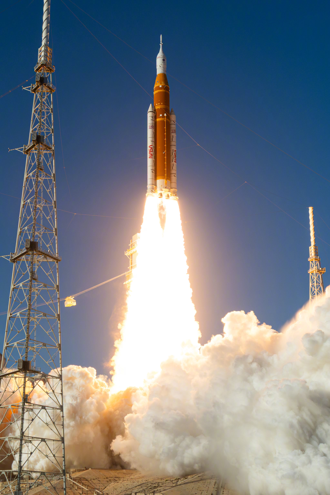

---

## 12

@斯图卡98

发表于：2026-04-04 23:47

来源：微博

链接：https://m.weibo.cn/status/5283886008371461

曾经的记忆：Backstreet Boys

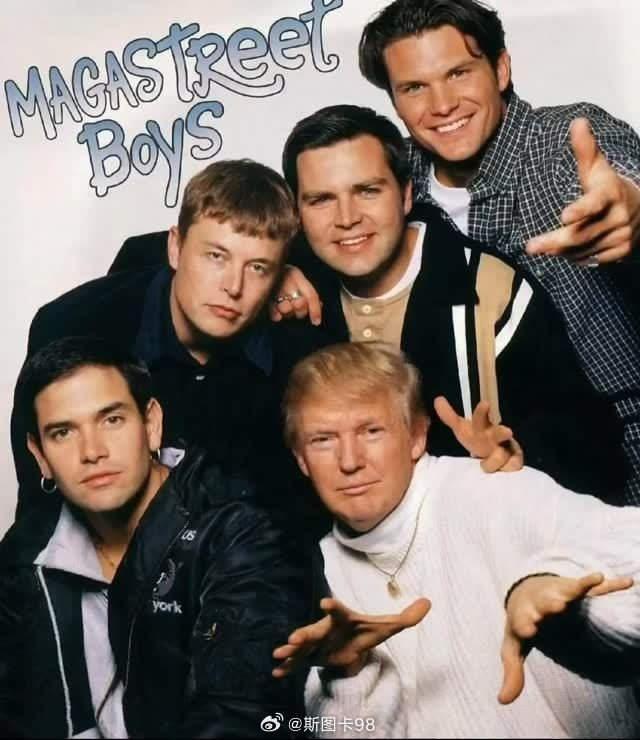

---

## 13

@刘晓光Savvy

发表于：2026-03-26 14:06

来源：微博

链接：https://m.weibo.cn/status/5280840768029102

有个说法叫30倍杠杆做空闺蜜。

就是自己拿了1万的彩礼，对外炫耀说30万，导致闺蜜们要求高了，一直大龄单身。

我最近写了条：打工人的极限也就2到3万，还是一线城市。

评论区把我骂个狗血淋头，说他朋友，亲戚，同学，朋友的孩子都赚很多钱，比这个多多了，赚钱哪有那么难。

我在想，这些人是不是也被他们的朋友给做空了？

朋友可能只是吹个牛皮，他当真了。

还有红薯某音之类的网站，大家上网玩，说我爷爷是李嘉诚都可以。

然后网友看了真信了。

被做空了。

这里被做空的是什么呢？

人生的幸福感，基本的尊严，体面，未来的成长潜能。

以及自己的智商都被做空了。

---

## 14

@图老板赛博札记

发表于：2026-04-04 08:48

来源：微博

链接：https://m.weibo.cn/status/5283897597493464

伊朗真的越战越勇了？

---

## 15

@物理芝士数学酱

发表于：2026-04-04 08:48

来源：微博

链接：https://m.weibo.cn/status/5283908754342350

\#今天要来点化学吗？\# 

30年前在村上春树的一篇随笔里读到，美国人喜欢在可口可乐里加花生。

这种喝法在美国南部有一定传统，通常是把咸花生直接倒进玻璃瓶装的可乐里。这被称为“农夫可乐”。

在文化记忆里，它常被视为一种怀旧的“南方小吃搭配”。不过现在大多数美国南方人甚至也不了解这些文化。

不过美国农夫认为这种搭配很美味，并非是他们的错觉。

经典版可口可乐的pH值为2.5，与胃酸的酸度大致相同。当把烤花生放入可口可乐中时，其中的磷酸会使花生表面的蛋白质部分变性，释放出游离的谷氨酸。这样，鲜味就在杯中实时产生。

花生上的盐分会抑制舌头上的苦味受体，从而增强你对甜味的感知，而无需额外添加糖。可口可乐每罐已含有39克糖。由于盐分清除了其他味觉信号的干扰，你的大脑会感觉它更甜。所以要选咸花生。

碳酸化作用有两个方面。首先，溶解在液体中的二氧化碳会形成碳酸，碳酸会刺激痛觉受体（TRPA1），而不是味觉受体。这种轻微的刺激感能让你的味蕾在每次啜饮之间得到休息，从而避免味觉疲劳。每一口都像第一口一样令人惊艳。其次，气泡会搅动花生表面，加速蛋白质分解和谷氨酸释放。花生浸泡的时间越长，提取出的鲜味就越多。

脂肪含量是关键。花生中脂肪含量高达49%（按重量计）。脂肪是唯一能激活CD36受体的宏量营养素，而大脑会将这种受体解读为浓郁和满足感。将脂肪与糖、盐、酸、鲜味和碳酸混合在一起，就意外地同时激活了人类味觉系统中所有主要的奖赏通路。

20世纪20年代，佐治亚州的农民把花生米丢可乐里是为了空出一只手。他们偶然发现了盐-酸-鲜味-脂肪-碳酸的最佳循环，而食品科学却在一个世纪后才能够解释其原理。

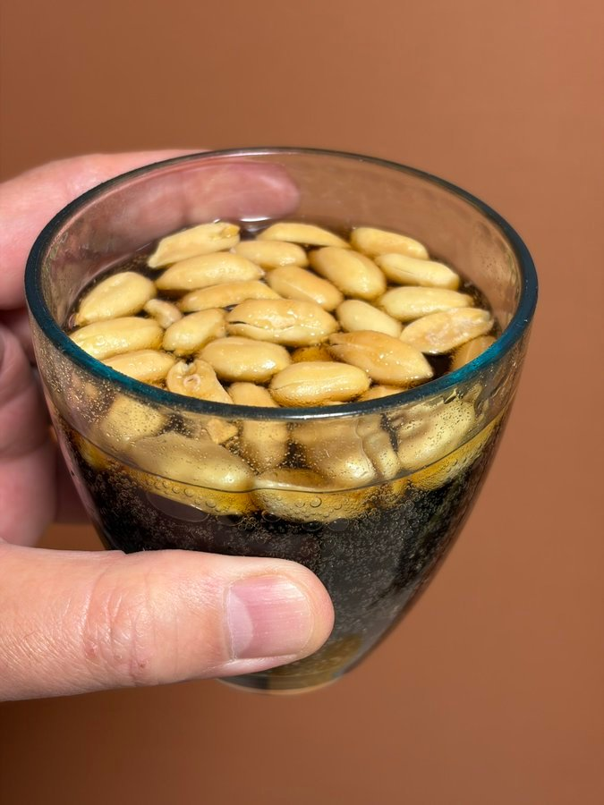

---

## 16

@风云学会陈经

发表于：2026-04-04 09:49

来源：微博

链接：https://m.weibo.cn/status/5283910506512525

昨一个安徽网约车司机，一家人都跑上海来谋生。想明白了恒生科技指数的问题

一个劲抱怨挣不到钱，下雨跑四个小时才收到160元。说七八年以前日子好，跑网约车月入2万，开大货车跑长途能3万。

后来跑的人多，平台提成多，收入少多了，也就1万。但回安徽蚌埠是不可能的，更赚不到钱。而且家人和亲戚朋友不少人都跑来上海过，一个人租10平米的房子1500，能做饭洗衣服可以了。

好日子的目标是一年能存十万，以前可以，现在认为白领也做不到。

感觉社会气氛就是这样，商品过剩，劳动力供给过剩，就没有稀缺产生的景气。其实吃喝也行，司机还自己买了个ID.4开，首付4万多，三年月供3800多，换了几辆车。这绝对不是下层没钱赚的人，就是赚不到大钱。

搞大模型、芯片这些的就是稀缺的，气氛不是一回事，到处抢，百万年薪的是标配。其它科技都过剩了，恒生科技这些股基本是过剩行业的，跌大了。大模型算力稀缺，估值高到离谱。

所以，目前中国主要国情是供给过剩，高素质劳动力规模极大。世界经济历史上没有过。

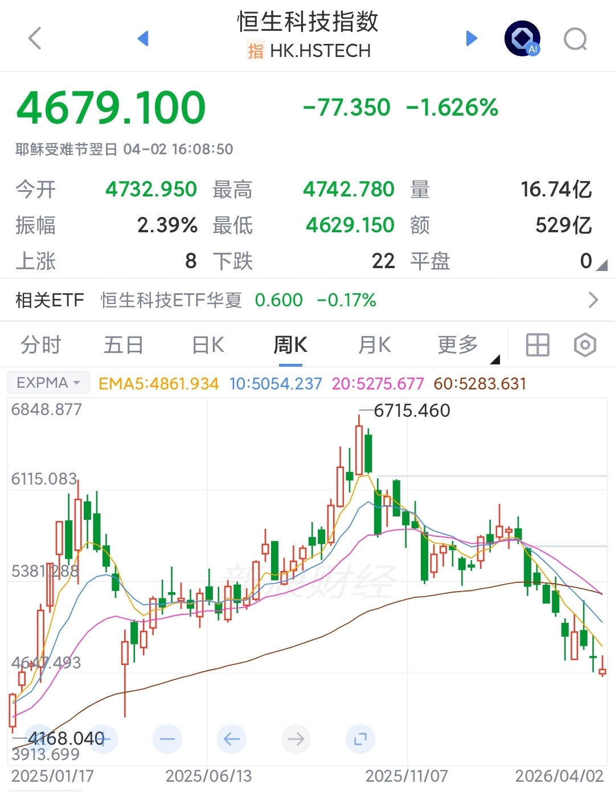

---

## 17

@包容万物恒河水

发表于：2026-04-04 09:49

来源：微博

链接：https://m.weibo.cn/status/5283915829871332

🔻图1：阿波罗17号，1972年，哈苏500，70mm胶片相机，80mm蔡司镜头

🔻图2：阿尔忒弥斯 II，2026 年，尼康D5，22mm（14-24mm f/2.8G ED广角镜头）和 1/4 秒，50k ISO（51200）。

🔻图3-5，阿尔忒弥斯 II，2026 年。

🔻via NASA

\#美国50多年来首次载人飞向月球\#\#海外新鲜事\#\#热点现场\#

---

## 18

@蓝星金刀客

发表于：2026-04-04 09:49

来源：微博

链接：https://m.weibo.cn/status/5283917613241613

就在刚刚，南京地铁公布了昨天（2026年4月3日）客流数据，446.9万！

1，继续冲进历史前十，来到了历史第2，把2019年跨年的411.6万挤出第十。

2，同时，这也是继4月1日408万、4月2日408.2之后，历史上首次三连400万！当然，很有机会6连400万！

3，远了不说，这个五一能把6号线和宁马城际通了的话，再次突破500万的机会还是有的！

\#南京头条\#\#苏大强\#\#南京地铁\#

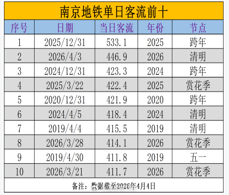

---

## 19

@多益网络

发表于：2026-04-01 12:44

来源：微博

链接：https://m.weibo.cn/status/5282994442735831

中国首父徐波，作为100多个孩子的父亲，非常支持图中的看法，徐波认为任何孩子的国籍，应该根据其父亲的国籍来确定，中国富豪的孩子，国籍当然应该是中国。希望加州法院能把抢走的徐波的孩子还给中国，还给徐波。徐波在美所生的孩子是12个，而不是华尔街日报所说的100个，或其他数量。这些媒体欺骗了大众。

---

## 20

@菜鸟耶夫斯基

发表于：2026-04-04 09:49

来源：微博

链接：https://m.weibo.cn/status/5283918679116098

\#伊朗议长发文嘲讽美军战机被击落\# 昨天，伊朗巡飞弹命中了一架CH-47直升机。

伊朗越做越对了，既然你不承认实际的美军伤亡人数，那我再打一些美军装备。实打实的照片一出来，就算战火没有烧到美国本土，但是美国国内是看到了美军在这场不明不白战争中遭到的损失。

以打促谈，以打促和，以打促醒。

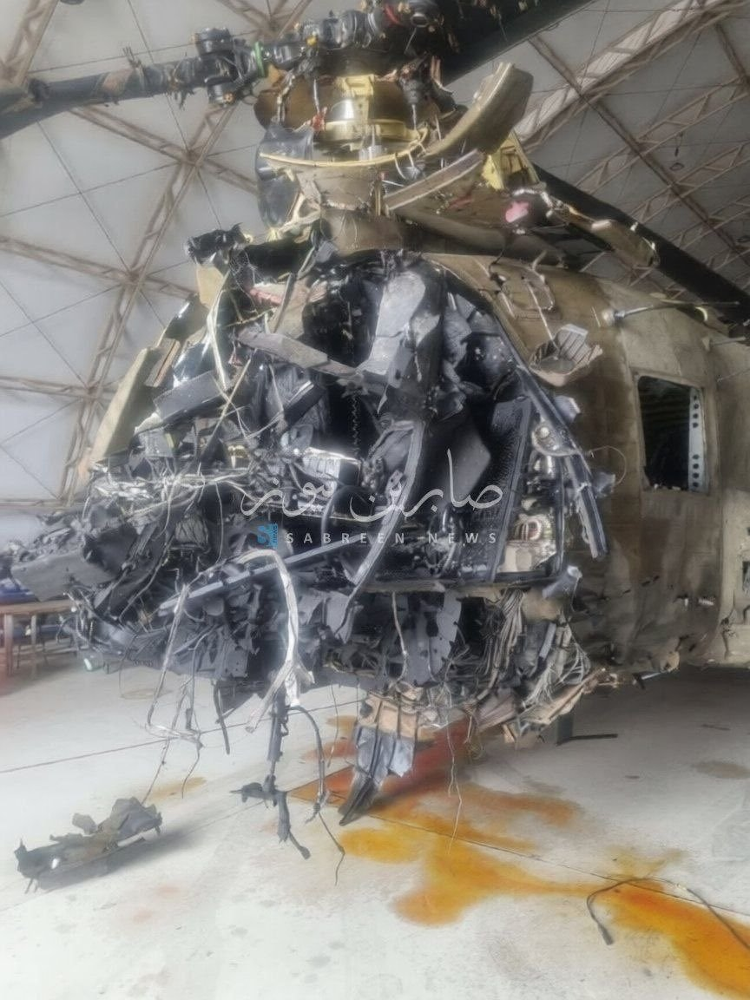

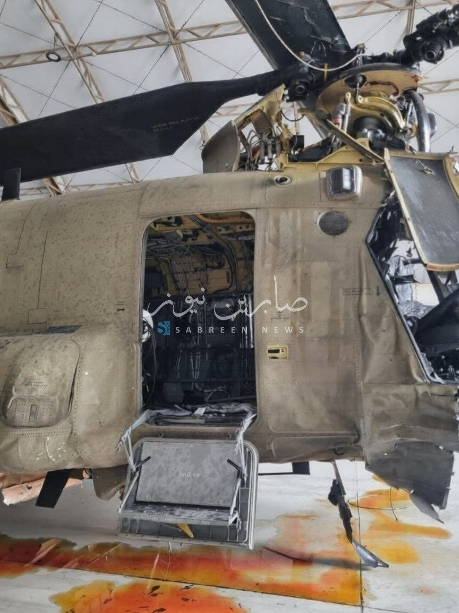

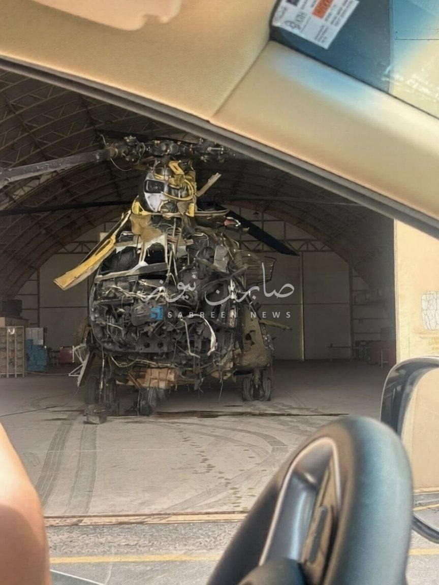

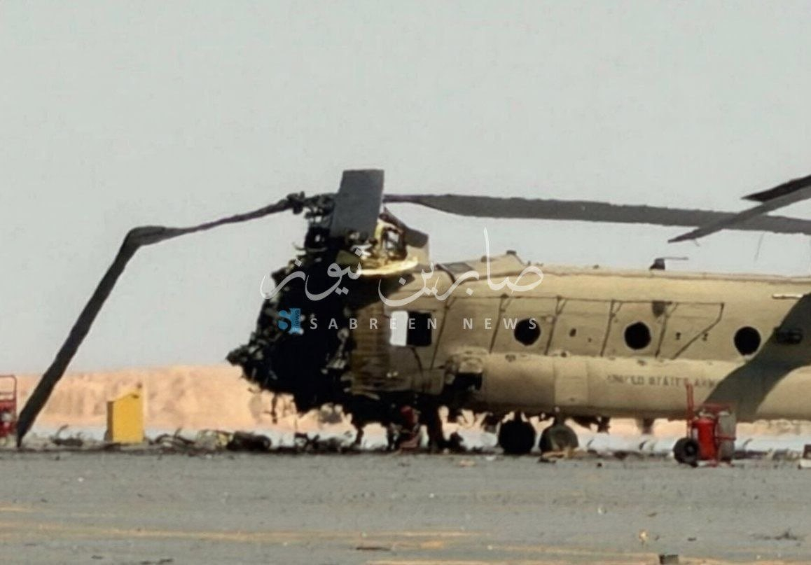

---

## 21

@俄罗斯卫星通讯社

发表于：2026-04-04 09:49

来源：微博

链接：https://m.weibo.cn/status/5283919072335089

【🚨🇮🇷 伊朗计划对通过霍尔木兹海峡的油轮实施国别区分】\#伊朗威胁封锁霍尔木兹海峡\# 据半岛电视台报道，伊朗将根据各国对近期中东战争的政治立场对其实施区分。

🟠 敌对国家将不被允许通过霍尔木兹海峡

🟠 中立国家需缴纳通行费

2月28日，美国与以色列对伊朗境内目标发动多次打击，包括袭击德黑兰，造成破坏和平民伤亡。作为回应，伊朗向以色列领土及美国在中东的军事目标实施了报复性导弹打击。

持续的军事行动已大幅减少霍尔木兹海峡的海上交通量，该海峡是全球能源供应的关键咽喉要道。战争爆发前，全球约20%的原油和20%的液化天然气（LNG）经此海峡运输。目前这一数字已降至正常水平的5%。

---

## 22

@何牧歌耶

发表于：2026-04-04 09:49

来源：微博

链接：https://m.weibo.cn/status/5283916442502500

嬴政既没有过一个杀功臣也没有屠过一个城市怎么就成了某些人口里的暴君？

---

## 23

@观察者网

发表于：2026-04-04 09:50

来源：微博

链接：https://m.weibo.cn/status/5283923887654158

【“丧事喜办”的剧本已经有了，\#好莱坞可以开拍深入敌后3了\#】4月3日伊朗宣布击落了一架美军的F35，还展示了垂尾残骸作为证据。只不过如果仔细研究垂尾会发现这只是升级过电子战设备的最新型F-15E，完全不是F-35。而且第一时间展示的残骸只有垂尾，没有看到机身主体，因此存在重伤返航的可能。\#美军2架黑鹰直升机被伊朗击中\# 

但随后伊朗公布了弹射座椅的照片，确认是F15E的弹射座椅而且已经释放，因此可以确凿认定是击落了，而且飞行员在跳伞落地后还活着。而这时击落F15E这个战果已经成为次要的事了，能不能抓到两个跳伞的美军飞行员才是最关键的事。

如果伊朗俘虏了飞行员，那无疑会让特朗普非常难堪。到时候灰头土脸的飞行员上电视台直播承认自己的轰炸罪行，那特朗普的国内支持度直接就爆炸了。

也因此在4月3日当天，美军的重中之重就是把这俩飞行员给捞回来。在飞机被击落后不到两小时，伊朗上空就发现了MC130J给两架黑鹰直升机进行空中加油，毫无疑问这是美国空军伞降救援队（PJ）出动进行飞行员搜救了。与此同时大量的加油机、无人机都在波斯湾上空活动，甚至还看到A10“疣猪”攻击机（编注：根据最新消息，A10“疣猪”攻击机被伊朗击落）出现在伊朗境内进行战斗任务。可以说美军动用了几乎整个战区的力量进行两名飞行员的搜救。

在伊朗境内进行低空空中加油，实在是令人佩服。这时候但凡有个单兵防空弹或者高射机枪，就把这仨全部捅下来了。

而伊朗也是拼了命要抓住这两飞行员，同时尽可能的阻挠美军的救援行动。在伊朗老乡拍到的视频中，可以清楚的看到MC130J在释放热诱弹来规避地面发射的单兵防空弹。而前来搜救的黑鹰也疑似被击中受伤，但不确认是否坠毁。伊朗电视台已经发布了抓获这两名美军飞行员的重金悬赏，当地老乡是倾巢出动去搜那飞行员。

但是不论对美军还是对伊朗来说，这次搜救/抓捕都有很多困难。结合击落的省份以及地形地貌，大致可以判断是在海拔三四千米的高原地带，很可能在德纳山那边。这地方深入伊朗内陆，距离波斯湾海岸线有150公里而距离伊拉克边境更是有三百多公里，而且是山地地形。

因此美军在这里开展搜救难度非常大，甚至开展了极为冒险的MC130J在伊朗腹地低空给黑鹰直升机进行空中加油的高风险行动。如此深入腹地而且复杂的救援行动需要战区级力量支援，因此3日当天美军几乎停下了其他所有空袭行动，全力进行搜救了。

而对伊朗来说抓捕飞行员也并不容易。这一块地方属于地广人稀还是山地，本身人口密度就很低以牧民为主。大量的山脉虽然对美军的搜救造成了很大的麻烦，对伊朗方面的搜索也造成了很大的难度，这使得两边多少都有些尴尬。但由于伊朗是本土可以调集大量人员来搜山，而美军的救援机群在伊朗腹地停留的时间很有限，而且时间越长伊朗越是可以调动更多力量进行攻击或者地导设伏，到时候指不定就成了葫芦娃救爷爷了。

目前美军宣布救出了一名飞行员。得说在这种战场环境下还能捞出一名飞行员，美军的PJ确实强大（无嘲讽意味）。但F-15E是双座，还有一名飞行员下落不明，所以这事还有的折腾。而随着黄金24小时逐渐流逝，情况会对美军越来越不利，而伊朗的机会也越来越大。哪怕到头来伊朗找到的只是第二个飞行员的尸体，依然能让他们上个大分。因此这场飞行员大搜索尚未结束，下半场才刚刚开始。这第二个飞行员可是活要见人死要见尸。

当然这次的搜救场面搞得那么大，倒是给好莱坞提供了极佳的素材，你看这《深入敌后》不就可以拍3了？光现实里就是又是黑鹰出动又是A10扫射的，还有直升机在山区内搜救、敌方控制区内空中加油等惊险场面，“丧事喜办”的剧本已经有了。（文/张仲麟 风闻社区）

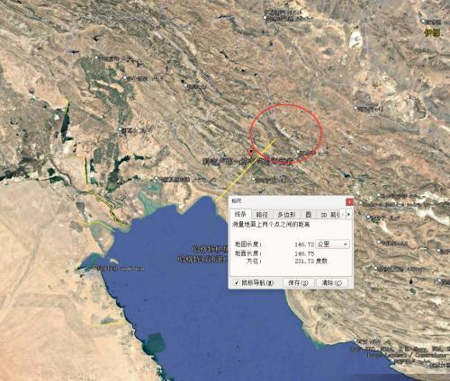

