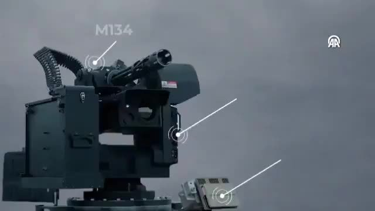

@万年炎帝
发表于：2026-04-04 11:47
来源：微博
链接：https://m.weibo.cn/status/5283951948333978

🔻现在无人机对陆地战车载具的威胁这么大，除了传统安装主动防御系统转塔，近距离拦截之外，战车配备更远的多层拦截手段也是很有必要的。
🔻例如安装下面视频中展示的M134小火神速射机枪武器站，在几百米距离上可以拦截来袭无人机FPV什么的，或者安装编程榴弹机枪武器站，用空炸榴弹拦截无人机。
🔻甚至于携带图中展示的微型导弹巢，或者拦截型无人机蜂群，用于对抗敌方无人机蜂群。
🔻不这么干，就只能和 图1 乌克兰的艾布拉姆斯一样，硬接FPV了，而这是没什么前途的，既完成不了进攻任务，昂贵上千万美元的载具也会被简单摧毁掉。

\#伊朗被曝实施打了就跑战术\#\#烽火问鼎计划\#

---

