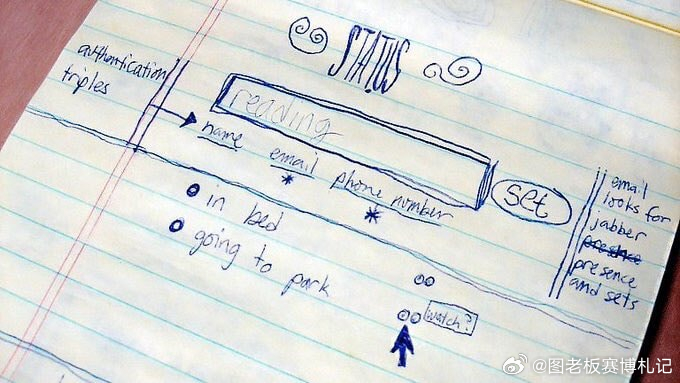

@图老板赛博札记
发表于：2026-03-13 05:04
来源：微博
链接：https://m.weibo.cn/status/5275993285593381

话说在 2000 - 2001 年那会儿，杰克・多西随手画下的一张手稿，竟勾勒出了日后风靡全球的 Twitter 的雏形，而且早于 Twitter 正式立项约五年。这张手稿里的设计逻辑，在之后产品不断变化发展中，始终稳稳扎根，几乎没怎么变过。

那时候，这个项目最初叫 “STATUS” ，可不是现在的 “Twitter”。多西年轻时候对出租车、急救车的无线电调度系统特别着迷，你想啊，那些车辆不停地广播自己的位置和状态，多有意思。他就琢磨着，能不能把这一套用在人们日常生活里呢？最后就有了想法，不是写长篇大论的文章，也不是发布新闻，而是让朋友们随时都能知道 “你现在正在做什么”，这就是 Twitter 核心定位 —— 状态广播。

再看看手稿中央，一个大大的输入框特别醒目，里面用铅笔写着默认词 “reading”，右边就一个简简单单的按钮 “Set” 。这就是发推功能最早的样子啦，不用费劲想标题，也不用考虑排版，直接写下状态，然后按下发送就行。输入框上面的提示语，后来就变成了 Twitter 很标志性的 “What are you doing?” 。多西还在输入框下面写了俩示例状态 “in bed” 和 “going to park” ，这不就是 “微博客（Microblogging）” 概念的源头嘛，即时、碎片化，都不用怎么构思。

手稿左上方标注了 “authentication triples”，也就是身份验证三要素，对应名字、邮箱和电话号码，这里面手机号还特别加了星号。为啥呢？因为 Twitter 一开始是靠 SMS 运作的，用户给专用短号码发一条短信，系统就把状态更新到网页上，还能群发给关注者。这也就有了 140 字符的限制，国际标准短信上限是 160 字符，留出 20 字符给用户名，剩下 140 字符用来写内容。

手稿右下角画了几个小圆圈和箭头，旁边写着 “watch?” 。那时候主流即时通讯软件像 MSN、AIM，好友关系都是双向的，可多西想的 “watch” 是单向订阅，就是我能留意某人的状态，不需要对方回应。这个看似不起眼的词，后来就演变成了 Twitter 超有影响力的机制之一 —— Follow（关注）。

而且啊，手稿右侧写着 “email looks for jabber presence and sets” ，Jabber 是当时很流行的开源即时通讯协议，也就是现在的 XMPP 。这说明多西从一开始就设想了一套跨平台架构，不管你是发邮件、发短信，还是直接在页面输入，所有状态都能被统一捕捉到，然后同步分发出去，可不是只局限在一个入口。

从这张手稿能看出，一个伟大产品的诞生，最初的理念往往就蕴含着无限潜力。你觉得 Twitter 这些最初的设计理念，对后来社交媒体发展影响大吗？
\#Twitter \#产品设计 \#社交媒体历史

---

