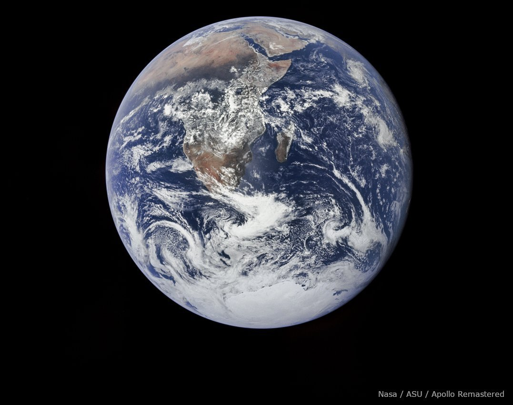
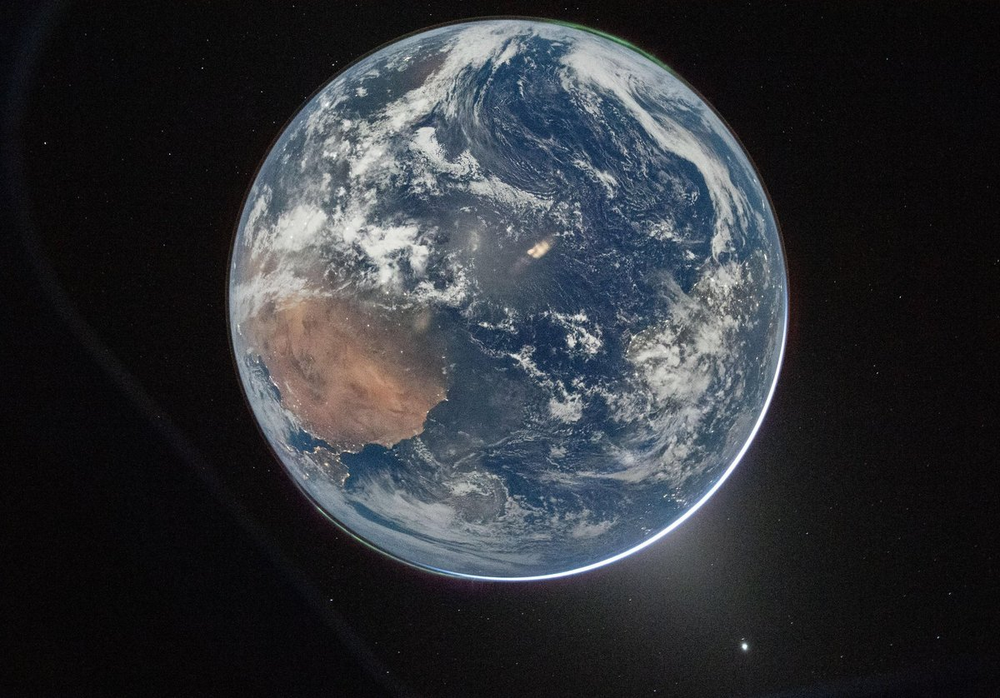
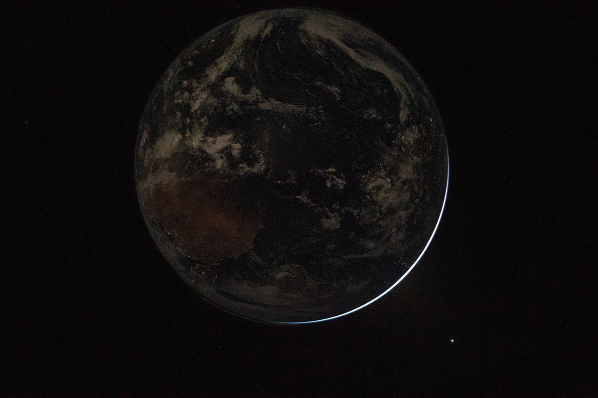
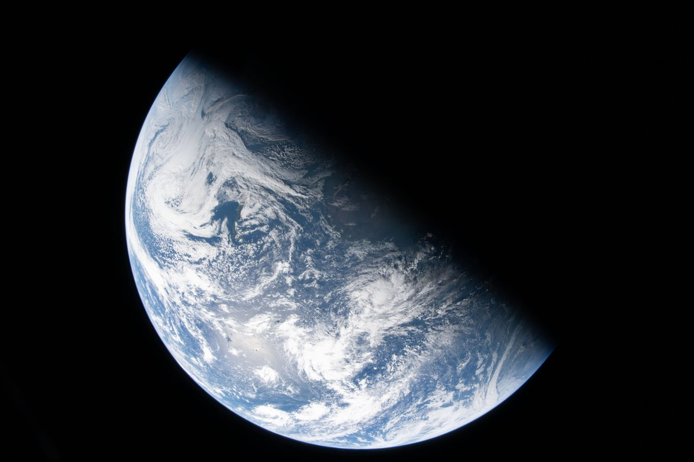
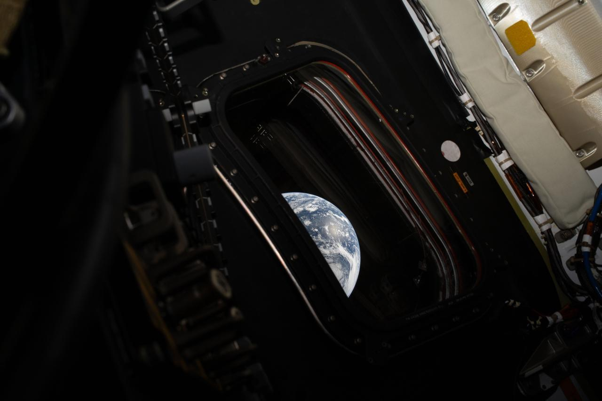

@包容万物恒河水

发表于：2026-04-04 09:49

来源：微博

链接：https://m.weibo.cn/status/5283915829871332

🔻图1：阿波罗17号，1972年，哈苏500，70mm胶片相机，80mm蔡司镜头

🔻图2：阿尔忒弥斯 II，2026 年，尼康D5，22mm（14-24mm f/2.8G ED广角镜头）和 1/4 秒，50k ISO（51200）。

🔻图3-5，阿尔忒弥斯 II，2026 年。

🔻via NASA

\#美国50多年来首次载人飞向月球\#\#海外新鲜事\#\#热点现场\#

---

