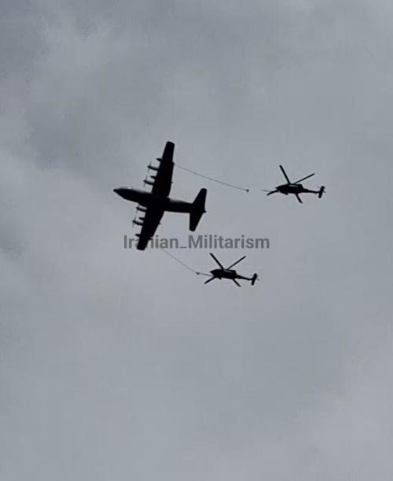
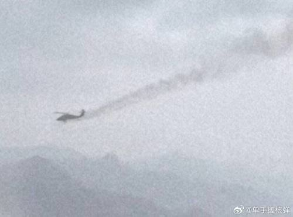

@观察者网

发表于：2026-04-04 09:50

来源：微博

链接：https://m.weibo.cn/status/5283923887654158

【“丧事喜办”的剧本已经有了，\#好莱坞可以开拍深入敌后3了\#】4月3日伊朗宣布击落了一架美军的F35，还展示了垂尾残骸作为证据。只不过如果仔细研究垂尾会发现这只是升级过电子战设备的最新型F-15E，完全不是F-35。而且第一时间展示的残骸只有垂尾，没有看到机身主体，因此存在重伤返航的可能。\#美军2架黑鹰直升机被伊朗击中\# 

但随后伊朗公布了弹射座椅的照片，确认是F15E的弹射座椅而且已经释放，因此可以确凿认定是击落了，而且飞行员在跳伞落地后还活着。而这时击落F15E这个战果已经成为次要的事了，能不能抓到两个跳伞的美军飞行员才是最关键的事。

如果伊朗俘虏了飞行员，那无疑会让特朗普非常难堪。到时候灰头土脸的飞行员上电视台直播承认自己的轰炸罪行，那特朗普的国内支持度直接就爆炸了。

也因此在4月3日当天，美军的重中之重就是把这俩飞行员给捞回来。在飞机被击落后不到两小时，伊朗上空就发现了MC130J给两架黑鹰直升机进行空中加油，毫无疑问这是美国空军伞降救援队（PJ）出动进行飞行员搜救了。与此同时大量的加油机、无人机都在波斯湾上空活动，甚至还看到A10“疣猪”攻击机（编注：根据最新消息，A10“疣猪”攻击机被伊朗击落）出现在伊朗境内进行战斗任务。可以说美军动用了几乎整个战区的力量进行两名飞行员的搜救。

在伊朗境内进行低空空中加油，实在是令人佩服。这时候但凡有个单兵防空弹或者高射机枪，就把这仨全部捅下来了。

而伊朗也是拼了命要抓住这两飞行员，同时尽可能的阻挠美军的救援行动。在伊朗老乡拍到的视频中，可以清楚的看到MC130J在释放热诱弹来规避地面发射的单兵防空弹。而前来搜救的黑鹰也疑似被击中受伤，但不确认是否坠毁。伊朗电视台已经发布了抓获这两名美军飞行员的重金悬赏，当地老乡是倾巢出动去搜那飞行员。

但是不论对美军还是对伊朗来说，这次搜救/抓捕都有很多困难。结合击落的省份以及地形地貌，大致可以判断是在海拔三四千米的高原地带，很可能在德纳山那边。这地方深入伊朗内陆，距离波斯湾海岸线有150公里而距离伊拉克边境更是有三百多公里，而且是山地地形。

因此美军在这里开展搜救难度非常大，甚至开展了极为冒险的MC130J在伊朗腹地低空给黑鹰直升机进行空中加油的高风险行动。如此深入腹地而且复杂的救援行动需要战区级力量支援，因此3日当天美军几乎停下了其他所有空袭行动，全力进行搜救了。

而对伊朗来说抓捕飞行员也并不容易。这一块地方属于地广人稀还是山地，本身人口密度就很低以牧民为主。大量的山脉虽然对美军的搜救造成了很大的麻烦，对伊朗方面的搜索也造成了很大的难度，这使得两边多少都有些尴尬。但由于伊朗是本土可以调集大量人员来搜山，而美军的救援机群在伊朗腹地停留的时间很有限，而且时间越长伊朗越是可以调动更多力量进行攻击或者地导设伏，到时候指不定就成了葫芦娃救爷爷了。

目前美军宣布救出了一名飞行员。得说在这种战场环境下还能捞出一名飞行员，美军的PJ确实强大（无嘲讽意味）。但F-15E是双座，还有一名飞行员下落不明，所以这事还有的折腾。而随着黄金24小时逐渐流逝，情况会对美军越来越不利，而伊朗的机会也越来越大。哪怕到头来伊朗找到的只是第二个飞行员的尸体，依然能让他们上个大分。因此这场飞行员大搜索尚未结束，下半场才刚刚开始。这第二个飞行员可是活要见人死要见尸。

当然这次的搜救场面搞得那么大，倒是给好莱坞提供了极佳的素材，你看这《深入敌后》不就可以拍3了？光现实里就是又是黑鹰出动又是A10扫射的，还有直升机在山区内搜救、敌方控制区内空中加油等惊险场面，“丧事喜办”的剧本已经有了。（文/张仲麟 风闻社区）

---

