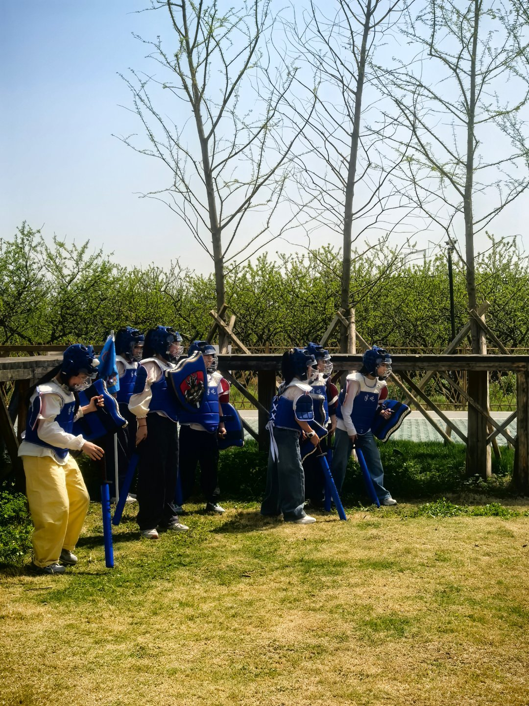
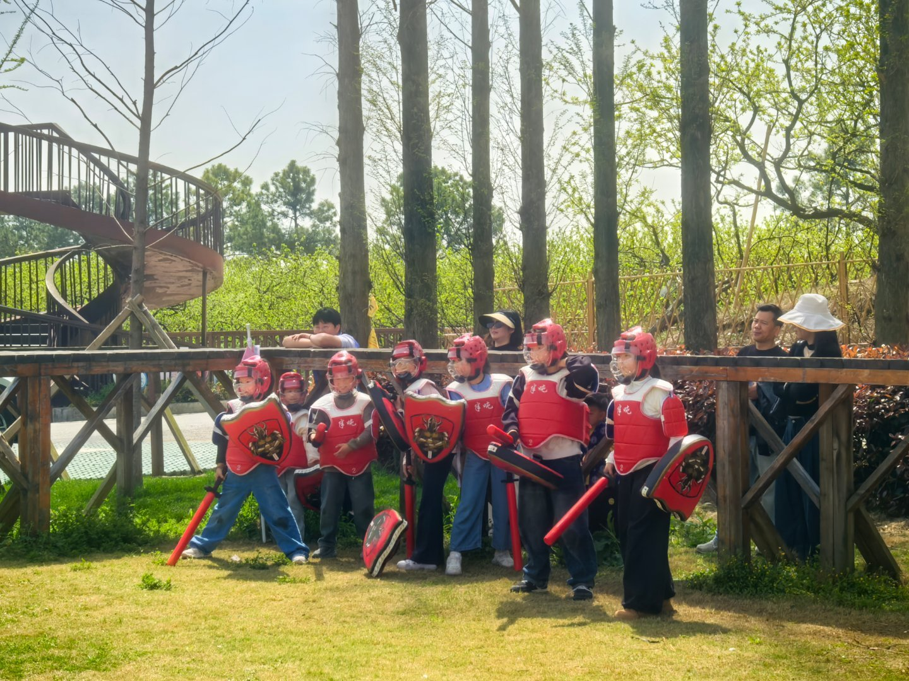
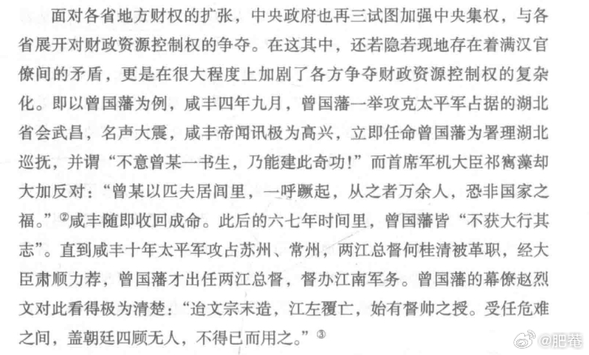
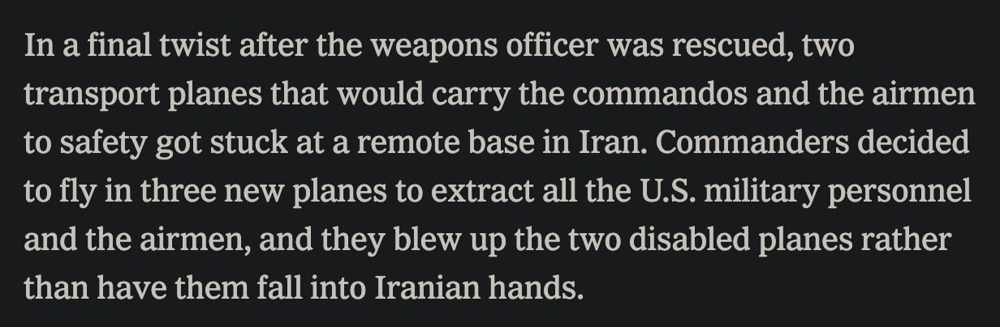
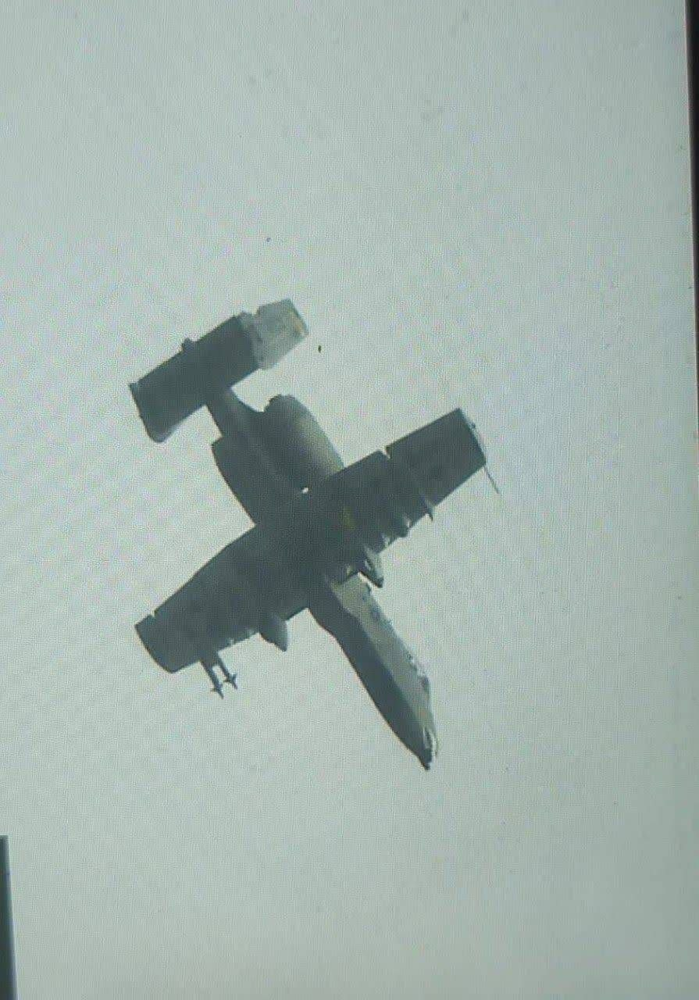
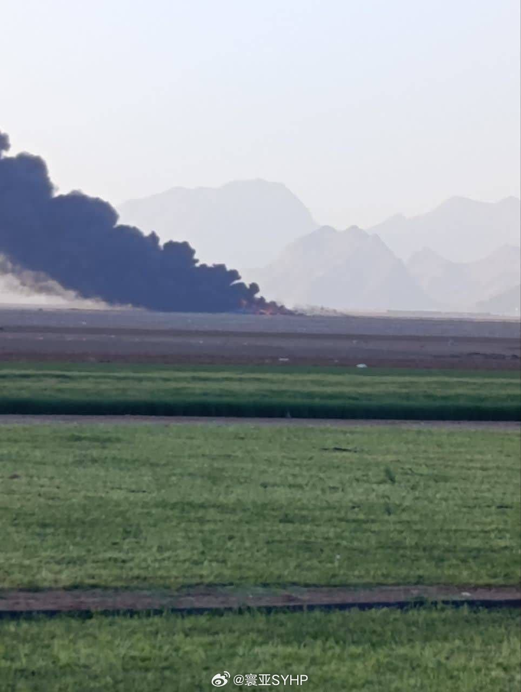

# 2026-04-06

## 1

@沙姆雄狮_EL

发表于：2026-04-05 21:39

来源：微博

链接：https://m.weibo.cn/status/5284456438435020

美国官员说，昨晚今晨美军解救被击落的战斗机联队长的联合特战行动总计损失了8架飞机：2架C-130系列特战运输机、4架MH-6“小鸟”直升机（入场的载具全部损失）以及2架MQ-9无人机（被击落），总价值大约3亿美元。

此外，该官员声称美军轰炸了试图登山的“伊朗革命卫队车辆”。

---

## 2

@深圳宁南山

发表于：2026-04-05 21:39

来源：微博

链接：https://m.weibo.cn/status/5284460951504804

2025年我国出生人口数量几十年来首次低于西方国家

1月19日国家统计局发布我国2025年出生人口下降到792万了，

792万也是1949年以来我国出生人口最低的一年。

我查询了2024年西方国家的情况，

欧盟27国+美国+加拿大+英国+澳新总人口是8.94亿人，而出生人口总共853.05万人；

2024年底我国人口14.0828亿人，出生人口是954万人，因此这一年暂时我国还领先。

但是我国2025年出生仅有792万人，虽然西方国家2025年全年统计数据还没出来，但他们出生人口波动不会太大，

所以可以判定2025年我国新生儿数量已经低于西方了，是其2024年出生人口总数的92.8%，也就是我国14亿人口出生人口还不如西方9亿人的出生人口多。

以上我还没有计算日本，韩国，像日本的心理一向是把我国当做最大敌人。

或者更确切的说，在过去的几十年，1962年（1961年是我国出生人口低谷，但我未能查到西方新生儿确切出生数据）以来我国新生儿人口一直都比西方多，但2025年成了转折点。

由于西方的生育率比我们高（欧盟2024年为1.37，美国2024年为1.599），

我国2020年七普生育率是1.3，现在普遍认为比这又低了不少，

因此预计未来我国和西方出生人口数量的差距还将越来越大。

2024年西方（欧盟+美加+英国+澳新）大约4.81万美元人均GDP（世界银行数据）是我国2024年人均GDP 1.344万美元的大约3.58倍，

而且现在西方出生人口数和生育率都已经高于我国，西方对我国开始呈现人均和人口总量的“双优势”。未来如果我国生育率不能得到提升，那么未来我国人口也将低于西方，西方仍将长期是这个星球实力最强大的团体。

除此之外，由于超低生育率，因此我国人口结构也会比更加老龄化，养老金，医保等各项支出负担更重，本土市场消费能力减弱，这会拖累我国长期经济增速，导致人均GDP追赶西方可能性降低。

---

## 3

@深圳宁南山

发表于：2026-04-05 22:39

来源：微博

链接：https://m.weibo.cn/status/5284471939271142

从发电量看日本经济颓势，2024年日本发电量只有历史巅峰发电量的不到84%

查询了下日本的发电量情况，数据来自IEA（国际能源署），这是一个主要由发达国家组成的政府间国际组织。

日本的发电量在2000年为1.06781万亿度，在之后的多年内略有增长，

到2010年日本达到了历史发电量的最顶峰，这一年日本发电量为1.17087万亿度电。

但之后由于2011年311海啸的影响，日本核电发电量从2011年这一年开始出现直线下降，导致日本发电量开始出现了下降。

如下图，2011年海啸之后日本增加了天然气和煤电发电量，这在一定程度上弥补了核电发电量迅猛下降带来的发电量损失。

但是煤电发电量在2013年达到顶峰，

天然气发电量在2014年达到顶峰之后也开始走下坡路。

到2015年日本总发电量下降为1.058616万亿度，比2010年的巅峰下降了1100亿度以上。

到2022年发电量继续下降到1.017679万亿度。

到2024年日本发电量跌破一万亿度，只有9819.93亿度，

这是2010年历史最高峰发电量的83.87%，换言之比历史最高年份发电量下降了16.13%。

总之对于日本经济和未来发展前景，我觉得是不行的。

---

## 4

@背刀打拳的两百斤的猫

发表于：2026-04-05 15:40

来源：微博

链接：https://m.weibo.cn/status/5284371070454290

今天非常热，但来参加全甲软质研学的小朋友们都非常棒！

\#全甲格斗\#\#中国全甲格斗\# 桐乡·桃园槜李广场

---

## 5

@高飞

发表于：2026-04-05 17:40

来源：微博

链接：https://m.weibo.cn/status/5284392847282662

\#模型时代\# Andrej Kaparthy：如何用LLM构建个人知识库（维基）

前几天AI造概念大神Andrej写了一个推文，说：

最近我发现有一件事非常有用：利用大型语言模型（LLMs）为各种感兴趣的研究主题构建个人知识库。这样一来，我近期处理的文本量中，用于操作代码的部分大幅减少，而用于操作知识（以 Markdown 和图片形式存储）的部分则显著增加。

结果推文爆火，超过千万阅读。于是他写了一个完整指南，我编译了一下，最下边是一些读者留言，我选了10条。

原文在这里：gist.github.com/karpathy/442a6bf555914893e9891c11519de94f

LLM Wiki (大语言模型维基)

一种使用 LLM 构建个人知识库的模式。

这是一个关于“理念”的文件，旨在让你将其复制粘贴给你的专属 LLM 智能体（例如 OpenAI Codex、Claude Code、OpenCode / Pi 等）。它的目的是传达高层次的构想，而你的智能体将与你协作，构建出具体的实现细节。

一、核心理念

大多数人使用 LLM 处理文档的体验都类似于 RAG（检索增强生成）：你上传一堆文件，LLM 在你提问时检索相关的文本块，然后生成答案。这种方法虽然有效，但意味着 LLM 在回答每个问题时都在“从零开始”重新发现知识。这里没有任何积累。如果你问一个需要综合五份文档才能回答的微妙问题，LLM 每次都必须重新寻找并拼凑这些相关的碎片。没有建立起任何深层体系。NotebookLM、ChatGPT 的文件上传功能以及大多数 RAG 系统都是这种工作模式。

这里的理念则完全不同。LLM 不仅仅是在查询时从原始文档中检索，而是逐步构建并维护一个持久的 Wiki（维基）——这是一个结构化、相互链接的 Markdown 文件集合，介于你和原始信息源之间。当你添加一个新的信息源时，LLM 不仅仅是为以后的检索建立索引。它会阅读该文档，提取关键信息，并将其整合到现有的 Wiki 中——它会更新实体页面、修订主题摘要、指出新数据与旧观点矛盾的地方、强化或挑战不断演进的综合结论。知识被编译一次后，就会保持更新，而不是每次查询时都重新推导。

这是最关键的区别：Wiki 是一个持久的、不断复利积累的产物。 交叉引用已经存在。矛盾点已经被标记。综合总结已经反映了你读过的所有内容。随着你添加的每一个来源和提出的每一个问题，这个 Wiki 都会变得越来越丰富。

你从不（或很少）自己编写 Wiki——LLM 负责编写和维护它的全部内容。你负责收集来源、探索方向并提出正确的问题。LLM 则承担所有的苦力活——总结、交叉引用、归档和记账，正是这些工作让一个知识库随着时间的推移变得真正有用。在实践中，我会在屏幕一边打开 LLM 智能体，另一边打开 Obsidian（一款笔记软件）。LLM 根据我们的对话进行编辑，我则实时浏览结果——跟踪链接、查看图谱视图、阅读更新后的页面。Obsidian 是 IDE（集成开发环境）；LLM 是程序员；而 Wiki 就是代码库。

这可以应用于许多不同的场景。以下是一些例子：

• 个人管理： 跟踪你的目标、健康、心理、自我提升——归档日记、文章、播客笔记，随着时间的推移构建出关于你自己的结构化画像。

• 学术研究： 花几周或几个月的时间深入研究一个主题——阅读论文、文章、报告，逐步构建一个包含不断演进的论点的全面 Wiki。

• 读书笔记： 边读边将每一章归档，为人物、主题、情节线索以及它们之间的联系建立页面。读完后，你就会拥有一个内容丰富的伴读 Wiki。想象一下像“托尔金网关 (Tolkien Gateway)”这样的粉丝百科——数千个相互链接的页面涵盖了人物、地点、事件、语言，由志愿者社区历时数年建立。随着你的阅读，你可以个人构建类似的东西，由 LLM 完成所有的交叉引用和维护工作。

• 企业/团队： 一个由 LLM 维护的内部 Wiki，数据来源于 Slack 聊天记录、会议记录、项目文档、客户电话。可能需要人类在其中参与审核更新。Wiki 能保持最新，因为 LLM 做了团队中没人愿意做的维护工作。

• 竞品分析、尽职调查、旅行规划、课程笔记、爱好深挖——任何你需要随着时间推移积累知识，并希望它们井然有序而不是散落各处的地方。

二、架构

系统分为三个层级：

 Raw sources (原始资料)： 你精心收集的源文档集合。包括文章、论文、图片、数据文件。这些是不可变的——LLM 只从中读取，但从不修改它们。这是你唯一的事实来源。

 The wiki (维基)： 一个包含 LLM 生成的 Markdown 文件的目录。包括摘要、实体页面、概念页面、对比、概述、综合总结。LLM 完全拥有这一层。它创建页面，在新的来源到达时更新它们，维护交叉引用，并保持一切一致性。你负责阅读；LLM 负责编写。

 The schema (模式/配置文件)： 一个文档（例如针对 Claude Code 的 `CLAUDE.md`，或针对 Codex 的 `AGENTS.md`），告诉 LLM 这个 Wiki 是如何构建的，有哪些约定俗成的规则，以及在摄取来源、回答问题或维护 Wiki 时应遵循哪些工作流。这是关键的配置文件——正是它让 LLM 成为一个严谨的 Wiki 维护者，而不是一个普通的聊天机器人。随着你弄清楚什么适合你的领域，你和 LLM 将随着时间共同演进这个文件。

三、运作方式 (Operations)

• Ingest (摄取)： 你将一个新的来源放入原始集合中，并告诉 LLM 去处理它。一个示例流程：LLM 阅读来源，与你讨论关键要点，在 Wiki 中写一个摘要页面，更新索引，更新整个 Wiki 中相关的实体和概念页面，并在日志中附加一个条目。单个来源可能会触及 10-15 个 Wiki 页面。就我个人而言，我更喜欢一次摄取一个来源并保持参与——我会阅读摘要、检查更新，并指导 LLM 强调哪些内容。但你也可以在较少监督的情况下批量摄取多个来源。这取决于你如何制定适合自己风格的工作流，并在 Schema 中将其记录下来以供未来的会话使用。

• Query (查询)： 你针对 Wiki 提出问题。LLM 搜索相关页面、阅读它们，并综合出一个带有引用的答案。根据问题的不同，答案可以采取不同的形式——一个 Markdown 页面、一个比较表格、一个幻灯片 (Marp)、一个图表 (matplotlib)、或一个画布。一个重要的洞见是：优秀的答案可以作为新页面归档回 Wiki 中。 你要求做的一个对比分析、一个你发现的联系——这些都很有价值，不应该消失在聊天记录中。这样，你的探索就会像摄取的来源一样在知识库中产生复利。

• Lint (规范检查)： 定期要求 LLM 对 Wiki 进行健康检查。寻找：页面之间的矛盾、被新来源取代的陈旧论断、没有外部链接指向的孤立页面 (orphan pages)、被多次提及但缺乏独立页面的重要概念、缺失的交叉引用、可以通过网络搜索填补的数据空白。LLM 非常擅长提出需要调查的新问题和需要寻找的新来源。这能保持 Wiki 在扩展时的健康状态。

四、索引与日志 (Indexing and logging)

有两个特殊文件可以帮助 LLM（以及你）在 Wiki 增长时进行导航。它们服务于不同的目的：

• `index.md` 面向内容。它是 Wiki 中所有内容的目录——列出每个页面并附带链接、一句话摘要，还可以选择性地包含日期或来源数量等元数据。按类别（实体、概念、来源等）组织。LLM 在每次摄取时都会更新它。在回答查询时，LLM 首先读取索引以寻找相关页面，然后深入挖掘。在中等规模（约 100 个来源，数百个页面）下，这种方法出奇地有效，并且避免了构建基于向量嵌入的 RAG 基础设施的需要。

• `log.md` 按时间顺序排列。它是一个只能追加的记录，记录了何时发生了什么——摄取、查询、检查 (lint passes)。一个实用提示：如果每个条目都以一致的前缀开头（例如 `\#\# [2026-04-02] ingest | Article Title`），日志就可以用简单的 Unix 工具进行解析——运行 `grep "^\#\# \[" log.md | tail -5` 就能让你看到最后 5 个条目。日志为你提供了 Wiki 演进的时间线，并帮助 LLM 了解最近完成了哪些工作。

五、可选：CLI 工具

在某个阶段，你可能想要构建一些小工具来帮助 LLM 更高效地在 Wiki 上运行。在 Wiki 页面上的搜索引擎是最显而易见的一个——在小规模下，索引文件就足够了，但随着 Wiki 的增长，你会需要真正的搜索。`qmd` 是一个不错的选择：它是一个用于 Markdown 文件的本地搜索引擎，具有混合 BM25/向量搜索和 LLM 重排功能，全部在设备端运行。它既有 CLI 界面（所以 LLM 可以调用它），也有 MCP 服务器（所以 LLM 可以将其作为原生工具使用）。你也可以自己构建更简单的东西——当有需求时，LLM 可以帮你写一个简单的搜索脚本。

六、技巧与提示

• Obsidian Web Clipper 是一个浏览器扩展，可将网页文章转换为 Markdown。这对于快速将来源引入原始集合非常有用。

• 在本地下载图片。 在 Obsidian 设置 → 文件与链接中，将“附件文件夹路径”设置为一个固定目录（例如 `raw/assets/`）。然后在设置 → 快捷键中，搜索“Download”找到“下载当前文件的附件”并绑定快捷键（例如 Ctrl+Shift+D）。剪辑文章后，按下快捷键，所有图片都会下载到本地磁盘。这是可选的，但很有用——它允许 LLM 直接查看和引用图片，而不必依赖可能会失效的 URL。注意：LLM 无法在一次传递中原生读取带有内联图片的 Markdown——解决办法是让 LLM 先阅读文本，然后单独查看一些或全部引用的图片以获取额外的上下文。有点笨拙，但也足够用了。

• Obsidian 的关系图谱 (Graph view) 是查看你 Wiki 形状的最好方式——什么连接着什么，哪些页面是枢纽，哪些是孤立节点。

• Marp 是一种基于 Markdown 的幻灯片格式。Obsidian 也有它的插件。非常适合直接从 Wiki 内容生成演示文稿。

• Dataview 是一个 Obsidian 插件，可以在页面前言 (frontmatter) 上运行查询。如果你的 LLM 在 Wiki 页面中添加了 YAML 前言（标签、日期、来源数量），Dataview 就可以生成动态表格和列表。

• Wiki 只是一个 Markdown 文件的 Git 仓库。 你可以免费获得版本历史、分支和协作功能。

七、为什么这种方法有效

维护知识库最枯燥的部分不是阅读或思考——而是“记账”。更新交叉引用、保持摘要的最新状态、注意新数据何时与旧观点矛盾、维护几十个页面之间的一致性。人类之所以放弃 Wiki，是因为维护的负担增长得比其带来的价值快。而 LLM 不会觉得无聊，不会忘记更新交叉引用，并且可以在一次处理中触及 15 个文件。因为维护成本接近于零，所以 Wiki 能够一直保持良好的维护状态。

人类的工作是精选来源、指导分析、提出好问题，并思考这一切意味着什么。而 LLM 的工作则是剩下的所有事情。

这个想法在精神上与 Vannevar Bush 在 1945 年提出的 Memex 相关——一个私人的、精心策划的知识存储库，文档之间有着联想的轨迹。Bush 的愿景与这种模式更接近，而不是现在的万维网：私密、积极策划、文档之间的连接与文档本身一样有价值。他无法解决的部分是“谁来做维护”。而 LLM 解决了这个问题。

八、注意事项

这份文档刻意保持抽象。它描述的是一种理念，而不是一个具体的实现。具体的目录结构、Schema 约定、页面格式、工具链——所有这些都取决于你的领域、你的偏好以及你选择的 LLM。上面提到的一切都是可选和模块化的——选择有用的，忽略没用的。例如：你的来源可能纯文本就够了，所以你完全不需要图像处理。你的 Wiki 可能足够小，索引文件就够用了，不需要搜索引擎。你可能不在乎幻灯片，只想要 Markdown 页面。你可能想要一套完全不同的输出格式。正确的使用方法是将这份文档分享给你的 LLM 智能体，共同合作实例化一个适合你需求的版本。这个文档唯一的任务就是传达这种模式。你的 LLM 会搞定剩下的。

---

精选留言评论 (Top 10)

以下摘选了原帖中 10 条最具启发性、工程实践价值和深度思考的留言：

1. 关于引入“个人语境层”和提取管道 (dkushnikov)

> 独立摸索到了相同的模式！开源工具 Obsidian Seed 和 Mnemon 完美契合了这个架构。最关键的补充是：将个性化作为一等公民层。提取信息的“种子”不应该只是来源本身，而是“来源 + 读者语境 + 模板”的组合。同一篇文章，基于不同的读者角色和目标，应该生成不同的执行摘要和领域标签。

2. 架构落地的目录分层设计 (umbex)

> 我正在测试类似的结构：使用结构化的文件系统加上定时监控 `inbox`（收件箱）的机制。将处理分为摄入、路由、巩固和总结四个阶段。

> 目录结构非常清晰：

> `inbox/` (未处理的材料)

> `foundations/` (不可变的底层事实真相)

> `data/current/` (活跃的时间序列数据)

> `data/archive/` (被取代的数据)

> `state.md` (该领域当前的运行状态综合)

3. “语音优先”与“不做内容发明”的硬约束 (peas)

> 知识系统往往在“捕获”阶段而非“综合”阶段失败。我通过语音录入 Telegram，Whisper 转录，LLM 分类打标签来更新知识库。这里有一个最重要的硬约束：不进行内容发明。LLM 必须是编辑而不是作家。知识库里的每一句话都必须能追溯到用户实际说过的话。缺乏这个约束，你会得到一个充满你从未想过的“合理内容”的维基。LLM 是我的速记员，不是代笔。

4. 生产环境的血泪经验：先分类，后提取 (bluewater8008)

> 我们在生产环境中运行这个模式几周后学到了几点：

> 1. 提取前先分类。50页的报告和2页的信件需要完全不同的处理方式。

> 2. 为索引设定 Token 预算。L0（项目上下文）、L1（索引）、L2（搜索结果）、L3（全文）。强制 Agent 不查阅索引就不能读全文，这是扩展规模的关键。

> 3. 每一个任务产生两个输出。给用户的分析是输出一；更新维基页面是输出二。如果不明确规定，LLM 就会让知识在聊天记录中蒸发。

5. 开发专属的命令行编译工具 sage-wiki (xoai)

> 我用 Go 语言写了一个单文件二进制工具 `sage-wiki`，实现了你描述的整个端到端流程。`sage-wiki compile --watch` 可以增量地将源材料编译成带有概念、反向链接和交叉引用的文章，并直接输出到 Obsidian 中。此外它还暴露了一个 MCP server，让任何 LLM 智能体都能在它之上运行。正如你所说，把查询结果“归档”回维基是让知识复利的魔法。

6. 知识库作为个人操作系统的“状态管理” (KeremSalman)

> 这是一个绝对的范式转变。我正在生活中经历大规模的“硬重启”，而传统 RAG 系统无状态、碎片化的特性让我挣扎。你提出将 LLM 作为一个持续运行在 Markdown 代码库上的“编译器”，正是我需要的架构。真正的记忆不在于语义检索，而在于状态管理、数据血缘（lineage）和可验证的真相。

7. 交易终端环境下的领域适配 (VictorVVedtion)

> 我们将 LLM Wiki 模式应用在了 AI 交易终端（Vibe Sensei）中。我们的改动是：

> 1. 原始资料变成了 JSONL 格式的交易事件日志（追加写入）。

> 2. 双重编译模式：在 LLM API 宕机时，拥有一个纯基于统计模板的降级维基生成机制。

> 3. 闭环复利：每一次 `query` 查询历史胜率或行为模式后，综合分析的结果都会作为一篇新文章存入 `notes/` 目录。下一笔交易就会从上一次的综合分析中获益。

8. 反转思路：让数据库渲染 Markdown (mpazik)

> 当维基超过几百页时，你会想问：“我上周添加了什么？列出所有未验证的内容。” 仅靠读取文件是做不到的，手工维护索引也无法扩展。因此我反转了这种模式：数据进入事务日志，在 SQLite 中建立索引，然后每个实体都被渲染成你可以编辑的 Markdown 文件。索引不再是 Agent 手工维护的文件，而是一个实时查询。

9. 防范偏见的“发散性检查” (localwolfpackai)

> 在“摄取/查询”操作中加入一个 Divergence Check (发散性检查) 是个好主意。每次 LLM 更新概念页面时，必须生成一个名为“反面论点与数据空白”的隐藏部分。如果你摄入了 5 篇赞扬某个 UI 框架的文章，LLM 应该被派去寻找（或模拟）对该框架最深刻的批评。这有助于对抗自身的确认偏误。

10. 针对实际项目的规划应用 (tkgally)

> 我正在用 Claude Code 构建一个日英词典。随着项目的复杂性增加，我开始对其整体设计感到不安。所以我创建了一个 `planning/` 目录，把你这篇 LLM Wiki 的 Markdown 文件放进去，告诉 Claude 开始构建一个知识库，记录我们在未来几个月项目扩展时的决策和方向。我甚至安排了一个定时提示词，让 Claude 每天晚上都去维护一下这个知识库。

---

## 6

@EricTsui

发表于：2026-04-03 06:47

来源：微博

链接：https://m.weibo.cn/status/5283629200050396

小红薯七宗罪，终极吐槽3.0版本

➊ 单向正义

"谁发帖谁有理"成为铁律，评论区化身道德法庭。真相和逻辑被抛弃，只要有人发帖控诉，先不论事实如何，舆论立刻一边倒支持性别。

➋ 情绪化推理

"我愤怒=你有罪"的强盗逻辑盛行。心理学上的 情绪化推理 被滥用，仅凭情绪宣泄来定罪，完全不需要证据或事实支撑。

➌滤镜道德观

外在形象和财富决定了道德高度。背名牌包、发精修照片的人，即使行为自私也能获得共情，普通人维权反而被挑剔"不够体面"。

➍MBTI邪教

四个字母解释一切人生问题。交友、恋爱、职场冲突都用MBTI标签解决，甚至把性格缺陷美化为"天生人格"，拒绝反思。

➎情绪价值勒索

亲密关系变成情绪ATM机。一味要求对方提供情绪价值，却不愿付出，用心理学术语包装情感勒索的本质。

➏无菌实验室幻想

用标签建造心理防空洞。MBTI、网红滤镜、生活攻略构成无菌空间，逃避真实世界的摩擦和挑战。

➐算法驯化脑

平台用"高分攻略"批量制造认知残障人士：从"如何高级地生气"到"伴侣防坑指南"，算法把人生拆解成傻瓜操作手册。用户大脑长期吃攻略软饭，最终退化成只会查MBTI标签、抄模板话术的复读机，遇到问题第一反应是搜索"标准答案"，完全丧失处理现实复杂性的能力——这本质上是一场由代码操控的集体脑萎缩运动。

本文融合了网上一些视频段子和分析，结合ai写的，你也可以说是你写的。 

1.0版本：小红薯的核心画像：“精致的土炮”+“吹牛的文青”

2.0版本：小红薯的本质：传统时尚杂志的互联网升级版

## 7

@寰亚SYHP

发表于：2026-04-05 15:40

来源：微博

链接：https://m.weibo.cn/status/5284360321239846

\#美军在伊朗损失二架C-130运输机\#伊朗方面公布C-130运输机更多照片\#伊朗称击落两架黑鹰和一架C130运输机\#

---

## 8

@图老板赛博札记

发表于：2026-03-11 08:01

来源：微博

链接：https://m.weibo.cn/status/5275312877211636

APP和互联网服务封闭自己的院墙，搞圈地运动，形成垄断，并获取高额利润的问题越来越严重。以微信生态为例，用户在其平台内积累的社交关系、聊天记录、小程序数据等，几乎无法迁移至其他平台；再如各大应用商店对开发者抽取高达30%的佣金，却以"平台规则"为由拒绝任何形式的外部支付渠道接入。

市场在追逐利润的本能驱动下，天然倾向于构建封闭的生态壁垒，以此锁定用户、排斥竞争对手，而这恰恰与公众利益背道而驰。具体而言，当一个平台积累了足够庞大的用户基础后，其网络效应便会形成强大的"护城河"——用户因为迁移成本过高而被迫留存，新兴竞争者则因无法获得同等规模的用户资源而难以立足。长此以往，市场竞争机制逐渐失灵，创新动力随之萎缩，消费者不得不在有限的选择中接受平台单方面制定的规则与价格。

这些现象表明，这种问题靠市场自身的力量是根本解决不了的，必须由政府监管机构或者行业组织来出面干预和协调。

比如传统通信业就是一个极具说服力的先例：电话、短信必须互联互通，任何一家运营商都不能以技术或商业理由拒绝与其他运营商对接。正是这种强制性的互通要求，使得用户无论选择哪家运营商，都能自由地与任何人通话或发送短信，从而避免了"用户被运营商绑架"的局面。

再看互联网领域，email、HTTP，以及移动通信领域的3G、4G、5G，由于采取了"协议先行"的路径——即在产业大规模铺开之前，先由标准化组织制定开放协议，所有厂商在此基础上参与竞争——反而形成了一种良性的市场格局：谁也无法凭借私有协议实现垄断，竞争的焦点转向了服务质量和价格，最终受益的是普通用户。这一历史经验充分说明，开放标准与互联互通并不会扼杀创新，反而能够激发更充分、更公平的市场竞争。

因此，强制要求互联互通完全可以成为政府层面反托拉斯的标准手段，并且应当被纳入常态化的监管工具箱。对于那些已经形成网络效应垄断的平台，监管机构完全有理由要求其开放接口、允许第三方互通，而不必等到垄断造成严重危害之后才亡羊补牢。

## 9

@_村西边老王_

发表于：2026-04-05 14:40

来源：微博

链接：https://m.weibo.cn/status/5284350912367423

张近东许家印之流和李嘉诚的差距。

文章正式开始之前，我要先严重申明——这不是关于知名企业家的经营八卦，而是一篇严肃的商业逻辑分析。甚至你花几十万去读商学院也不一定能学到。因此值得你们反复深度阅读和分享。

李嘉诚喜欢卡位置。所以他不会去买一些、买完了以后、还需要巨额投入、超重运营、竞争极其激烈、然后还需要不断拉新的生意。

巴拿马的港口你不用拉新。

欧洲的运营商你需要拉新，但其实主要技术提升是来自于诺基亚爱立信和华为。而且运营商牌照其实是有限的，最差也就是这样了。他买的时候已经足够便宜了。再亏也就这样了。底线很高。

他投资国内地块的时候都很早。在各个城市把位置站住了。站住了他要么一线城市肯定赚钱就早点开发收租要么二线城市等地块升值了再开发或者卖掉。总之就是不参与残酷的产品竞争。

位置卡住了。

而张近东买的都是什么东西？

买了PPTV、后面面临的是巨额的版权投入和超重的互联网运营。他既没这个钱也没这个运营能力。结果就是PPTV没了。

天天快递也好、国际米兰也好、江苏苏宁足球队也好、包括他投资的万达也好恒大也好。都是一些位置不好、本身也很缺钱、然后买了以后还需要巨额投入、在行业里地位也不是太高的标的。

这就是巨大的问题。

他们的产品本身并不能成为流量本身。买了以后还需要再不断拉新、去买流量。而李嘉诚买的东西要么本身就是渠道、自带流量、要么就是产品本身就是刚需、自带流量。

运营成本很轻。

而且位置不差。

许家印更别提了。要么买一堆海南贵州清远的地，压根没流量。他把东西建起来了以后、还需要自己再去花钱买流量。这就是为什么恒大海花岛或者碧桂园马来西亚森林城市还需要自己雇人全国发传单。

这种需要发传单的事情李嘉诚是绝对不会干的。

这就省了老鼻子钱了。

许家印要么去做恒大冰泉他自己没渠道还得花钱买渠道。要么做汽车这个东西别说卖了1300辆了、就算是蔚来这种真正投入技术的企业卖了130万辆也赚不了啥钱。

许家印就喜欢做一些流量成本很高的生意。

所以许家印比张近东还惨。

这些东西李嘉诚基本上是不碰的。因为李嘉诚很清楚自己是一个传统行业商业。对于技术层面的判断并没有那么准。所以他哪怕是投资科技企业、投的比例也极低。

所以李泽楷是腾讯最早的股东，很早就退出来了。退出腾讯是个错误。但是你并不知道腾讯未来可以形成垄断地位。所以我认为对他们来说这是一个正确决策。因为投资对于已经有钱的人要的不是超额收益，而是确定性收益。

投资是否正确其实是因人而异的。

巴菲特投资苹果也是苹果完全成功了才投资的。而不是苹果早期或者乔布斯回归了才投资的。

因为投资这个东西，最大的区别其实是资金成本的区别和资金体量的区别。巴菲特不需要投资早期项目去博一个烟蒂。虽然他早期是投资烟蒂的。但是后面他有钱了就投资权重了。

这也是他说芒格对他带来的最大的影响。

芒格看不上烟蒂。

这个真正懂投资的人都知道我在说什么。99%的投资者、包括但不限于所谓的股票或者房产或者币圈投资者其实都不知道我在说什么。因为他们道行太低了。还处在只有投资烟蒂的钱、但却指望单车变摩托的阶段。

投资这个东西其实是很深奥的东西。哪怕同样是顶级投资人。他们所擅长的领域也是不一样的。

就好像被誉为中国巴菲特的段永平。李嘉诚碰的东西他是不会碰的。原因就在于他是做科技行业出身的。他是真的不懂传统行业。

但段永平说过，中国真正的投资之神其实是李嘉诚。

而张磊和段永平同样都是投资科技行业的，他俩的区别则在于张磊缺乏自己在科技行业创业和穿越周期经营的精力。所以他虽然很厉害，但是在2020年之后就跌落神坛了。

所以段永平后来就很少在投资国内企业了，因为他在美国时间呆了20多年就知道什么叫穿越周期了。

这个对我们的启发是什么？

倒不是劝你去上商学院或者学习李嘉诚去投资港口。

张康阳上过沃顿商学院、在最顶级的投行都干过、虽然完全算不上顶级金融操盘手、但至少金融技术层面的东西肯定是大差不差的。但他做投资也是一地鸡毛。然后你肯定也是没有李嘉诚那么有钱的。

而是很多人、尤其是传统行业的人、还在做一些需要发传单的投资和生意。

比如开服装厂的，还想着扩大服装厂。开淘宝的，还想着去做自媒体。发完了一个传单，还想着换个行业发传单。然后自己在新的行业又完全没名气。

还真不如多读点书多学习一下财报去做投资算了。

## 10

@肥菴

发表于：2026-04-05 09:40

来源：微博

链接：https://m.weibo.cn/status/5284270027311185

这段很有意思，阻止曾国藩出任督抚的是个汉人，推荐曾国藩出任督抚的是个满人，让人不禁对群体史的研究产生怀疑

---

## 11

@装甲省油灯

发表于：2026-04-03 10:11

来源：微博

链接：https://m.weibo.cn/status/5283680694309077

很多人看到清代初期的制度，总觉得那是满洲八旗自己研究出来的。其实翻翻史书就会发现，清承明制这话一点不假，而且大清传承的还不是洪武永乐时代的制度，那套制度在嘉靖年间就大部分失能了，满清继承的恰恰是崇祯一朝君臣在大明最后的十几年里，为挣扎求生被逼着改出来的那一套制度，并在随后两百年里对其各种魔改，最终形成了大清特色封建主义。

在残酷的内外战争和天灾人祸的夹击下，崇祯一朝君臣对明代的各种制度都进行了剧烈变革。很多二百年来积压的弊政陋规，都是到了崇祯朝才真正开始想办法纠正。

有些人和团体就这样，不到生死攸关的时候，是不会想着做出任何改变的。

只是当时的大明已经积重难返，崇祯一朝的君臣显然也不是什么可以力挽狂澜的猛人团，再加上崇祯本身行事方式反复无常，并无成大事者应有的担当，叠加内外天灾人祸不断打断改革进程，导致大明这场最后的自救运动以失败告终。而政治向来是以成败论英雄，所以我们往往忽视了崇祯一朝君臣在明清制度变革中的承上启下作用。

单从财政上说，明末和清初有三个明显的前后衔接之处，其实源头都在崇祯时代。

第一个就是户部统管天下财政

受教科书影响，我们一直觉得自从隋唐确立三省六部制后，户部就是管理全国财政的部门，户部尚书相当于财政部长，统管全国收入和支出，但明代的情况远没有这么简单。大明的财政制度，可以说是古往今来少见的一朵大奇葩，从制度设计上就可以一窥朱元璋的统治思路。

朱元璋出身底层，极度忌惮权臣专权，尤其害怕户部掌控全国财权对皇帝权力形成威胁，因此在制度设计上刻意拆分财权，实行“事权与财权绑定”的原则，一个部门管什么事，就给对应的税金征收权与财源，避免户部在财政领域一家独大。

这就导致全国财权极度碎片化，中央各个部门都有自己的小金库，例如工部管工程建设、官营手工业，就给了匠班银、工程抽分、矿税分成的征收权；

太仆寺管马政，就给了马价银、桩朋银、草场租银的征收权；

光禄寺管宫廷膳食、祭祀，就给了对应地区的粮米、禽畜、物料的征收权；

刑部、都察院管司法，就给了罚没银、赎罪银的支配权。

兵部也是收入的大项，北京兵部和南京兵部还有差异，我们只说北京北部，也就是大明大多数时间的国防部，北京兵部的收入分由下属武库司、车驾司、职方司、武选司分别管理、各自存储，以武库司银库、车驾司银库为核心，形成“各司分掌、互不统属”的格局；

兵部的白银收入集中于武库司与车驾司，明后期峰值年收入约140-170万两，主要包括军罪赎锾银（罚没赎罪银），这是武库司核心财源，也是兵部最稳定的财政来源。还有驿传站银（驿递余银），这是车驾司核心财源。此外还有皂隶银、柴炭银、马价分成银，官营军器局的盈余收入、武举相关规费、武学学田租银等。

这套制度是典型的各部门管不同的事务，有不同的专项资金，专款专用啊但和现在的专款专用有明显差异

地方上的赋税征收上缴也很奇葩，明初地方上几乎没有行政经费，导致贪腐横生，哪怕想当清官，也得首先保证自己职能的正常运作，但不贪点钱当做行政经费，自己的职权就没法正常运作……

说回正题，地方上征收了赋税，按照税金类型分别解送中央各部、各边镇甚至临近州县，而不是统一交给户部，很多钱粮户部根本不过手，户部作为名义上的全国财政部，实际上除了自己直属的仓库外，也就剩个管理田赋和军屯籽粒粮，还有对各部门小金库的财政支出审计和预算的职能，导致原本统一的国家财政被拆分到十几个部门，形成了“一个朝廷，N个独立财政体系”的奇观，这在历朝历代绝无仅有。

这套制度在和平年代还能正常运行，一旦面临大事，需要互相协调时，就没有任何制度性的协调机制，只能依靠皇帝个人协调，无形中强化了皇权。

举个例子，嘉靖二十九年（1550年），蒙古土默特部俺答汗率兵突破古北口，兵临北京城下，史称“庚戌之变”。

此时明朝京营防务彻底废弛，在册兵力十四五万，实则多为老弱与权贵家奴，能战者不足万人；各地勤王军队星夜驰援，但均轻骑出发，未携带足够的粮草军械，抵达京师后连基本口粮都无法保障，士卒饥疲、军心涣散，战备完全陷入停滞。

 

当时的财政状况更是拉稀，户部太仓银库存银不足8万两，连京营官军的当月俸粮都无法发放，更别说满足守城、犒军、军械采购的巨额需求，户部尚书孙应奎“忧惧不知所出”，完全无力应对。

 

面对生死危机，户部第一时间向各拥有独立小金库的部门求援，却遭遇全面推诿：

 

太仆寺当时最富有，存银超过200万两，但带头抵制出钱，以“祖宗定制，常盈库银专备九边马政与驿传，非有御笔特旨，不得擅动”为由，拒绝调拨库中存银；

工部称节慎库存银为皇陵修缮、京营军械制造的专项备用金，“挪用于守城，日后陵工、军需无着，无人敢担其责”，仅愿象征性出银3万两；

光禄寺、兵部武库司、顺天府等部门，均以“专款专用、祖制不得违逆”为由，拒绝出钱，各部门互相甩锅，无一方愿意主动割肉，协调彻底陷入僵局。

 

户部不管用，还得皇帝老儿亲自出手，嘉靖帝得知这时候了还在扯皮，大为光火，直接绕过户部，亲自出手统筹。

 

首先带头表率，一向抠门的朱厚熜先动用自身私库，从内承运库（皇帝内帑）紧急调银10万两，先行拨付通州大营，用于犒赏勤王军队，为各部门定下强制出资的基调；

然后明确划定各部门的硬性出资额，且不接受任何讨价还价：太仆寺常盈库调银50万两，工部节慎库调银30万两，光禄寺调银10万两，兵部武库司调银15万两，南京户部协济银50万两；

同时下旨严令所有银两必须在3日内解赴通州大营，“迟误者，堂官逮系下狱，属官贬谪边地”。

面对皇帝的绝对权威，各部门不敢再有丝毫推诿，3日内全部银两足额解到。这场危机的化解，完全依赖于皇帝的个人意志与皇权的强制力，是明代碎片化财政体系下，最高效的跨部门协调模式，类似的例子在明代历史上屡见不鲜，如果皇帝太小或者太懒，一般就是内阁作为皇权代理人出面协调。

而税金征收上也很碎片化，由于各部门都有自己要收的税，最后都得基层政府落实，但是各部门互相之间掣肘扯皮的事儿也多，导致各部门的税金在基层征收时经常出Bug。例如负责全国马政的太仆寺，隶属关系上归兵部管，也有自己的小金库：常盈库，资金来源就是全国各地为马政缴纳的税金。

明初将马政压力分摊给了河北、河南、山东、山西等地的部分民户，让民户帮朝廷养马，养马的民户被称为马户，马户免除部分徭役，但要向朝廷定期缴纳马匹，这其实就是一种收实物税，收上来的马匹归太仆寺管理。

但是随着时代变化，特别是户籍黄册制度停摆之后，原有的实物税+徭役体系难以正常运转，马户大量逃亡，地方上就收不到马匹，但中央派下来的额定赋税还是要交马匹，这就很麻烦。所以央地之间达成协议，不用交马了，每年交对应数量的白银，中央拿着钱自己去买马。

这个过程一代代层累下来也很抽象，比如到了嘉靖时代，已经出现了“本色马每匹征银三十两，折色每匹征银二十四两”这样的离谱规定。

这其中“本色”是实物税，就是马匹牲畜粮食布匹一类的，“折色”是与实物税价值对应的绢帛银钱，但搞笑的是，马政本来征收马匹，马匹算是实物税，也就是本色。现在马匹征收不上来，改成收钱了，这本来就是本色改折色了，结果你又搞了个“折色征银”，把折色当成本色再折色一遍，意味着大明马政收税收的是“折色的折色”……搁这打折促销呢！

真是补丁摞着补丁，屎山代码一样的税制。我最初看的时候直接麻瓜了~

这些养马州县交的白银都送到了太仆寺，而明朝中期军费负担不大，导致太仆寺的银库存银一直用不掉，积攒了大量白银，最多时达到上千万两，这笔钱成了万历皇帝进行三大征的重要支撑，维护了帝国最后的威名。

户部最初职能更小，都不能直接管理国库，只有审计预算的权力，明初国库其实就是朱元璋设立的“内府十库”，兼具国库和皇帝内库的功能，也是各部门小金库之上唯一的国库。

朱老四迁都北京后，南方的漕粮北运要有地方储存，供应九边军饷、京师运转要有机构分派统计，于是在正统七年（1442年），在北京和通州逐渐形成了太仓库，划归户部管辖。专门存储户部征收的田赋折银、盐课、商税、关税等国家财政收入，用于军费、官俸、赈灾等公共开支，是大明法定意义上的国库。

而在此之前的正统元年（1436年）金花银改革，朝廷正式将江南等省份的400万石秋粮折银100万两，定为岁额，除少量用于武官俸禄外，绝大部分全部解入内承运库，成为皇帝的专属私财。至此，内帑从国家财政中独立出来，拥有了法定的、稳定的收入来源，后世被视为大明续命稻草的内帑才正式登上历史舞台。

此后国家公共财政收入，除了各部门的小金库外，统一归集到户部太仓库（纯国库），皇室专属收入归集到内承运库（内帑），二者完成了彻底的制度化分离。

有个著名论点认为“下西洋是因为钱进了皇帝内库，所以文官不支持”，这完全是对明初财政制度一无所知，洪武朝、永乐朝所有的收入都进皇帝内库，根本没有国家财政和皇帝私人金库的区别，啥钱都是皇帝的，整个大明就是老朱家的大田庄，太仓设立并归户部管辖，要到英宗正统年间了，那时候下西洋早就不搞了。

我们常说明朝一年财政收入四百万两白银，指的就是太仓库的每年折银收入。这也是明朝的户部开始统管全国财政的开始，算是系统运行中自动打的补丁。

实际上每年太仓不是只收这些，明王朝的收入也不止这些。

嘉靖年间太仓岁入约二百万两，到万历六年增至四百五十余万两，万历四十六年下降至三百八十九万两，而当年仅边饷支出就高达三百八十一万两，这还只是北方边军的军饷，中原和南方驻军的军饷都没往里算。

天启、崇祯年间，由于内乱和外战，太仓岁入更是跌到二三百万两。但这绝不意味着明朝财政崩溃了，实际上崇祯年间全国田赋加派三饷后，仅户部两个管新收兵饷的司一年就能收一千五百万两白银，额定两千万，因灾荒兵祸蠲免了五百万。

要知道辽饷开征前，户部每年经手的白银只有太仓库那四百万两，这个数字就是《明朝那些事儿》等著作中“大明一年财政收入仅四百万两白银”的由来。可稍动脑筋就知道不可能，一年四百万两银子连发全国士兵的军饷都不够，还没算官员俸禄，就这点钱怎么可能维持正常国家机器的运转？

事实是，归属户部管辖的钱粮在天启崇祯年间直接翻了好几倍。在这个客观形势下，户部几乎是被迫拿到了国家财政问题上的话语权。清朝入关后，多尔衮和顺治很自然地确立了户部统管天下财政的制度，到康熙年间彻底定型。

崇祯皇帝即位初年就要求户部重新编纂各省府县的赋役全书，作为征收钱粮的基础。这件事因为内外战争没能做成，后来是顺治皇帝时代做成的。整体税收规模上，辽饷属于在正赋基础上多征了一千万两白银，崇祯朝剿饷+练饷再加一千万两。清朝保留了辽饷的这一千万，取消了崇祯加的剿饷练饷那一千万。

关于“三饷”，有几个具体数字值得一说。辽饷始征于万历四十六年，到四十八年止，全国除贵州等少数地区外，平均每亩加征银九厘，共五百二十万零六十二两。

崇祯四年，田课由九厘提高到一分二厘，派银六百六十七万余两，实征五百二十二万余两，加上关税、盐课及杂项，共征银七百四十万八千二百九十八两。

剿饷二百八十万两，原议只征一年，实际从崇祯十年延续到十三年才被迫停止。

练饷七百三十余万两，是崇祯十二年根据杨嗣昌提议征派的。清朝入关后，多尔衮曾下诏蠲免三饷，但辽饷中的九厘银不久就被编入《赋役全书》成为正式田赋份额，终清一代再未蠲除，直到民国时代，才逐渐改变。

搞笑的是，辽饷最初的征收本就是为了消灭女真设立的特别税，按理说是什么时候女真政权灭了就不收了，结果却被女真政权完整继承下来，成了正税，直到大清亡了才不收了……

嗯，这辽饷也确实是女真政权灭了就不收了，真是地狱笑话。

第二条重大区别就是银钱并行，铸钱辅助白银流通

关于明代货币，大家往往注意到前期的纸币大明宝钞和后期的白银货币，但中国古代使用最多、最常见的货币其实是铜钱。作为一个稳定统治长城以南长达276年的王朝，大明的铜钱货币发行量在历代大一统王朝里可以算倒数第一。

明初也铸造铜钱，但由于金银铜等贵金属匮乏导致通货紧缩，明廷于洪武八年开始大量发行宝钞，确立“钞为主、钱为辅”的货币体系，但这种缺乏准备金的宝钞老百姓根本不认，为了维护宝钞的流通，明朝从洪武年间就开始限制民间用铜钱，这导致大明是唯一一个奇葩到禁止自己铸造的洪武、永乐通宝交易的王朝。禁钱力度随宝钞贬值程度不断升级，最终随宝钞体系崩溃而彻底失效。

隔壁日本的织田家把永乐通宝拿来当自己的家纹，大明自己却限制使用。导致民间商品经济长期缺乏货币支撑，交易用的基本都是私铸恶钱和前朝旧钱，甚至以物易物。

 

洪武朝初期对铜钱还是分级限制：法定宝钞一贯=铜钱1000文=白银1两，规定商税、课程征收实行“钱三钞七”，100文以下的小额交易只许用铜钱，100文以上必须优先使用宝钞，从交易场景上限制铜钱的使用范围。

同时明廷也在收缩铸钱规模，宝钞发行当年，立即关停中央宝源局，次年裁撤福建宝泉局，洪武十年关停全国所有行省宝泉局，彻底停止官方铸钱，从供给端掐断铜钱增量。

从洪武二十二年增发10-50文小面额宝钞，试图彻底替代铜钱的小额流通功能，结果老百姓还是不认；最后洪武大帝祭出行政手段，于洪武二十七年（1394年）颁布最严厉的“禁钱令”，正式下令禁止民间一切铜钱流通，要求百姓限期将手中铜钱全部上缴官府兑换宝钞，违者以重罪论处，甚至持有铜钱都属违法。至此，铜钱在官方制度层面彻底退出流通，明朝进入纯纸币流通阶段。

 

到了永乐宣德时代，铜钱禁令进入了执行最严格的阶段，哪怕官方有铸钱行为，也完全不允许国内流通，虽开铸永乐通宝，宣德通宝等货币，但铸钱几乎全部用于郑和下西洋的海外赏赐、朝贡贸易，国内严禁流通，民间私藏、使用铜钱均会被治罪。

正统朝之后，禁令逐渐松弛，直至彻底失效，正统元年（1436年），明英宗正式“弛用银之禁”，此时白银大量涌入国内，成为市场交易的重要媒介，官方不得不承认白银的合法流通地位，导致宝钞急剧贬值，但白银数量还是少，而且价值高，在小额交易中很不方便，社会急需信用足够的小额货币作为流通中介，因此朝廷逐步放松铜钱禁令，允许唐宋旧钱、本朝铸钱与白银、宝钞并行流通，民间交易重新大规模使用铜钱；

此后成化、弘治年间，虽有官员多次提议恢复宝钞、重新限制铜钱，但均未落地，铜钱重新成为民间主流小额流通货币，但官方铸造铜钱却没有跟上，主要还是缺铜，整个正统-正德时代， 86年的时间里，只有明孝宗弘治年间少量铸造铜钱，其他时候大明几乎没有新增加的铜钱进入市场，直到嘉靖-万历时代金背钱大量铸造，才缓解了大明的钱荒。

到了16世纪中期以后，整个社会已经形成了白银-铜钱流通的货币体系，但官方的铸钱还是不能满足所需，民间私铸行为屡禁不止。

白银成为流通货币其实是好事，但有个重大隐患，就是中国本土白银产量也很低，一旦白银流入数量不足，整个国家就会陷入通货紧缩，引发经济萧条。明亡清兴的同时，欧洲在打三十年战争，日本经历丰臣-德川易代，国际白银贸易波动剧烈，这不是巧合。

面对全国性的内忧外患，崇祯君臣不得不找新的生财之道。其中一条就是铸铜钱。在天启崇祯时代，到处缺钱，于是衍生出铸钱收息的铸币税办法，而且把权力下放到各边镇，让各地自己铸钱发军饷。但恶果是迅速导致了私铸铜钱的公开化，导致大量的劣质铜钱涌入市场，严重扰乱了经济秩序，

借着张居正改革的遗产，明朝的税收和财政支出也全面货币化，在崇祯时代，随着大规模战争和赈灾带来的巨额财政支出，在整个社会确立了白银-铜钱的流通体系。

整个大明折腾了两百多年没搞明白的货币体系，终于在崇祯时代被拨乱反正了。

清朝入关后延续了这一货币化政策，没有因为贵金属问题就想朱元璋那样脑洞大开的走禁钱路线，而是非常重视铜钱铸造，没有铜就想办法找铜。除了从云南挖矿铸钱外，从日本进口也是重要的渠道。铜矿贸易也大大推动了清廷在西南的改土归流。当时中国最大的铜矿是云南滇铜，在当地土司手里。

清朝大铸制钱，大量需铜，商人们开矿贩铜大有利润，于是大量商人进入土司地盘，成立集市和商站。这些商人都是编户齐民的汉人，清政府顺理成章地在这些商站集市设立行政机构管理他们，商人也十分欢迎，他们需要清政府保护自己不被地头蛇吃干抹净，也就成了改土归流的社会基础

正是靠白银和铜钱两种货币互相补充，清朝才能管理比明朝庞大数倍的国民经济体系。而这些成就都可以追溯到崇祯君臣死中求活的种种努力。

第三个区别是央地划分，起运与存留的比例。

在明朝，地方州县收上来的赋税，有相当比例留在本地，称为“存留”，不往外地起运。而清代的起运比例明显更高。明代地方存留比例大概在百分之三十到四十，清代是百分之二十到三十。

而且明朝在铸钱上也搞得很奇怪。北京南京各有一个大的铸币单位，宝泉局和宝源局，工部和户部各管一个，两边铸出来的钱样式居然不统一，南钱和北钱以山东兖州府为界，越界了就不用，泾渭分明。万历末年，时任户部郎官的杨嗣昌曾经估计南京铸钱成本只有北京九分之一，也不知道是南边偷工减料还是北边的钱炉、钱范、工匠是金子做的。

天启元年，户部新设了宝泉局，与工部宝源局并立，钱背加铸“户”字以作区别，工部那边也铸“工”字，两家互相竞争又互相掣肘。

清代地方存留比例比明代低，除了清代地方不用养宗藩、实物税减少方便解运之外，还有个重要原因就是学习崇祯皇帝的做法，大规模征收地方上的各种不在田赋正供之内的杂项税费，归入中央财政。

在崇祯朝，咸阳木税、潼关杂税、浙之黄鱼税、闽之沙埕木税、海澄杂税、山东之泰山香税、粤东之南雄桥税等等，这些地方上收着自己过日子用的杂项税，都被户部或全部、或取一半拿走了当辽饷用。

这个趋势一直延续到康熙初年，清廷在应付内外战争时也是这么做的：大量裁减官吏岗位、裁减地方办公经费。比如顺治十三年，曾经一口气裁掉了地方经费七十五万两，全拿去当军饷。

总的来说，明清时期实物财政向货币财政的演变非常明显，明代晚期，也就是天启崇祯时代，最终确定了以货币为统一的财政核算单位，而且最终确立了以银两为主体的财政收入和支出体制，大清延续了这一国策并进一步完善，最终确立了后世三百年的社会经济基础。

现代人看待欧洲崛起，往往看重意大利战争以来，欧洲多国并立，军事技术和国家动员力在频繁战争中互相内卷，快速迭代进步。其实中国也是这样。

自萨尔浒到甲申，明王朝一直以财政总动员的规模去支撑辽东战事，也在不断的内外战败和失利中逐步调整、纠错、进步，最后把国初那个原始而粗糙的“小政府”体制演化成了一个有相当动员能力、能做成一些事情的“大政府”国家。

当然不能说崇祯君臣有什么经天纬地之才，但乱世的筛选机制残酷而高效，社会和制度会向国战体制趋同演化，并不以君主的个人意向或才具为转移。

萨尔浒时明朝东拼西凑的11万军队，因为准备不足，被八旗砍瓜切菜一样在几天内干掉，当时杨镐和诸位将领上疏要求准备充分了再打，朝廷竟然连大维持大军在边境对峙半年的粮饷都拿不出来，只能逼着他们去打，结果东拼西凑的野战军在不到半个月的时间里彻底报销，开启了明末数十年乱世的潘多拉魔盒。

而到了二十多年后的松锦之战，明朝虽然财政依然拉稀，但相比万历年间已经有了大幅改观，甚至可以维持13万大军在辽西走廊进行一年多的战事，甚至能让满洲八旗贵族在长期的拉锯战中普遍产生畏难情绪，能打得八旗汉军哀呼“彼兵如狼，我兵如羊，岂可敌也”。

可见几十年战争下来，明方无论军队战斗力还是国家动员力，都有了极大提升。我们之前受结果影响先入为主，把崇祯朝看作一个失败再失败的时代，但重新捋一遍不难发现，崇祯君臣虽然奇葩，左右互搏，互相拆台背刺的事儿都干了不少，但还是做成了一些事情的。无非是明朝这台古旧的统治机器已经延续了两百七十六年，无论怎么修修补补都积重难返。只要另起炉灶，换一批人从头开始，哪怕用同样的制度，一样能发挥出更大的威力。

总的来说，清代的制度，除了八旗国族，绝大多数都是从明朝，尤其是明末演化出来的。论对后世制度的影响，崇祯朝大概是洪武朝开国肇基和永乐朝魔改之后，整个明朝最重要的时代了。崇祯本人的所作所为都更像一个清朝而非明朝的皇帝，从正面和负面意义上都是这样。

甚至可以说，正是因为明朝底子够厚，有一定纠错能力，但又没强到足以逆天改命，再加上崇祯君臣的神助攻，才导致了满清能顺利接手明朝的统治机器。

清朝取代明朝，固然是大明内外失血下，被高效的满洲战争机器军事征服的结果，但在制度层面，清朝继承和发展的是明朝在生死存亡之际被迫打磨出来的那套的战时体制，再融合进自己一贯使用的八旗战时体制，让两套战时体制配合运转，才是八旗迅速征服天下的重要原因。

一个王朝的遗产，并不总是由它的成功来定义的。

---

## 12

@包容万物恒河水

发表于：2026-04-05 14:41

来源：微博

链接：https://m.weibo.cn/status/5284346963428214

🔻美军救走F-15机组的主要原因是身处伊朗人口稀少的边远省份，距离伊朗边境仅50-100公里。

🔻在拥有 GPS 和卫星电话的 21 世纪，救援人员具备显著的定位优势，飞行员在知晓自身位置且能与己方部队保持通讯的情况下，于偏远地区的荒野中隐蔽两天。

🔻但是，第一次日间行动失败，导致两架黑鹰直升机受损、一架 A-10 攻击机坠毁、另一架迫降，机组人员和特战队员受伤

🔻第二次夜间行动利用黑暗环境与已知位置展开突袭，至少两架C-130特种机被摧毁。

🔻考虑到损失的多架飞机，这场闹剧无疑是一次美国军事上的失败。

🔻此外，考虑到美军信息的信誉度现在很低，很多人并不相信美军的伤亡数字。

🔻美国怎么成了这个样子？

\#特朗普称已救回飞行员\#\#伊媒称美军试图炸死在伊失联飞行员\#\#海外新鲜事\#\#中东现场直击\#

---

## 13

@寰亚SYHP

发表于：2026-04-05 13:41

来源：微博

链接：https://m.weibo.cn/status/5284330931751279

\#美军在伊朗损失二架C-130运输机\#纽约时报：美军二架原计划在伊朗用于接载突击队员及其他空勤人员撤离至安全地带的C-130“大力神”运输机，因受困而无法起飞；为防止飞机落入伊朗手中，美军随后将其炸毁。最终，美军不得不增派三架新飞机，才得以将整个救援小组及所有空勤人员全部撤离。\#第二名美军飞行员获救\# \#伊朗称击落美C130运输机\#

---

## 14

@洋务先驱张之洞

发表于：2026-04-05 12:41

来源：微博

链接：https://m.weibo.cn/status/5284319805310444

突入伊朗境内野地着陆的美军C-130特战型，据称有受困而被自己人炸毁的\#美伊以冲突\#\#热点现场\#

---

## 15

@挨踢牛魔王

发表于：2026-04-05 12:41

来源：微博

链接：https://m.weibo.cn/status/5284321129925592

大模型是顺我者昌逆我者亡，并不是所有的工程化，都会被大模型吞噬。

openclaw这个名字起的挺好的，claw就是爪子，抓手。

大模型只是会推理，它没有手，你给它提供抓手，然后顺着它的发展方向，就不会被吞噬。

比如，claude code把编辑变成替换，你大模型在替换文本上变强了，会消灭这个努力么？

不会，只会让claude code越来越强，编辑越来越精准。

再比如，工具的并行执行，你大模型输出速度变快了，会消灭这个努力吗？

不会，大模型输出速度变快，claude code执行就更快了。

就是说claude code的很多设计，是顺着大模型，朝着发挥大模型潜力的方向去做的。

不得不说，还是大模型公司的人更懂得发挥模型的潜力。

那么你在大模型上构建应用，一样要顺着大模型，才不会被吞噬。

## 16

@寰亚SYHP

发表于：2026-04-05 12:41

来源：微博

链接：https://m.weibo.cn/status/5284321528906842

\#第二名美军飞行员获救  \#有网友提起预测特朗普会发文。特朗普发文：第二名美军飞行员获救 \#特朗普称已救回飞行员\#

---

