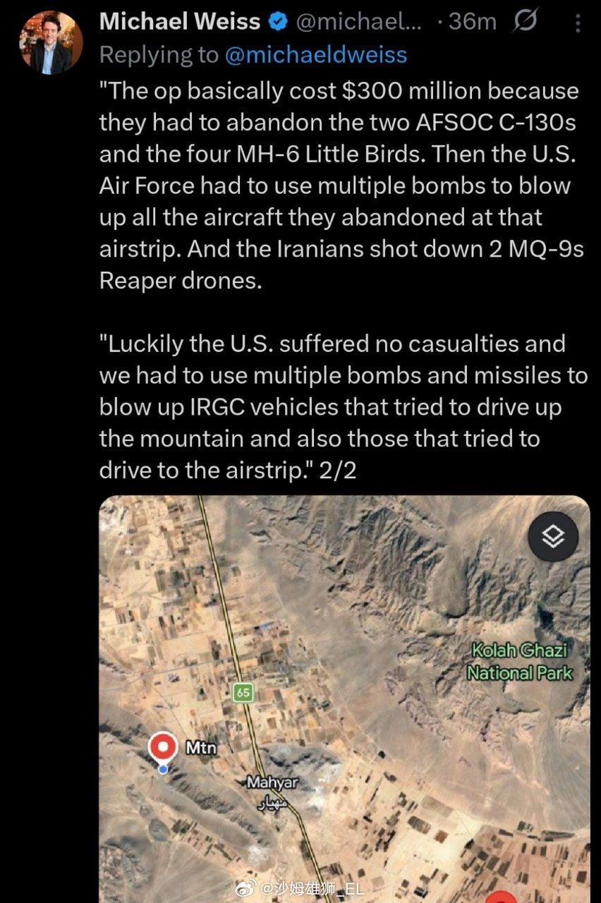

@沙姆雄狮_EL
发表于：2026-04-05 21:39
来源：微博
链接：https://m.weibo.cn/status/5284456438435020

美国官员说，昨晚今晨美军解救被击落的战斗机联队长的联合特战行动总计损失了8架飞机：2架C-130系列特战运输机、4架MH-6“小鸟”直升机（入场的载具全部损失）以及2架MQ-9无人机（被击落），总价值大约3亿美元。

此外，该官员声称美军轰炸了试图登山的“伊朗革命卫队车辆”。

---

