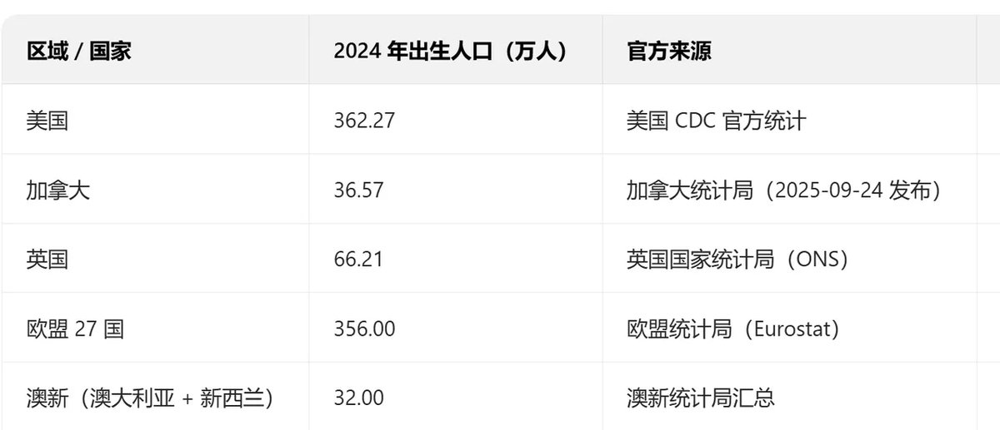

@深圳宁南山

发表于：2026-04-05 21:39

来源：微博

链接：https://m.weibo.cn/status/5284460951504804

2025年我国出生人口数量几十年来首次低于西方国家

1月19日国家统计局发布我国2025年出生人口下降到792万了，

792万也是1949年以来我国出生人口最低的一年。

我查询了2024年西方国家的情况，

欧盟27国+美国+加拿大+英国+澳新总人口是8.94亿人，而出生人口总共853.05万人；

2024年底我国人口14.0828亿人，出生人口是954万人，因此这一年暂时我国还领先。

但是我国2025年出生仅有792万人，虽然西方国家2025年全年统计数据还没出来，但他们出生人口波动不会太大，

所以可以判定2025年我国新生儿数量已经低于西方了，是其2024年出生人口总数的92.8%，也就是我国14亿人口出生人口还不如西方9亿人的出生人口多。

以上我还没有计算日本，韩国，像日本的心理一向是把我国当做最大敌人。

或者更确切的说，在过去的几十年，1962年（1961年是我国出生人口低谷，但我未能查到西方新生儿确切出生数据）以来我国新生儿人口一直都比西方多，但2025年成了转折点。

由于西方的生育率比我们高（欧盟2024年为1.37，美国2024年为1.599），

我国2020年七普生育率是1.3，现在普遍认为比这又低了不少，

因此预计未来我国和西方出生人口数量的差距还将越来越大。

2024年西方（欧盟+美加+英国+澳新）大约4.81万美元人均GDP（世界银行数据）是我国2024年人均GDP 1.344万美元的大约3.58倍，

而且现在西方出生人口数和生育率都已经高于我国，西方对我国开始呈现人均和人口总量的“双优势”。未来如果我国生育率不能得到提升，那么未来我国人口也将低于西方，西方仍将长期是这个星球实力最强大的团体。

除此之外，由于超低生育率，因此我国人口结构也会比更加老龄化，养老金，医保等各项支出负担更重，本土市场消费能力减弱，这会拖累我国长期经济增速，导致人均GDP追赶西方可能性降低。

---

