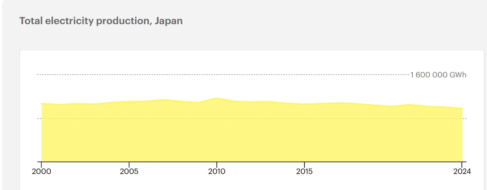
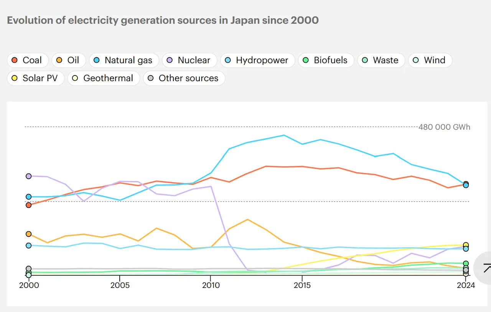

@深圳宁南山
发表于：2026-04-05 22:39
来源：微博
链接：https://m.weibo.cn/status/5284471939271142

从发电量看日本经济颓势，2024年日本发电量只有历史巅峰发电量的不到84%

查询了下日本的发电量情况，数据来自IEA（国际能源署），这是一个主要由发达国家组成的政府间国际组织。
日本的发电量在2000年为1.06781万亿度，在之后的多年内略有增长，
到2010年日本达到了历史发电量的最顶峰，这一年日本发电量为1.17087万亿度电。

但之后由于2011年311海啸的影响，日本核电发电量从2011年这一年开始出现直线下降，导致日本发电量开始出现了下降。

如下图，2011年海啸之后日本增加了天然气和煤电发电量，这在一定程度上弥补了核电发电量迅猛下降带来的发电量损失。
但是煤电发电量在2013年达到顶峰，
天然气发电量在2014年达到顶峰之后也开始走下坡路。
到2015年日本总发电量下降为1.058616万亿度，比2010年的巅峰下降了1100亿度以上。

到2022年发电量继续下降到1.017679万亿度。
到2024年日本发电量跌破一万亿度，只有9819.93亿度，
这是2010年历史最高峰发电量的83.87%，换言之比历史最高年份发电量下降了16.13%。

总之对于日本经济和未来发展前景，我觉得是不行的。

---

