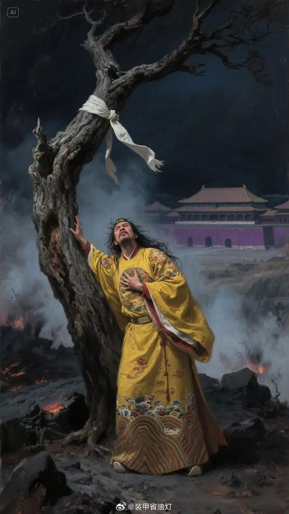
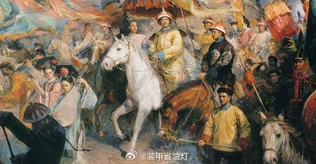

@装甲省油灯
发表于：2026-04-03 10:11
来源：微博
链接：https://m.weibo.cn/status/5283680694309077

很多人看到清代初期的制度，总觉得那是满洲八旗自己研究出来的。其实翻翻史书就会发现，清承明制这话一点不假，而且大清传承的还不是洪武永乐时代的制度，那套制度在嘉靖年间就大部分失能了，满清继承的恰恰是崇祯一朝君臣在大明最后的十几年里，为挣扎求生被逼着改出来的那一套制度，并在随后两百年里对其各种魔改，最终形成了大清特色封建主义。

在残酷的内外战争和天灾人祸的夹击下，崇祯一朝君臣对明代的各种制度都进行了剧烈变革。很多二百年来积压的弊政陋规，都是到了崇祯朝才真正开始想办法纠正。

有些人和团体就这样，不到生死攸关的时候，是不会想着做出任何改变的。

只是当时的大明已经积重难返，崇祯一朝的君臣显然也不是什么可以力挽狂澜的猛人团，再加上崇祯本身行事方式反复无常，并无成大事者应有的担当，叠加内外天灾人祸不断打断改革进程，导致大明这场最后的自救运动以失败告终。而政治向来是以成败论英雄，所以我们往往忽视了崇祯一朝君臣在明清制度变革中的承上启下作用。

单从财政上说，明末和清初有三个明显的前后衔接之处，其实源头都在崇祯时代。

第一个就是户部统管天下财政

受教科书影响，我们一直觉得自从隋唐确立三省六部制后，户部就是管理全国财政的部门，户部尚书相当于财政部长，统管全国收入和支出，但明代的情况远没有这么简单。大明的财政制度，可以说是古往今来少见的一朵大奇葩，从制度设计上就可以一窥朱元璋的统治思路。

朱元璋出身底层，极度忌惮权臣专权，尤其害怕户部掌控全国财权对皇帝权力形成威胁，因此在制度设计上刻意拆分财权，实行“事权与财权绑定”的原则，一个部门管什么事，就给对应的税金征收权与财源，避免户部在财政领域一家独大。

这就导致全国财权极度碎片化，中央各个部门都有自己的小金库，例如工部管工程建设、官营手工业，就给了匠班银、工程抽分、矿税分成的征收权；

太仆寺管马政，就给了马价银、桩朋银、草场租银的征收权；

光禄寺管宫廷膳食、祭祀，就给了对应地区的粮米、禽畜、物料的征收权；

刑部、都察院管司法，就给了罚没银、赎罪银的支配权。

兵部也是收入的大项，北京兵部和南京兵部还有差异，我们只说北京北部，也就是大明大多数时间的国防部，北京兵部的收入分由下属武库司、车驾司、职方司、武选司分别管理、各自存储，以武库司银库、车驾司银库为核心，形成“各司分掌、互不统属”的格局；

兵部的白银收入集中于武库司与车驾司，明后期峰值年收入约140-170万两，主要包括军罪赎锾银（罚没赎罪银），这是武库司核心财源，也是兵部最稳定的财政来源。还有驿传站银（驿递余银），这是车驾司核心财源。此外还有皂隶银、柴炭银、马价分成银，官营军器局的盈余收入、武举相关规费、武学学田租银等。

这套制度是典型的各部门管不同的事务，有不同的专项资金，专款专用啊但和现在的专款专用有明显差异

地方上的赋税征收上缴也很奇葩，明初地方上几乎没有行政经费，导致贪腐横生，哪怕想当清官，也得首先保证自己职能的正常运作，但不贪点钱当做行政经费，自己的职权就没法正常运作……

说回正题，地方上征收了赋税，按照税金类型分别解送中央各部、各边镇甚至临近州县，而不是统一交给户部，很多钱粮户部根本不过手，户部作为名义上的全国财政部，实际上除了自己直属的仓库外，也就剩个管理田赋和军屯籽粒粮，还有对各部门小金库的财政支出审计和预算的职能，导致原本统一的国家财政被拆分到十几个部门，形成了“一个朝廷，N个独立财政体系”的奇观，这在历朝历代绝无仅有。

这套制度在和平年代还能正常运行，一旦面临大事，需要互相协调时，就没有任何制度性的协调机制，只能依靠皇帝个人协调，无形中强化了皇权。

举个例子，嘉靖二十九年（1550年），蒙古土默特部俺答汗率兵突破古北口，兵临北京城下，史称“庚戌之变”。

此时明朝京营防务彻底废弛，在册兵力十四五万，实则多为老弱与权贵家奴，能战者不足万人；各地勤王军队星夜驰援，但均轻骑出发，未携带足够的粮草军械，抵达京师后连基本口粮都无法保障，士卒饥疲、军心涣散，战备完全陷入停滞。
 
当时的财政状况更是拉稀，户部太仓银库存银不足8万两，连京营官军的当月俸粮都无法发放，更别说满足守城、犒军、军械采购的巨额需求，户部尚书孙应奎“忧惧不知所出”，完全无力应对。
 
面对生死危机，户部第一时间向各拥有独立小金库的部门求援，却遭遇全面推诿：
 
太仆寺当时最富有，存银超过200万两，但带头抵制出钱，以“祖宗定制，常盈库银专备九边马政与驿传，非有御笔特旨，不得擅动”为由，拒绝调拨库中存银；

工部称节慎库存银为皇陵修缮、京营军械制造的专项备用金，“挪用于守城，日后陵工、军需无着，无人敢担其责”，仅愿象征性出银3万两；

光禄寺、兵部武库司、顺天府等部门，均以“专款专用、祖制不得违逆”为由，拒绝出钱，各部门互相甩锅，无一方愿意主动割肉，协调彻底陷入僵局。
 
户部不管用，还得皇帝老儿亲自出手，嘉靖帝得知这时候了还在扯皮，大为光火，直接绕过户部，亲自出手统筹。
 
首先带头表率，一向抠门的朱厚熜先动用自身私库，从内承运库（皇帝内帑）紧急调银10万两，先行拨付通州大营，用于犒赏勤王军队，为各部门定下强制出资的基调；

然后明确划定各部门的硬性出资额，且不接受任何讨价还价：太仆寺常盈库调银50万两，工部节慎库调银30万两，光禄寺调银10万两，兵部武库司调银15万两，南京户部协济银50万两；

同时下旨严令所有银两必须在3日内解赴通州大营，“迟误者，堂官逮系下狱，属官贬谪边地”。

面对皇帝的绝对权威，各部门不敢再有丝毫推诿，3日内全部银两足额解到。这场危机的化解，完全依赖于皇帝的个人意志与皇权的强制力，是明代碎片化财政体系下，最高效的跨部门协调模式，类似的例子在明代历史上屡见不鲜，如果皇帝太小或者太懒，一般就是内阁作为皇权代理人出面协调。

而税金征收上也很碎片化，由于各部门都有自己要收的税，最后都得基层政府落实，但是各部门互相之间掣肘扯皮的事儿也多，导致各部门的税金在基层征收时经常出Bug。例如负责全国马政的太仆寺，隶属关系上归兵部管，也有自己的小金库：常盈库，资金来源就是全国各地为马政缴纳的税金。

明初将马政压力分摊给了河北、河南、山东、山西等地的部分民户，让民户帮朝廷养马，养马的民户被称为马户，马户免除部分徭役，但要向朝廷定期缴纳马匹，这其实就是一种收实物税，收上来的马匹归太仆寺管理。

但是随着时代变化，特别是户籍黄册制度停摆之后，原有的实物税+徭役体系难以正常运转，马户大量逃亡，地方上就收不到马匹，但中央派下来的额定赋税还是要交马匹，这就很麻烦。所以央地之间达成协议，不用交马了，每年交对应数量的白银，中央拿着钱自己去买马。

这个过程一代代层累下来也很抽象，比如到了嘉靖时代，已经出现了“本色马每匹征银三十两，折色每匹征银二十四两”这样的离谱规定。

这其中“本色”是实物税，就是马匹牲畜粮食布匹一类的，“折色”是与实物税价值对应的绢帛银钱，但搞笑的是，马政本来征收马匹，马匹算是实物税，也就是本色。现在马匹征收不上来，改成收钱了，这本来就是本色改折色了，结果你又搞了个“折色征银”，把折色当成本色再折色一遍，意味着大明马政收税收的是“折色的折色”……搁这打折促销呢！

真是补丁摞着补丁，屎山代码一样的税制。我最初看的时候直接麻瓜了~

这些养马州县交的白银都送到了太仆寺，而明朝中期军费负担不大，导致太仆寺的银库存银一直用不掉，积攒了大量白银，最多时达到上千万两，这笔钱成了万历皇帝进行三大征的重要支撑，维护了帝国最后的威名。

户部最初职能更小，都不能直接管理国库，只有审计预算的权力，明初国库其实就是朱元璋设立的“内府十库”，兼具国库和皇帝内库的功能，也是各部门小金库之上唯一的国库。

朱老四迁都北京后，南方的漕粮北运要有地方储存，供应九边军饷、京师运转要有机构分派统计，于是在正统七年（1442年），在北京和通州逐渐形成了太仓库，划归户部管辖。专门存储户部征收的田赋折银、盐课、商税、关税等国家财政收入，用于军费、官俸、赈灾等公共开支，是大明法定意义上的国库。

而在此之前的正统元年（1436年）金花银改革，朝廷正式将江南等省份的400万石秋粮折银100万两，定为岁额，除少量用于武官俸禄外，绝大部分全部解入内承运库，成为皇帝的专属私财。至此，内帑从国家财政中独立出来，拥有了法定的、稳定的收入来源，后世被视为大明续命稻草的内帑才正式登上历史舞台。

此后国家公共财政收入，除了各部门的小金库外，统一归集到户部太仓库（纯国库），皇室专属收入归集到内承运库（内帑），二者完成了彻底的制度化分离。

有个著名论点认为“下西洋是因为钱进了皇帝内库，所以文官不支持”，这完全是对明初财政制度一无所知，洪武朝、永乐朝所有的收入都进皇帝内库，根本没有国家财政和皇帝私人金库的区别，啥钱都是皇帝的，整个大明就是老朱家的大田庄，太仓设立并归户部管辖，要到英宗正统年间了，那时候下西洋早就不搞了。

我们常说明朝一年财政收入四百万两白银，指的就是太仓库的每年折银收入。这也是明朝的户部开始统管全国财政的开始，算是系统运行中自动打的补丁。

实际上每年太仓不是只收这些，明王朝的收入也不止这些。

嘉靖年间太仓岁入约二百万两，到万历六年增至四百五十余万两，万历四十六年下降至三百八十九万两，而当年仅边饷支出就高达三百八十一万两，这还只是北方边军的军饷，中原和南方驻军的军饷都没往里算。

天启、崇祯年间，由于内乱和外战，太仓岁入更是跌到二三百万两。但这绝不意味着明朝财政崩溃了，实际上崇祯年间全国田赋加派三饷后，仅户部两个管新收兵饷的司一年就能收一千五百万两白银，额定两千万，因灾荒兵祸蠲免了五百万。

要知道辽饷开征前，户部每年经手的白银只有太仓库那四百万两，这个数字就是《明朝那些事儿》等著作中“大明一年财政收入仅四百万两白银”的由来。可稍动脑筋就知道不可能，一年四百万两银子连发全国士兵的军饷都不够，还没算官员俸禄，就这点钱怎么可能维持正常国家机器的运转？

事实是，归属户部管辖的钱粮在天启崇祯年间直接翻了好几倍。在这个客观形势下，户部几乎是被迫拿到了国家财政问题上的话语权。清朝入关后，多尔衮和顺治很自然地确立了户部统管天下财政的制度，到康熙年间彻底定型。

崇祯皇帝即位初年就要求户部重新编纂各省府县的赋役全书，作为征收钱粮的基础。这件事因为内外战争没能做成，后来是顺治皇帝时代做成的。整体税收规模上，辽饷属于在正赋基础上多征了一千万两白银，崇祯朝剿饷+练饷再加一千万两。清朝保留了辽饷的这一千万，取消了崇祯加的剿饷练饷那一千万。

关于“三饷”，有几个具体数字值得一说。辽饷始征于万历四十六年，到四十八年止，全国除贵州等少数地区外，平均每亩加征银九厘，共五百二十万零六十二两。

崇祯四年，田课由九厘提高到一分二厘，派银六百六十七万余两，实征五百二十二万余两，加上关税、盐课及杂项，共征银七百四十万八千二百九十八两。

剿饷二百八十万两，原议只征一年，实际从崇祯十年延续到十三年才被迫停止。

练饷七百三十余万两，是崇祯十二年根据杨嗣昌提议征派的。清朝入关后，多尔衮曾下诏蠲免三饷，但辽饷中的九厘银不久就被编入《赋役全书》成为正式田赋份额，终清一代再未蠲除，直到民国时代，才逐渐改变。

搞笑的是，辽饷最初的征收本就是为了消灭女真设立的特别税，按理说是什么时候女真政权灭了就不收了，结果却被女真政权完整继承下来，成了正税，直到大清亡了才不收了……

嗯，这辽饷也确实是女真政权灭了就不收了，真是地狱笑话。

第二条重大区别就是银钱并行，铸钱辅助白银流通

关于明代货币，大家往往注意到前期的纸币大明宝钞和后期的白银货币，但中国古代使用最多、最常见的货币其实是铜钱。作为一个稳定统治长城以南长达276年的王朝，大明的铜钱货币发行量在历代大一统王朝里可以算倒数第一。

明初也铸造铜钱，但由于金银铜等贵金属匮乏导致通货紧缩，明廷于洪武八年开始大量发行宝钞，确立“钞为主、钱为辅”的货币体系，但这种缺乏准备金的宝钞老百姓根本不认，为了维护宝钞的流通，明朝从洪武年间就开始限制民间用铜钱，这导致大明是唯一一个奇葩到禁止自己铸造的洪武、永乐通宝交易的王朝。禁钱力度随宝钞贬值程度不断升级，最终随宝钞体系崩溃而彻底失效。

隔壁日本的织田家把永乐通宝拿来当自己的家纹，大明自己却限制使用。导致民间商品经济长期缺乏货币支撑，交易用的基本都是私铸恶钱和前朝旧钱，甚至以物易物。
 
洪武朝初期对铜钱还是分级限制：法定宝钞一贯=铜钱1000文=白银1两，规定商税、课程征收实行“钱三钞七”，100文以下的小额交易只许用铜钱，100文以上必须优先使用宝钞，从交易场景上限制铜钱的使用范围。

同时明廷也在收缩铸钱规模，宝钞发行当年，立即关停中央宝源局，次年裁撤福建宝泉局，洪武十年关停全国所有行省宝泉局，彻底停止官方铸钱，从供给端掐断铜钱增量。

从洪武二十二年增发10-50文小面额宝钞，试图彻底替代铜钱的小额流通功能，结果老百姓还是不认；最后洪武大帝祭出行政手段，于洪武二十七年（1394年）颁布最严厉的“禁钱令”，正式下令禁止民间一切铜钱流通，要求百姓限期将手中铜钱全部上缴官府兑换宝钞，违者以重罪论处，甚至持有铜钱都属违法。至此，铜钱在官方制度层面彻底退出流通，明朝进入纯纸币流通阶段。
 
到了永乐宣德时代，铜钱禁令进入了执行最严格的阶段，哪怕官方有铸钱行为，也完全不允许国内流通，虽开铸永乐通宝，宣德通宝等货币，但铸钱几乎全部用于郑和下西洋的海外赏赐、朝贡贸易，国内严禁流通，民间私藏、使用铜钱均会被治罪。

正统朝之后，禁令逐渐松弛，直至彻底失效，正统元年（1436年），明英宗正式“弛用银之禁”，此时白银大量涌入国内，成为市场交易的重要媒介，官方不得不承认白银的合法流通地位，导致宝钞急剧贬值，但白银数量还是少，而且价值高，在小额交易中很不方便，社会急需信用足够的小额货币作为流通中介，因此朝廷逐步放松铜钱禁令，允许唐宋旧钱、本朝铸钱与白银、宝钞并行流通，民间交易重新大规模使用铜钱；

此后成化、弘治年间，虽有官员多次提议恢复宝钞、重新限制铜钱，但均未落地，铜钱重新成为民间主流小额流通货币，但官方铸造铜钱却没有跟上，主要还是缺铜，整个正统-正德时代， 86年的时间里，只有明孝宗弘治年间少量铸造铜钱，其他时候大明几乎没有新增加的铜钱进入市场，直到嘉靖-万历时代金背钱大量铸造，才缓解了大明的钱荒。

到了16世纪中期以后，整个社会已经形成了白银-铜钱流通的货币体系，但官方的铸钱还是不能满足所需，民间私铸行为屡禁不止。

白银成为流通货币其实是好事，但有个重大隐患，就是中国本土白银产量也很低，一旦白银流入数量不足，整个国家就会陷入通货紧缩，引发经济萧条。明亡清兴的同时，欧洲在打三十年战争，日本经历丰臣-德川易代，国际白银贸易波动剧烈，这不是巧合。

面对全国性的内忧外患，崇祯君臣不得不找新的生财之道。其中一条就是铸铜钱。在天启崇祯时代，到处缺钱，于是衍生出铸钱收息的铸币税办法，而且把权力下放到各边镇，让各地自己铸钱发军饷。但恶果是迅速导致了私铸铜钱的公开化，导致大量的劣质铜钱涌入市场，严重扰乱了经济秩序，

借着张居正改革的遗产，明朝的税收和财政支出也全面货币化，在崇祯时代，随着大规模战争和赈灾带来的巨额财政支出，在整个社会确立了白银-铜钱的流通体系。

整个大明折腾了两百多年没搞明白的货币体系，终于在崇祯时代被拨乱反正了。

清朝入关后延续了这一货币化政策，没有因为贵金属问题就想朱元璋那样脑洞大开的走禁钱路线，而是非常重视铜钱铸造，没有铜就想办法找铜。除了从云南挖矿铸钱外，从日本进口也是重要的渠道。铜矿贸易也大大推动了清廷在西南的改土归流。当时中国最大的铜矿是云南滇铜，在当地土司手里。

清朝大铸制钱，大量需铜，商人们开矿贩铜大有利润，于是大量商人进入土司地盘，成立集市和商站。这些商人都是编户齐民的汉人，清政府顺理成章地在这些商站集市设立行政机构管理他们，商人也十分欢迎，他们需要清政府保护自己不被地头蛇吃干抹净，也就成了改土归流的社会基础

正是靠白银和铜钱两种货币互相补充，清朝才能管理比明朝庞大数倍的国民经济体系。而这些成就都可以追溯到崇祯君臣死中求活的种种努力。

第三个区别是央地划分，起运与存留的比例。

在明朝，地方州县收上来的赋税，有相当比例留在本地，称为“存留”，不往外地起运。而清代的起运比例明显更高。明代地方存留比例大概在百分之三十到四十，清代是百分之二十到三十。

而且明朝在铸钱上也搞得很奇怪。北京南京各有一个大的铸币单位，宝泉局和宝源局，工部和户部各管一个，两边铸出来的钱样式居然不统一，南钱和北钱以山东兖州府为界，越界了就不用，泾渭分明。万历末年，时任户部郎官的杨嗣昌曾经估计南京铸钱成本只有北京九分之一，也不知道是南边偷工减料还是北边的钱炉、钱范、工匠是金子做的。

天启元年，户部新设了宝泉局，与工部宝源局并立，钱背加铸“户”字以作区别，工部那边也铸“工”字，两家互相竞争又互相掣肘。

清代地方存留比例比明代低，除了清代地方不用养宗藩、实物税减少方便解运之外，还有个重要原因就是学习崇祯皇帝的做法，大规模征收地方上的各种不在田赋正供之内的杂项税费，归入中央财政。

在崇祯朝，咸阳木税、潼关杂税、浙之黄鱼税、闽之沙埕木税、海澄杂税、山东之泰山香税、粤东之南雄桥税等等，这些地方上收着自己过日子用的杂项税，都被户部或全部、或取一半拿走了当辽饷用。

这个趋势一直延续到康熙初年，清廷在应付内外战争时也是这么做的：大量裁减官吏岗位、裁减地方办公经费。比如顺治十三年，曾经一口气裁掉了地方经费七十五万两，全拿去当军饷。

总的来说，明清时期实物财政向货币财政的演变非常明显，明代晚期，也就是天启崇祯时代，最终确定了以货币为统一的财政核算单位，而且最终确立了以银两为主体的财政收入和支出体制，大清延续了这一国策并进一步完善，最终确立了后世三百年的社会经济基础。

现代人看待欧洲崛起，往往看重意大利战争以来，欧洲多国并立，军事技术和国家动员力在频繁战争中互相内卷，快速迭代进步。其实中国也是这样。

自萨尔浒到甲申，明王朝一直以财政总动员的规模去支撑辽东战事，也在不断的内外战败和失利中逐步调整、纠错、进步，最后把国初那个原始而粗糙的“小政府”体制演化成了一个有相当动员能力、能做成一些事情的“大政府”国家。

当然不能说崇祯君臣有什么经天纬地之才，但乱世的筛选机制残酷而高效，社会和制度会向国战体制趋同演化，并不以君主的个人意向或才具为转移。

萨尔浒时明朝东拼西凑的11万军队，因为准备不足，被八旗砍瓜切菜一样在几天内干掉，当时杨镐和诸位将领上疏要求准备充分了再打，朝廷竟然连大维持大军在边境对峙半年的粮饷都拿不出来，只能逼着他们去打，结果东拼西凑的野战军在不到半个月的时间里彻底报销，开启了明末数十年乱世的潘多拉魔盒。

而到了二十多年后的松锦之战，明朝虽然财政依然拉稀，但相比万历年间已经有了大幅改观，甚至可以维持13万大军在辽西走廊进行一年多的战事，甚至能让满洲八旗贵族在长期的拉锯战中普遍产生畏难情绪，能打得八旗汉军哀呼“彼兵如狼，我兵如羊，岂可敌也”。

可见几十年战争下来，明方无论军队战斗力还是国家动员力，都有了极大提升。我们之前受结果影响先入为主，把崇祯朝看作一个失败再失败的时代，但重新捋一遍不难发现，崇祯君臣虽然奇葩，左右互搏，互相拆台背刺的事儿都干了不少，但还是做成了一些事情的。无非是明朝这台古旧的统治机器已经延续了两百七十六年，无论怎么修修补补都积重难返。只要另起炉灶，换一批人从头开始，哪怕用同样的制度，一样能发挥出更大的威力。

总的来说，清代的制度，除了八旗国族，绝大多数都是从明朝，尤其是明末演化出来的。论对后世制度的影响，崇祯朝大概是洪武朝开国肇基和永乐朝魔改之后，整个明朝最重要的时代了。崇祯本人的所作所为都更像一个清朝而非明朝的皇帝，从正面和负面意义上都是这样。

甚至可以说，正是因为明朝底子够厚，有一定纠错能力，但又没强到足以逆天改命，再加上崇祯君臣的神助攻，才导致了满清能顺利接手明朝的统治机器。

清朝取代明朝，固然是大明内外失血下，被高效的满洲战争机器军事征服的结果，但在制度层面，清朝继承和发展的是明朝在生死存亡之际被迫打磨出来的那套的战时体制，再融合进自己一贯使用的八旗战时体制，让两套战时体制配合运转，才是八旗迅速征服天下的重要原因。

一个王朝的遗产，并不总是由它的成功来定义的。

---

