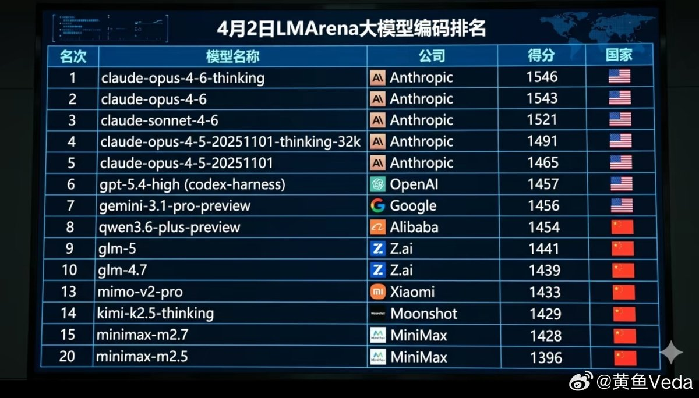
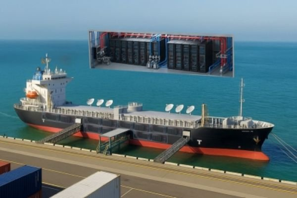
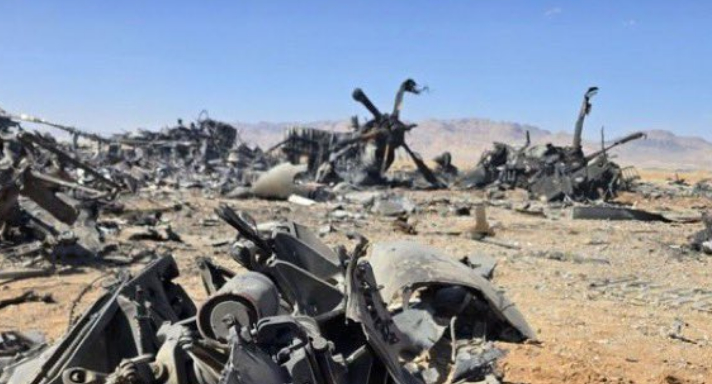
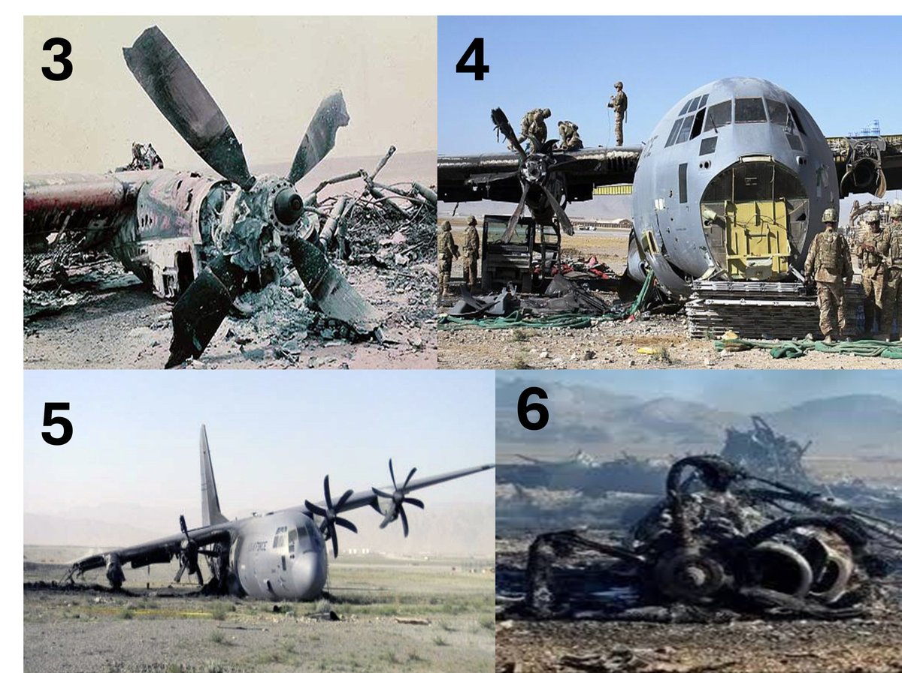
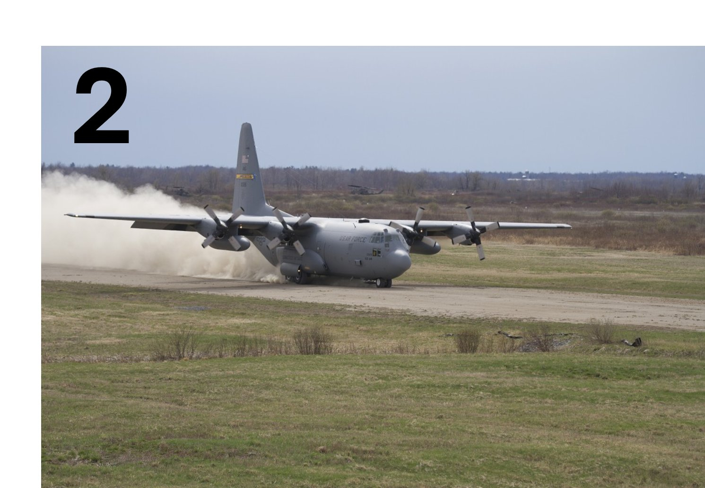
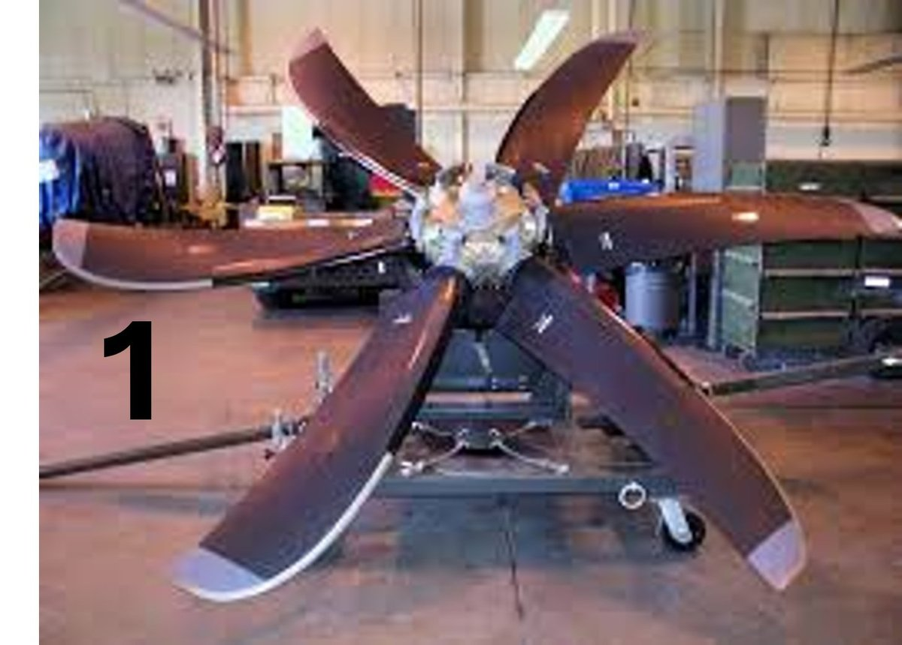
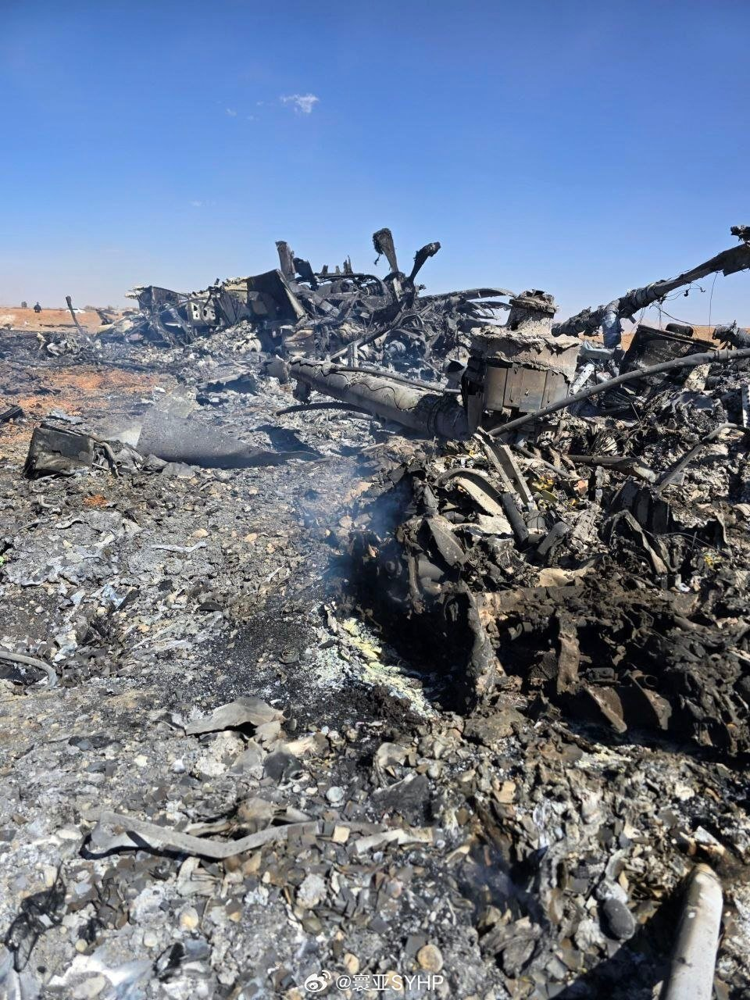
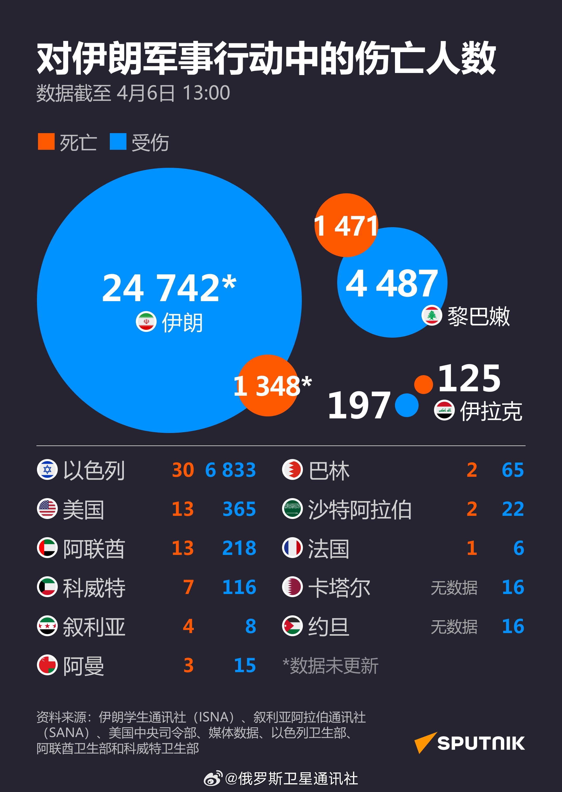
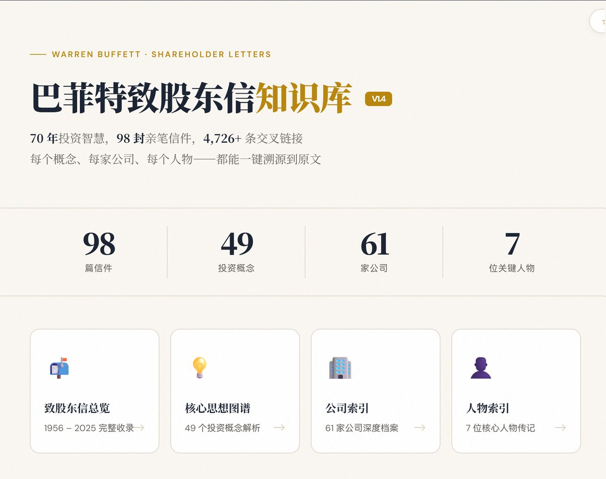
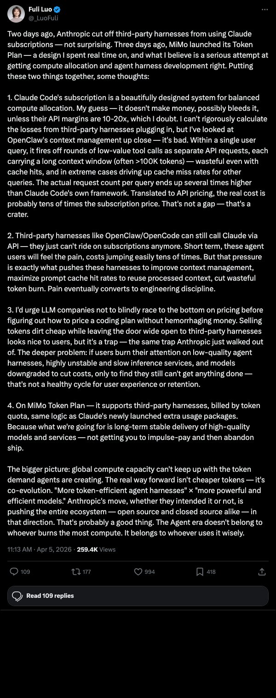

# 2026-04-07

## 1

@天玑-无极领域

发表于：2026-04-05 13:49

来源：微博

链接：https://m.weibo.cn/status/5284460369021281

优思益为什么会翻车？

在国外注册皮包公司，卖奖项，找名人背书，包装成洋品牌.... 这些都不重要。

只要这次没爆出来，优思益依然是国外知名品牌，依然有顶级网红带货，依然售价很高，依然有无数九菜买。

翻车是因为被曝光了。

股东太多，员工太多，利益难免分布不均，难免会有内部冲突，这些都是潜在隐患，随便一个普通员工，如果怀恨在心，暗中收集证据，就足够搞死一家公司。

避免翻车只有三种方法：

A、做正经生意。

B、初期就要做好风控，秘密只能给必要的信得过的人知道。

C、洗白。用偏门方法起步，后期快速洗白，以优思益为例，来一手国内收购，左手倒右手，就会成为民族之光。

## 2

@黄鱼Veda

发表于：2026-04-04 17:32

来源：微博

链接：https://m.weibo.cn/status/5284153999229269

大模型编程能力排名，

Claude断崖领先。

看到国旗分布很恐怖，AI现在就是中国和美国之争。

---

## 3

@刘晓光Savvy

发表于：2026-04-06 13:34

来源：微博

链接：https://m.weibo.cn/status/5284703590683177

是性格决定命运，还是命运决定性格。

还是Paul Piff的大富翁实验，找100多个陌生人玩大富翁，并且开场就设计了作弊机制，扔硬币决定谁可以作弊，幸运儿可以拿到更多的收益，双倍起始资金，双倍回报率等等。

然后实验设计者发现：

几乎所有的获胜者，到最后的性格，都呈现出高度的趋同性：

侃侃而谈，健谈，自信，锐利，信心十足，举手投足不自觉的带有上位者的风格气质。

事后采访时候，这些富玩家也表示，自己平时的性格没这么有侵略性，感觉像是被游戏操纵了一样，随着不断的获胜，优势加大，自然而然的就开始颐指气使了起来。

除了这种自信，侵略性的性格，还有一个性格：

贪婪和不守规矩。

比特币大亨孙宇晨被同学回忆时候，说他们一起去吃椰子鸡，孙会抢先一步把所有的好肉都捞到自己碗里，把不好的肉留给别人。

心理学上有过类似的实验，在试验场地明确反复声明了，这些饮料是留给小朋友的，成年人绝对禁止拿取。

然后找了一批2小时没喝水口渴的成年人过来。

然后发现：

富裕的成年人，偷饮料的几率，是普通人的2-3倍以上。

从这些实验来看，性格决定命运好像不太准确，

命运决定了性格，几乎所有的成功人士，性格都呈现出高度的趋同化。

## 4

@机工战略

发表于：2026-04-06 17:34

来源：微博

链接：https://m.weibo.cn/status/5284760817500965

商船三井、日立製作所、日立系统近日联合宣布，将共同开发浮体式数据中心——把退役旧船改造成海上AI算力设施。

消息本身不大，但背后的逻辑值得认真看。

AI算力的需求扩张正在把陆地数据中心逼到极限。SemiAnalysis最新数据显示，H100一年期GPU租金从去年10月的1.7美元/小时涨到了今年3月的2.35美元，五个月涨了40%。Blackwell新卡的部署订单已经排到2026年8-9月，有人租了算力集群再转手倒卖，"像摩纳哥大奖赛期间转租公寓"。这轮紧缺的根本原因不是芯片产能，而是电力和冷却——GPU集群的用电密度是传统服务器的10倍以上，许多城市的电网根本撑不住。

旧船的逻辑就在这里。海上数据中心直接用海水冷却，冷却成本大幅压缩；位置可以灵活调配，哪里有便宜电力哪里停；土地成本为零。微软2018年做过海底数据中心实验（Project Natick），在苏格兰近海运行两年，故障率只有陆地数据中心的八分之一。商船三井的方案是浮在水面上，工程难度更低，商业落地更近。

两个问题同时解决：AI基础设施的扩张瓶颈，以及航运业大量退役船舶的资产处置难题。全球集装箱和散货船队老龄化严重，超过20年船龄的船通常只能拆解，残值极低。如果改造路径成立，这批资产的变现逻辑完全重写。

这个组合对中国有直接的参考意义。中远海运是全球最大的航运集团之一，拥有庞大的船队，老旧船舶处置压力长期存在；国内三大云厂商的算力扩张需求每年以数百亿计。商船三井能想到的路，中远海运+阿里云/腾讯云在逻辑上完全可以复制。

当然挑战也是真实的：海上运维成本高、海洋腐蚀加速设备老化、海底光缆接入等都是工程难题。但方向已经打开了——AI时代的基础设施边界，正在突破陆地。

---

## 5

@包容万物恒河水

发表于：2026-04-06 08:35

来源：微博

链接：https://m.weibo.cn/status/5284622583204792

🔻从现场残骸来看，美军使用的并非标准的 C-130（配备四叶钢制螺旋桨），而是MC-130J，由美国空军特种作战司令部用于秘密行动。

🔻因为MC-130J 采用六叶 Dowty R391 复合材料螺旋桨，这些桨叶由复合材料制成，特别采用了碳纤维结构。

🔻很难想象 MC-130J 会陷在沙子跑道上，这款飞机本来就是设计在泥土、沼泽、积雪和碎石中强行起降的，“机械故障”也不大可能两架同时都故障吧？

🔻更可能的情况是：飞机在进入伊朗领空时遭受攻击，或者是在伊斯法罕农业旧跑道临时设立的快速加油点（该地点“恰好”靠近疑似铀储存区）着陆期间，遭受伊朗地面部队袭击并受损。

🔻从我们的角度看，对伊朗发动地面战争将代价惨重，并将在战术、作战和战略层面遭遇全面失败。

🔻从特朗普团伙的角度看，飞机能下去，增援飞机能接走人，说明82师冲伊斯法罕的计划是具备可行性的。

🔻美军：？

\#特朗普暗示最后通牒再延迟1天\#\#伊朗打击以色列能源设施\#\#中东现场直击\#\#海外新鲜事\#

---

## 6

@理记

发表于：2026-04-04 08:26

来源：微博

链接：https://m.weibo.cn/status/5284016590685186

该吃晚餐了。

这段时间也看到了张雪的故事，非常励志，很喜欢这个人直来直去的性格。

有句话想跟重庆方面说，我要是你们，除了给张雪工厂用地和贷款支持外，你们必须派俩人，死死的把他看管好了，让他餐餐控糖。

张雪今年39岁，面色已经到了这种程度，明显严重臃肿的碳水脸糖化脸，烟➕酒➕重口味高糖饮食环境，再这样下去是绝对扛不住的。

而且现在身边都是这样的人，人们经常不以为然，都不知道啥是健康肤色了。

张雪峰老师的视频看的越来越多，我越真心觉得遗憾，他曾在直播间里现场表演连吃了九个和路雪雪糕，长期高糖高油高盐高脂肪高胆固醇饮食，其实是导致猝死的核心基础原因。

再累，再熬夜，不可能把血管累堵了。但是累和熬夜，可以让长期高糖饮食导致堵塞的血管，瞬间破裂。

苏州工业园区失去了张雪峰老师，我们也失去了一个鲜活有趣的人。

重庆一定要保护好张雪。

死死管住！

---

## 7

@神嘛事儿

发表于：2026-04-06 14:35

来源：微博

链接：https://m.weibo.cn/status/5284712394522632

实话实说啊，写微博，纯文字的，是目前唯一的最低成本的，保留大家仅有的不多的天然智力的方法，我从不看抖音也不看短视频，要自己一个字一个字的写，另外如果大家有兴趣的话可以用一张纸手写一下，你们会有震惊的发现就是你有可能写不出来字，一定要远离流数据，新一代的年轻人智商已经大不如前，这是事实 

另外就是多看真书，一页一页手翻的，不信大家去马上搞一本看看，你会发现你无法控制自己的眼球精确对焦

## 8

@寰亚SYHP

发表于：2026-04-06 17:35

来源：微博

链接：https://m.weibo.cn/status/5284753365533812

个人意见：\#美军夺取伊朗浓缩铀计划失败\#

昨天，美军在伊朗伊斯法罕损失2架C-130运输机和4架直升机。这不是为了营救美国飞行员，而是夺取伊朗浓缩铀，但是失败了。只是至今不承认而已，相信未来会有披露的

美军以营救飞行员为名，出动了三角洲部队、联合特种作战、特种作战部队和ST-6联合开展的高风险行动，目的就是为了夺取伊朗的浓缩铀。因此需要如此多的行动人员、支援力量、飞机等等。这原本就是一次这样的行动，但行动失败了。

昨天凌晨，有人在伊朗释放消息称，在恰哈马哈勒-巴赫蒂亚里省库赫达什特县发现美军飞行员。引发大批伊朗民众半夜驾车前往寻找，有多条视频显示。美军战机和直升机也出现在那里，并袭击了伊朗巴斯基民兵组织及民众，导致9人死亡。

这是声东击西，故意释放的假消息。之所以那样做，实际上营救美军飞行员和同时夺取伊朗浓缩铀创造条件。美军飞行员是在科吉卢耶-博韦艾哈迈德省获救的，两地相隔数百公里。

在伊朗南部的伊斯法罕为什么美军会出现两架C-130运输机以及多架直升机？要知道，距离美国飞行员的位置也有几百公里。开始所有人都以为是为了营救美国飞行员，实际上不是。是为了夺取伊朗的浓缩铀。美军的运输机和直升机遭到伊朗袭击，夺取浓缩铀计划失败。飞机受损无法起飞，被迫炸毁掉。

---

## 9

@俄罗斯卫星通讯社

发表于：2026-04-06 17:35

来源：微博

链接：https://m.weibo.cn/status/5284756733561711

【信息图：\#针对伊朗的军事行动伤亡人数\#】据俄罗斯卫星通讯社最新信息图数据，截至北京时间4月6日13时00分，伊朗境内受伤人数已超2.4万人，黎巴嫩则累计4487人受伤、1471人死亡。\#美以伊最新局势\#\#中东局势彻底失控\# 

此外，以色列、阿联酋、伊拉克及地区其他国家也出现人员伤亡，反映出危机在多条战线持续升级。

---

## 10

@蚁工厂

发表于：2026-04-06 17:35

来源：微博

链接：https://m.weibo.cn/status/5284756498940440

巴菲特知识库

buffett-letters-eir.pages.dev/

应该可以拿来蒸馏一个巴菲特理财顾问了~

---

## 11

@i陆三金

发表于：2026-04-06 11:35

来源：微博

链接：https://m.weibo.cn/status/5284664512087402

OpenClaw 创始人 Peter 又认证了一圈国产模型

---

## 12

@宝玉xp

发表于：2026-04-06 12:35

来源：微博

链接：https://m.weibo.cn/status/5284682063152984

小米 MiMo 团队负责人罗福莉：

全球算力跟不上 Agent 时代的 Token 消耗，出路不是更便宜的 Token，而是更省 Token 的框架和更高效的模型共同进化。

一个技术细节：

OpenClaw 的上下文管理做得非常糟糕。一个用户请求会触发多轮低价值的工具调用，每次都带着超过 10 万 Token 的长上下文窗口，实际请求次数是 Claude Code 自身框架的好几倍。换算成 API 价格，真实成本可能是订阅价的几十倍。

罗福莉提了两个观点：

第一，短期阵痛反而是好事。第三方框架被迫走 API 付费后，成本压力会倒逼它们改进上下文管理、提高 prompt 缓存命中率、减少无效 Token 消耗。

第二，呼吁其他大模型公司不要在没想清楚定价模型之前盲目打价格战。低价卖 Token 的同时对第三方框架大开门户，看着对用户友好，实际是个陷阱，Anthropic 刚从这个坑里爬出来。

---

## 13

@带你去苏联

发表于：2026-04-06 13:36

来源：微博

链接：https://m.weibo.cn/status/5284694943862822

现在各个国家的物价都在暴涨，俄罗斯就不说了，已经涨疯了，就连乌兹别克斯坦这种人均收入三千的地方，物价堪比北上深，甚至更贵。随便一个连锁酒店，温德姆、Holiday inn这种，就没有低于1000一晚的，环境好点的餐厅，人均也要200左右，酒店楼下小酒吧，40ml的杰克丹尼要近100，真的很夸张。

## 14

@海上一浪花

发表于：2026-04-06 22:36

来源：微博

链接：https://m.weibo.cn/status/5284592902996914

上海旗袍

上海的商业月份牌是在1910前后出现的，在1930年代前后趋于鼎盛；而起源于满族袍服的旗袍也刚好在此时改良成型。也就是说，商业月份牌发展成熟的阶段，也正是旗袍兴起的时候，所以，作为当时最流行的服装，旗袍得以大量地出现在这些具有广告效应的月份牌里，并被今天的人们所观赏：那些妖冶的女人们，当她们刁着时髦的过滤嘴香烟，穿着各式旗袍向人们推销香烟、肥皂、花露水、婴儿代乳粉以及一切可以推销的东西时，并没有想到半个世纪后她们本身会构成一个时代的标记。

据相关文献记载：“旗袍源于清代的旗人之袍，是贵族的衣饰；现代意义的旗袍，诞生于20世纪初叶，盛行于三四十年代，一度成为中国女性服装的代表。行家把20世纪20年代看作旗袍流行的起点，30年代达到顶峰状态，很快从发源地上海风靡至全国各地。”

作为旗袍的发祥地，上海女人自是最能体会旗袍的精妙。所以，当时的上海女人们常将裁缝带进电影院，让他们学习新片里出现的旗袍新款，以便能够快速准确地炮制出来。

传统旗袍的特点是衣裳连体，随体收腰，下摆开衩，凸显曲线轮廓。有收领、收襟、半袖、短袖、齐肩等多种样式，颜色更是五彩缤纷，面料多以锦缎为主，给人富贵艳丽，柔中含挺的感觉。有人把旗袍比喻成会跳舞的官窑瓷器，无论大家闺秀还是小家碧玉，只要穿上它，便显出高贵典雅来。

直至1949年初，旗袍还是中国女人最主要的服装之一。但是，随着人民解放军的进城，市民们的审美观忽然变了，那套南征北战的黄色军装成为了最时髦的"时装"。此后的旗袍风尚江河日下，并渐渐被一系列具有革命色彩的服装所取代：最初是那种双排扣的"列宁装"；后来是男式背带工装裤和格子衬衣；再后来是一种叫做"布拉吉"的苏联式连衣裙成为年轻女性的最爱。到了1959年，也就是所谓“三年困难”时期，由于粮食、棉花大量减产，纺织品必须凭票购买，人们的着装开始以耐磨耐脏为标准，于是灰、黑、蓝，成为了整个中国的流行色。

接下来是一系列的政治运动，旗袍也在这一系列的政治运动中寿终正寝了。

我曾认识一位上海旗袍界的老法师，他说：“这女同志穿旗袍，讲究的是九翘三弯。不过现代女同志都爱减肥，什么九翘三弯都没了。”\#历史上的浪花\#\#微博兴趣创作计划\#

---

## 15

@包容万物恒河水

发表于：2026-04-06 20:15

来源：微博

链接：https://m.weibo.cn/status/5284557515653823

🔻ABC 新闻称：2 架 HC-130J 救援飞机和 4 架 MH-6“小鸟”直升机被摧毁。

🔻美军中央司令部终于更新的通稿称：“美国成功从伊朗境内一架被击落的 F-15E 战斗机中救出两名机组人员，并继续进行军事打击。两名机组人员在不同的飞行任务中均安全返回。4月2日，一架飞机在战斗中被击落。”

\#特朗普透露美军营救飞行员细节\#\#伊朗称美军营救飞行员任务失败\#\#海外新鲜事\#\#中东现场直击\#

---

## 16

@牧星观海天

发表于：2026-04-05 12:57

来源：微博

链接：https://m.weibo.cn/status/5284447076491867

美国一博主援引美国军方官员的消息，发布的美军营救F-15E武器操作官的行动细节：

“左侧山顶区域是武器系统官的藏身之处，他从西北方向约5英里处弹射逃生。右侧区域是临时跑道，两架C-130运输机和四架MH-6“小鸟”直升机在此降落。

“一架MH-6直升机飞往山顶区域，救出了武器系统官，并将他带回跑道。由于两架C-130的前起落架陷进了土里，几个小时后，美军不得不调来三架空军特种作战司令部(AFSOC)的Dash-8飞机，将获救的F-15E武器操作官和参与行动的约100名人员接走。”

“这次行动基本上耗资3亿美元，因为他们不得不放弃两架C-130运输机和4架MH-6直升机。”随后，美国空军不得不动用多枚炸弹摧毁遗弃在该简易机场的所有飞机，伊朗方面还击落了两架MQ-9“死神”无人机。

“幸运的是，美方没有人员伤亡。我们不得不动用多枚炸弹和导弹摧毁试图爬上山坡的伊朗伊斯兰革命卫队车辆，以及那些试图驶向简易机场的车辆。”\#美伊以冲突\#\#热点观点\#\#伊媒称多名美军士兵在营救行动中身亡\#

---

## 17

@刘晓光Savvy

发表于：2026-04-06 14:36

来源：微博

链接：https://m.weibo.cn/status/5284710603293822

认知决定不了财富，性格也决定不了命运，反而是财富反过来决定了认知，性格。

那么什么决定了财富？

运气。

命运二字，命和运有显著的区别。

命更多是你的原生家庭，父母，家族资源，你的基因，先天注定的健康。

运则更多的是后天的待遇和经历。

命基本是先天注定的没有什么能改变的空间。

但是运势就完全不一样。

一个人的运势，和玄学里说的，戴什么手串，信什么宗教仪式完全不一样。

我认为一个人至少90%以上的运势，是由他的人际关系社会交往情况决定的。

人不是自然界动物，而是社会化动物，外界的刮风下雨打猎觅食，不能构成你的运势。

你遇到的人，多少人，哪些人，这些人的人品，质量，层次，他们所带来的变化，机会，基本上构成了你一生中90%的运势。

包括所谓的命，如果你能够通过熟人介绍到一位靠谱的医生，可能不花什么太多钱，就解决了困扰你一生的疾病大难题。

所以想要改善你的运势，最简单也是最立竿见影的方法，就是想办法改善你的人际关系。

而想要改善你的人际关系，第一步就是真正树立对「人际关系」的正确认知。

绝大部分人会认为，只有真心来往的朋友，才是有价值的，才是值得的，才是有必要的。

不是真心来往的朋友，浅层关系，会过于虚伪，甚至恶心，让人产生疲累，不想来往。

这种认知是十分肤浅的，狭隘的，甚至对自己的命运十分有害的。

深入的人际关系，往往是一个人的命运祸端的开启。

四川铁桶溶尸案中，受害者就是和家乡的2位伙伴真心来往，吃喝玩乐一条龙，结果被伙伴硬生生塞进铁桶用硫酸浇死。

罗大美案中，也是因为同村的发小，知根知底真心来往，结果被对方绑架撕票了。

从古至今，真心交往的朋友，下场往往都非常糟糕，梁山，瓦岗，蒋公的结拜兄弟们，朱元璋的同乡们，无数起血淋淋的案例都告诉大家。

真心的，感情深的关系，对你个人不是什么好事，往往非常容易演变为祸端。

反而是大家所瞧不起的，认为虚伪的，甚至恶心的浅层关系，利益关系，才是真正比较健康和理想的关系。

为什么说浅层关系并不虚伪反而很有意义？

因为人类不是三体人，没有直接思想沟通的能力，人心隔肚皮，大家都无法确保彼此的真实想法是什么。

所以社交场合基本上大家都是以客套礼貌为主，彼此之间减少深入的来往，局限在口头友好。

不是对方想跟你虚伪，而是对方也不知道你的真实面目是什么，他不能突兀的暴露自己，所以只能维持着小心翼翼的客套和礼貌。

这种关系恰恰才是正常的，合理的，符合人类这种动物的生理结构特性的，属于自然规律。

自然规律的存在是合理的，理性的，而不是什么虚伪的，本来就不应该被嘲讽和打压。

由这种表面客套，演变而来的利益关系，也要比所谓的深入感情关系更加健康。

因为利益绑定往往更为牢固，更加的持久，而感情关系稍微出现一点波折，就非常容易反目成仇。

更重要的是，利益关系更容易出现预警，当你知道彼此的利益不一致时候，你就明白不能再信任这段关系了。

但是感情关系人心隔肚皮，你永远无法确定对方是不是还真的有感情，他背着你做什么打算有什么小算盘，这些你都一无所知，这样一旦对方背叛，对你的损失是无以估量的。

换言之，如果你保持着传统对人际关系的认知：

认为表面客套的关系是虚伪的，肉麻的，恶心的。

认为利益关系是庸俗的，低级的，拙劣的。

那么你将会不断的减少自己的人际关系广度，减少很多机会，从而大大降低你改运的可能。

而如果你始终认为只有深入的感情关系才有价值，那么你的人生会非常脆弱，十分容易被某个人摧毁。

但是如果你从今天开始扭转认知，不再认为浅层关系是虚伪的，不再认为利益关系是庸俗的。

你认为这些是正常的，自然的，可接受的，也是做人所必要的。

那么当你不断积极的去拓展浅层关系，并且不断增加自己的利益合作时候，

你会发现自己的运势，会大大增加。

