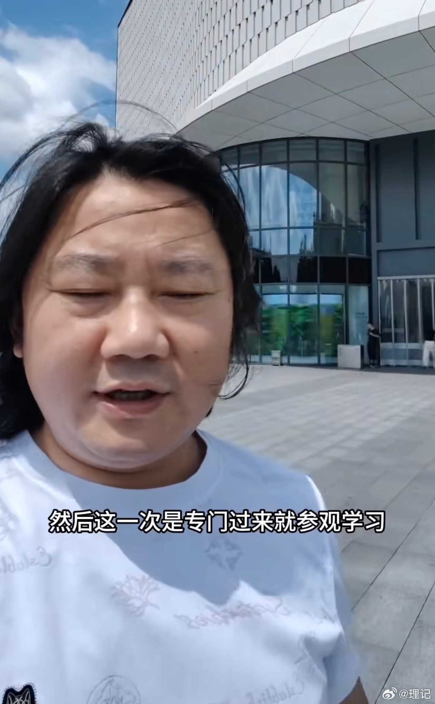
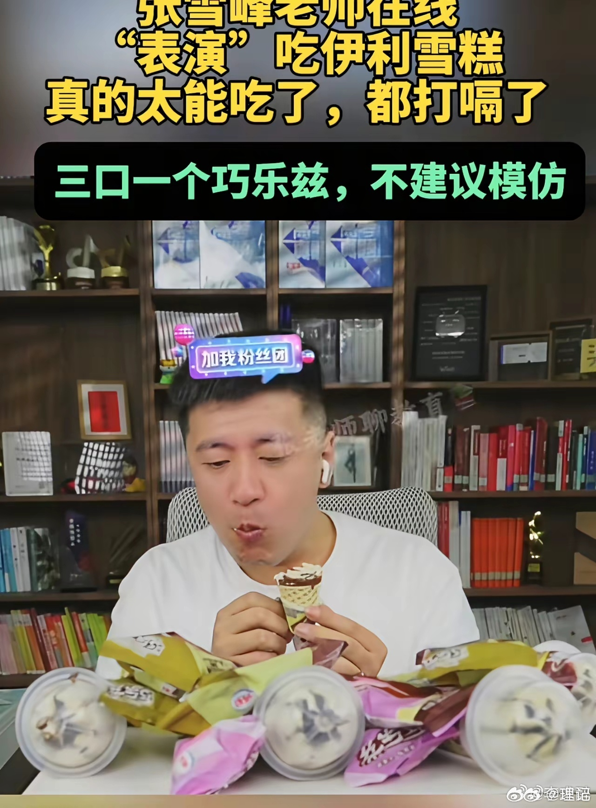

@理记
发表于：2026-04-04 08:26
来源：微博
链接：https://m.weibo.cn/status/5284016590685186

该吃晚餐了。

这段时间也看到了张雪的故事，非常励志，很喜欢这个人直来直去的性格。

有句话想跟重庆方面说，我要是你们，除了给张雪工厂用地和贷款支持外，你们必须派俩人，死死的把他看管好了，让他餐餐控糖。

张雪今年39岁，面色已经到了这种程度，明显严重臃肿的碳水脸糖化脸，烟➕酒➕重口味高糖饮食环境，再这样下去是绝对扛不住的。

而且现在身边都是这样的人，人们经常不以为然，都不知道啥是健康肤色了。

张雪峰老师的视频看的越来越多，我越真心觉得遗憾，他曾在直播间里现场表演连吃了九个和路雪雪糕，长期高糖高油高盐高脂肪高胆固醇饮食，其实是导致猝死的核心基础原因。

再累，再熬夜，不可能把血管累堵了。但是累和熬夜，可以让长期高糖饮食导致堵塞的血管，瞬间破裂。

苏州工业园区失去了张雪峰老师，我们也失去了一个鲜活有趣的人。

重庆一定要保护好张雪。

死死管住！

---

