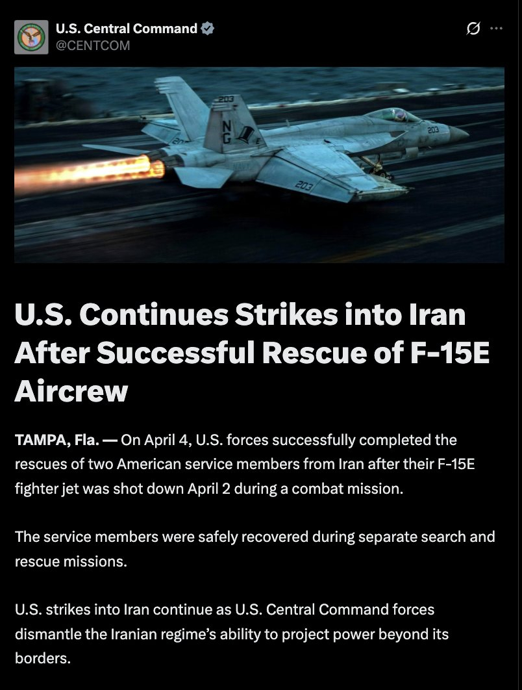

@包容万物恒河水
发表于：2026-04-06 20:15
来源：微博
链接：https://m.weibo.cn/status/5284557515653823

🔻ABC 新闻称：2 架 HC-130J 救援飞机和 4 架 MH-6“小鸟”直升机被摧毁。
🔻美军中央司令部终于更新的通稿称：“美国成功从伊朗境内一架被击落的 F-15E 战斗机中救出两名机组人员，并继续进行军事打击。两名机组人员在不同的飞行任务中均安全返回。4月2日，一架飞机在战斗中被击落。”
\#特朗普透露美军营救飞行员细节\#\#伊朗称美军营救飞行员任务失败\#\#海外新鲜事\#\#中东现场直击\#

---

