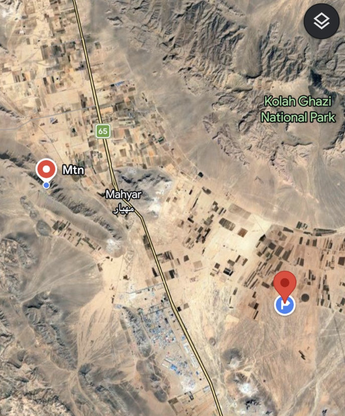

@牧星观海天

发表于：2026-04-05 12:57

来源：微博

链接：https://m.weibo.cn/status/5284447076491867

美国一博主援引美国军方官员的消息，发布的美军营救F-15E武器操作官的行动细节：

“左侧山顶区域是武器系统官的藏身之处，他从西北方向约5英里处弹射逃生。右侧区域是临时跑道，两架C-130运输机和四架MH-6“小鸟”直升机在此降落。

“一架MH-6直升机飞往山顶区域，救出了武器系统官，并将他带回跑道。由于两架C-130的前起落架陷进了土里，几个小时后，美军不得不调来三架空军特种作战司令部(AFSOC)的Dash-8飞机，将获救的F-15E武器操作官和参与行动的约100名人员接走。”

“这次行动基本上耗资3亿美元，因为他们不得不放弃两架C-130运输机和4架MH-6直升机。”随后，美国空军不得不动用多枚炸弹摧毁遗弃在该简易机场的所有飞机，伊朗方面还击落了两架MQ-9“死神”无人机。

“幸运的是，美方没有人员伤亡。我们不得不动用多枚炸弹和导弹摧毁试图爬上山坡的伊朗伊斯兰革命卫队车辆，以及那些试图驶向简易机场的车辆。”\#美伊以冲突\#\#热点观点\#\#伊媒称多名美军士兵在营救行动中身亡\#

---

