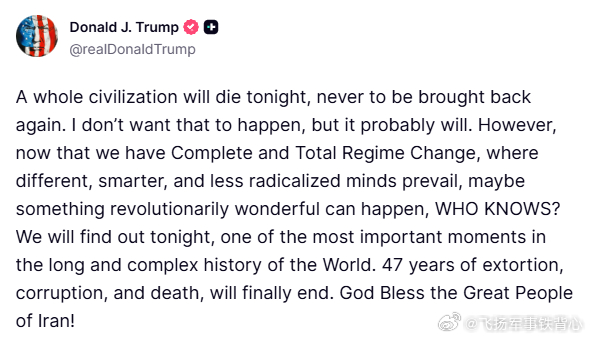

@飞扬军事铁背心
发表于：2026-04-07 20:33
来源：微博
链接：https://m.weibo.cn/status/5285168638329595

特朗普又在发帖：

“今晚，一整个文明可能会灭亡，再也无法复生。我不希望这种事情发生，但它很可能会发生。

然而，现在我们已经实现了彻底的政权更迭，不同、更聪明、且不那么激进的思想占据主导，也许会发生某种革命性的美好的事情，谁知道呢？

今晚我们将拭目以待，这将是世界漫长而复杂历史中最重要的时刻之一。47年的勒索、腐败与死亡，终将结束。愿上帝保佑伟大的伊朗人民！”

\#烽火问鼎计划\#\#美伊以冲突\# 

你是不是要发射核弹？是不是？是不是？

---

