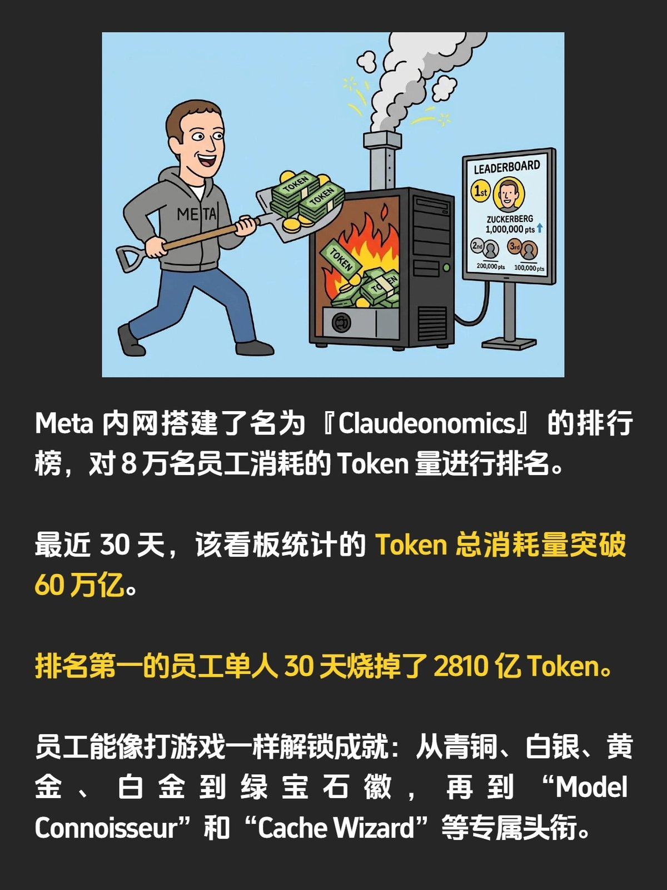

@这个AI很盒里

发表于：2026-04-06 13:32

来源：微博

链接：https://m.weibo.cn/status/5284818428364060

Meta 内部搞了一个叫 Claudeonomics 的排行榜，直接抓取公司后台数据，给全公司 8 万多名员工的 AI Token 消耗量排座次。

这个榜单采用了游戏的机制，不仅有青铜到绿宝石的段位，还给那些烧 Token 最狠的员工发专属头衔，排名前 250 名的用户会被重点展示。

这种刷榜行为带来的消耗量是惊人的，过去 30 天里，Meta 员工在这个仪表盘上总共烧掉了超过 60 万亿个 Token。

排名第一的那位猛人，一个人单月就干掉了 2810 亿个 Token。

如果按照 Anthropic 公开的定价来算，60 万亿个 Token 的成本大概在 9 亿美元左右。当然，大厂自己有协议价或者也会用本地部署的模型，不可能真烧掉这么多钱，但整体来说也是一笔不小的开支。

目前 Meta 内部依然是以鼓励为主，Meta 的 CTO 直接在会上说这笔投入稳赚不赔，并表示“公司对此的投入不设上限”。

这让我想到黄仁勋之前的一句话：“如果一个拿 50 万美金年薪的工程师，一年烧不掉 25 万美金的 Token，就应该让老板极度警惕。”

换句话说，你 Token 烧得多不一定有问题，但 Token 烧得少一定有问题。

这种新型职场身份焦虑已经在硅谷有了个特定的名词，叫 Tokenmaxxing。

---

