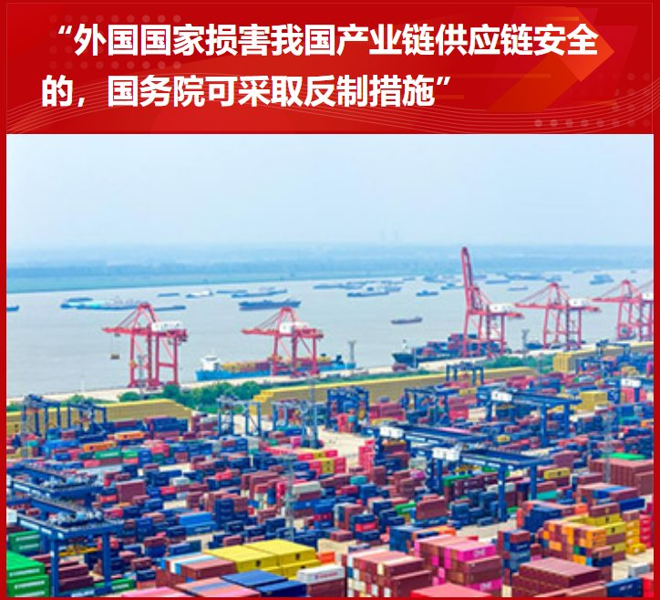
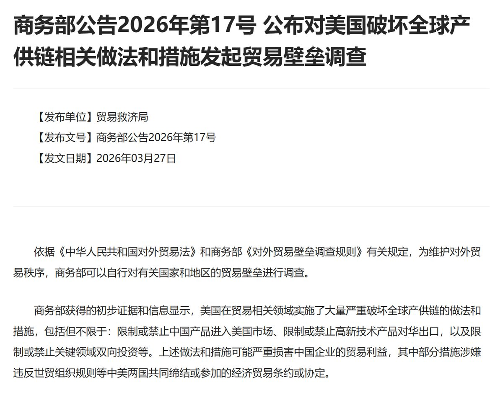

@江宇行舟

发表于：2026-04-07 18:44

来源：微博

链接：https://m.weibo.cn/status/5285259166089804

在国外最近打得热火朝天时，这条国内消息值得咱、尤其是实业界的朋友关注。

就在几个小时前，国务院公布了《国务院关于产业链供应链安全的规定》，规定共18条，总结下来三件事：一是明确产业链供应链安全工作原则，二是建立健全产业链供应链安全制度措施。

第三点尤为重要，规定反制措施和域外适用。针对外国国家、地区和国际组织以及外国组织、个人损害我国产业链供应链安全的，建立产业链供应链安全调查制度，国务院有关部门可据此开展产业链供应链安全调查，采取反制措施。

《规定》特别强调我国境内的组织、个人应当执行有关反制措施。任何组织、个人违法开展与产业链供应链有关的信息收集活动的，有关部门依法采取相应处理措施。

我在近年走访中曾遇到被制裁企业吐槽，美国制裁与我方反制在执行层面存在不对等，自己这儿都被赶出美国市场了，咱对等列入负面清单的美国企业，还能继续在中国市场经营，乃至参加地方政府招投标。

现在有了规定，以后不仅执行有了章程，再犯规，怎么处理也有了依据。

在“两会”期间，我曾私下表达过遗憾，感觉政府工作报告没有写到海外资产安全与维权的内容，这本也是高水平对外开放的一体两面，“十五五”规划明明都写到了，要加强反干预、反制裁、反长臂管辖。

但仅仅过了一个月，就看到国家在这方面的后手，而且角度站位非常高，已经站到了产业链工业链的全局高度，来做这件事。

更让人开心的，是这个《规定》出台10天以前，商务部已于3月27日对美国破坏全球产供链相关做法和措施，发起了贸易壁垒调查。

执行层面先行一步，完整的顶层设计如今又正式发布，我相信在这件事情上我们将开展足够全局性、也将持续性的有力工作。也希望掌握相关线索的朋友们能针对这个话题，向有关部门能提供则提供，有宣传价值和渠道的，该发声则发声。

美国对我们的“线人”使用很猛，从竞争对手、NGO到媒体整了“一条龙”。有时候一两个记者预设几个问题，找个把警惕性不高的企业职工套个话，以后就是递交到美国国会发动制裁的所谓“证据”。如今要对他们反制，我们一样也要打人民战争的。

就这两天，哪怕上了太行山，我也没闲着。结合美国过去这些年对产供链破坏的特征，刚提炼出来，写了一篇“十宗罪、九应对”。咱既然说要当出题人，这种题目必须扔给美国人回答，这也是咱“尊重”美帝国主义的表现。

它一个超级大国，整天只想和中国谈卖油卖豆收多少税，对竞争对手则是只会这个制裁、那个封锁、满眼都是行政干预，一点也不给鼓吹灯塔这么多年的公知殖人面子。

帝国主义？超级大国？就这？出息呢？！

见证了美帝的腐朽，更烘托出我们中国企业的伟大。我入得此坑，就是亲眼见证了自己朋友的企业，在制裁中的困顿与坚持，开始关注这个方向，也通过各种机缘巧合进行着走访，并在保障这些朋友安全和隐私的前提下，不断把自己的见闻通过不同渠道发布出来。

我相信，“讲好中国故事”也好，“唱响光明论”也好，这些狂风暴雨中追光摘虹的事迹，一定是最好的素材，谁看了都会有信心。

这也是一项五味杂陈的工作，有对咱企业顶住超级大国制裁的钦佩和感动；有对咱反制措施受限于客观条件研发周期较长的等待甚至焦虑；有见证咱企业、产业链逆势图存、闯出新路的信心与欢喜；有结合“双循环”理念思考下一程的憧憬与困惑；也有接触相关知识、规则时候的抓耳挠腮……

这些坚持下来的国内领军企业，未来一定会是世界百年品牌，能见证他们的奔跑，感觉真的很好。

也在这过程中，不断认识到各行各业的良师益友，有些是我长期的偶像，甚至二三十年前就在电视上见过，大家来自产政研学的不同方向，但都有着同一个目标。

我很喜欢一位长期从事相关维权的同志所说，这是一张宏大的拼图，不仅需要顶层设计，也需要我们基层结合日常工作接触到的信息，互相之间对其颗粒度，相互学习、有针对性提交，这就是一块一块拼拼图的过程。

我愿意做一块拼图，并且我希望能认识更多的拼图。

我相信等咱完成这幅拼图的时候，中国的产业，一定会独领风骚全世界。

---

