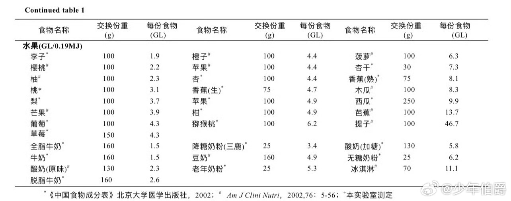
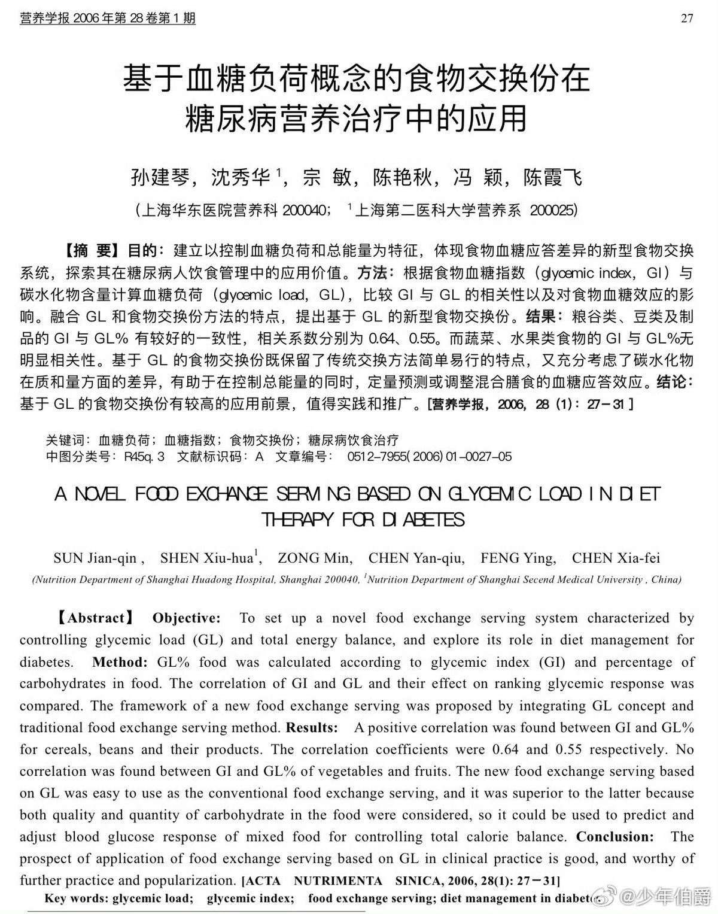
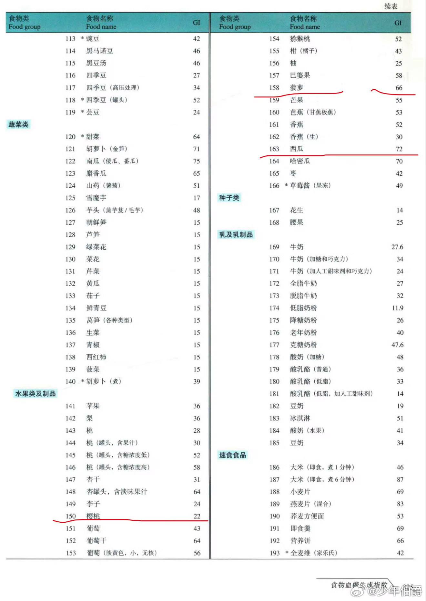

@少年伯爵

发表于：2026-04-07 16:31

来源：微博

链接：https://m.weibo.cn/status/5285225706816624

减脂期间，吃哪些水果更有利于减肥呢？糖尿病患者摄入哪些水果更安全呢？隐藏高糖的那个危险水果王者究竟是谁？

\#伯爵冷知识\# 如图3所示，正儿八经的高升糖GI（≥70）的水果是西瓜（72）和哈密瓜（70），中升糖GI的水果是芒果（55）和菠萝（66）。但比升糖指数GI更实际的指标其实是血糖负荷GL（单位交换食物重量的升糖指数），由图1可知——我们日常吃的苹果、梨、桃、柚子、葡萄、草莓等血糖负荷其实都还好（<5），真正的血糖负荷分水岭是从猕猴桃开始的——猕猴桃（6.2）＜菠萝（6.3）＜香蕉（8.1）＜木瓜（8.3）＜西瓜（9.9）＜芭蕉（13.7）＜提子（46.7）

隐藏的水果高糖大BOSS居然是提子……

已老实，我平时吃点苹果（4.4）或者柚子（2.3）就好。

最后不得不感慨，不管是升糖指数GI还是血糖负荷GL，樱桃（22和2.2）都是最低之一的那个，真是既好吃又减肥，对糖尿病患者也很友好，唯一的缺点就是……贵。

世上没有两全法啊。

红尘炼狱。

---

