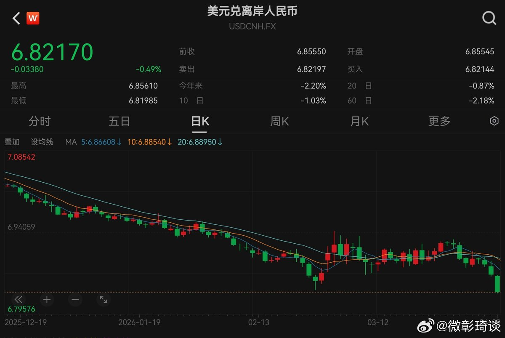
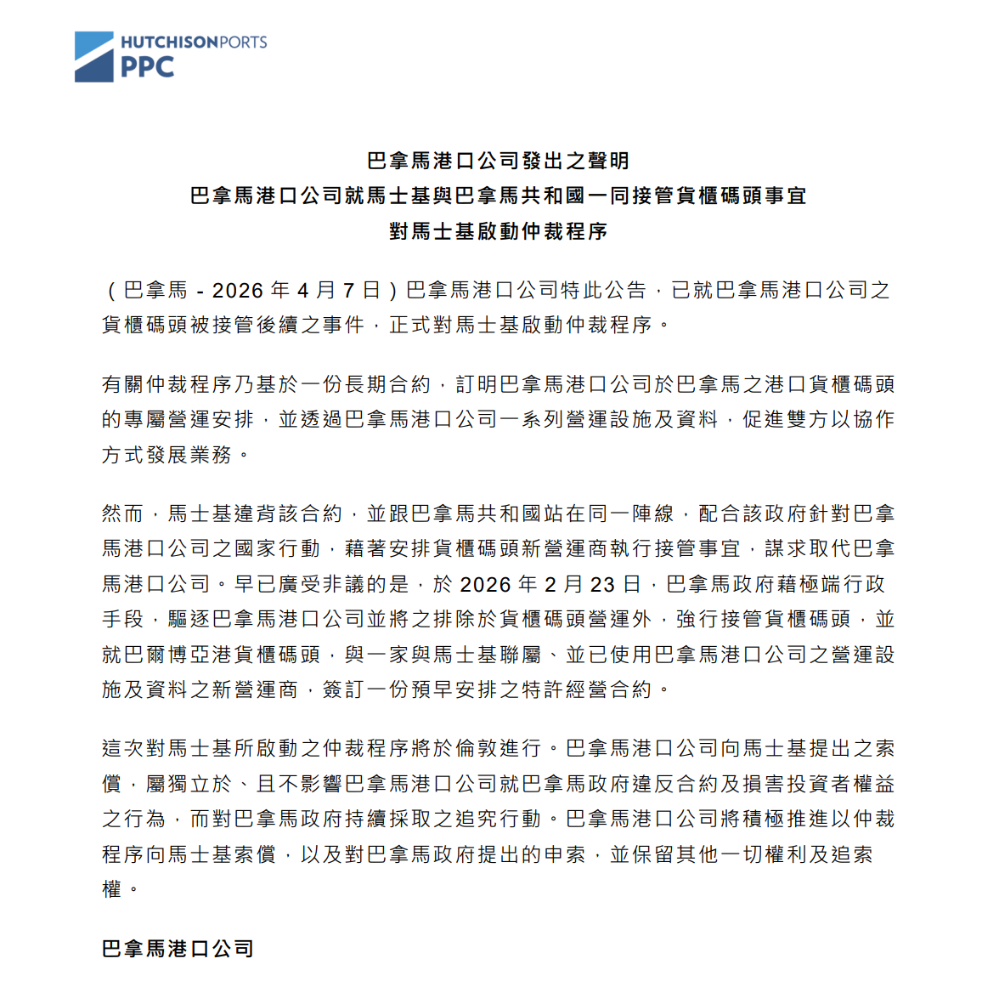
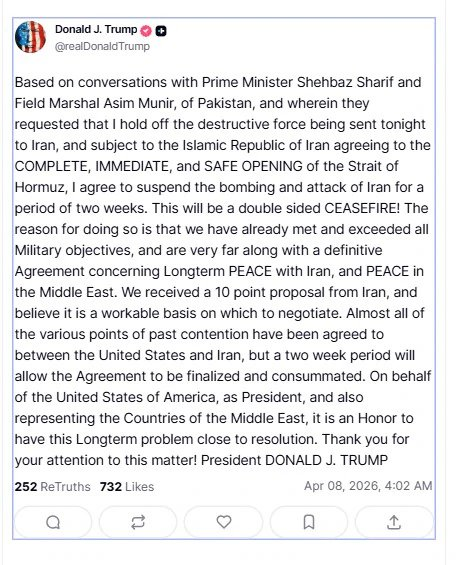
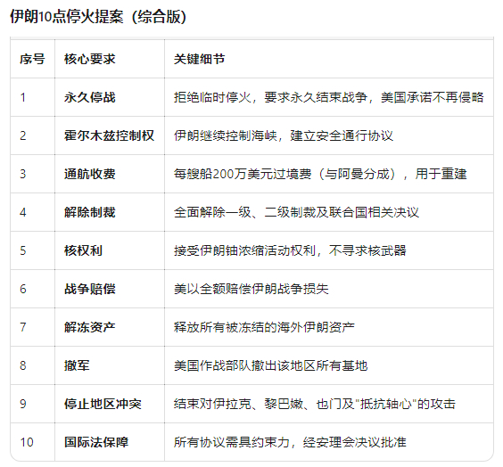
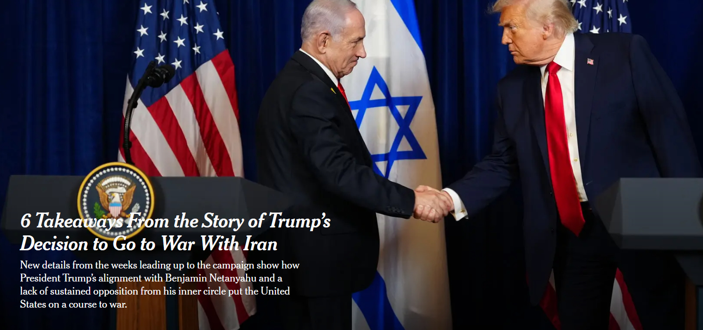
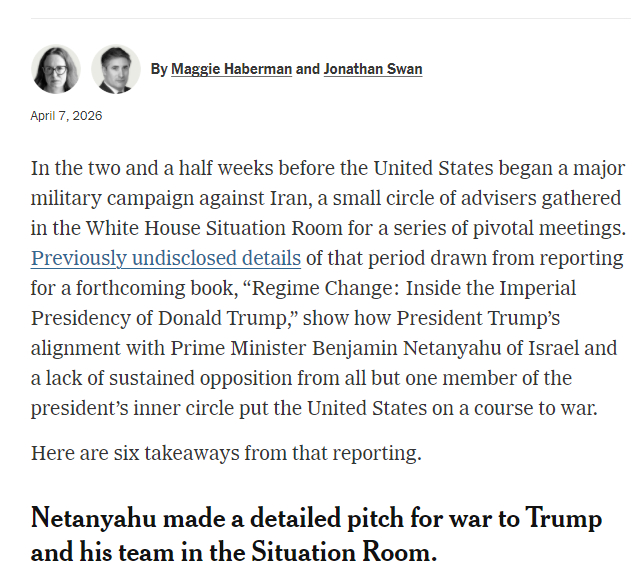
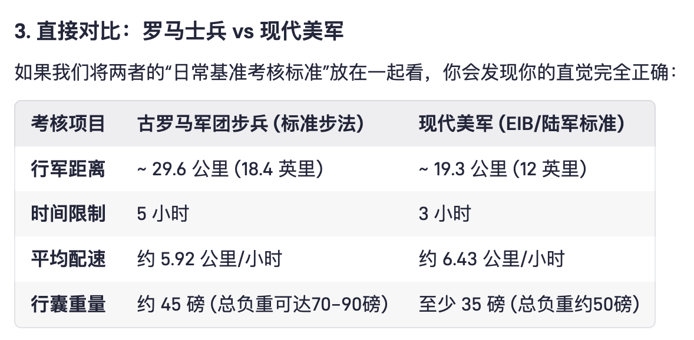
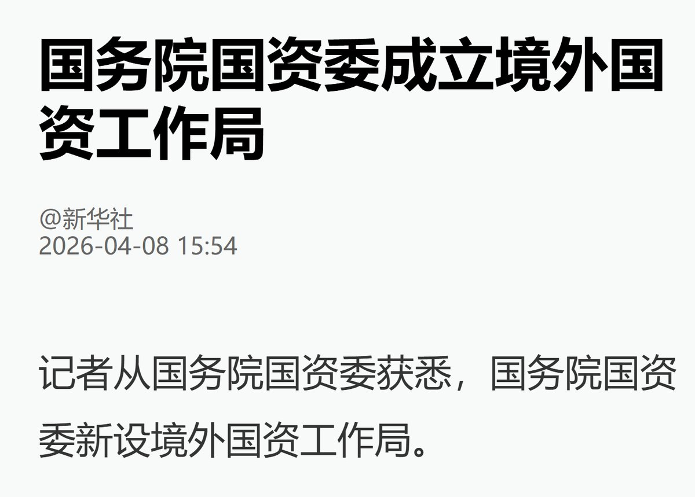
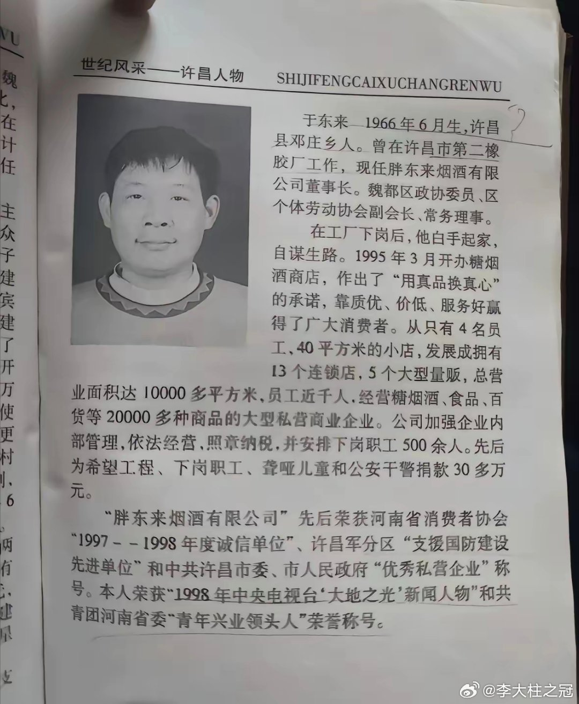

# 2026-04-09

## 1

@微彰琦谈

发表于：2026-04-08 13:11

来源：微博

链接：https://m.weibo.cn/status/5285537741275686

什么才是动荡世界中的稳定性和确定性—人民币

伊朗战争发生后，各类资产都出现了大幅波动。但截至今天，波动最小，并且最快恢复到战前趋势并创新高的资产是：人民币。

战争稍有缓和迹象，人民币兑美元汇率就迅速再创年内新高，也是2023年2月即3年多以来的新高。

要知道，虽然今日美元指数也大幅回落，但相比战争发生前的2月底，美元指数还是有大概1%的上涨，这也就意味着，人民币比美元的避险功能更强。当然必须承认，人民币仍然还不能自由兑换，说什么人民币的避险功能有点扯。但其实也不绝对尽然，任何国际资金都可以在香港交易所开户，然后籍由陆股通北上买入A股，当然必须承担一些股价波动，但也可以享受人民币升值的好处。尽管股价波动还是很大的，但换个角度，A股中有一些股票价格比港股还低，对于本来就有意投资中国资产的投资者来说，何不趁机北上，股价汇率双套利。

---

## 2

@那些珍贵老照片

发表于：2026-04-08 09:00

来源：微博

链接：https://m.weibo.cn/status/5285474571912975

1980年的广东深圳

---

## 3

@江宇行舟

发表于：2026-04-08 11:34

来源：微博

链接：https://m.weibo.cn/status/5285513491382330

长江和记实业就巴拿马港口被劫夺，正式追责马士基。

香港长江和记实业有限公司旗下巴拿马港口公司发声明，正式对全球航运巨头马士基启动仲裁程序。

巴拿马港口公司表示，有关仲裁程序基于一份长期合约，订明巴拿马港口公司在巴港口的货柜码头专属营运安排，并透过巴拿马港口公司一系列营运设施及资料，促进双方以协作方式发展业务。

然而马士基违背合约，并与巴拿马政府站在同一阵线，配合政府针对巴拿马港口公司的行动，借着安排货柜码头新营运商执行接管事宜，谋求取代巴拿马港口公司。

2026年2月23日，巴拿马政府借极端行政手段，驱逐巴拿马港口公司、强行接管集装箱码头后，旋即与新运营商签订了早就写好的巴尔博亚港集装箱码头特许经营合同，新运营商系与马士基联属、并已取得了巴拿马港口公司之运营设施及资料，这也显系早有预谋。

巴拿马港口公司还指出，这次对马士基启动的仲裁程序将于伦敦进行，公司将向马士基提出索偿。并且本仲裁自身独立，不影响公司向巴拿马政府采取的追究行动。

——既然马士基的责任已经很明确了，咱这边也可从“约谈”升级了吧。

---

## 4

@沉睡之书11

发表于：2026-04-08 12:09

来源：微博

链接：https://m.weibo.cn/status/5285522232050464

特朗普：可能与伊朗组建联合项目保护霍尔木兹海峡

美国总统特朗普当地时间周三上午在接受ABC新闻采访时表示，在周二宣布为期两周的停火后，美国可能寻求与伊朗组建联合项目以保护霍尔木兹海峡的安全。

当被问及是否会允许德黑兰对通过这一战略水道的航运收费时，特朗普表示：“我们正在考虑将其作为一项合资项目来实施。这是一种保护海峡的方式——也是防止其他许多国家染指的方式。”

特朗普补充说：“这是一件非常美好的事情”。

特朗普还表示，他不会允许伊朗保留任何铀浓缩能力，尽管德黑兰一再声称不会放弃这样做的自由。特朗普表示，在该地区的美军也不会撤离，暗示他们将留在当地以执行未来达成的任何协议。特朗普预计和平谈判将于周五开始，并将迅速推进。

“收费可以，我要分一半。”

\#海外新鲜事\#\#伊朗接受停火提议\#

---

## 5

@生育兴华

发表于：2026-04-08 01:29

来源：微博

链接：https://m.weibo.cn/status/5285361093969311

东北生育率超级低，难道是要说东北都在996？

强制企业把利润分给员工？那企业完全可以少招员工，或者不开企业。（产品可以买进口的嘛，我国卖矿赚钱）

企业没有利润，为什么要开企业？

若是要人民有钱，也不可能靠强制企业来分配利润，要有利润才能分利润啊。

有多少比例的企业有利润？

要人民有钱，政府自己印，自己发嘛。钱不都是国家印出来的吗？怎么还需要企业去发？钱都是国家的，国家直接发。

什么？要企业生产产品？国家不能生产吗？反正企业利润分掉也有人开企业，那国企最好。

罗马生育率低，是因为罗马太忙，人民996吗？

古代生育率高，是因为古代朝九晚五，有钱消费和社交？

生孩子是要女人生孩子，现在小仙女们都是在996吗？

不是说好的小仙女工作不好找，找不到工作的吗？

十个人工作也比不上一个精英加班。真的做好准备，让精英少加班3小时，而让五个人多花一共30小时去上班吗？如果认为上班破坏生育，为什么要认为更多的人花更多时间上班能提高生育？

@刘新征 能逻辑自洽吗？

---

## 6

@China航天

发表于：2026-04-07 19:54

来源：微博

链接：https://m.weibo.cn/status/5285276885714127

\#阿尔忒弥斯2号\# 猎户座飞船服务舱拍摄的日食

---

## 7

@风云学会陈经

发表于：2026-04-08 02:44

来源：微博

链接：https://m.weibo.cn/status/5285380005826246

\#伊朗公布10项停战条款主要内容\#

伊朗赢大了，美国输惨了

1. 斗到这份上，还有人说伊朗怂了。确实需要解释下，为什么是伊朗赢大了、美国输惨了。图一是特朗普发贴：We received a 10 point proposal from Iran, and believe it is a workable basis on which to negotiate。特朗普明确说收到了伊朗的10点提案，还说这个是“可行的基础”。

2. 图二是伊朗的10点提案，各版本略有不同，但基本就是这些要求。仔细看看每一条，这等于让美国投降。可以确认的是，伊朗极为强硬，即使面对特朗普“文明终结”的威胁，也没有任何屈服。而伊朗同意停火两周，前提是特朗普同意以10点提案为基础谈判。伊朗同意开放霍尔木兹海峡两周，前提是美以停火，CNN报道以色列也同意停火了。伊朗并不是因为害怕挨炸而放开海峡，而是为了基于10点提案的谈判，是胜利的放开。

3. 而特朗普这边，找不到任何伊朗动摇的迹象，本来已经是绝望状态下不来台了，这时巴基斯坦传来了伊朗的10点提案。可以肯定，这时特朗普已经是病急乱投医一样，不管10点提案上面写的啥，都说停两周，先缓缓。也许以后特朗普会玩赖，说10点全部不同意，但在这一刻，他就是TACO了，就是怂了。

4. 有人说，再等两周美国多几个航母来了、弹药补充好了，又重新开炸。看看战场形势，2周完全改变不了任何实力对比。伊朗已经建立了极为坚实可信的抵抗基地，在扎格罗斯山脉中有无数山洞组成的地下网络，有海量的导弹与无人机，也有足够的灵活机动的发射车，洞口挨炸后几个小时就又清理好了，山洞里还有生产工厂，可以每月生产数千枚导弹和无人机。这些山洞，美以毫无办法，来多少航母都没用。而且美国航母只能躲得远远的，那个“的黎波里”两栖登陆舰，也根本没法近前。

5. 有人说，美以可以空袭把伊朗的民用的电厂、工厂、基建全部摧毁。这是违法国际法的战争罪行，联合国都发警告了。而且特朗普已经威胁过了，伊朗没有任何动摇。议长加利巴夫把自己的名字加到烈士名单上，伊朗有一堆视死如归的高官坚决抵抗，这一点值得尊重。而且，伊朗并不是只能挨打，而是有两个极为有效的反制筹码。第一个是封锁霍尔木海峡，第二个是彻底炸毁海湾国家的油气设备与基建。这两个筹码是真实可信的，伊朗已经封锁过了，也炸掉了一些沙特、阿联酋、卡塔尔、科威特、巴林等国的设施，有坚定的意志实施。

6. 现在证明了，特朗普的讹诈完全失败，他只有选择TACO，避免世界经济毁灭、美国股市泡沫破灭、违反国际法成为战犯、MAGA内部大分裂等一堆无法承受的后果。这一次怂了，过两周又能如何？

7. 2025年4月中美巅峰对决了一次，等于中断贸易往来了 。特朗普知道厉害了，虽然说的是推迟，但实际已经不敢再对中国讹诈了。后面，特朗普也没有办法讹诈伊朗了，都看出来了，伊朗会毫不动摇坚决反击。美国无法在战场上击败伊朗，这是伊朗的大胜利，美国输惨了。

---

## 8

@向小田

发表于：2026-04-08 01:53

来源：微博

链接：https://m.weibo.cn/status/5285367126690080

经常谈判的朋友都知道，如果合同的谈判基础是某方的，通常意味着某方在谈判中占有相对优势。从目前的情况来看：

1、川普说谈判的基础是伊朗提出的10条建议，并且他认为是可行的基础。这个谈判的基础很意外竟然不是美方提出的15条建议。说明美方对谈判达成的意愿更加强烈，那么谈判的结果很有可能就向伊朗的条件倾斜。

2、伊朗之前表示不接受临时停火。但是现在显然它接受了临时停火，这只有两种可能一种是美方做了某些让步，另一方面是伊朗承受不住更大的经济损失。从第1条来看，伊朗觉得谈判有利可图从而接受临时停火的概率较高。

3、有消息称，伊朗和阿曼获准在停火期间对霍尔木兹海峡通行收费，伊朗将利用霍尔木兹海峡通行费用于重建。如果这个消息属实，说明美方在海峡ETC上又一次让步——只要能够安全通过海峡保证海峡开放，它甚至能够接受收费。这个立场跟之前比是有退步的。海峡ETC收费在伊朗看来可以视为战争赔款，对弥补损失有一个交代。对美方而言，海峡收费总比关闭强，只要想办法让阿拉伯国家付费，美方就等于没出钱，也是个思路。

4、美方声称已经实现了所有的军事目标。可作为下的台阶。伊朗称实现了所有的目标，可以理解为政治目标。双方都找到了一个平衡点。虽然这个平衡很脆弱，但是达成协议的概率增加了。

最后说一下就是这个谈判的过程不会很快，达成最终协议可能需要几个月时间，但是中间可能维持比较长时间的停火，或者临时协议。\#伊朗公布10项停战条款主要内容\#\#伊朗接受停火提议\#

---

## 9

@风云学会陈经

发表于：2026-04-08 04:17

来源：微博

链接：https://m.weibo.cn/status/5285403569425818

\#特朗普为何迅速转变态度\#

纽约时报：特朗普团队决定对伊朗开战的故事

这个故事写得非常好！

这完全解释了，特朗普这些人是如何决策对伊朗开战的，是被内塔尼亚胡忽悠了，情报官员给出了意见，要防备以色列忽悠。万斯强烈反对，看来头脑最清醒。但没人想到会搞成这样，没有一个人知道美国会面对如此大的失败，太傲慢了，小看了伊朗。但最主要的，还是这些人相信特朗普的“直觉”会创造奇迹，被过去的“成功”迷惑了。

----

以下是该报道的六个要点。

一. 内塔尼亚胡在情况室向特朗普及其团队详细阐述了开战的必要性

2月11日，内塔尼亚胡先生在“情况室”——一个极少用于与外国领导人面对面会谈的场所——与特朗普先生隔桌而坐，向总统及其高级助手做了一个长达一小时的汇报。他指出，伊朗已具备实现政权更迭的条件，美以联合行动有望推翻伊斯兰共和国政权。有一次，他播放了一段视频，其中包含了一系列如果神权政府倒台后可能领导伊朗的人物剪辑。这些人当中包括流亡的伊朗末代国王之子礼萨·巴列维。

以色列领导人及其顾问们描绘了一幅看似稳操胜券的前景：伊朗的导弹计划将在数周内被摧毁，霍尔木兹海峡将保持畅通，且仅对美国利益实施有限报复。以色列情报机构摩萨德甚至可能协助在伊朗国内策动一场起义，以彻底完成这一任务。

特朗普先生的回应迅速而有力，且在场大多数人看来都表示赞同。这听起来不错，他对总理说道。

二. 美国情报官员称内塔尼亚胡的政权更迭设想“荒诞可笑”

美国分析人士连夜紧急评估内塔尼亚胡先生所提出的内容。他们第二天在另一次态势室会议上得出的结论直截了当。

美国情报官员得出结论，以色列方案中前两个目标——刺杀阿亚图拉并削弱伊朗威胁邻国的能力——是可实现的。而内塔尼亚胡先生及其团队提出的后两个目标——伊朗国内爆发民众起义，以及用一位新的世俗领导人取代伊斯兰政府——则不可实现。美国中央情报局局长约翰·拉特克利夫用一个词来形容这些政权更迭的场景：“荒诞可笑”。国务卿马科·卢比奥则翻译道：“换句话说，这纯属胡扯。”

特朗普先生接受了这一评估——并将其抛诸脑后。他表示，政权更迭将“是他们自己的问题”。他对刺杀伊朗最高领导人、摧毁其军事力量的兴趣丝毫未减。

三. 副总统J.D.万斯是反对这场战争最坚决的人——也是唯一一位有力论证反对战争理由的人

在特朗普先生的亲信圈中，万斯先生最积极地试图阻止走向战争的步伐。他一生的政治生涯正是以反对这种军事冒险主义为己任，他还向同事们表示，与伊朗的政权更迭战争将是一场灾难。

在总统及其其他顾问面前，万斯先生警告说，这场冲突可能引发地区混乱和难以估量的人员伤亡，瓦解总统的政治联盟，并被曾支持“不再发动新战争”这一承诺的选民视为一种背叛。他强调，美国弹药正在耗尽，且由于该政权的存亡岌岌可危，将面临规模巨大且难以预料的报复风险。他还警告了霍尔木兹海峡的局势，以及汽油价格飙升的可能性。

他本希望完全避免采取任何军事行动。但鉴于特朗普先生很可能采取行动，万斯先生试图引导他选择更为有限的选项。当这一努力失败后，他主张动用压倒性的力量，以迅速结束事态。在2月26日的最后一次会议上，他对总统直言不讳地表示：“我知道我认为这是个坏主意，但如果您执意要这么做，我会支持您。”

四. 一些特朗普的顾问私下里有严重顾虑，但还是听从了总统的决定

内圈的职位分布于一个连续谱上，但有一点是共通的：除了万斯先生之外，没有人提出有力的论据来改变特朗普先生的想法。

“国防部长皮特·黑格塞斯最为热情。我们迟早都得对付伊朗人，所以干脆现在就动手吧，”他在2月26日——即特朗普先生下达最终命令的前一天——向与会人员表示。鲁比奥先生则态度较为犹豫——他更倾向于继续施加最大压力，而非全面开战——但他并未试图劝说总统改变主意。白宫办公厅主任苏茜·怀尔斯担心，在中期选举前夕，美国可能被卷入中东冲突，但她认为，自己并不适合在大型会议上向总统表达对军事决策的担忧。

参谋长联席会议主席丹·凯恩将军对这场战争深感忧虑，并一再指出其中存在的风险：武器耗尽、霍尔木兹海峡关闭，以及难以预测伊朗的反应。然而，他极为谨慎，从不表明立场，反复强调自己的职责并非向总统提出具体建议，以至于在某些人看来，他似乎同时为各方观点辩护。反过来，特朗普先生似乎常常只听自己想听的。

五. 特朗普认为这将是一场速战速决的战争，就像在委内瑞拉那样

总统坚信与伊朗的冲突将短暂而果断，这种信念根深蒂固，且在很大程度上不受相反证据的影响。今年6月，伊朗对其轰炸核设施的回应十分低调，加之1月那次惊天动地的突击行动成功从其住所抓获了委内瑞拉领导人尼古拉斯·马杜罗，这些都令总统更加胆大妄为。其中没有美国公民丧生。

当顾问们提出伊朗可能关闭霍尔木兹海峡——这一全球大量油气运输的咽喉要道——的可能性时，特朗普先生断然否定了这种可能性，认为该政权在走到那一步之前就会屈服。当有人告知，这场行动将大幅耗尽美国的武器储备，包括本已因多年支持乌克兰和以色列而捉襟见肘的导弹拦截系统时，特朗普先生特朗普似乎权衡了警告与一个更具吸引力的数据：美国拥有几乎无限量的廉价、精确制导炸弹。

当反干预主义评论员塔克·卡尔森私下问特朗普先生，他怎么如此确信一切都会没事时，总统回答道：“因为过去总是这样。”

六. 对特朗普而言，这是一个凭直觉做出的决定，而促成这一决定的正是在他第一任期内并不存在的回音壁

特朗普先生决定将国家推向战争，并非出于情报评估，也并非源于其顾问们之间达成的战略共识——而这种共识根本不存在。推动他做出这一决定的，正是他的直觉——正是这种直觉，曾一次又一次地让他的团队目睹了不可思议的成果。

与他第一任期的团队截然不同——当时许多人视他为需要管控或阻挠的危险人物——特朗普先生在第二任期内身边环绕着一群将他视为历史伟人的顾问。在2024年实现令人难以置信的东山再起之后，在经历起诉和暗杀未遂之后，以及在下令实施那场天衣无缝的行动并成功抓获……在委内瑞拉，马杜罗身边的人对特朗普先生的命运和直觉怀有一种近乎迷信的信念，坚信他有能力凭一己之力创造新的现实。在做出这一高风险、高赌注的决定时，几乎所有人都听从了总统的直觉。

在试图实现特朗普先生意愿的人们环绕之下，且迄今为止一切进展顺利，几乎没有任何东西能阻挡本能与行动之间的鸿沟。

---

## 10

@V闪闪

发表于：2026-04-08 05:05

来源：微博

链接：https://m.weibo.cn/status/5285415529480948

知道啥是相辅相成吗？图1 这种吹好🇺🇸故事能有2万赞，和图2 这种2026年依然可以公开信息诈骗，是分离不开的。

---

## 11

@李楠或kkk

发表于：2026-04-08 05:04

来源：微博

链接：https://m.weibo.cn/status/5285415344146229

Paper 表明 GPT 确定性的让你变蠢。

这也很简单，罗马士兵的负重行军能力比现代士兵更高。

有了汽车的帮助，体力就退化了。而有了 AI 的帮助，脑力一样退化。

另一方面说，其实就是智力平权了。

聪明的大脑会更像今天的健身，并不影响你达成结果。

但是另一方面，其实，

又影响很多。

网页链接

---

## 12

@李建秋的世界

发表于：2026-04-08 05:00

来源：微博

链接：https://m.weibo.cn/status/5285414307106486

“世界和平的大日子！伊朗想要和平，他们已经受够了！同样，所有人也受够了！美利坚合众国将协助解决霍尔木兹海峡的拥堵问题。会有很多积极的行动！大家都会赚大钱。伊朗可以开始重建进程了。我们会满载各种物资，在那儿‘转悠转悠’，以确保万事顺遂。我对此信心十足。就像我们在美国正在经历的一样，这可能是中东的黄金时代！！！”

确认了伊朗可以收费。

好了，大家可以赞美和平塑造者唐纳德特朗普先生了。

---

## 13

@那些珍贵老照片

发表于：2026-04-08 05:00

来源：微博

链接：https://m.weibo.cn/status/5285414173675444

1987年的湖南长沙

---

## 14

@有个梨GPT

发表于：2026-04-08 07:15

来源：微博

链接：https://m.weibo.cn/status/5285448236138724

Trump是历史上首次在战争里引入控制论的人。

他使用一种反馈思想控制战争的烈度。即，当股市和油价象电压达到高位警戒线时，他就关断开关开启谈判防止过冲，让股价和油价回来一点，然后再打一轮。如此循环往复多次之后，Trump家族的投资业绩就能超过巴灰特了。

真的，在过去50年里超越了Yes Prime Minister的神剧只此一部。因为绝大多数人在过着每天开车上班和吃外卖的日子，拿攒下来的钱买了基金或指数或大盘蓝筹股。只要让这些人在每天早上加油和中午午餐看股票账户时没有发现端倪，这个世界，或者母体，就被理解为差不多还是完好的，他们不会集体起立大声喧哗可以继续专注的过自己的小日子。Trump把现代社会运行机制里的这一弱点，利用到了极致。

在这个意义上说，Trump是顶尖黑客，白领生活是肉鸡。这个角度的解释也给Trump Always Chicken Out赋予了一种新的风味儿。

---

## 15

@刘晓光Savvy

发表于：2026-04-08 04:02

来源：微博

链接：https://m.weibo.cn/status/5285399605811231

闭嘴给钱的养育方式，说穿了，其实就是溺爱孩子，不要说教，尽可能满足他们的物质需求。

我自己在苏北农村长大，大家都知道农村人对儿子的溺爱程度是无以复加，非常恐怖的。

这些农村家庭用这样方法养出来的小孩，都是我亲眼所见，都是我身边的发小。

9成以上的结果，都是小畜生。

具体怎么个畜生法呢，这里说3个案例，都是我发小。

一个不爱学习，初中读完就不读了，在家自己做生意，开了个店，生意也不错，脑子活，口才好，人长得也漂亮，生意一直很不错，当然是在乡里的不错。

不过他有个缺点，就是喜欢玩，喜欢呼朋唤友，没事喝点小酒。

然后30岁左右那年，出事了。

喝酒了，撞人了，把人撞成了重度伤残。

法院判下来要执行100多万，当时这个钱可是天价，一辈子也还不起。

我这个发小不可能承担这个责任，直接跑路了，消失了，拖着就是不还，坚决不还，现在都不知道在哪鬼混。

到现在苦主都找不到他在哪，找他家里老人，老人也没钱，名下没有任何财产。

全家人都被这个跑路的哥们，害到了谷底。

以上是不爱学习，学历低的小畜生。

以下是学历高的，十里八乡的学霸，高中毕业考上了985，全家的骄傲。

他爸妈是乡镇的小官僚，家里本来条件也好，毕业了给在大城市买房买车娶媳妇了，也找了工作。

然后觉得工作太平庸配不上从小到大优秀的自己，想做大事，做企业家，赚大钱。

然后因为跑业务结识了某某大哥，内幕消息去炒期货，把家里房子什么的都抵押了，还借了高利贷，一波梭哈，全没了。

他没有还债，而是选择原地消失，跑路了。

债主找到他家，家里人动员亲戚出来找，不过没说真实原因怕丢脸，说他离婚了抑郁症失联了，我们最后好不容易找到了，送回去。

家里卖房卖资产凑钱，让他拿着卡回大城市去还钱，这个绝对足够的溺爱，闭嘴给钱了吧？

他走到半路不甘心，觉得自己这辈子不该如此，又拿钱去炒期货，又梭哈没了。

然后又失踪跑路了，现在也不知道死哪去了。

这次家里再也没法兜底了，老爸气的中风，老妈以泪洗面，债主把家里搬空了也还是还不上钱，仅此而已。

最后一个是和我关系最近的发小，他亲口对我说的故事，虽然他犯的错没那么大，但也是实打实的畜生行为。

他大学时候找了个女友同居，套套破了没注意，不小心怀上了。

怀了怎么办？两个人脑子不清醒，觉得小孩挺好玩的，很可爱，生下来也不错。

于是两个人决定把孩子生下来，当然这个不重要。

重要的是，随着预产期将近，女友孕吐明显，脾气不稳定，他伺候照顾的累了，烦了，陷入了极大的恐慌，我怎么照顾孩子，我工作都没有，我未来怎么办？这么多琐碎鸡毛蒜皮，太可怕了。

于是他跑路了，失联了，女方怎么都找不到他。

这个女孩子发挥出了超人的镇静和决断力，这个时候也没法引产了，只能独自一人把孩子生下来，然后坐了几百公里的火车，找到他家，坐在他家公寓门口等他妈妈下班，等老太太回家了，把婴儿往她怀里一塞，说阿姨这是您儿子的孩子，然后走了。

把他妈妈搞的目瞪口呆，赶紧打电话联系，说尽了好话，让他赶紧回来看看自己儿子。

他亲口和我说这件事的时候，没有惭愧，没有痛心疾首，没有反省自己，只是觉得自己情有可原，人之常情，犯了个小错误，现在回家了，还是个好爸爸（哪怕儿子都是自己妈带大的），而且周围人都羡慕他们家早早就有了儿子，抱上了孙子，成功人生。

所以说闭嘴给钱会养育出什么样的孩子。

是张雪，还是我举例的这三种小畜生？

家庭养育这个东西是一个很复杂的事情，尤其是对孩子的人格教养，最起码要有基本的科学常识。

一个正常人的正面人格，应该包含了5项：

尽责性

开放性

外向性

宜人性

敏感性

溺爱方式的家庭养育，对孩子的外向性帮助会很大，小孩从小自信无法无天有人兜底，对外打交道当然会轻松自在。

但是在尽责性方面，则会是灾难性的结果。

而尽责性，是所有人格的核心地基，没有尽责性，其它4大特性不管多么的优秀，这个人必然会是一个卑鄙小人，纯粹的小畜生。

尽责性过高，对你自己的人生来说不是一件好事，用现在的流行话术来说，就是容易内耗，容易左思右想，过于在乎自己的行为，导致自己寸步难行。

但是如果尽责性非常低，几乎没有，会是一种什么结果呢？

就是我上面提到的，跑路了，消失了，失联了。

如果你养育出来的孩子，尽责性过低，和尽责性过高，你认为这两种结果，哪个相对好点。

当然是尽责性过高，比尽责性过低好太多太多倍了，不论是对他本人，还是对社会对家庭，都要好太多了。

而培养孩子的尽责性，是一定要进行说教的，而且是大量的说教。

不说教，孩子就会被红书，微博，某音等社交网络给洗脑。

社交网络的绝大部分言论，都是「去责任化」，自私自利，我自己享受开心第一。

缺乏家庭证明的说教，单方面受这种言论影响，必然会自动成为一个小畜生。

传统的说教方式，比如我对你这么好以后要报答我们，父母养你不容易，我们辛辛苦苦在外打工受气，都是为了你，你要争气啊，要好好读书。

这不是一种好的说教方式，容易养成孩子「尽责性」过高，「外向性」过低的人格趋势。

但它远比完全不说教，任由孩子养成「尽责性」过低的人格，要好上一万倍。

不论是庞众望还是张雪，亦或者是某些成功人士，他们成功的原因都不是因为父母闭嘴给钱。

而是因为他们抽中了基因彩票，天生的了不起，智商高，胸怀远大，和父母的养育方式没有半毛钱关系。

哪怕父母对他们PUA，又打又骂，他们也会成功。

如果没有抽中基因彩票，只是普通智商，然后父母还溺爱，

那么只会成为我上文中说的，那些小畜生。

在传统教育学界的观点中，孩子从小不教育，不规范，任由爷爷奶奶带大教养，

那么这个孩子大概率一生就完了，就毁了。

很多人不认同这个观点，但这个观点的的确确就是事实。

因为溺爱对孩子「尽责性」人格的摧毁，基本上是灾难性的。

正确的说教好于错误的说教。

但是错误的说教，也要远好于完全没有说教，纯溺爱。

---

## 16

@江宇行舟

发表于：2026-04-08 08:01

来源：微博

链接：https://m.weibo.cn/status/5285459930647944

境外国资工作局的主要职责：

指导所监管企业国际化经营和境外资产布局优化、结构调整，

承担所监管企业境外资产监督有关工作，

加强境外投资经营等方面风险防范化解，

承担境外突发事件和危机处理有关工作。

---

## 17

@李大柱之冠

发表于：2026-04-07 09:23

来源：微博

链接：https://m.weibo.cn/status/5285118136813796

1999年的一本书《世纪风采·许昌人物》。

里面赫然有胖东来于东来老板的介绍。

很多这些年爆火的人物，如果稍微留意一下，你会发现人家在很早之前就已经出小名了。

只不过名气比较小，被人忽视。

