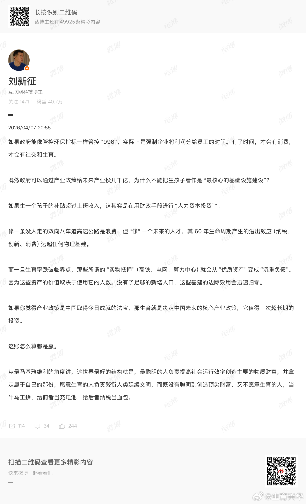

@生育兴华

发表于：2026-04-08 01:29

来源：微博

链接：https://m.weibo.cn/status/5285361093969311

东北生育率超级低，难道是要说东北都在996？

强制企业把利润分给员工？那企业完全可以少招员工，或者不开企业。（产品可以买进口的嘛，我国卖矿赚钱）

企业没有利润，为什么要开企业？

若是要人民有钱，也不可能靠强制企业来分配利润，要有利润才能分利润啊。

有多少比例的企业有利润？

要人民有钱，政府自己印，自己发嘛。钱不都是国家印出来的吗？怎么还需要企业去发？钱都是国家的，国家直接发。

什么？要企业生产产品？国家不能生产吗？反正企业利润分掉也有人开企业，那国企最好。

罗马生育率低，是因为罗马太忙，人民996吗？

古代生育率高，是因为古代朝九晚五，有钱消费和社交？

生孩子是要女人生孩子，现在小仙女们都是在996吗？

不是说好的小仙女工作不好找，找不到工作的吗？

十个人工作也比不上一个精英加班。真的做好准备，让精英少加班3小时，而让五个人多花一共30小时去上班吗？如果认为上班破坏生育，为什么要认为更多的人花更多时间上班能提高生育？

@刘新征 能逻辑自洽吗？

---

