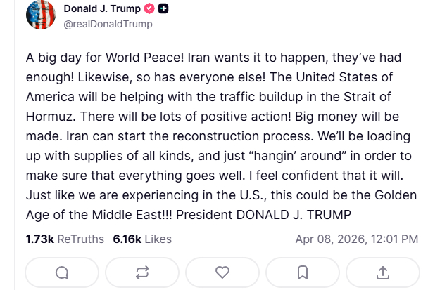

@李建秋的世界
发表于：2026-04-08 05:00
来源：微博
链接：https://m.weibo.cn/status/5285414307106486

“世界和平的大日子！伊朗想要和平，他们已经受够了！同样，所有人也受够了！美利坚合众国将协助解决霍尔木兹海峡的拥堵问题。会有很多积极的行动！大家都会赚大钱。伊朗可以开始重建进程了。我们会满载各种物资，在那儿‘转悠转悠’，以确保万事顺遂。我对此信心十足。就像我们在美国正在经历的一样，这可能是中东的黄金时代！！！”

确认了伊朗可以收费。
好了，大家可以赞美和平塑造者唐纳德特朗普先生了。

---

