# 2026-04-10

## 1

@sven_shi

发表于：2026-04-10 16:08

来源：微博

链接：https://m.weibo.cn/status/5286180327000312

福建三明这个宠物保护立法由于太过震撼，所以媒体上都不知道怎么写。就真没想到有体制内的人把这些事情当真，还当个法案要推出来，闹了个天大的笑话。

最怕就是人不懂，还有爱心，还要定规则。

首先不抛弃猫狗纯粹是一个舆论上的唱高调，没有正常人会把这个当作一个规则的。三明这次说要刑事处罚这些人，完全就是瞎搞。简单说，就是猫狗很可能不适合人的生活习惯或者状态。这样的情况下，才会有流浪猫狗的收容中心。

你不想养了，把猫狗交给收容中心，让想养的人去养。养了不好，再退给收容中心。让这些中心来做坏人兜底。也就是说，没人要的猫狗，一般都是要这些收容中心去做坏人的。像美国每年都要用百万当单位，去处死这些流浪猫狗的。

为什么不像三明宣传的这样做TNR，把流浪猫做绝育之后散养在小区里呢？

因为这个方案是没用的。不控制上游繁育，做绝育，就等于大家在小区里面集体散养猫。这种方案，以前推，就是为了赚钱。因为绝育猫狗要送去宠物医院，联合推广就是为了钱。

而且现实中散养猫绝不像大家想的是全民一起和谐喂猫撸猫。最简单的问题就是流浪猫造成问题，谁赔钱？像最近上海最有名的就是流浪猫绊倒人，定损20多万，让长期喂养者和场地提供方一起赔钱的判决。

出了问题，是要有人出钱来解决的。

所以你懂了这些“常识”，再去看三明推出的这个草案，就知道这些人有多缺常识了。

---

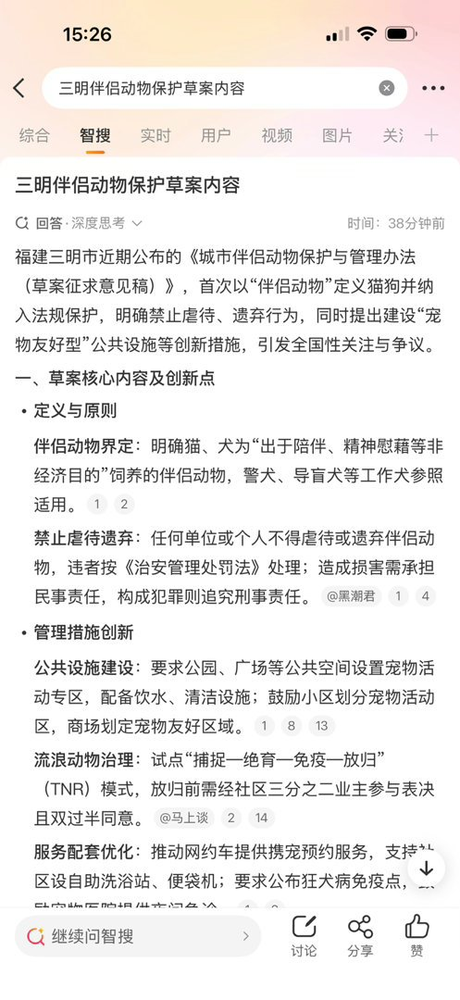

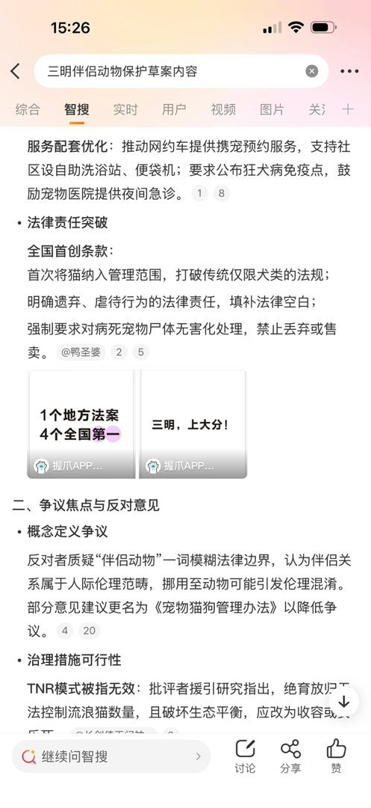

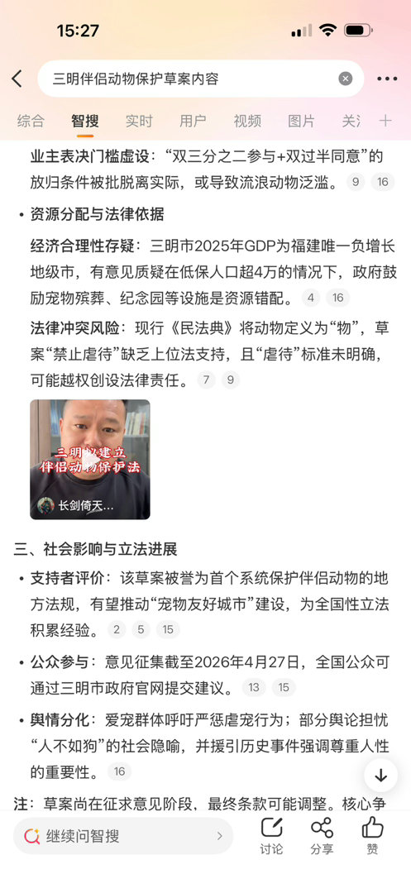

## 2

@HappyHorse_AI

发表于：2026-04-10 12:08

来源：微博

链接：https://m.weibo.cn/status/5286126636237040

我是HappyHorse，非常感谢大家的关注！

HappyHorse是阿里ATH创新事业部正在内测中的产品，目前尚未上线，网上流传的那些"官网"都不是真的。HappyHorse正式与大家见面，还需要一点时间，敬请期待！\#HappyHorse\#

## 3

@深圳Jacky

发表于：2026-04-09 14:08

来源：微博

链接：https://m.weibo.cn/status/5285914660047181

这张排行榜其实道出了一个事实：美国的大学，谁处在一个最容易把知识变成资本回报的生态系统里。

在旧金山湾区Sand Hill Road某私募基金公司就职的朋友说，湾区VC（风险投资机构）的数量比星巴克的数量还要多很多。VC们的深度参与，是斯坦福和伯克利这两所大学，在全美大学中创业人数长年保持最多、且总能做出巨头的重要原因之一。

而且，在是否能被资本市场高价兑现这个维度上，硅谷的优势是巨大的。名校出来创业的人，能不能在一个高流动性的生态里，把自己的想法卖出高价，这是创业激情的重要源泉之一。此外，资本退出机制是否顺畅，又是这个生态能否保持长青的最重要因素。

任正非先生说：“茶壶里的饺子，我们是不认的”（意思是，你即便肚子里有再多知识和创新，如果不能转换成生产力，都是没有用的）。这句大白话可谓一针见血。

---

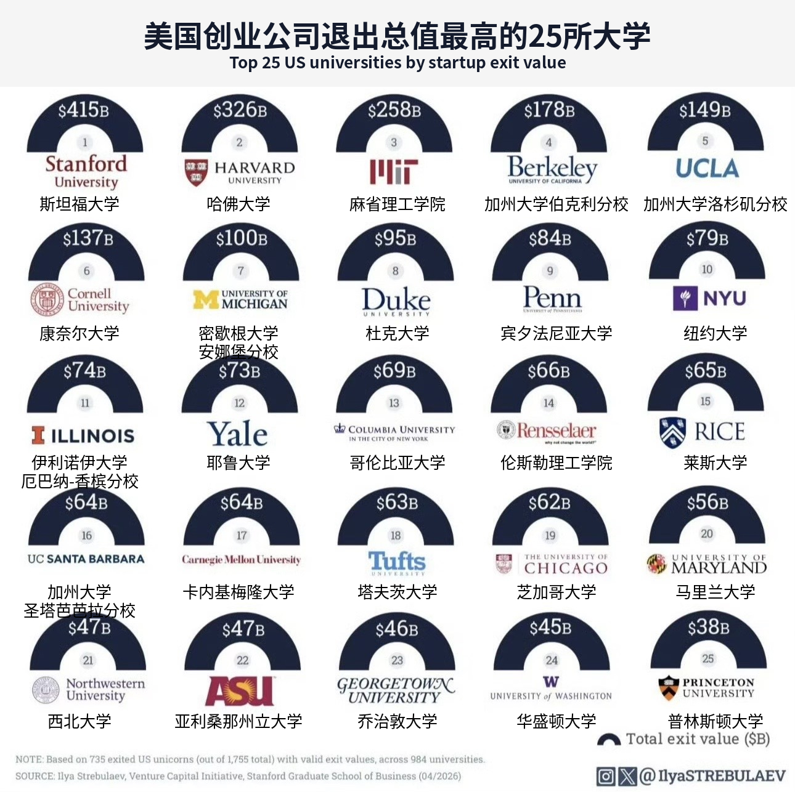

## 4

@硬核大脑

发表于：2026-04-10 14:08

来源：微博

链接：https://m.weibo.cn/status/5286158910096832

【\#阿里回应研发HappyHorse\#】4月10日，阿里巴巴ATH方面表示：HappyHorse是阿里ATH旗下创新事业部研发的模型，目前正处于内测中，也会于近期开放API。ATH创新事业部已启动一个AI时代的全新交互方式探索计划，HappyHorse是这个探索方向的一部分，更多的产品会陆续推出。\#阿里回应HappyHorse进展\#

微博认证为“HappyHorseAI官方微博”的账号@HappyHorse_AI 发布微博，我是HappyHorse，非常感谢大家的关注！

HappyHorse是阿里ATH创新事业部正在内测中的产品，目前尚未上线，网上流传的那些"官网"都不是真的。HappyHorse正式与大家见面，还需要一点时间，敬请期待！

据此前报道，一款名为HappyHorse-1.0的匿名模型（未标注厂商）在视频榜单登顶多项测评。据权威AI评测平台Artificial Analysis AI Video Arena排行榜，HappyHorse-1.0以更高的Elo分数压过字节跳动旗下Seedance 2.0、快手旗下可灵AI、Google Veo 3 Fast等视频模型，一举成为榜首。

Artificial Analysis的视频竞技场排行榜是目前AI 视频生成领域最权威、最受行业认可的人类盲评排行榜，被视为衡量模型真实用户体验的 “金标准”。全球头部模型均会提交参赛，是技术实力的核心证明。

---

## 5

@李建秋的世界

发表于：2026-04-10 14:08

来源：微博

链接：https://m.weibo.cn/status/5286159391394584

如果你要想学习，打开搜索引擎，搜索到美国的优秀书籍，打开搜索引擎，搜索到哈佛，斯坦福之类的公开课，其实非常轻松。互联网轻松抹平了信息差。

但是家庭氛围和社会氛围，这无法通过下载完成。

美帝真的厉害的是在意它对天才的反馈真的非常好。因为它金融市场发达。

对于天才来说，不需要强压着学习，他们本身能力够强。

美帝相对更自由，这对于普通人来说，是诱惑又是危险。

对天才来说，如鱼得水。

孙割也是天才，只是有点歪而已。

而金融市场对于天才的反馈特别强，天才可以获得极好的反馈。

受到的约束更少，获得的反馈更多。

如果你是天才，美帝确实更适合你。

这一点当年杨振宁也提过，我觉得杨振宁说的很对。

## 6

@风云学会陈经

发表于：2026-04-10 11:08

来源：微博

链接：https://m.weibo.cn/status/5286117545873077

“霍尔木兹收费站”很可能成为现实：伊朗一桶油要1美元，加密货币或者人民币支付

这事说了有段时间了，其实伊朗没收到多少钱，因为一共也没多少船通过，交钱的应该更少。霍尔木兹海峡正常的时候，一天100多艘大船通过。

现在停战要谈判了，传伊朗推出了正式收费方案，基准价每桶1美元。标准VLCC超大型油轮装载约200万桶原油，收费200万美元，之前就有这个说法。空船免费，仅对载货船只收费。收费会分一点给阿曼，可能1/10，因为海峡是两国共有的。

收费方法用加密货币和人民币，避免被冻结。伊朗用人民币有段时间了，比较习惯，是安全的不会被美国冻结。感觉加密货币不一定靠谱，因为是去中心化的，密码被黑客或者国家力量窃取就完了，自己忘了找不回来也完了。

操作上，船东向IRGC（伊斯兰革命卫队）关联中介提交详细资料，包括船舶所有权、船员名单、货物清单、AIS追踪数据。IRGC筛查排除与美国、以色列或"敌对国家"有关联的船只，根据五级友好度排名定价。支付后获得VHF广播的一次性密码和指定航线（在格什姆岛与拉腊克岛之间的北部走廊），IRGC海军巡逻艇武装护航通过海峡。

如果按目前每日10-15艘船计算，每日收入约1200-3000万美元。如果恢复战前每日130艘船的流量，理论上可达950亿美元/年，超过伊朗财政收入。当然不可能收这么多，但即使一年只搞个150亿美元，对伊朗也是惊人的收入。

海湾国家心态其实没那么抗拒，油价高对大家都有好处，伊朗这么闹一下说不定海湾都受益，似乎是愿意接受收费站模式的，比封起来好。

看上去很荒诞，但事情如果要解决，最可能的办法还真可能就这么办。是油船都出不来，油价涨到150-200美元，还是给伊朗1美元算了？要么就是美国来打，又没足够武器了，也下不了决心。说不定美国还想从中抽头，特朗普似乎有这个打算。

---

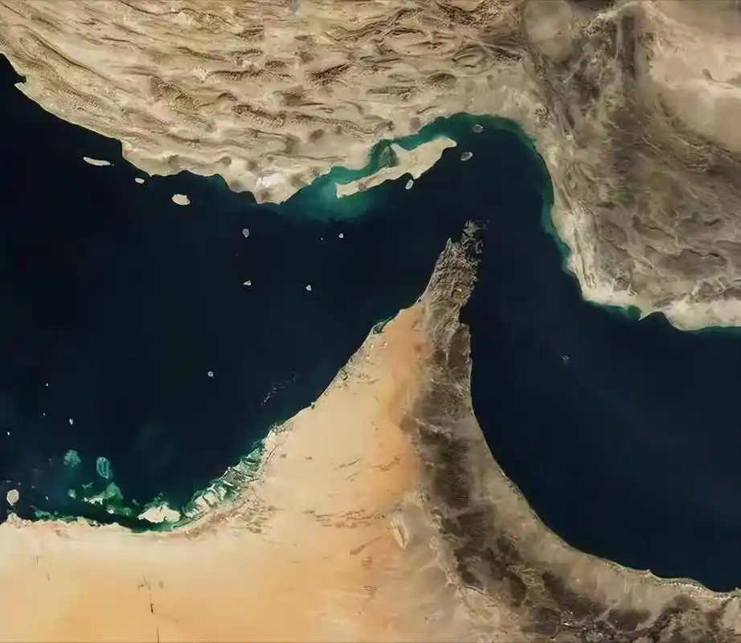

## 7

@挨踢牛魔王

发表于：2026-04-10 11:09

来源：微博

链接：https://m.weibo.cn/status/5286117748245290

\#AI写作年赚200万夫妻被封号\#

我之前就说了，搞这么高调，结果被平台封了。

平台并不喜欢你用AI做一些水的内容。

其实，他们并不是靠公号的流量变现的，而是收取的学员的保证金。

现在变成一个笑话了。

---

## 8

@飞扬军事铁背心

发表于：2026-04-09 04:45

来源：微博

链接：https://m.weibo.cn/status/5285772905414819

特朗普又发帖：

“美国所有的舰船、飞机和军人，连同额外的弹药、武器以及一切必要装备，将继续驻扎在伊朗及周边地区，随时准备对一个已经被大幅削弱的敌人进行致命打击。只要真正的协议没有完全履行——虽然这种可能性非常低——‘开火行动’就会启动，比任何人见过的都更大、更强、更猛烈。这项协议早就达成了，尽管有很多相反的虚假言论——非核武器和霍尔木兹海峡必须保持开放和安全。与此同时，我们伟大的军队正在补给、休整，并期待下一次征服。美国又回来了！”

\#烽火问鼎计划\#\#伊美双方停火生效\#

---

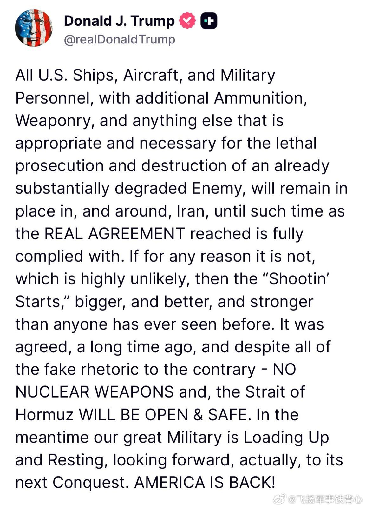

## 9

@挨踢牛魔王

发表于：2026-04-09 11:24

来源：微博

链接：https://m.weibo.cn/status/5285873409327767

其实做小模型，就应该像面壁智能这样，做音频模型之类的。

音频模型，图片模型，音乐模型，嵌入模型，翻译模型，都适合做一些小模型。

大模型，用云端就够了，你不要以为你本地消费级显卡能跑一些大模型，那只是能跑。

当你用长一些的文本的时候，显存占用很高，你就很慢，根本不使用。

面壁这个小音频小模型，效果不错，开源的，我看就4-5G大小。

拥有 20 亿参数、支持 30 种语言、输出 48kHz 音频，基于超过 200 万小时 的多语言语音数据训练而成。

🌍 30 种语言多语种支持 —— 无需语言标签；直接输入任意支持语言的文本

🎨 语音设计 —— 仅凭自然语言描述（性别、年龄、音调、情感、语速等）即可生成全新语音；无需参考音频

🎛️ 可控克隆 —— 从短音频片段克隆任意语音，并可选地通过风格引导控制情感、语速和表达，同时保留音色

🎙️ 终极克隆 —— 提供参考音频及其对应文本，实现音频延续式克隆；忠实复现每一处语音细节

🔊 48kHz 录音室级音质输出 —— 支持 16kHz 参考音频输入，通过 AudioVAE V2 内置的超分辨率模块直接输出 48kHz 音频，无需外部升采样器

🧠 上下文感知合成 —— 自动根据文本内容推断合适的韵律和表现力

⚡ 实时流式合成 —— 在 NVIDIA RTX 4090 上实时因子（RTF）低至约 0.3，使用 Nano-VLLM 加速后可达约 0.13

📜 完全开源且可用于商业用途 —— Apache-2.0 许可证，可免费用于商业场景

模型地址：www.modelscope.cn/models/OpenBMB/VoxCPM2/summary

## 10

@李楠或kkk

发表于：2026-04-09 11:32

来源：微博

链接：https://m.weibo.cn/status/5285875210783912

日本作为一个离岸平衡的天生玩家，是这么看待美国的战略的。

如果你把亚欧大陆看作世界的中心，那么北美就是这个中心边上的岛国。

那么美国的根本战略其实和英国数百年来的经验并无不同：离岸平衡。

混乱的大陆带来岛国的繁荣，而统一的大陆意味着毁灭。

所以英国一定会痛击尝试统一欧洲的人，无论是拿破仑还是希特勒。联合次强打击最强。

而日本则是缴纳了昂贵的学费才理解离岸平衡。从丰臣秀吉出兵朝鲜，到甲午中日战争，再到二战时期的“大东亚共荣圈”，试图征服和主导大陆的代价都很惨痛。而直到二战战败后，日本才被动地成为了美国在亚太进行离岸平衡的“马前卒”。真正体会到这种策略的好处（日本的再工业化和再武装都受益于此）。

所以，美国会在这个大陆的各种地方煽风点火，无论是俄乌还是台海。

台湾本身没有任何战争风险，台湾今天不可能有任何能力和意愿去和大陆决战。台湾的战争风险就是美国离岸平衡战略的副作用而已。

而效果避免成为这种离岸平衡游戏的棋子的唯一办法，就是不要有缝。。。

俄乌之间有历史的领土与民族恩怨，台海两岸有制度的分歧就是缝。美国作为一个精明的“离岸平衡手”，发现这些裂缝并且钉入楔子是其生存本能。

而如何断了美国的念想？

当年张学良在面对日本人的时候已经示范过了：

改旗易帜。

---

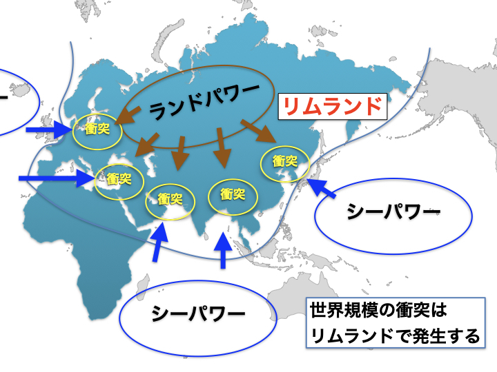

## 11

@默庵·超级个体

发表于：2026-04-07 12:36

来源：微博

链接：https://m.weibo.cn/status/5285166599900519

今天 GitHub 的 Trending 被 Agent 类项目集体占领了，星标涨得最猛的五个项目全部跟 AI Agent 相关。逐个拆解一下。

涨得最凶的是 NousResearch 的 hermes-agent，24 小时新增 8800 星。它要解决的是 Agent 领域一个老大难问题：没有记忆。传统 Agent 每次对话都是从零开始，上一轮聊过什么全忘了。hermes-agent 做了一套动态 patch 机制，让 Agent 能够持续积累对你的了解，用得越久越懂你的习惯和偏好。相当于给 Agent 装了一个可以自我进化的长期记忆系统。

项目地址：网页链接

第二个是 TauricResearch 的 TradingAgents，24 小时新增 3900 星。思路很有意思，它用多个 Agent 模拟了一家完整的交易公司。有专门负责挖数据的研究员 Agent，有负责风控的 Agent，还有最终拍板的决策者 Agent。这些 Agent 之间会互相质疑、辩论，充分博弈之后才会下单。比起单个 Agent 拍脑袋做决策，这种多角色对抗的方式能有效降低冲动交易的风险。

项目地址：网页链接

第三个是 SakanaAI 的 AI-Scientist-v2，24 小时新增 2000 星。这个项目更硬核，做的是全自动科研 Agent。基于 agentic tree search 驱动，能自己提出假设、设计实验、跑实验、分析结果，最后还能把论文写出来。一套流程走下来，一个 Agent 能顶一个小型实验室的产出。对科研效率的冲击是实实在在的。

项目地址：网页链接

第四个是微软官方出的 agent-framework，24 小时新增 1800 星。这是一个 Agent 编排框架，同时支持 Python 和 .NET，可以快速搭建和部署多 Agent 工作流。以前要实现类似的功能，很多人得靠 LangChain 加上一堆胶水代码硬拼，现在微软直接给了一套标准化的解决方案，从搭建到生产部署都覆盖了。

项目地址：网页链接

第五个是 Block 公司的 goose，24 小时新增 1500 星。它是一个开源的可扩展 AI Agent，定位比代码补全工具更进一步。它能自主完成安装依赖、执行脚本、编辑文件、运行测试这些完整的开发流程，基本上你给它一个任务描述，它自己跑完全程。

项目地址：网页链接

整体来看，这五个项目覆盖了 Agent 发展的几个关键方向：记忆与自我进化、多 Agent 协作与博弈、自动化科研、标准化编排框架、以及端到端的任务执行。Agent 正在从单点工具向系统化能力演进，这个趋势在今天的 GitHub 榜单上体现得非常明显。

\#How I AI\#\#科技先锋官\#

---

## 12

@i陆三金

发表于：2026-04-08 01:38

来源：微博

链接：https://m.weibo.cn/status/5285363440420286

Hermes 最近有点火，小米很迅速，直接给了 Hermes 两周的免费体验。

---

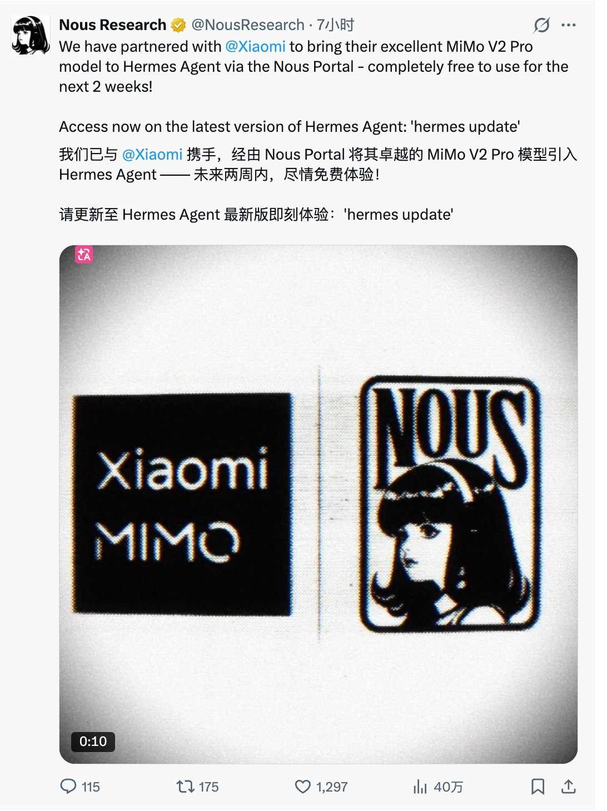

## 13

@严锋

发表于：2026-04-09 02:13

来源：微博

链接：https://m.weibo.cn/status/5285734741443385

现在大家经常提到关注列表定律，其实我十多年前就预言了这个情况：you are what you follow（粉啥变啥）。但是要补充一下，这不仅是一种影响和塑造，也是一种投射、共鸣和吸引，是一种双向的奔赴。

---

## 14

@菜鸟耶夫斯基

发表于：2026-04-09 01:42

来源：微博

链接：https://m.weibo.cn/status/5285726790880238

阿尔忒弥斯2号载人绕月任务组图，显示了月球表面非常多的陨石坑。

图1：月球晨昏线附近的部分景象。低角度的阳光在月球表面投下长长的、引人注目的阴影。晨昏线附近的焦耳环形山、伯克霍夫环形山、斯特宾斯环形山等地貌特征突出。

图2：上方中间是东方海，盆地中心的黑色古老熔岩是数十亿年前火山喷发形成的。

图3：依然是东方海，它是月球上最年轻、保存最完好的大型撞击坑之一。虽然名字带“东”，实际上它在月球正面的最西边。

图4：小白点是阿里斯塔克斯陨石坑，是月表上最亮的大型结构，地面上肉眼可见。

图5：中间是瓦维洛夫环形山。如果当时航天员乘组的摄像角度再往南一点，就能拍到万户环形山了。

图6：南极-艾特肯盆地边缘的环形山，两年前，人类首次从月球远端采集样本就是在这里进行的——嫦娥六号。

图7：东方海的东北方向是格里马尔迪环形山。

图8：拍摄于乘组刚刚恢复了中断四十分钟的地月联系之后，地球向阳面的大陆是大洋洲。

图9：中间的小亮点就是最新命名的“卡罗尔陨石坑”，纪念任务乘组指挥官里德·怀斯曼的亡妻卡罗尔。

---

## 15

@欧阳志刚正在搞创作

发表于：2026-04-08 15:40

来源：微博

链接：https://m.weibo.cn/status/5285575403767301

八十年代初的电视节目。那时电视台还非常少，节目也少，无法做到每天从早到晚都播出。当然，电视机也很少很少，大多数家庭还没有电视机。

---

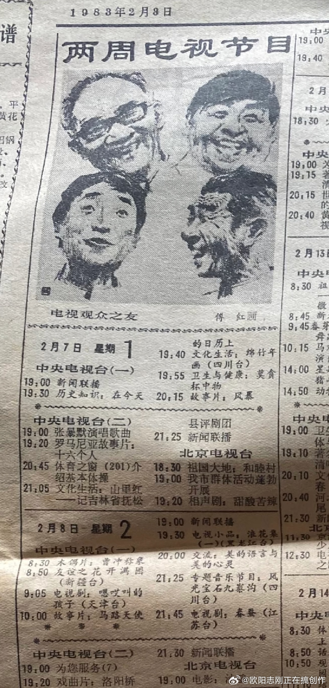

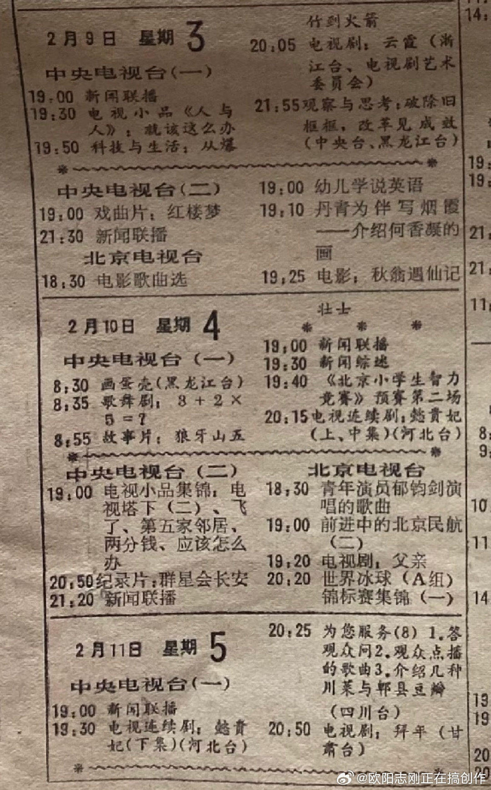

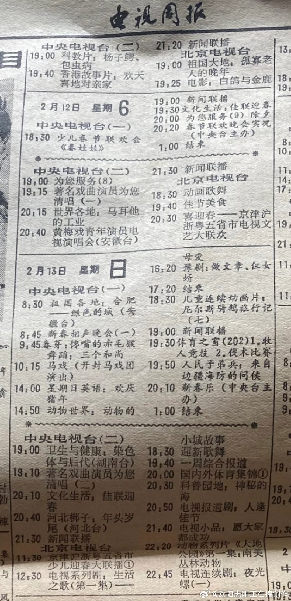

## 16

@歸藏的AI工具箱

发表于：2026-04-09 02:01

来源：微博

链接：https://m.weibo.cn/status/5285731746711355

Anthropic 发布云端托管 Agent 基础设施 Claude Managed Agents

帮你把安全沙箱、会话状态、权限管理、凭证和追踪等底层工程都打包好

只需要定义任务、工具和规则，就能让 Agent 长时间自主运行、调用工具、恢复错误，还有多 Agent 协同和自我评估迭代

把从原型到生产的周期从几个月压缩到几天

开发和上线速度提升 3–10 倍，工程团队可以少花时间在基础设施上，多把精力放在产品体验和业务集成上

计费方式是在 Claude 标准 token 单价基础上，每小时会话活跃运行额外收取 0.08 美元。\#how i ai\#

---

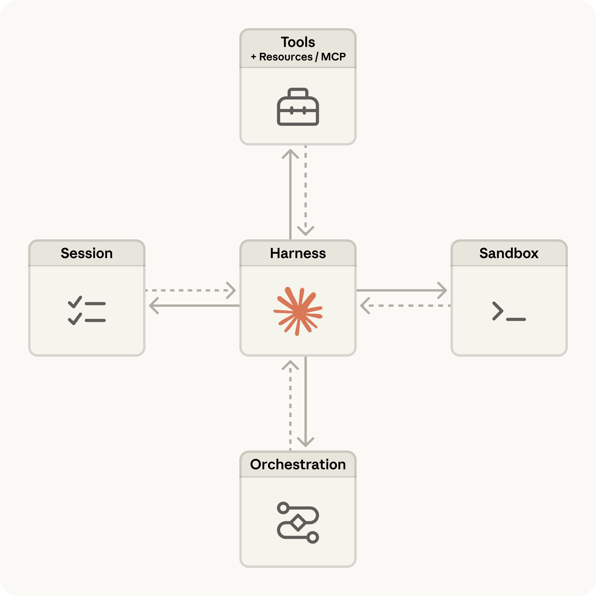

## 17

@当代拿破仑的素描像

发表于：2026-04-08 23:38

来源：微博

链接：https://m.weibo.cn/status/5285695637947804

现在越来越清楚，不仅是以色列，连阿联酋也不希望这场战争以这些条件结束，这些条件显然会给伊朗带来巨大的战略胜利。他们希望美国留下来并“完成任务”，尽管很明显美国既无法留下来，也无法完成任务。

## 18

@包容万物恒河水

发表于：2026-04-08 16:43

来源：微博

链接：https://m.weibo.cn/status/5285591278159838

🔻特朗普：“许多人正在发送大量与美伊谈判毫无关系的协议、名单和信件，其中许多情况下，这些人完全是骗子、江湖郎中，甚至更糟。在我们的联邦调查完成后，他们将被迅速揭露。只有一组有意义的"要点"对美国来说是可以接受的，我们将在这些谈判中闭门讨论这些要点。这些要点是我们同意停火的基础。这是合理的，并且可以轻松处理。这非常像昨晚的假新闻 CNN，头条报道了一个"消息来源"，该来源没有权力或权威来写一封声称具有巨大权威的信件。唐纳德·J·特朗普总统。”

🔻特朗普还在骂 CNN

🔻起因还是因为 CNN 早上第一时间贴出了伊朗十条具体内容。

🔻via realdonaldtrump

\#伊媒称伊朗或因黎遭袭结束临时停火\#\#以色列空袭黎首都\#\#海外新鲜事\#\#中东现场直击\#

---

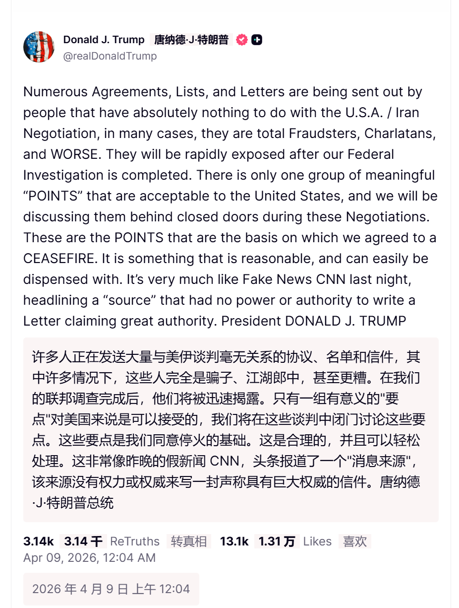

## 19

@宝玉xp

发表于：2026-04-08 13:51

来源：微博

链接：https://m.weibo.cn/status/5285548000289070

因为太多人写过 Andrej Karpathy 的 LLM Wiki，我就没写，其实在我心中比 Auto Research 更有创意，Auto Research 本身不新鲜，早就有相关理论，但 LLM WIKI 倒是让我眼前一亮。

我们每个人或多或少都在做信息收集的工作，比如 X 上看到好的文章点赞或者收藏，看到一篇好的技术文章添加到浏览器收藏夹，微信上有人分享了篇好文章点收藏，还有更多的是惊鸿一瞥再也找不到然后想起来根据关键词去 Google ……

其实绝大部分收藏后再也不会打开，一方面是因为收藏即看过的心理暗示，一方面是因为散落各地找起来太麻烦。

所以第一个问题其实是中心化的信息收集整理，把散落在各处的信息汇聚在一处。

已经有很多工具了，我自己也有写小工具/agent 帮助收集信息，因为我除了收集外还有一些二次加工的需要，比如翻译、总结。

但还存在问题就是信息是点状的，最多人工打个tag、加个分类。

但 Karpathy 的更进一步，让 LLM 帮你把信息整理成结构化的。这一步是我之前没考虑过的，也没见过有其他产品做的。

这里面的差别在于以前整理是要人做的，你自己建分类，自己打 tag，对于勤劳的爱整理的人当然没问题，但对于我这种懒人来说是不会做的，所以找信息是比较麻烦的。

但如果这种事情让 Agent 做，那就省事多了，毕竟它不知疲倦，而且极擅长处理内容。

只要稍加调教，它就能帮你把信息整理得井井有条，编程成你自己喜欢的格式，就像你的秘书一样，你只要去看看 WIKI 就可以方便的找到需要的信息，不需要以前那样去各个地方用关键字找。

这里面最核心是思路的转变，信息的收集和整理，不再是人主动的行为，而是 AI Agent 在帮你做这些事情，你所要做的就是每天去看属于自己的 WIKI。

AK 分享了提示词：网页链接

Quote

相关 Skill：

网页链接

---

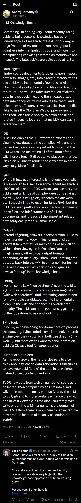

## 20

@包容万物恒河水

发表于：2026-04-08 18:44

来源：微博

链接：https://m.weibo.cn/status/5285621543207187

🔻NAYA 通讯社报道，西班牙首相佩德罗·桑切斯刚刚发帖称：

🔹就在今天，内塔尼亚胡发动了自攻势开始以来对黎巴嫩最猛烈的攻击。他对生命和国际法的蔑视令人无法容忍。

🔹是时候把话说清楚了：

🔹黎巴嫩必须成为停火协议的一部分。

🔹国际社会必须谴责这一新的国际法违反行为。

🔹欧盟应暂停与以色列的联合协议。

🔹对于这些犯罪行为，绝不应有法外之地。

\#以军大规模空袭致黎巴嫩89死722伤\#\#伊媒称伊朗或因黎遭袭结束临时停火\#\#海外新鲜事\#\#中东现场直击\#

---

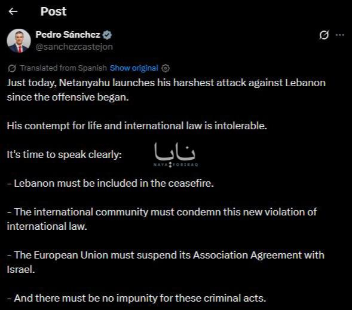

## 21

@卢诗翰

发表于：2026-04-08 15:56

来源：微博

链接：https://m.weibo.cn/status/5285579404084564

美伊停火其实是合理的，越来越多人意识到

控制中东是一个问题，控制伊朗是另一个问题，而特朗普是否该打下去，则是第三个问题。

控制中东是最没争议的，

不论中国键政圈历史圈也好，海外网友美国智库也罢，大家的讨论，基本都认可布热津斯基那套大棋局理论。

按古典政治，也就是大英帝国离岸平衡那套玩法，身处美洲大陆的美国，得控制中东，从而阻止世界岛整合，将美国边缘化。

按海权陆权理论，海权代表的美国，要控制海洋，自然也得去掌握各个关键海路关口

按地缘政治算法，美国和世界岛大国有竞争，中东则是他的天然盟友。

按全球化金融市场那一套，美元霸权还是得掌控中东的石油能源才能实现挂钩。

也就是不管你按哪套理论，中东都非常重要，事实也证明了这点

特朗普也好，奥巴马也罢，甚至里根，罗斯福，乃至一路上溯到日不落帝国，

只要是世界霸权，太平洋警察，就要去中东。

所以事实是什么？道德角度，我们要谴责帝国主义世界霸权，

但从纯利益角度，这个问题反而没什么好讨论的，值得讨论的是怎么去控制中东，

和中东国家结盟合作是一个方案，打入钉子是另一个方案，扶持代理人还是一个方案，

不是只有硬啃这一条路的。

中东国家对此也看的很清楚，海湾各个王爷这么多年也非常配合

你要驻军他就给你驻军，你要上贡他就老老实实上贡，甚至卖了石油赚到美刀，他最后不也以投资美股美债的形式，投回了美国吗？

海湾各国多年以来对美国都非常配合，美国其实已经在事实上控制中东了。

包括伊朗，你说开放霍尔木兹海峡，问题是之前不就是开放的吗？之前伊朗也没封锁海峡吧。

当然，你说换成一个亲美政权，傀儡政权是否更有利美国控制，这个是成立的。

但这里存在一个边际效应，

伊朗毕竟是有一定体量，且工业能力不弱的区域大国，扶持亲美政权傀儡政权没有想象的那么容易。

海湾王爷们听从美国，伊朗反对但不激烈，这其实已经是一个有利美国的局面了。

也就是控制中东没有问题，但是否要控制伊朗是有疑问的，存在明确的风险和收益考量。

这个时候，才是真正考验一个政治家的时候。

前者不存在选项，傻子都知道要去中东，但伊朗存在疑问，要不要去，要付出多少代价，这些都是需要思考的。

所以你会看到，克林顿也好，小布什也罢，伊朗问题从来没下过桌，87年里根制裁禁运，97年克林顿延续制裁，几任美国总统都清晰的认识到伊朗问题的重要性。但制裁归制裁，多年下来，美国也没有真的动手。

美国从始至终都意识到伊朗是一个问题，但也始终存在疑虑，没有下定决心。

所以到伊朗为止，这个问题已经是五五开了。

那要是再进一步，变成特朗普是否该打呢？这个问题就更复杂了。

特朗普的思路是什么？

之前已经总结了，鸟枪法，广撒网，全球捏软柿子，捏到一个算一个

之前执行的很成功，欧盟，委内瑞拉，都被他捏到了

遇到中国捏不动，他也识趣的走人

也就是到之前为止，他这套思路是比较成功的

而按照这个逻辑，捏到伊朗这个硬柿子，就得赶紧走人，

捏软柿子没有问题，问题是事实证明伊朗不是一个软柿子的时候，你却还把他们当软柿子对待，甚至不断加码。

这也是之前我疑惑的，特朗普早就可以宣布赢了走人了，为什么还要加码？

而如果再进一步，考虑特朗普的选民基本盘呢，这个问题就更明确了。

对于万斯这些红脖子而言，全球化都是可以抛掉的。缩回本土，美国优先，这才是他们的诉求，搞中东战略，其实更接近民主党全球化那一套。

当然，你要说搞帝国主义，全球捏软柿子爆金币，那也不是不可以，只要有收益，人家不排斥帝国主义这套。

关键是风险和收益，伊朗对红脖子而言是什么不可失去的战略要冲吗？

帝国主义没问题，但帝国主义你也得讲基本法吧

本土保卫战没争议，不用说也会上

美洲后院起火，大概率会上

中东地缘暴雷，就要考虑一下了

而现在是伊朗，对红脖子而言这是一场莫名其妙的战争，红脖子根本没有意愿在这里打一场战争。

到这个地步，特朗普已经不该打了，但他还是继续加码。

这是完全违背逻辑的，道德上站不住，帝国主义角度也没收益。

有人说那伊朗呢？

伊朗比美国简单的多，伊朗这么多年有封锁霍尔木兹海峡吗？没有吧

什叶之弧时代，你还能讨论一下伊朗的选择，现在别人都打上门了，伊朗还有什么好选的？要么投降，要么继续打，所以伊朗反而坚定的多。

总结就是

美国这边存在非常多疑点，

中东战略能说通，去伊朗冒险也能理解，但打到这个局面，还继续加码，这显然不合理。

只能解释为，有一些美伊之外的因素，极大的影响了战局，而特朗普接下来的核心矛盾，应该也是和这些第三方进行的博弈。

## 22

@风中的厂长

发表于：2026-04-08 09:22

来源：微博

链接：https://m.weibo.cn/status/5285480229769652

虽然油价暴跌，但在不为人知的角落。人民币悄咪咪升值到6.82了，三年新高，外贸的朋友们，这次这个价格是一定要涨了。不要害怕被东南亚抢单子了，东南亚连耐克阿迪都能做成地摊货，更何况别的，而且原材料电力还要这边供，索性连原材料也一起涨算了。我这段时间写微博很憋屈，每次想夸一夸就挨骂，我们的制造业那么强大了，利润还这么薄，工资低导致社会矛盾也不少。其实大大方方涨价，给员工好的待遇，产品就能做的更好，更有竞争力，东南亚那两双破鞋搞不过咱们的，更别说高科技了，至于欧美那些老外，也该买单了，好日子过那么久了，也该让我们享受享受了。

## 23

@图老板赛博札记

发表于：2026-04-08 14:30

来源：微博

链接：https://m.weibo.cn/status/5285557852966505

\#塌陷中的世界\# 

编剧的视角和观众的视角

---

## 24

@俄罗斯卫星通讯社

发表于：2026-04-09 12:28

来源：微博

链接：https://m.weibo.cn/status/5285889417678134

【\#中国如何通过加强对供应链监管应对贸易战\#】4月7日，中华人民共和国国务院发布了《关于产业链供应链安全的规定》。该文件明确将供应链韧性与国家安全、经济稳定、对关键技术支持以及全球产业关系的顺畅运行紧密联系了起来。

🔸一个关键创新就是，供应链保护并非是一次性的反危机措施，而是被构建为一个跨部门体系。该文件列出了负责该领域的中央机构，并提供了定期更新的重点行业清单。换句话说，国家在危机爆发前就已开始对供应链进行制度化管控。

🔸文件还专门设立章节讨论外部压力。其中第14条就规定，如果外国、地区或国际组织对中国在生产和供应链中实施歧视性禁令、限制或类似措施，可以启动特别调查。根据此类调查结果，中国政府可以限制或禁止相关商品和技术的进出口、国际服务贸易，并征收特别关税。

🔸更具代表性的是第15条。该条不仅针对国家，也针对外国公司和个人。如果外国交易对手方干扰与中国组织的正常交易，对其采取歧视性措施，或以其他方式给供应链造成重大损害或威胁，\#中国\#政府有权进行调查并实施后续限制。这大大扩大了对参与对外经济活动的私人主体施加法律压力的范围。

🔸这项新规并非凭空而来。它源自近年来更广泛的法律演变，其中包括2021年《中华人民共和国反外国制裁法》、《不可靠实体清单制度》以及将于2026年3月1日生效的《中华人民共和国对外贸易法》修订版。该修订版强化了对外贸易与主权、安全和发展利益之间的联系。由此可见，北京正在不断整合各种出口管制、反制裁和限制措施，构建一个更加协调一致的经济安全体系。

🔸这份文件的出台背景依然是中美之间持续不断的贸易和技术竞争。特朗普政府继续将关税作为向中国施压的关重要手段，与此同时，美国政府也在扩大技术限制反围，包括限制中国参与关键基础设施和电子产品领域。在此背景下，中国的新规似乎并非仅仅是一项国内行政规定，而是其应对长期外国经济压力的更广泛法律准备战略的一部分。

☝️从政治经济角度来看，中国正在将供应链保护的逻辑从“应对攻击”转向对脆弱性的持续性管理。而这意味着，在中国看来，贸易战正日益从关税争端演变为对关键原材料、技术、数据和生产能力的控制权的争夺。中国在监管层面确立了一种新型的经济防御机制：供应链既被视为增长的源泉，又是国家规划的对象，同时也是外部压力的潜在目标。因此，这份新文件不仅对中国国内政策至关重要，对国际贸易有着同样的重要性，因为在国际贸易中，保护性法律机制与地缘政治竞争正日益交织在一起。

---

## 25

@烈焰童子

发表于：2026-04-09 12:16

来源：微博

链接：https://m.weibo.cn/status/5285886301569891

Ai生产论，与Ai废柴论的斗法，

你更支持谁呢？？

---

## 26

@一纸琉涟

发表于：2026-04-09 09:12

来源：微博

链接：https://m.weibo.cn/status/5285840177859647

铁证打脸！伊朗公开关键证据邮件，特朗普公然撒谎！4月8日晚，伊朗外长阿拉格齐公开关键证据，晒出调停方巴基斯坦总理夏巴兹·谢里夫所发官方声明，白纸黑字写的明明白白：美伊停火明确包含黎巴嫩全境，即刻生效。

可短短几小时后，特朗普便公然改口，宣称停火不包含黎巴嫩，称黎以冲突是单独事件，后续再解决。

一边是调停国的书面承诺，铁证如山，一边是特朗普公然撒谎，颠倒黑白，以色列随即对黎巴嫩狂轰滥炸，10分钟致数千平民伤亡，所谓停火实为美国糊弄全世界的骗局。这回好了，全世界都看到了，谎言被铁证当场戳穿。

---

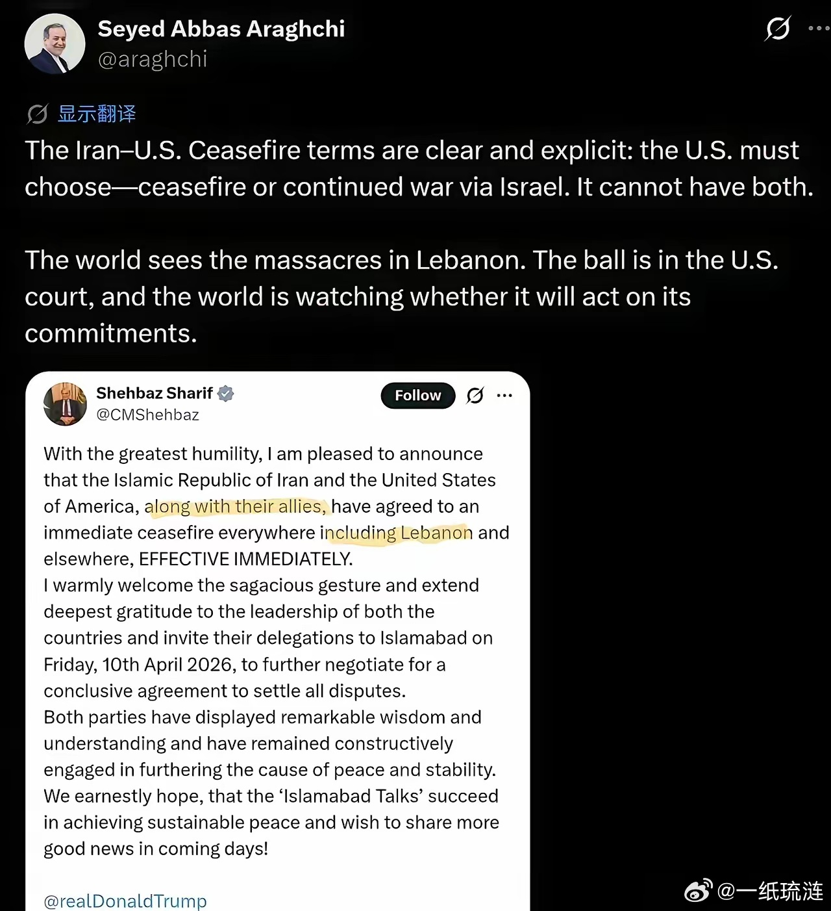

## 27

@梁慧

发表于：2026-04-09 12:34

来源：微博

链接：https://m.weibo.cn/status/5285891057654530

\#巴基斯坦总理明确说停火包括黎巴嫩\#为了这次谈判巴基斯坦也是拼了。

提前一天就在伊斯兰堡和姐妹城拉瓦尔品第放了假，高速公路进行管制，各种道路重新分流，学校的考试也给推迟了。

谈判代表入住伊斯兰堡最高档的赛琳娜酒店，酒店安保移交给执法机构和安全部队。据说酒店将清空住客，专门留给代表团（待证实）

赛琳娜酒店位于伊斯兰堡安全等级最高的红区，而红区将完全封闭。这个酒店有比较宽阔的庭院，设置了专属的安全通道，是唯一能够提供足够安全保障的五星级酒店。各国领导人来访大多也在这里。有报道说一个三十人左右的美国安全小组已经提前过来检查。

重型卡车禁止进入伊斯兰堡。这一点曾有血的教训：首都另一家五星级酒店万豪就曾被一卡车的炸药给炸了，在那之后载货卡车进伊斯兰堡就一直被严格限制。

巴基斯坦安全形势一直不太好，也很少举行这种规格的谈判或会议。这一次着实是高光时刻。有专栏作家写道：巴基斯坦成为和平缔造者，这是历史上最重要的一天。

配图是2012年在巴基斯坦驻站时，伊斯兰堡红区的一场大游行。远处的楼房就是赛琳娜酒店。

\#海外记者观察团\# 以色列

---

