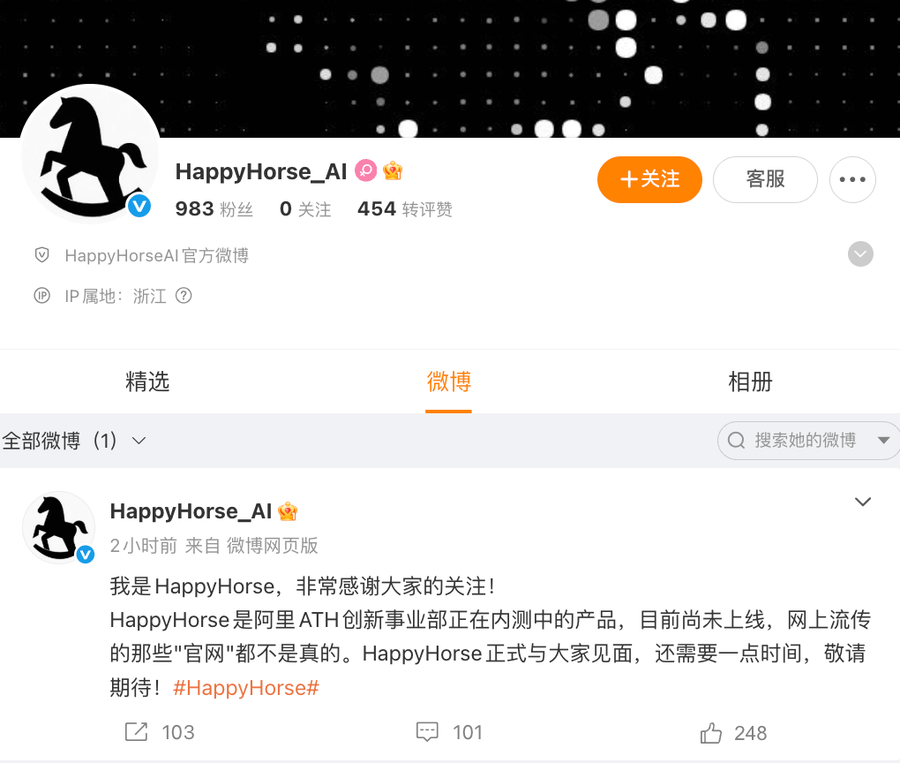

@硬核大脑
发表于：2026-04-10 14:08
来源：微博
链接：https://m.weibo.cn/status/5286158910096832

【\#阿里回应研发HappyHorse\#】4月10日，阿里巴巴ATH方面表示：HappyHorse是阿里ATH旗下创新事业部研发的模型，目前正处于内测中，也会于近期开放API。ATH创新事业部已启动一个AI时代的全新交互方式探索计划，HappyHorse是这个探索方向的一部分，更多的产品会陆续推出。\#阿里回应HappyHorse进展\#

微博认证为“HappyHorseAI官方微博”的账号@HappyHorse_AI 发布微博，我是HappyHorse，非常感谢大家的关注！
HappyHorse是阿里ATH创新事业部正在内测中的产品，目前尚未上线，网上流传的那些"官网"都不是真的。HappyHorse正式与大家见面，还需要一点时间，敬请期待！

据此前报道，一款名为HappyHorse-1.0的匿名模型（未标注厂商）在视频榜单登顶多项测评。据权威AI评测平台Artificial Analysis AI Video Arena排行榜，HappyHorse-1.0以更高的Elo分数压过字节跳动旗下Seedance 2.0、快手旗下可灵AI、Google Veo 3 Fast等视频模型，一举成为榜首。

Artificial Analysis的视频竞技场排行榜是目前AI 视频生成领域最权威、最受行业认可的人类盲评排行榜，被视为衡量模型真实用户体验的 “金标准”。全球头部模型均会提交参赛，是技术实力的核心证明。

---

