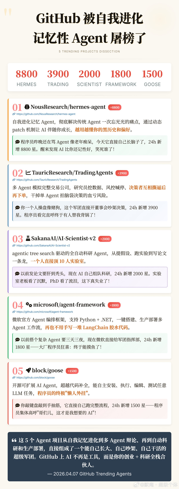

@默庵·超级个体

发表于：2026-04-07 12:36

来源：微博

链接：https://m.weibo.cn/status/5285166599900519

今天 GitHub 的 Trending 被 Agent 类项目集体占领了，星标涨得最猛的五个项目全部跟 AI Agent 相关。逐个拆解一下。

涨得最凶的是 NousResearch 的 hermes-agent，24 小时新增 8800 星。它要解决的是 Agent 领域一个老大难问题：没有记忆。传统 Agent 每次对话都是从零开始，上一轮聊过什么全忘了。hermes-agent 做了一套动态 patch 机制，让 Agent 能够持续积累对你的了解，用得越久越懂你的习惯和偏好。相当于给 Agent 装了一个可以自我进化的长期记忆系统。

项目地址：网页链接

第二个是 TauricResearch 的 TradingAgents，24 小时新增 3900 星。思路很有意思，它用多个 Agent 模拟了一家完整的交易公司。有专门负责挖数据的研究员 Agent，有负责风控的 Agent，还有最终拍板的决策者 Agent。这些 Agent 之间会互相质疑、辩论，充分博弈之后才会下单。比起单个 Agent 拍脑袋做决策，这种多角色对抗的方式能有效降低冲动交易的风险。

项目地址：网页链接

第三个是 SakanaAI 的 AI-Scientist-v2，24 小时新增 2000 星。这个项目更硬核，做的是全自动科研 Agent。基于 agentic tree search 驱动，能自己提出假设、设计实验、跑实验、分析结果，最后还能把论文写出来。一套流程走下来，一个 Agent 能顶一个小型实验室的产出。对科研效率的冲击是实实在在的。

项目地址：网页链接

第四个是微软官方出的 agent-framework，24 小时新增 1800 星。这是一个 Agent 编排框架，同时支持 Python 和 .NET，可以快速搭建和部署多 Agent 工作流。以前要实现类似的功能，很多人得靠 LangChain 加上一堆胶水代码硬拼，现在微软直接给了一套标准化的解决方案，从搭建到生产部署都覆盖了。

项目地址：网页链接

第五个是 Block 公司的 goose，24 小时新增 1500 星。它是一个开源的可扩展 AI Agent，定位比代码补全工具更进一步。它能自主完成安装依赖、执行脚本、编辑文件、运行测试这些完整的开发流程，基本上你给它一个任务描述，它自己跑完全程。

项目地址：网页链接

整体来看，这五个项目覆盖了 Agent 发展的几个关键方向：记忆与自我进化、多 Agent 协作与博弈、自动化科研、标准化编排框架、以及端到端的任务执行。Agent 正在从单点工具向系统化能力演进，这个趋势在今天的 GitHub 榜单上体现得非常明显。

\#How I AI\#\#科技先锋官\#

---

