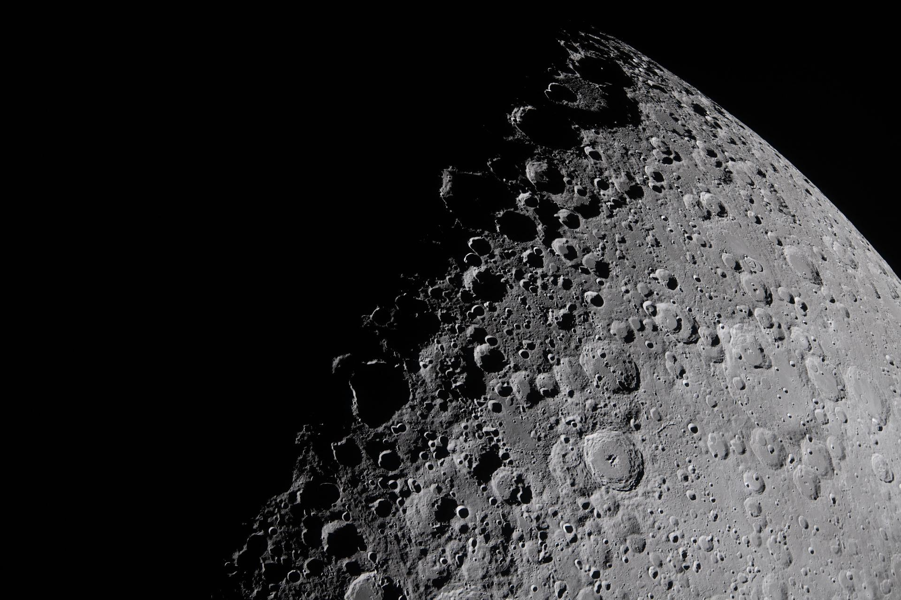
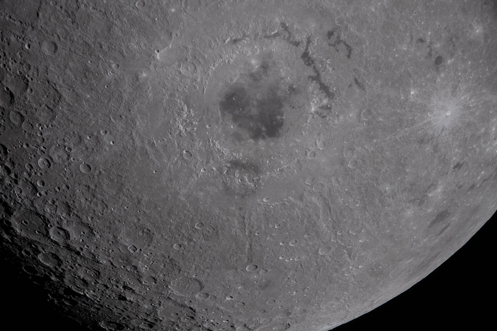
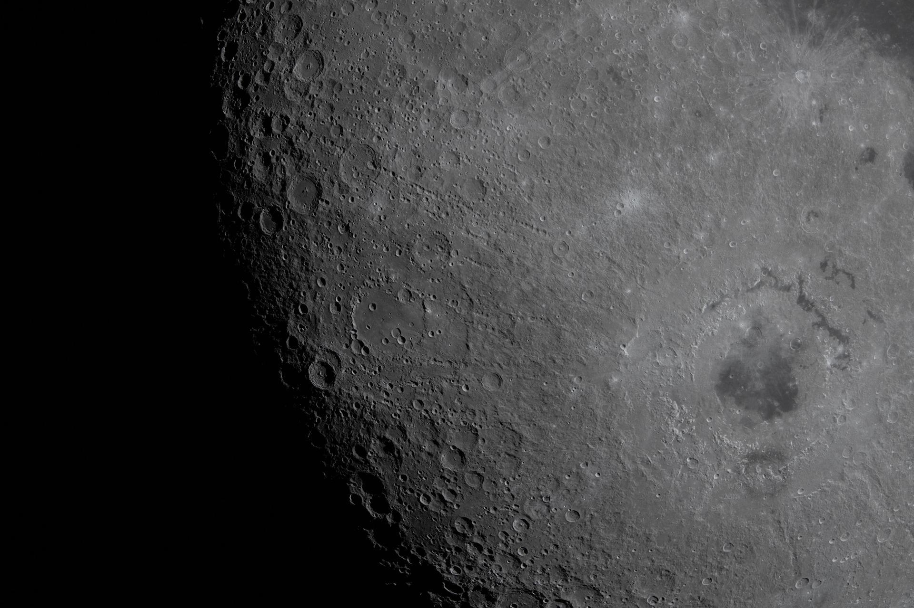
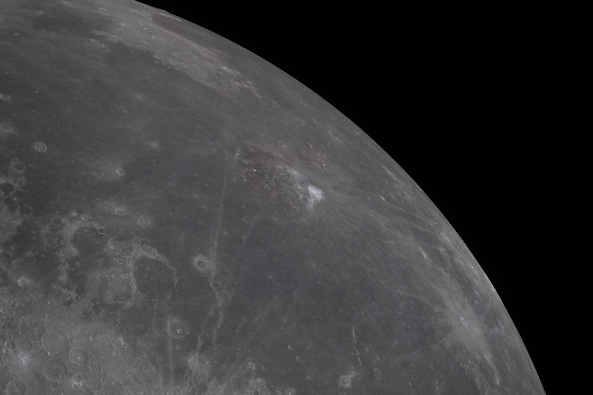
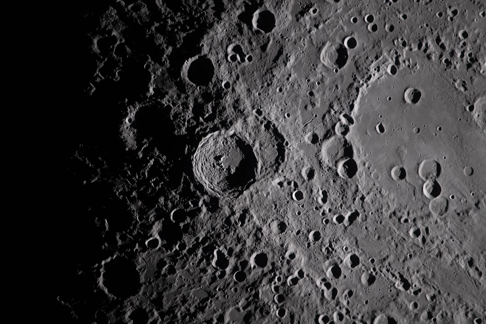
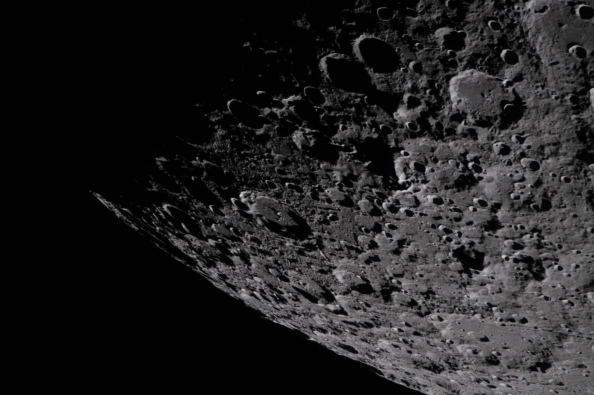
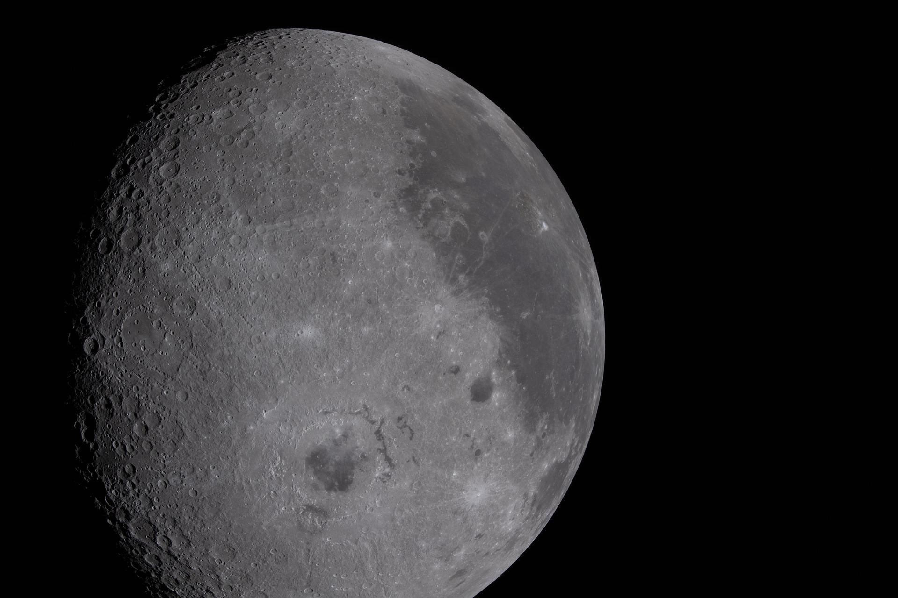
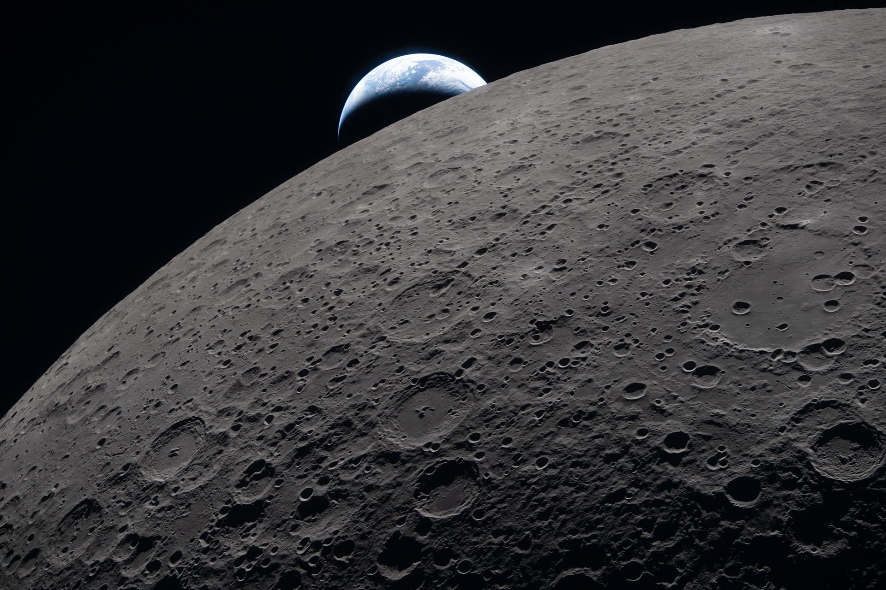
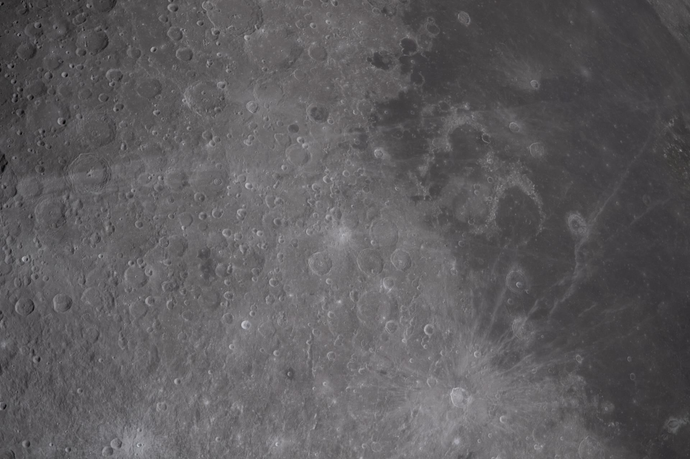

@菜鸟耶夫斯基
发表于：2026-04-09 01:42
来源：微博
链接：https://m.weibo.cn/status/5285726790880238

阿尔忒弥斯2号载人绕月任务组图，显示了月球表面非常多的陨石坑。
图1：月球晨昏线附近的部分景象。低角度的阳光在月球表面投下长长的、引人注目的阴影。晨昏线附近的焦耳环形山、伯克霍夫环形山、斯特宾斯环形山等地貌特征突出。
图2：上方中间是东方海，盆地中心的黑色古老熔岩是数十亿年前火山喷发形成的。
图3：依然是东方海，它是月球上最年轻、保存最完好的大型撞击坑之一。虽然名字带“东”，实际上它在月球正面的最西边。
图4：小白点是阿里斯塔克斯陨石坑，是月表上最亮的大型结构，地面上肉眼可见。
图5：中间是瓦维洛夫环形山。如果当时航天员乘组的摄像角度再往南一点，就能拍到万户环形山了。
图6：南极-艾特肯盆地边缘的环形山，两年前，人类首次从月球远端采集样本就是在这里进行的——嫦娥六号。
图7：东方海的东北方向是格里马尔迪环形山。
图8：拍摄于乘组刚刚恢复了中断四十分钟的地月联系之后，地球向阳面的大陆是大洋洲。
图9：中间的小亮点就是最新命名的“卡罗尔陨石坑”，纪念任务乘组指挥官里德·怀斯曼的亡妻卡罗尔。

---

