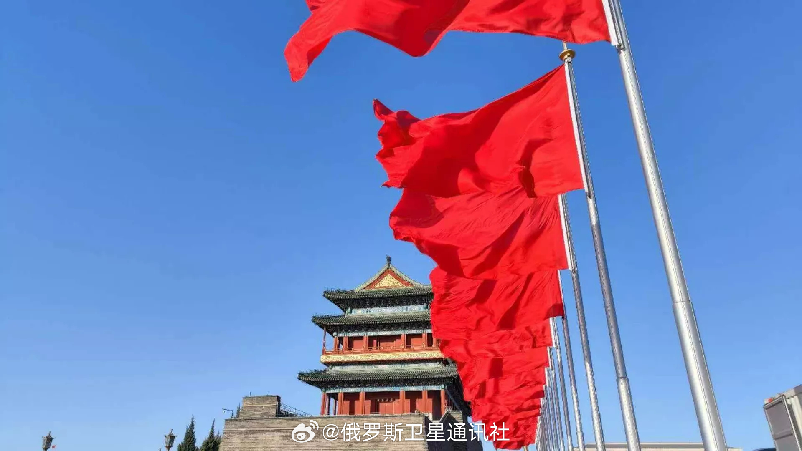

@俄罗斯卫星通讯社
发表于：2026-04-09 12:28
来源：微博
链接：https://m.weibo.cn/status/5285889417678134

【\#中国如何通过加强对供应链监管应对贸易战\#】4月7日，中华人民共和国国务院发布了《关于产业链供应链安全的规定》。该文件明确将供应链韧性与国家安全、经济稳定、对关键技术支持以及全球产业关系的顺畅运行紧密联系了起来。

🔸一个关键创新就是，供应链保护并非是一次性的反危机措施，而是被构建为一个跨部门体系。该文件列出了负责该领域的中央机构，并提供了定期更新的重点行业清单。换句话说，国家在危机爆发前就已开始对供应链进行制度化管控。

🔸文件还专门设立章节讨论外部压力。其中第14条就规定，如果外国、地区或国际组织对中国在生产和供应链中实施歧视性禁令、限制或类似措施，可以启动特别调查。根据此类调查结果，中国政府可以限制或禁止相关商品和技术的进出口、国际服务贸易，并征收特别关税。

🔸更具代表性的是第15条。该条不仅针对国家，也针对外国公司和个人。如果外国交易对手方干扰与中国组织的正常交易，对其采取歧视性措施，或以其他方式给供应链造成重大损害或威胁，\#中国\#政府有权进行调查并实施后续限制。这大大扩大了对参与对外经济活动的私人主体施加法律压力的范围。

🔸这项新规并非凭空而来。它源自近年来更广泛的法律演变，其中包括2021年《中华人民共和国反外国制裁法》、《不可靠实体清单制度》以及将于2026年3月1日生效的《中华人民共和国对外贸易法》修订版。该修订版强化了对外贸易与主权、安全和发展利益之间的联系。由此可见，北京正在不断整合各种出口管制、反制裁和限制措施，构建一个更加协调一致的经济安全体系。

🔸这份文件的出台背景依然是中美之间持续不断的贸易和技术竞争。特朗普政府继续将关税作为向中国施压的关重要手段，与此同时，美国政府也在扩大技术限制反围，包括限制中国参与关键基础设施和电子产品领域。在此背景下，中国的新规似乎并非仅仅是一项国内行政规定，而是其应对长期外国经济压力的更广泛法律准备战略的一部分。

☝️从政治经济角度来看，中国正在将供应链保护的逻辑从“应对攻击”转向对脆弱性的持续性管理。而这意味着，在中国看来，贸易战正日益从关税争端演变为对关键原材料、技术、数据和生产能力的控制权的争夺。中国在监管层面确立了一种新型的经济防御机制：供应链既被视为增长的源泉，又是国家规划的对象，同时也是外部压力的潜在目标。因此，这份新文件不仅对中国国内政策至关重要，对国际贸易有着同样的重要性，因为在国际贸易中，保护性法律机制与地缘政治竞争正日益交织在一起。

---

