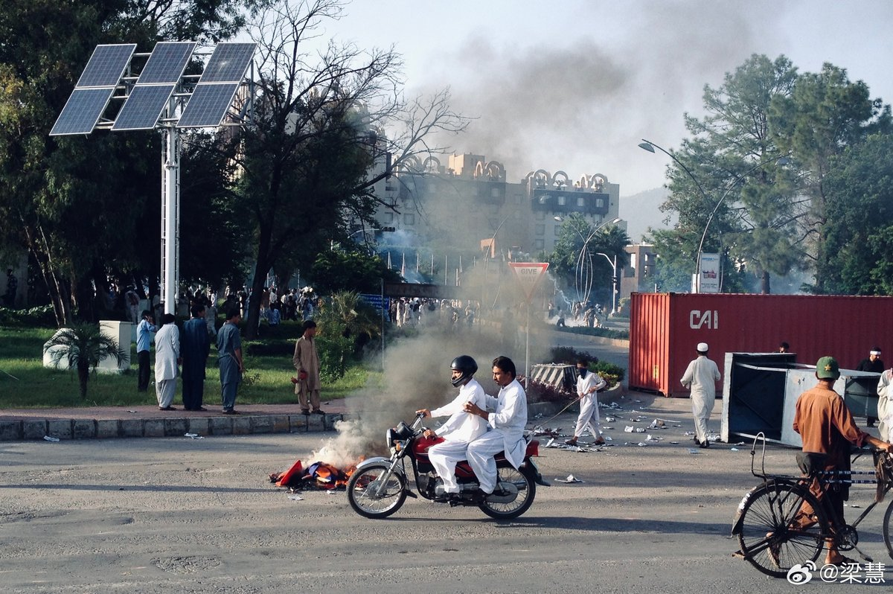

@梁慧
发表于：2026-04-09 12:34
来源：微博
链接：https://m.weibo.cn/status/5285891057654530

\#巴基斯坦总理明确说停火包括黎巴嫩\#为了这次谈判巴基斯坦也是拼了。

提前一天就在伊斯兰堡和姐妹城拉瓦尔品第放了假，高速公路进行管制，各种道路重新分流，学校的考试也给推迟了。

谈判代表入住伊斯兰堡最高档的赛琳娜酒店，酒店安保移交给执法机构和安全部队。据说酒店将清空住客，专门留给代表团（待证实）

赛琳娜酒店位于伊斯兰堡安全等级最高的红区，而红区将完全封闭。这个酒店有比较宽阔的庭院，设置了专属的安全通道，是唯一能够提供足够安全保障的五星级酒店。各国领导人来访大多也在这里。有报道说一个三十人左右的美国安全小组已经提前过来检查。

重型卡车禁止进入伊斯兰堡。这一点曾有血的教训：首都另一家五星级酒店万豪就曾被一卡车的炸药给炸了，在那之后载货卡车进伊斯兰堡就一直被严格限制。

巴基斯坦安全形势一直不太好，也很少举行这种规格的谈判或会议。这一次着实是高光时刻。有专栏作家写道：巴基斯坦成为和平缔造者，这是历史上最重要的一天。

配图是2012年在巴基斯坦驻站时，伊斯兰堡红区的一场大游行。远处的楼房就是赛琳娜酒店。

\#海外记者观察团\# 以色列

---

