# 2026-04-11

## 1

@李晓鹏博士

发表于：2026-04-09 03:57

来源：微博

链接：https://m.weibo.cn/status/5285760708119928

张雪机车从成立到夺取世界冠军，只用了两年时间，是因为它的背后有一套可以为燃油摩托车提供支持，但是又不靠燃油摩托车养活的世界顶级的工业供应链。

真正对张雪机车有决定意义的，其实是几家掌握了核心技术的高科技供应链企业。而且，它们都不是专为高端燃油摩托车做配套的——这个市场太小众了。它们都是立足于某一门核心技术，为机械、汽车等大工业需求服务。这些“核心供应商”的分布很广，没有聚集在一起，遍布中国各地。如果没有庞大的机械、汽车、消费品等相关市场养活了这些高科技企业，张雪机车也就不可能为自己所需要的那几百几千个零件找到有足够技术实力和精密加工能力的供应商。

比如，820rr发动机最核心的ECU（发动机控制单元），是上海的科博达提供的。这是一家有着超过20年历史的大型民营企业。2002年开始，为大众等合资品牌配套车灯控制器起家，一步步打入奥迪、宝马的全球供应链，并逐步转型做全车控制系统。经过多年磨练，才练就了能与博世等巨头掰手腕的底层技术，年营收超过60亿，是张雪机车的数倍。这套服务于千万辆级乘用车的电控体系，被“降维”适配到了张雪的战车上，正是“大产业反哺小赛道”的典型逻辑。

此外，广东佛山的季华实验室为张雪机车提供了轻质高强的TiAl（钛铝合金）气门。季华实验室不是一家企业，而是一个成立于2017年的“新型研发机构”，是政府资助的省级实验室。实验室之所以落在佛山，是政府为了支持珠江西岸万亿级装备制造产业带，满足家电、机器人、机械装备等本地集群升级的一个战略性投资，它并不以机动车发动机为主要研发方向。不过是在材料研发中“顺手”攻克了TiAl气门工艺，就让张雪机车的发动机在重量降低的同时，转速硬生生提升了近1000转。

还有一家更重要、更有意思的企业——深圳的金石三维。它为张雪机车提供了复杂的发动机原型与轻量化结构件快速试制。这是一家典型的民营科技企业，创始人江泽星2007年开始创业，靠给鞋业、陶瓷卫浴做模具起家——你没看错，就是那个生产运动鞋和马桶的行业。它用鞋模和马桶磨具生意养大了研发团队，慢慢的开始做3d打印，自研3d打印设备，用这种新技术来做磨具。

把鞋和马桶的模具3d打印做好以后，慢慢的就有其它行业的客户找上门。先是无人机公司来找它打造轻量化的机臂，然后是机器人企业需要定制复杂的关节，还有医疗器械厂商咨询能否打印个性化的手术导板。每一个新行业，提出的都是新考题——无人机要减重，机器人要强度，医疗器材要生物相容性。为了接住这些订单，企业不得不逼着自己的技术往前跑——从光固化树脂，到激光烧结尼龙，最后，终于进军技术3d打印“皇冠上的明珠”——金属3D打印。

金属打印的设备与材料成本高昂，工艺控制复杂，远超传统消费品模具的范畴。只有为高端制造业客户服务，才需要金属打印技术。

十多年发展下来，金石三维从一个做模具的小作坊，沿着中国制造业升级的阶梯，一步步被客户“推”着， 从一个服务于大众消费品的模具作坊，在2020年左右，成长为一家一个拥有上百台工业级3D打印机，能驾驭从树脂、尼龙到多种金属增材制造、为先进制造业服务的“工厂的工厂”。

张雪机车与金石三维的合作，展示了3D打印在“速度、复杂度和成本”上对传统制造模式的碾压。传统摩托车发动机改型需要经历“设计→ 开模具→ 铸造样件→ 测试”。其中的开模环节最麻烦，往往需要耗时数周，费用数十万。一旦测试失败，模具即报废，只能重新再来。设计一台新的发动机，要达到能挑战积累了几十年经验的世界巨头们的发动机，需要测试很多很多次。像张雪机车这类初期销量只有几千辆的小企业，要想通过不停的开大型模具来测试新研发设计的发动机，在财务上根本就不可行。而金石三维提供的SLA/SLS技术，实现了“数据直驱制造”，边际成本极低，“打1件”和“打10件”的成本曲线几乎是平的。这就使得小众、高性能车型的研发和少量生产成为可能，打破了“规模效应”的垄断。张雪团队今天完成建模，隔天就能拿到高精度的尼龙或树脂样件进行台架测试。这种“即时验证”能力，让820RR这类车型在两年内完成从图纸到世界冠军的“光速演进”成为可能。

此外，传统制造（减材/等材）受限于刀具角度和拔模方向，设计师必须“戴着镣铐跳舞”，因为很多复杂的零部件能设计出来但做不出来。3D打印实现了真正的“自由制造”。最典型的是“随形冷却流道”技术，它要求很多条不同大小和形状的散热冷却流道能完美的包裹住发动机缸体，这是传统工艺的禁区。金石三维利用金属3D打印，为高性能发动机缸头制造了复杂的内流道，能精准控制热负荷，成为压榨发动机极限性能的关键。还有像后视镜支架、进气歧管等部件，通过算法生成“骨骼状”结构，也只有3D打印能否实现，能在保证强度的同时极致减重。这对摩托车（尤其是赛车）的推重比提升是决定性的。

在3d打印领域，中国相关企业经过十多年的埋头苦干，已经悄然走在了世界前列。龙头企业很多，服务范围涵盖了从最高端最精密的航空航天到衣服鞋子在内的几乎所有制造行业，金石三维只是其中的一个代表。“高精度小批量定制”和“低价”、“高效”这些原本不可能放在一起的词汇，在中国已经实现了很好的融合。在不知不觉中，3d打印技术已经成为推动中国工业体系再升级和全面超越世界其它国家的一件利器。为张雪机车所提供的支持，对它而言不过是“牛刀小试”。

总之，张雪机车的成功，是中国制造业的一个缩影。中国庞大的工业体系，自然的催生出许许多多高科技企业或研发机构。这些机构服务于不同的行业，但其技术之间又存在广泛的联系。当某个赛道参与世界竞争的时候，一旦出现像张雪这样的能人，把这些分布在不同行业、不同地区的技术的融合到一起，就可以快速对外国竞争对手形成“降维打击”。在外国竞争对手看来，这就像是一个浑身长满触手的“克苏鲁”，随便伸出一根触手就能从他们手中夺走一个行业个领导权。二十年前的“中国制造”，把海量低价的消费品卖到全世界；号称“世界工厂”；十年前的“中国制造”，开始向世界输出有品质和有品牌的优秀产品；而“张雪机车”所代表的一个新十年，“中国制造”将以令全世界仰望的高端形象四处攻城拔寨——在这个庞大的“工业克苏鲁”支撑下，在很多很多西方几十年甚至几百年积累技术优势的细分赛道，都可能会像张雪机车的“两年夺冠”一样被来自中国的创新企业以迅雷不及掩耳之势超越。

---

## 2

@岳东晓博士

发表于：2026-04-09 00:49

来源：微博

链接：https://m.weibo.cn/status/5285713633610507

美媒：五角大楼律师准备拒绝在攻击目标单子上签字。美媒报道，五角大楼律师们打算拒绝在构成战争罪的攻击单子上签字。纽伦堡审判的先例表明，战争罪那是要清算到个人头上的。你名字在战争罪项签名栏，等于签下自己的逮捕令，等待的可能就是牢房甚至绞刑架。上月在飞机上看了一部电影《纽伦堡》，虽然感觉电影有美化战犯的嫌疑，但结局是一样的。狂妄一时、周围能人聚集的希特勒，正义来临时也只能用颤抖的手了结自己新婚妻子与自己的罪恶一生。戈林在纽伦堡法庭上，也得乖乖站起，接受审判。。。何况那些鸡鸣狗盗之辈。

\#美国\#\#伊朗\#

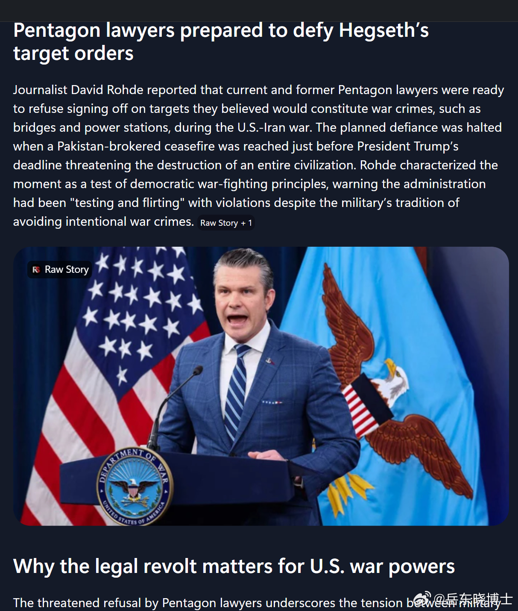

---

## 3

@理记

发表于：2026-04-08 11:33

来源：微博

链接：https://m.weibo.cn/status/5285513201458099

总是瞎传什么焦虑能变胖，药物激素能变胖，压力能变胖，熬夜能变胖。

踏马的都是扯淡，胖就是脂肪，所有的胖都是吃出来的，没有例外。如果压力都能变胖，那人类历史就再也没有大饥荒，隔山打牛成为现实了。

长期的高糖高油高脂肪的外卖饮食，就会导致抑郁焦虑，包括一系列疾病。除了基因和不可抗拒的外力因素，正常人的疾病就是吃出来的。

高糖高油高盐高脂肪食物都带有强烈的成瘾性，没有严格的戒断，偶然停一下，现在小姑娘减肥都是以为饿自己就行了，活生生的把脸饿垮了，内脏饿糟了。

高糖高油高盐高脂肪饮食是个恶性循环，一旦吃习惯了，不吃就难受，血糖过山车是诱发抑郁焦虑的直接因素，抑郁焦虑幼龄化是摆在眼前的事实。

最近比较年轻就心梗去世的，各位可以看看照片，不说百分百，基本都是碳水脸糖化脸。

事实都摆到这个份上了，还不懂得控糖必要性的，那就是在斩杀线上走钢丝。

对，斩杀线这个词的发明者，也胖的一塌糊涂，年纪轻轻一身毛病。

---

## 4

@李子暘Lee

发表于：2026-04-09 08:31

来源：微博

链接：https://m.weibo.cn/status/5285829660381665

看到一位美国医学专家分析为什么NBA现在伤病很多。

他认为，比赛多，强度大，对抗激烈等等，都不是真正的原因。真正的原因是，现在的NBA球员，都是从很小，七八岁，就开始专项篮球训练。

以前，身体好、有体育天赋的孩子，玩很多体育项目，棒球橄榄球田径篮球，都玩。

都玩的好处是，全身肌肉协调发展，哪个部分也不过度。现在早早就被锁定在篮球这一个项目上，相关的关节、肌腱等等过度磨损，到了成年，身体已经磨损得相当于老年了。

所以才会，没打几年比赛就受伤了，还往往是大伤，足以断送体育生涯的那种。

但这里有个困境。NBA的竞争已经如此激烈，竞技水平已经如此之高，不从七八岁就开始专项训练，将来就成不了尖子，冒不出来，签不上大合同。

也就是说，不但所谓业余体育，早已不存在。就是专业体育，也必须早早选定一个项目，从小就死磕，绝不能分心，才有可能爬上这个项目的金字塔尖。

这其实是整个人类竞技体育的困境。

竞技体育经过百多年的发展竞争，人类正常生长的身体优势，早已不够用。现在竞技体育的胜者，必须是畸形的、从小就打磨的、以摧残身体为条件的。

田径游泳等项目，世界纪录的打破，已经几乎不可能了，到头了。球类项目，也是精密得如同机器，早就是巨额资本和庞大团队的产物。

这和古罗马奴隶斗兽场，有什么区别呢？

我国为什么自古就没有竞技体育的传统啊？我国早早就不是奴隶制了。都是耕读之家的良家子弟，你让谁去当奴隶玩命供人取乐啊？

奥运会，可以休矣。

-

---

## 5

@那些珍贵老照片

发表于：2026-04-09 11:00

来源：微博

链接：https://m.weibo.cn/status/5285867158508196

80年代的北京生活

---

## 6

@飞扬军事铁背心

发表于：2026-04-09 10:04

来源：微博

链接：https://m.weibo.cn/status/5285853263036445

🔻特朗普于上午10点：“我们将撤回对那些在对抗伊朗时没有帮助我们的北约国家的支持。”

🔻佩德罗·桑切斯于晚上10点：“我们将重新开放位于德黑兰的西班牙大使馆，帮助伊朗实现和平与稳定。我们不惧任何报复。”

WSJ：西班牙将重开驻伊朗大使馆，成为首个采取此举的西方国家——

西班牙政府表示，计划重开位于德黑兰的大使馆，以推动和平努力，这也使西班牙成为首个重返伊朗首都的西方国家。外交部长何塞·曼努埃尔·阿尔巴雷斯在新闻发布会上表示：“我们正从一切可能的方面加入和平努力，包括从伊朗首都出发。”

以色列外交部长批评此举，称西班牙与“伊朗恐怖政权”勾结在一起。西班牙首相佩德罗·桑切斯已成为欧洲对伊朗冲突最严厉的批评者之一。他拒绝允许本国军事基地被用于美国对德黑兰的打击行动。

\#烽火问鼎计划\#\#伊美双方停火生效\#

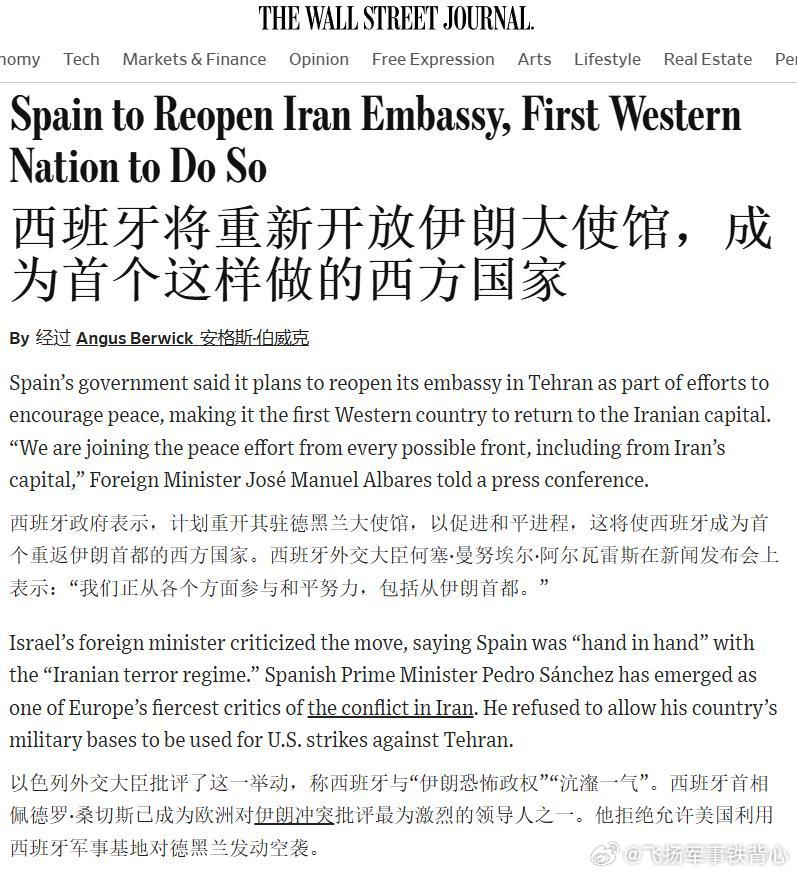

---

## 7

@默庵·超级个体

发表于：2026-04-08 07:27

来源：微博

链接：https://m.weibo.cn/status/5285451414901098

Hermes Agent 这个项目已经 32.9k stars 了。

简单跟 OpenClaw 做一个对比。

先说 OpenClaw 在干嘛。你手上可能同时有 ChatGPT、Claude、还有本地跑的模型，OpenClaw 就是把它们全接到一个地方，统一调度统一管理，相当于一个 AI 的总控台。好用是好用，但本质上还是你来安排，你来配，你来调。

Hermes 玩的是另一套逻辑。它的 agent 自己会学。你交给它一个任务，它干完之后会自己琢磨哪里没做好，下次碰到类似的事情就自动改进。不需要你重新写 prompt，不需要你手动调流程，它自己进化。

所以区别就一句话：OpenClaw 是你指挥它干活，Hermes 是它自己越干越聪明。

最绝的是 Hermes 还内置了一行迁移命令，终端敲 hermes claw migrate，你在 OpenClaw 里攒的配置直接就搬过来了。

传送门：github.com/NousResearch/hermes-agent

\#科技先锋官\#\#How I AI\#

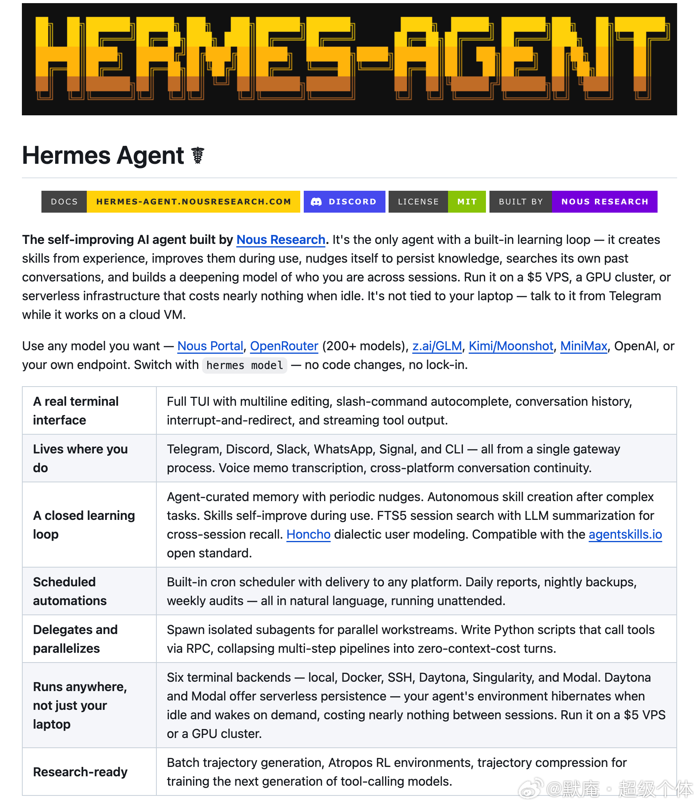

---

## 8

@谋影仗剑

发表于：2026-04-09 09:59

来源：微博

链接：https://m.weibo.cn/status/5285852055339786

【🦉Hermes来啦！】昨晚花了1个多小时，从 GitHub 上拉取并部署了最近势头上升很快的 Hermes Agent。我的直观使用感受是，Hermes 确实可以算得上是 🦞小龙虾的 2.0 版。

首先，“记忆”是 Hermes 最突出的特点。它的记忆能力比 OpenClaw、Claude Code、Codex 等Agent产品都更加出色。Hermes 对记忆的存取与技能的沉淀，基本是主动进行的；而 OpenClaw 小龙虾则更偏被动一些。Hermes 拥有更接近人类的“记忆代谢机制”，其“短、小、硬”的记忆哲学，也更符合我的理想。因为智慧的本质，就源于“压缩”。

其次，Hermes 的“Skill 技能”提升路径，也独具特色。它不是靠下载大量 Skill 来扩展能力，而是在互动实践中，自己撰写、迭代并进化 Skill。我感觉这样沉淀出来的技能，更贴近个人真实需求，上限也可能更高。当然，在工业化应用上，OpenClaw 那种高度可控的技能编排，可能会更容易规模化。

接下来，Hermes 将会成为我的主力 Agent 系统（数字分身），而 OpenClaw 则变为我的扩展 Agent 系统。大厂们打造 AGI（ASI）大模型，并希望永远把你绑定在它们的高价产品上。而普通个人能做的，就是基于开源项目，打造能够调用 AGI（ASI）、完全属于自己并拥有切换自由度的个人 Agent 系统。

---

## 9

@TOBEAJERKONE

发表于：2026-04-09 07:33

来源：微博

链接：https://m.weibo.cn/status/5285815312975885

在二十一世纪新发明的所有词汇里，我觉得「降本增效」这个词的恶毒程度至少可以排进前五名。

---

## 10

@新西兰冷百科孙小社

发表于：2026-04-08 10:59

来源：微博

链接：https://m.weibo.cn/status/5285504709035855

昨天《外交事务》上的这篇名为《中国的缺席让美国更深卷入高风险战争》的文章火了，作者是曾在驻北京的使馆任职过，所谓的对华关系专家，挪威人Jo Inge Bekkevold。

文章的倒数第二章，作者“缅怀”了苏联老大哥，大意是，冷战时候的光景好哇，贪多嚼不烂的苏联在全世界全面与美国展开地缘政治争夺，用巨大内耗催生出来的实质性军事威胁，迫使美国和西方阵营盟友在应对时始终保持冷静谨慎，也就不会像特朗普这样愣头愣脑地轻易陷进对伊朗采取军事行动的大泥坑。

而中国竟然不走苏联老路，处处谨慎行事，把美国惯坏了，才卷入到高风险战争中自插两肋。

这不由得让我想起一个二战时期的笑话。

德国和英国隔海对峙。

德国海军周一布水雷封锁水域，英国海军第二天就派人排雷。两方形成了默契，头天一个布，隔天另一个排。

结果有一天英国海军躲懒，没依默契去排雷。

第二天德国海军的舰船就被自己布的水雷给炸了。

当被英国人从水里捞起来后，德国海军军官义愤填膺地怒斥英国人不守规矩，不按套路打。

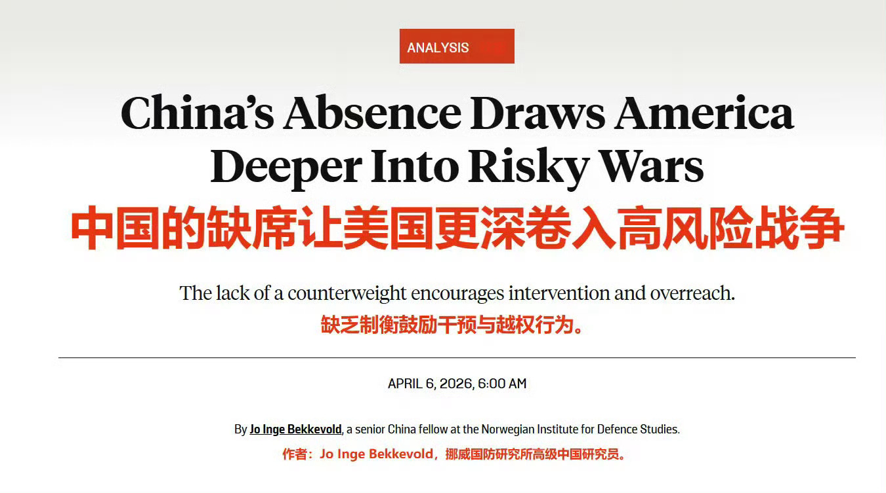

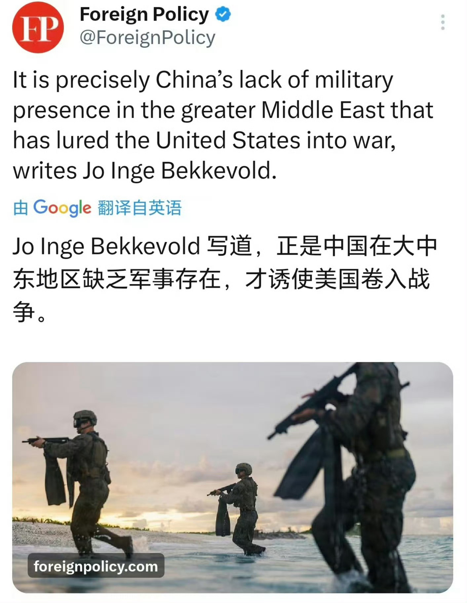

---

## 11

@爱可可-爱生活

发表于：2026-04-09 05:49

来源：微博

链接：https://m.weibo.cn/status/5285788964881974

开发AI Agent常常需要切换多个框架和工具，记忆系统难管理，技能创建繁琐，自学习循环还得从零搭建，效率低下。

《Hermes Agent 从入门到精通》橙皮书，提供Nous Research开源AI Agent框架的完整实战指南。

全书17章5部分，详解自学习循环、三层记忆系统、自动技能创建与演化，还包括安装、多平台部署和真实场景应用。

GitHub：github.com/alchaincyf/hermes-agent-orange-book

主要内容：

- 从Harness工程到Hermes Agent核心概念；

- 学习循环、记忆系统、Skills与工具生态；

- 动手安装、首次对话、多平台运行与自定义；

- 知识助手、开发自动化、内容创作、多Agent实战；

- 自学习Agent边界与三方对比深度思考。

免费PDF下载，支持开发者与AI爱好者快速上手，基于Hermes Agent v0.7.0。

\#AI橙皮书\#\#HermesAgent\#\#人工智能\#

---

## 12

@风清颂

发表于：2026-04-09 12:33

来源：微博

链接：https://m.weibo.cn/status/5285890706640227

北京大学 人口学教授、 中国人口学会副会长 乔晓春∶中国哪个学校也比不过印度、孟加拉的学校，因为它们语言体系是英语，教材是英文，方法、思路和原则都是正确的，而我们没有

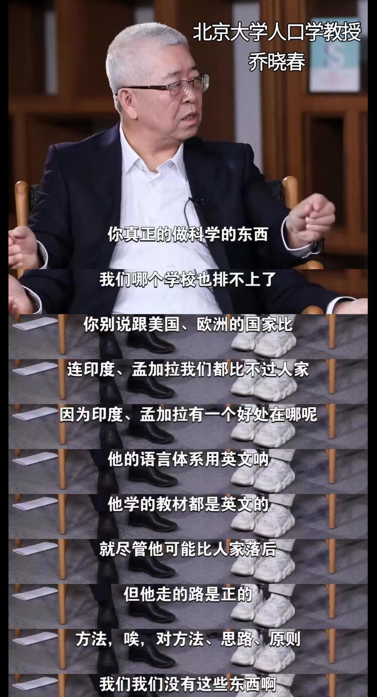

---

## 13

@宝玉xp

发表于：2026-04-09 19:32

来源：微博

链接：https://m.weibo.cn/status/5285996178702538

Anthropic 推出了一个叫“顾问工具”（advisor tool）的新 API 功能，核心思路是：让便宜的模型干活，遇到难题时请贵的模型出主意。

具体来说，Sonnet 或 Haiku 作为"执行者"全程跑任务、调工具、处理结果。碰到自己搞不定的决策，就把上下文递给 Opus，Opus 给出方案或纠正，执行者接着干。Opus 全程不碰工具、不直接输出给用户，只充当幕后军师。

这跟很多人熟悉的“大模型拆任务、小模型干活”的模式正好反过来。以前是大模型当指挥官，把任务拆成小块分配下去。现在是小模型自己跑，只在关键节点向大模型请教。好处很直接：大部分 Token 消耗在便宜的模型上，贵的模型只在刀刃上用。

效果方面，Sonnet 配 Opus 顾问在 SWE-bench 多语言测试上比 Sonnet 单干高了 2.7 个百分点，同时每个任务的成本还降了 11.9%。更有意思的是 Haiku 的表现：配上 Opus 顾问后，Haiku 在 BrowseComp 测试上从 19.7% 跳到 41.2%，翻了一倍多。虽然分数还是比 Sonnet 单干低 29%，但成本只有 Sonnet 的 15%，适合跑量大但对智能要求没那么极端的场景。

用起来也简单，在 Messages API 的 tools 里加一个 advisor_20260301 类型就行，一个 API 请求内部完成模型切换，不需要额外管理上下文或做多次调用。可以设 max_uses 控制每次请求最多咨询几次顾问，账单里顾问和执行者的 Token 分开计费。

对开发者来说，这提供了一个新的性价比选项：不用在"全程跑 Opus 太贵"和"只用 Sonnet 不够聪明"之间二选一了。你的 Agent 可以 95% 的时间跑 Sonnet 的价格，5% 的关键决策享受 Opus 的判断力。目前是 beta 阶段，需要加 anthropic-beta: advisor-tool-2026-03-01 请求头才能用。

官方博客：网页链接

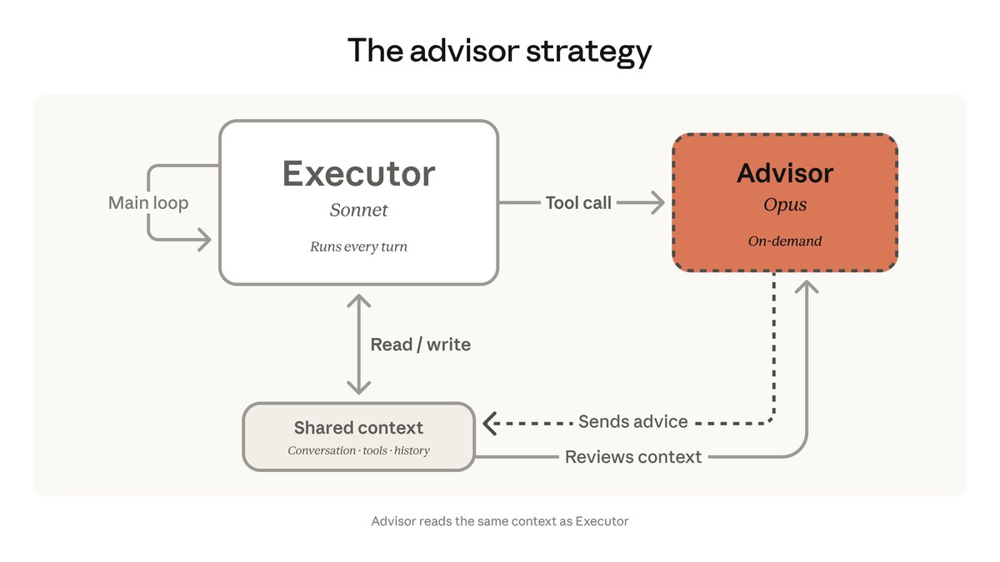

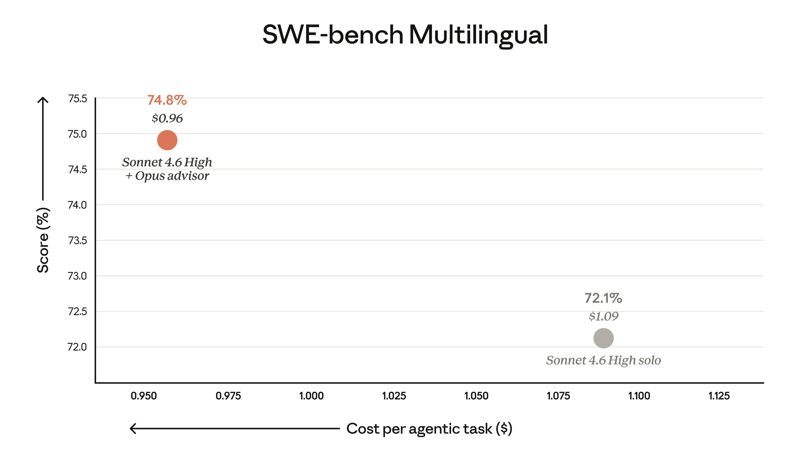

---

## 14

@西雅图夏至

发表于：2026-04-09 15:09

来源：微博

链接：https://m.weibo.cn/status/5285929997833946

美国生育率跌至每千人（15-44岁女性）五十三个👶

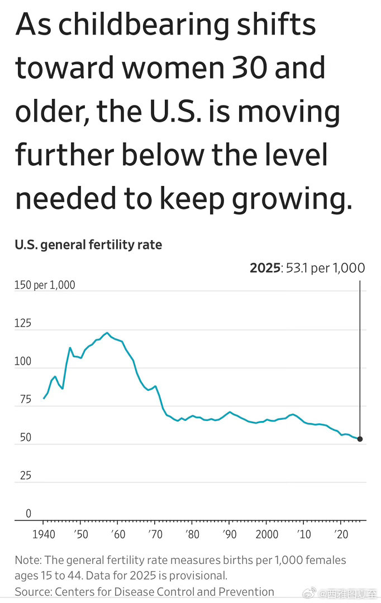

---

## 15

@三联生活周刊

发表于：2026-04-10 06:25

来源：微博

链接：https://m.weibo.cn/status/5286160511272168

\#中产家长开始抛弃国际学校了\# 在三年前，北京海淀那些热门国际学校的开放日，还人山人海，挤满了急于将自家孩子送进来的家长，如今早已盛况不再；上海也一样：2025年上海中考报名人数创下12.7万人的新高，比上一年的11.8万多了近1万，但国际高中的招生人数却反而有所减少了。哪怕是老牌国际学校，竟然都会面临招不满学生的尴尬境况，这不但前所未有，而且各地都在上演。

曾被无数中产家庭视为通往海外名校跳板的国际学校，为什么突然不吃香了？（文 | 维舟）

---

## 16

@挨踢牛魔王

发表于：2026-04-10 12:26

来源：微博

链接：https://m.weibo.cn/status/5286251410232853

为什么你看AI视频看多了，觉得很不舒服呢？

因为恐怖谷效应。

恐怖谷效应，就是指那种像人，但是又不是人的，你看了会觉得很不舒服。

这说明AI视频模拟的人类还不够逼真，总之是有一些细节没有达到。

你说不清是什么细节，但是你能感觉到。

明显不像人的，比如四足机器人，机械臂，你不会觉得恐怖。

玩偶这些拟人玩具，明显不像人的，你不会觉得恐怖，甚至你还觉得有些可爱。

但是逼真度超过一定程度，但是又不是人的，你会觉得特别恐怖。

那为什么会存在恐怖谷效应呢？

这是一段黑暗的历史。

因为在远古的时候，地球上并不是只有一种类人生物。

我们这一支叫智人，只有这一支活下来了，其余的类人生物都灭绝了。

这些类人生物，会袭击智人，并捕食智人的小孩。

那么智人见到这种像人，又不是人的生物的时候，第一时间就要进入预警状态。

只有这样你才能活下来。

那些不能立刻产生这种感觉，或者感觉反应慢的智人，会怎么样？

都死掉了。

同时，如果一个东西像人，又不是人，那可能是一个得了传染病的人，就是明显不健康的人类。

最恐怖的，则是尸体，有尸体，这说明发生了什么可怕的事情。

要赶紧逃跑或者预警。

我们是那些对于“恐怖谷效应”反应强烈的智人的后代，具备了这种基因。

丧尸片、僵尸片，就是用这种类人的形象，激发你远古的基因，让你觉得恐怖。

学废了吗？

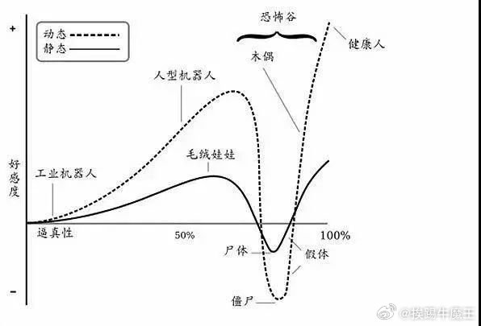

---

## 17

@少年伯爵

发表于：2026-04-10 12:26

来源：微博

链接：https://m.weibo.cn/status/5286251432775405

我们可以有讨好型人格，可以胆小，可以唯唯诺诺，可以没主见，可以社恐……这些都可以，因为这些的背后都是善良的影子。但我们同时也要有第二套后手人格，也就是讨伐型人格，可以让我们在极致的失望和痛苦之后，漠然而又冷血的切换成有主见，不内耗，极致的清醒和好胜，平静的碾碎一切。

---

## 18

@观察者网

发表于：2026-04-10 11:45

来源：微博

链接：https://m.weibo.cn/status/5286241035093938

【\#开源巨头红帽裁撤中国研发团队全员\#】 4月9日，开源巨头红帽（Red Hat）在社交平台上被传出“中国研发团队全员裁撤”的消息。该消息后续被红帽CTO兼全球工程高级副总裁向中国团队发送的邮件证实。

邮件称，红帽一直在调整全球布局，将停止在中国的工程活动，并将相关工作主要转移至亚太地区的工程枢纽。受影响员工即日起不再承担日常工作职责，雇佣关系将于2026年7月31日终止。

据云头条报道，裁员方案为N+3到N+6，以官方正式通知为准。

红帽2019年被IBM以340亿美元收购，该公司以企业版Linux系统为核心产品，还衍生出云计算平台和自动化工具等为企业提供服务。在中国，红帽服务涵盖了金融、制造、电信、汽车等行业，红帽中国官网的客户案例显示有兴业证券、海信、广东移动、上汽大众等企业。

红帽中国官网显示，目前红帽大中华区（含中国大陆、中国香港和中国台湾地区）目前拥有700多名员工，中国大陆有研发和服务团队500多人，其中北京研发中心拥有300多名软件开发与科研人员。

云头条报道称，本次裁员涉及419人。

红帽中国裁员并非偶然。当下全球范围内的科技行业普遍进入降本增效的环节，2024年8月，红帽母公司IBM就决定裁撤大部分中国区的研发和测试员工，涉及1800多人。2025年3月，IBM中国投资公司及其所有分公司停止了业务活动，并已于同年进行注销备案。

红帽自身在战略重心转移的同时，中国本土厂商正在快速崛起。

沙利文发布的《2025年中国服务器操作系统行业发展白皮书》显示，目前由华为主导的开源操作系统openEuler（欧拉）在新装机操作系统中的占比已经突破57.3%，形成明显领先优势。当国产操作系统已在关键基础设施领域占据超过半壁江山，过去由海外巨头主导的技术生态正被加速重构。

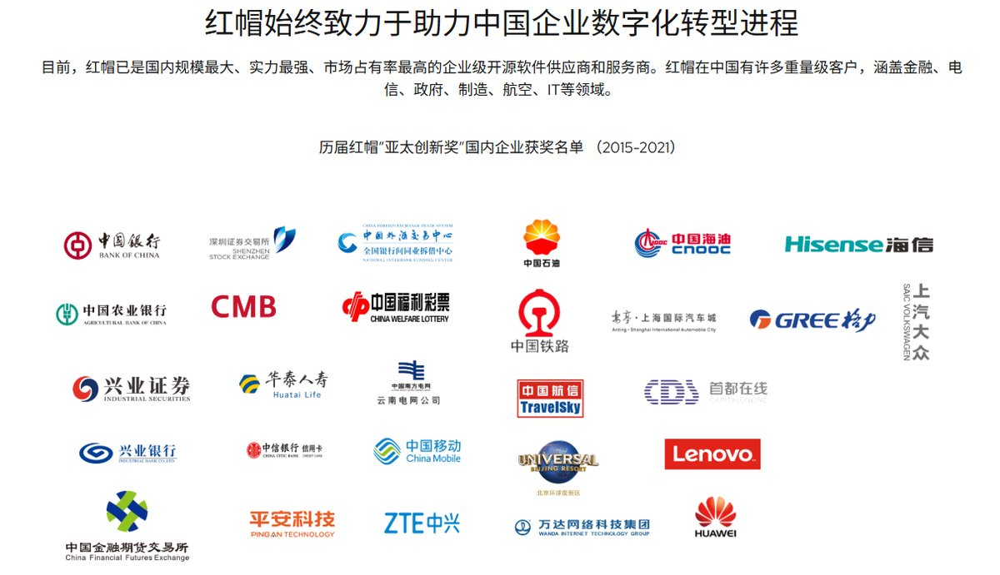

---

## 19

@猫叔在硅谷

发表于：2026-04-10 01:34

来源：微博

链接：https://m.weibo.cn/status/5286087125895188

斯坦福大学硬性要求所有住校本科生必须在校内购买餐饮套餐，每年最低餐费近8000美元。

但是斯坦福也会允许一些豁免情况，信仰耆那教的学生可以不必购买餐饮套餐。因为这个印度古老宗教的信徒不仅严格素食，而且还不能吃洋葱萝卜土豆大蒜等根茎类植物，一般的大学食堂根本满足不了他们的饮食要求。

所以此前有不少印度学生号称自己是耆那教徒，这样就免去了购买昂贵的校内餐饮套餐，可以自己支配食物支出。

但今年斯坦福突然宣布在校内食堂推出耆那教餐饮专区，提供专门标注的蔬菜、豆类、全谷物和香料菜品，并使用独立餐具。这些新选项的推出，使得那些号称耆那教的学生就不能申请豁免了，只能和其它学生一道乖乖缴费购买学校套餐。

很多印度学生对此非常不满。

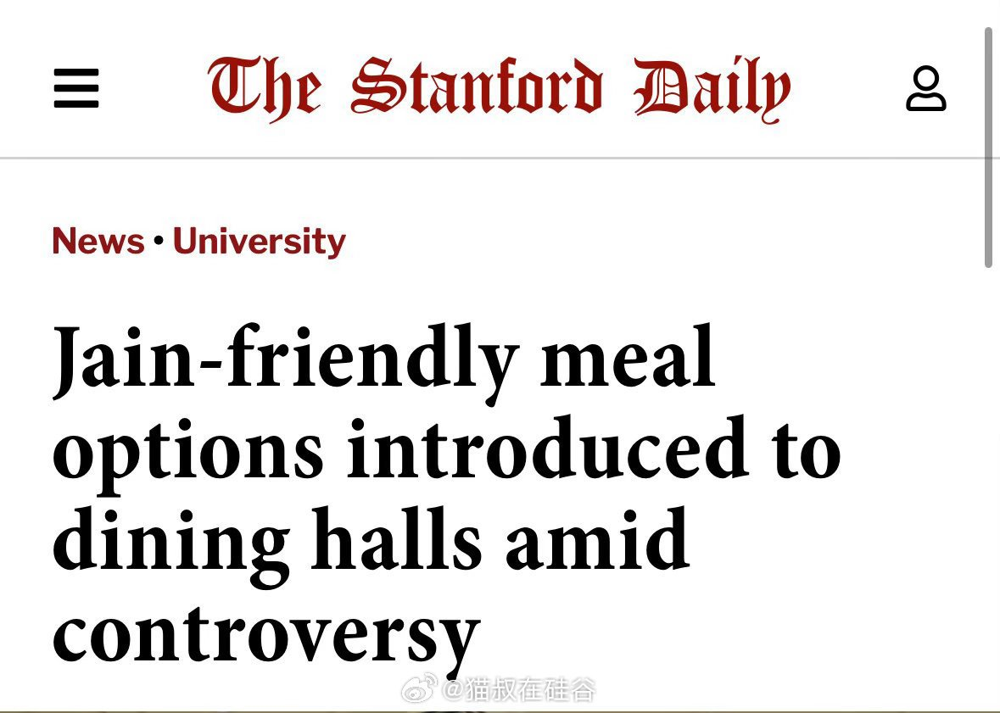

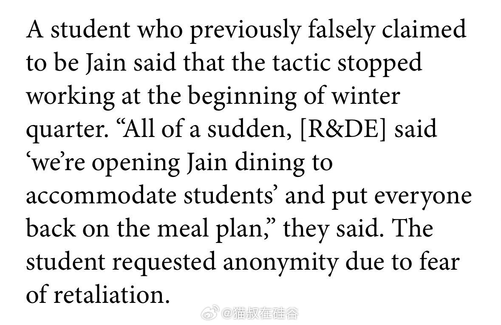

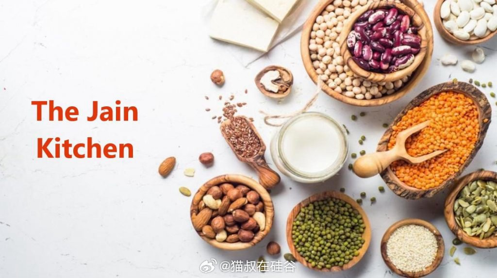

