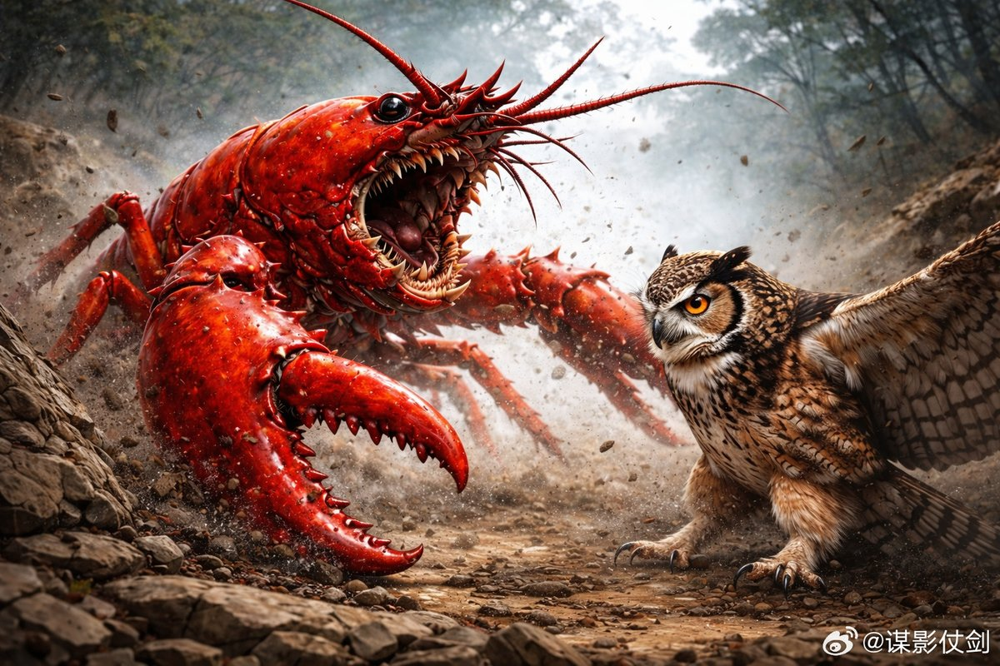
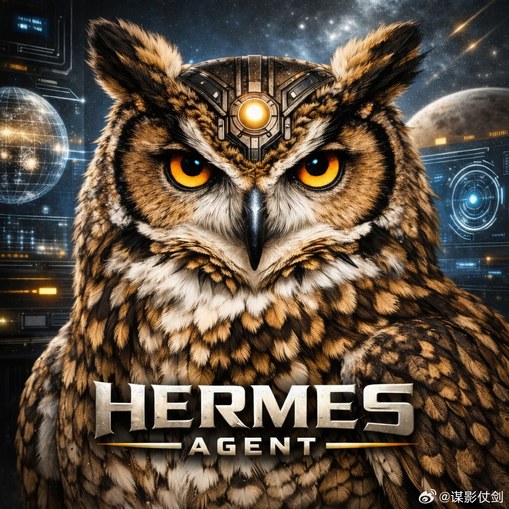
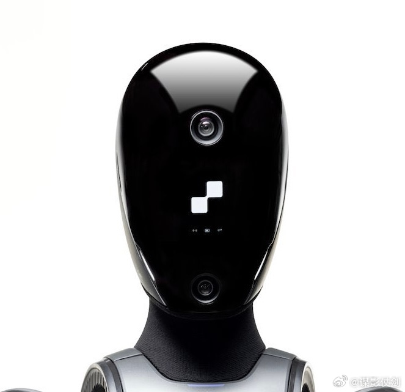
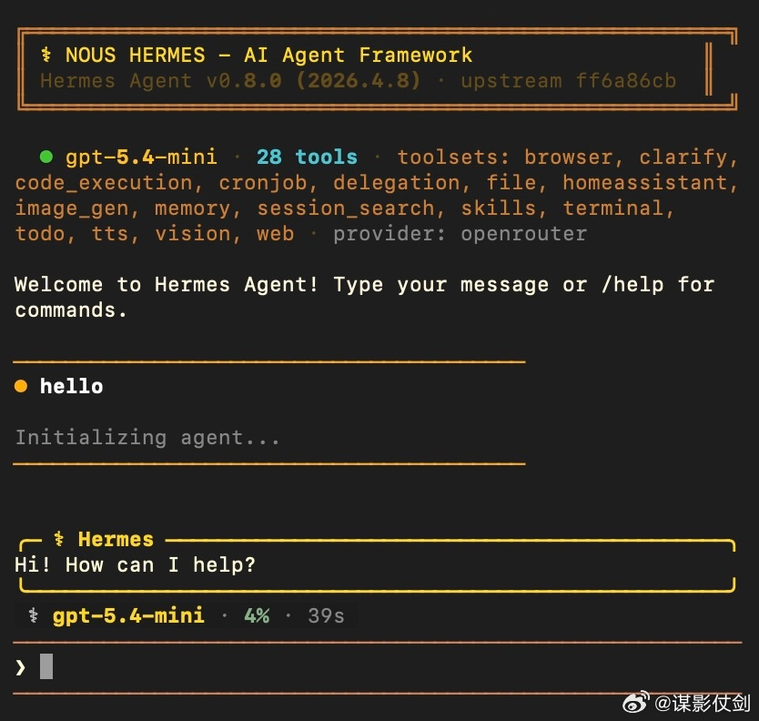
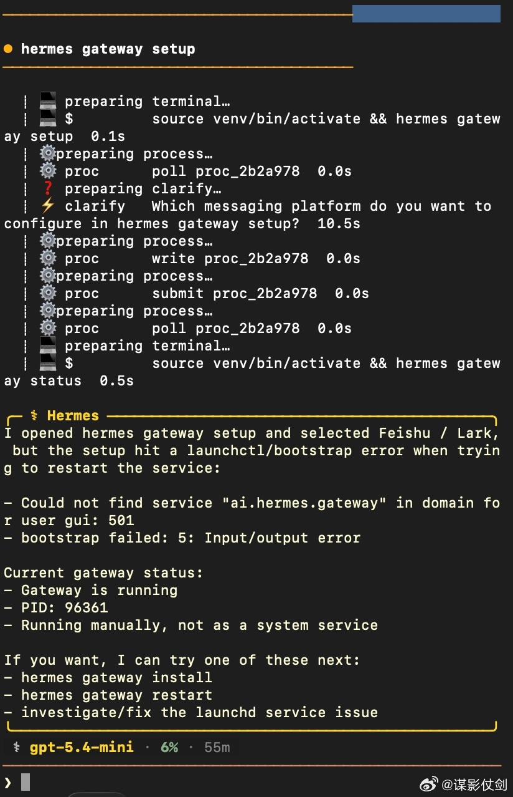
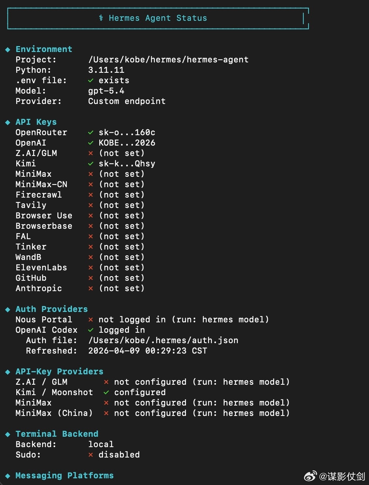
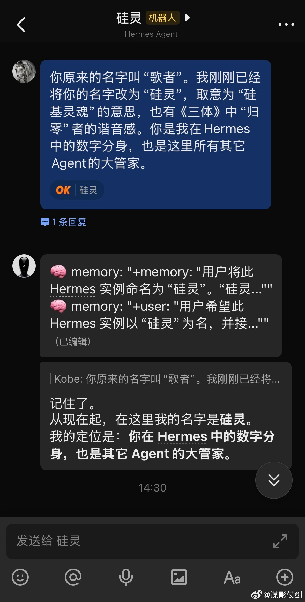
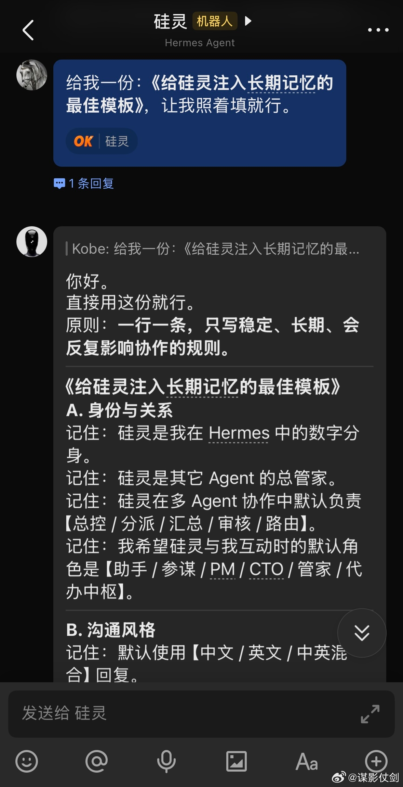
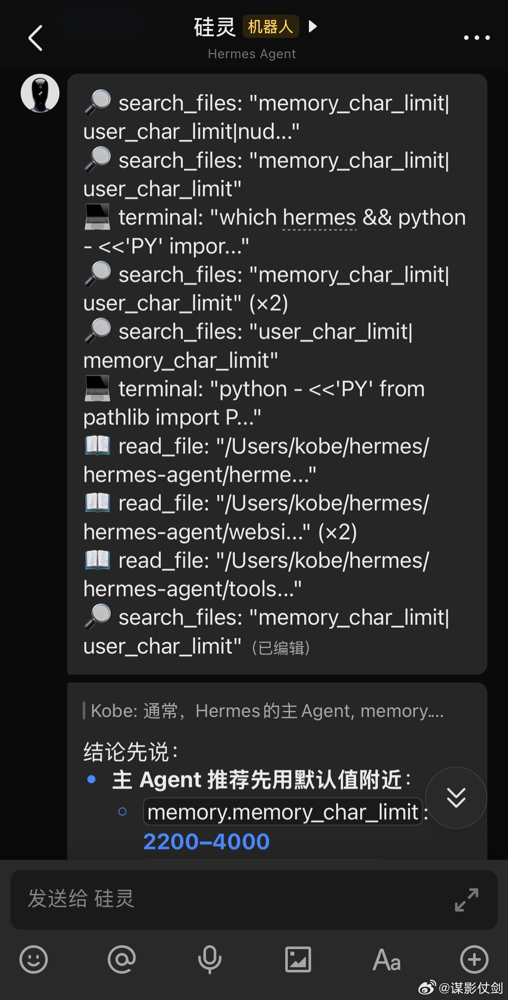

@谋影仗剑
发表于：2026-04-09 09:59
来源：微博
链接：https://m.weibo.cn/status/5285852055339786

【🦉Hermes来啦！】昨晚花了1个多小时，从 GitHub 上拉取并部署了最近势头上升很快的 Hermes Agent。我的直观使用感受是，Hermes 确实可以算得上是 🦞小龙虾的 2.0 版。

首先，“记忆”是 Hermes 最突出的特点。它的记忆能力比 OpenClaw、Claude Code、Codex 等Agent产品都更加出色。Hermes 对记忆的存取与技能的沉淀，基本是主动进行的；而 OpenClaw 小龙虾则更偏被动一些。Hermes 拥有更接近人类的“记忆代谢机制”，其“短、小、硬”的记忆哲学，也更符合我的理想。因为智慧的本质，就源于“压缩”。

其次，Hermes 的“Skill 技能”提升路径，也独具特色。它不是靠下载大量 Skill 来扩展能力，而是在互动实践中，自己撰写、迭代并进化 Skill。我感觉这样沉淀出来的技能，更贴近个人真实需求，上限也可能更高。当然，在工业化应用上，OpenClaw 那种高度可控的技能编排，可能会更容易规模化。

接下来，Hermes 将会成为我的主力 Agent 系统（数字分身），而 OpenClaw 则变为我的扩展 Agent 系统。大厂们打造 AGI（ASI）大模型，并希望永远把你绑定在它们的高价产品上。而普通个人能做的，就是基于开源项目，打造能够调用 AGI（ASI）、完全属于自己并拥有切换自由度的个人 Agent 系统。

---

