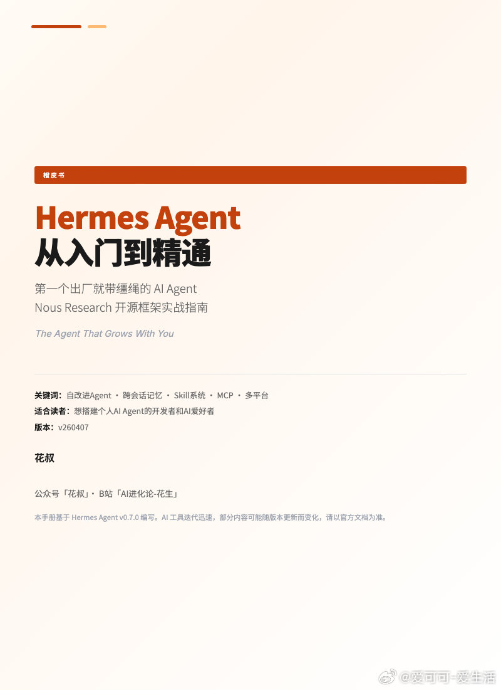
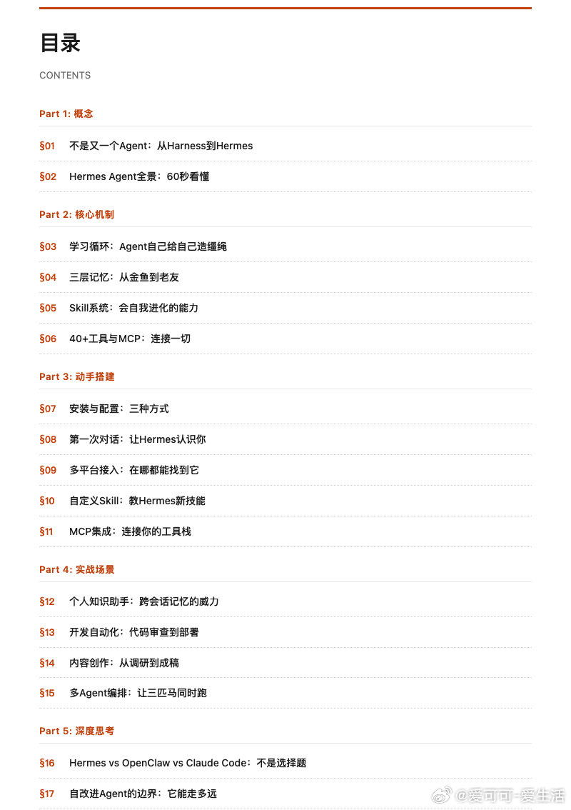
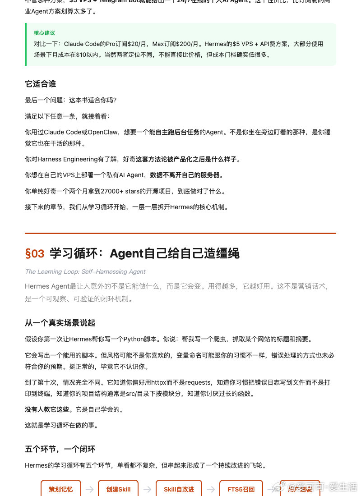

@爱可可-爱生活
发表于：2026-04-09 05:49
来源：微博
链接：https://m.weibo.cn/status/5285788964881974

开发AI Agent常常需要切换多个框架和工具，记忆系统难管理，技能创建繁琐，自学习循环还得从零搭建，效率低下。

《Hermes Agent 从入门到精通》橙皮书，提供Nous Research开源AI Agent框架的完整实战指南。

全书17章5部分，详解自学习循环、三层记忆系统、自动技能创建与演化，还包括安装、多平台部署和真实场景应用。

GitHub：github.com/alchaincyf/hermes-agent-orange-book

主要内容：

- 从Harness工程到Hermes Agent核心概念；
- 学习循环、记忆系统、Skills与工具生态；
- 动手安装、首次对话、多平台运行与自定义；
- 知识助手、开发自动化、内容创作、多Agent实战；
- 自学习Agent边界与三方对比深度思考。

免费PDF下载，支持开发者与AI爱好者快速上手，基于Hermes Agent v0.7.0。

\#AI橙皮书\#\#HermesAgent\#\#人工智能\#

---

