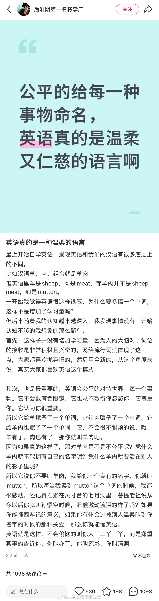

@蘸盐

发表于：2026-04-12 14:27

来源：微博

链接：https://m.weibo.cn/status/5286887003783483

英语牛cattle，牛肉beef←法语牛/牛肉bœuf；英语猪swine，猪肉pork←法语猪/猪肉porc；英语羊sheep，羊肉mutton←法语羊mouton。司各特《撒克逊劫后英雄略》里就吐槽过，这些动物活的时候叫英文名，送到诺曼贵族老爷的餐桌上就换了法语名

实际上英语历代堆叠的屎山代码还有很多。比如日耳曼系的white（≈德语weiss）跟拉丁系的blank（≈法语blanc）同时保留下来，类似的还有heart（心脏）和core（法语心脏cœur，拉丁语心脏cor），swine（猪，≈德语schwein、弗里西亚语swinen、北欧诸语言的svin）和pork（法语porc），red（≈德语rot）和rouge（法语rouge）；还有葡萄grape→葡萄干raisin，牛肉beef→牛肉干jerky，李子plum→李子干prune，鳕鱼cod→鳕鱼干stockfish

还有，表面上名词失去了阴性阳性中性，但其人称代词保留了阴性阳性（比如管一条船叫she/her）；名词复数形式有来自法语的（词尾加s那些），有来自拉丁语和希腊语的（nebula→nebulae，axis→axes，basis→bases，fungus→fungi），有来自古日耳曼语的（child→children，ox→oxen，man→men，foot→feet，goose→geese）……

---

