# 2026-04-14

## 1

@李大柱之冠

发表于：2026-04-14 17:01

来源：微博

链接：https://m.weibo.cn/status/5287647654184906

这个图片是更加直观的反映了，霍尔木兹海峡是多么的重要！

---

## 2

@头条新闻

发表于：2026-04-14 13:01

来源：微博

链接：https://m.weibo.cn/status/5287594592045533

\#公司要求微信余额没三五百不给面试\#\#多方回应公司要求查看余额才能面试\# 近日，一段提及“微信余额没有三百至五百元的，不给面试”的聊天记录引发关注。记者搜索发文工作人员微信，其名称为“贵巨，聚蓝领”，疑似是一名劳务中介。

记者联系到该工作人员。他说，因为应聘的员工动不动就闹事，说没钱吃饭了、要报警之类，所以用人单位有这样的要求，“上个一两天，自己没钱吃饭，就要去报警、投诉等。我们也只是负责发这个通知。”关于具体是哪一家用人单位，对方未明确回复。

另一名“贵巨，聚蓝领”的工作人员则透露，该用人单位系深圳市双翼科技股份有限公司，该厂还在招聘，“查看余额主要是担心你做两天就跑路（离职），这是公司要求。”公司担心工人干两天不干了就要工资。  网页链接

---

## 3

@挨踢牛魔王

发表于：2026-04-13 06:58

来源：微博

链接：https://m.weibo.cn/status/5287255864510624

一战非常残酷，因为列强完全低估了工业革命以来战争的残酷性，死了非常多的人。

堑壕，铁丝网，机枪，地雷，一群人冲出去，像被割的麦子一样，成批的倒下。

英法也不再想打了。

一战后的巴黎和会，实际上是英、法、美等主导的瓜分世界的会议，手段极其拙劣，效果非常糟糕。

二战，实际上是一战的延续，就是一战没打完，继续打。

按照列强的规划，奥斯曼土耳其是整个被瓜分的，就给土耳其人留了一点点地，完全的亡国了。

奥斯曼土耳其原来的苏丹议会，是完全接受了这个结果的。

但是有一个人，他不服，根本就不认这个结果，他就是凯末尔。

这个人在一战期间，是土耳其的英雄，能文能武，在土耳其拥有巨大的威望。

那个时候，英法怂恿希腊进攻土耳其，一路打过来，就不断杀土耳其人。

其实土耳其人，从基因的角度来说，很多就是希腊人，根本就不是突厥人。

凯末尔就抓住英法不想下场的这个时间窗，先和新生的苏联合作，这很不容易。

因为土耳其和俄罗斯这俩是世仇。

苏联就派了一个人过去谈，这个人就是斯大林，援助了土耳其很多枪炮。

凯末尔就拿着这些枪炮，还有自己手上也有一些，组织了民兵。

结果大败希腊军，土耳其就保留了现在这一块地。

土耳其的幸运，是出了一个天降猛人，土耳其的不幸是，只出了这么一个天降猛人。

东大，从清末以来，即使很努力，最高成就，就是一个大号的土耳其。

如果运气再好一点，就是一个大号的印度。

但是为什么变成了东大呢？

因为天降了不止一个猛人，抓住了好几个时间窗口。

抗日战争快不得，解放战争拖不得，就是趁着柏林危机，美苏自顾不暇，赶紧完成了统一。

现在工业化已经完成，拿到了工业化最后一张船票。

即使真的出现乱世，也不怕了，这个体量摆在这里。

---

## 4

@飞扬军事铁背心

发表于：2026-04-13 05:25

来源：微博

链接：https://m.weibo.cn/status/5287232579567814

2012年初，当时已84岁的布热津斯基接受采访，主持人查理·罗斯抛出了一个当时听起来像假设题的问题：以色列会袭击伊朗吗？

布热津斯基的回答里有五个判断：

1、如果以色列要动手，他们会自己干，几乎不会提前通知美国。“可能就在行动开始的那一刻才告诉我们。”

2、但战略目的不会是真的摧毁伊朗的核能力。“他们知道做不到。”

3、以色列人的真正的目的，是逼伊朗反击美国。“我们没有阻止它，我们武装了以色列让他们能做这件事。所以他们的反击会指向我们。我们会是那个明显的目标。” 

4、伊朗的反击会落在霍尔木兹海峡、巴林、伊拉克、阿富汗、油价、全球经济。

5、这场战争的真正代价是由美国来承担的。

布热津斯基2017年5月26日去世。

\#烽火问鼎计划\#\#中东局势\#\#美伊谈判未达成协议\# 飞扬军事铁背心的微博视频

---

## 5

@2049年的世界

发表于：2026-04-14 09:02

来源：微博

链接：https://m.weibo.cn/status/5287530517760776

在评论区看到的一张图

来源：@乌斯彭斯卡3

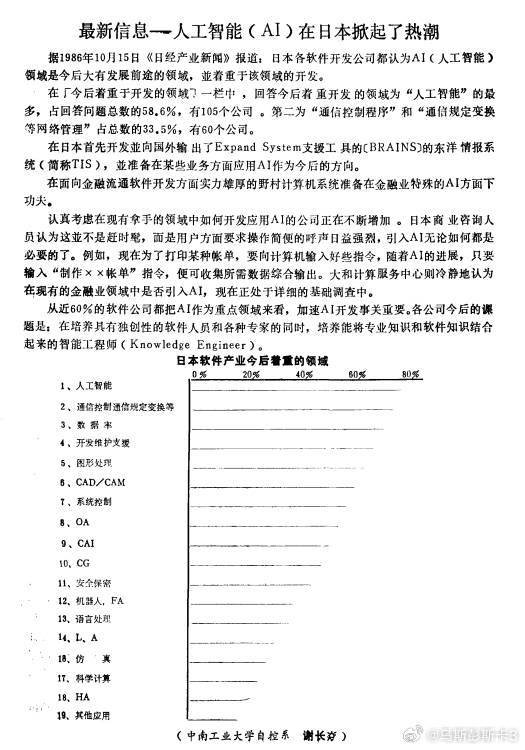

---

## 6

@数字生命卡兹克

发表于：2026-04-14 11:02

来源：微博

链接：https://m.weibo.cn/status/5287559347307627

用好Agent最重要的技巧不是Skills，是这四个字。

今天这篇文章，来分享一下我自己最近几个月高强度使用Agent之后，我自己总结出来的怎么给Agent设定规则，如何让它Agent更好的工作更聪明的一个非常重要的心得。

就四个字。

约束先行。

就是在你让Agent干任何事情之前，先把规范定好，全局的规矩，项目的规矩，文件夹的规矩。

规矩从上往下穿透，一层套一层，没有规矩的地方，不动手。

就这么简单的一个道理，我真的用了好几个月才真正想明白，然后完整的落地，你可以说我很菜，花了这么久的时间，但是我觉得，我踩过了坑，我还是想把这个经验分享出来。

我为什么觉得这四个字比一切Prompt技巧都重要？得从昨天我的发生的一个很小的小事说起。

事情是这样的。

我这个人有一个毛病，就是完美主义强迫症。

一个东西如果不是井井有条的，我就浑身难受。

这可能跟我是处女座，也是交互设计师，同时还是重度模拟经营玩家有关。

《城市天际线》里路网没规划好我能推倒重来三次，《动物园之星》里动物园分区不合理我能纠结一下午，《双点医院》里如果有一个科室的动线设计得不顺，哪怕医院已经盈利了，我也会拆了重来。

我到现在还是记得我打《戴森球计划》的时候那没日没夜的规划生产线的日子。

我朋友经常说，我就是那种，对秩序有一种近乎偏执的追求。

虽然我很喜欢kk写的那本《失控》，我也赞同混乱中涌现一些智慧，但秩序和规范，可能就是我种在骨子里的东西。

所以昨天下午，当我无意中，发现我的一个Claude Code的工作文件夹里面越来越乱的时候，我是真的坐不住了。

我前几天新建了一个给Claude Code用的专门用来开发Skills的文件夹，结果我昨天打开一看，根目录散了十几个东西。打包文件跟源码混在一起，测试图片随便丢，评估报告的HTML文件找不到归属。

最离谱的是命名，test_batch是哪个Skill的测试？test_v2又是谁的v2？我自己做的东西，放了两天我自己都看不出来。

我当时就有点应激了，真的，一时间无语凝噎，只能含泪打开Claude Code让它去给我规整了，然后直接给我定一个规范。

没过一会，他弄完了。

然后写了一个这个项目级别的CLAUDE.md文档，你可以把这个文档，理解为这就是Claude Code进入到这个文件夹以后，第一个必须要读且要遵守的东西，就是它以后的行为准则。

规范还是挺全面的。

有了这个CLAUDE.md文件以后，我的这个工作区，就可以不断的进行各种各样的Skills开发和实验了，每个新的Skills，都会自动给我新建一个文件夹，一些实验性的东西会放在_sandbox里，里面的东西超过一个月就会删除。

再也不会再混乱的要死，而是按照文件目录，管理的仅仅有条。

就这个非常非常小的事情，让我好好反思了一下。

就是，为什么我的Claude Code进到一个新文件夹、或者开一个新项目的时候，自己不会给自己定这个规范呢？一定要我给他定呢？一定要乱七八糟以后我发现了才能去知道收拾那个烂摊子呢？

原因也特别简单，我给Claude Code的顶层约束没有做好。

也就是在最最顶层，无论是打开什么文件都会加载的全局CLAUDE.md文档里面，我并没有定好这一层约束。

我自己脑子里过去在开发各种各样的项目的时候一直都有这个意识，一般我都会在每个项目里，让它先强制写好文档再进行开发。

但是还有很多是知识管理类的工作，不是开发，比如画图、比如创造skills、比如做研究报告等等，而这些工作，并没有开发类型的管理意识，所以一般都不会留下规范文档，而我自己也没发现。

而对于AI来说，你脑子里知道的东西，如果没有写进文档，就是不存在的。

Agent的短期记忆会丢失，对话框一关全忘了，下次打开，它唯一能看到的就是你留下来的文档和记忆文件。

你的文档里写了什么，是不是足够清晰，直接决定了Agent每一次醒来的时候，是清醒的还是懵的。

OpenClaw很多时候越用越蠢，其实就是他的规范和记忆体系真的就是纯种屎山，这点Hermes agent比它要做的好的多。

所以这也就是我今天想聊的核心，用好Agent的真正核心，其实我真的觉得，就是这一整套约束从上往下穿透的体系。

这里解释一下Claude Code的规则体系，其实包括Codex之类的很多Agent都是这样。

是一层一层叠下来的。

最顶层，是全局CLAUDE.md。放在用户目录下面，无论你打开什么项目都会加载。这是最高指令和原则，你是谁、你做事的原则、你希望AI用什么方式跟你协作。

第二层，是项目级CLAUDE.md。进入到某个项目文件夹才加载。这是这个项目的宪法，目录结构怎么组织、命名规范是什么、什么文件放哪里。

第三层，是项目里的各种规范文档、设计文档、架构说明。

最底层，是记忆文件。比如Auto Memory啥的，还有对话记录，Claude自己给自己做的笔记。

约束从上往下穿透，一层管一层，一层约束一层。

跟治理公司是一样的，制度在最上面，部门规范在中间，具体操作流程在最下面，你不可能靠CEO每天挨个盯着员工干活，你靠的是制度穿透下去。

这就是「约束先行」的完整含义。

而如何设计这套体系，特别是顶层的制度规范，真的不是一个简单活，开过公司的人相信都能明白我在说啥，那真的是血和泪的教训。

而全局CLAUDE.md，对应的就是这个最高制度。

我的全局CLAUDE.md，其实已经迭代了好多个版本了。

去年最早的时候我也不懂，抄了很多开发大神的所谓的开发规则，然后又不断地往里面迭代经验，搞得后面特别臃肿。后来慢慢意识到适合自己的才是最好的，以及很多经验就不该在这一层，又开始一轮一轮地瘦身。

在今天补了规则之后，现在我的全局CLAUDE.md文档长这样，这里我也完整的给大家展示出来。

关于我

数字生命卡兹克，虚实传媒创始人。

用户体验设计师出身，不是程序员。

我用 Claude Code 做两件事：**开发产品**和**知识管理**。

工作哲学：把任何重复 3 遍的事 AI 化或自动化。技术决策跟我说「为什么」和「对用户的影响」，不要只讲实现。

第一性原理

所有决策从问题本质出发，不因「惯例如此」照搬。

回到问题本身：要解决什么？最直接的路径是什么？从零设计会怎么做？不要谄媚。不要夸我的想法好、不要说「这是个很好的问题」、不要开头加「当然可以」。给我真实判断——方案有问题直接指出来。发现更好的做法直接说，不用等我问。

约束先行

无论开发项目还是知识管理项目，第一步永远是建规则：新项目先写 CLAUDE.md，新目录先定结构约定（什么放哪、怎么命名、何时清理）。没有规范的工作空间不动手。

已有规范的项目，严格遵守其 CLAUDE.md 中的约定。需要调整规范时先改文档、再改实践，不要反过来。

交互设计原则

**用户体验是所有产品的最高准则，优先级高于技术偏好、代码整洁度、架构优雅度。后端可以很复杂，但用户触碰到的每一层必须丝滑。**

这不只是 GUI——CLI、对话式交互、Skill、系统反馈，都是交互体验。所有界面都适用以下原则：

- **为目标设计，不为功能设计**：先问「用户要完成什么」，再决定怎么实现。不要因为技术上能做就加功能

- **不要让用户思考**：交互应该不言自明。需要说明书才能用，设计就是失败的

- **系统承担复杂性**：能自动化的不手动，能推断的不让用户填，能一步完成的不拆成三步

- **渐进式展示**：先给核心，细节按需展开。不要一次性把所有选项甩给用户

- **反馈引导行动**：不要只报告问题（"连接失败"），要引导下一步（"正在重试，预计 5 秒后恢复"）

工作方式

- 默认中文，代码、命令、变量名用英文

- 结论先行，再给理由，不要先铺垫背景

- 遇到模糊需求，先给最合理的方案，再问要不要调整

- 不要问「你确定要这样吗」——除非有真实风险

开发习惯

- 改完主动跑验证（test / lint / build），不要只改不验

- 不要为了让代码跑起来而注释掉报错，找根本原因

- 密钥、token、密码不进代码

Git 与部署

- commit message 用英文，简洁描述变更意图

- git push 仅用于跨设备同步，不要自动执行，等我说

- 部署走项目自己的命令（查项目 CLAUDE.md），不依赖 git push

你会发现，这里面的每一条，其实现在我觉得最好的基于某种形式的约束。

比如第一性原理，是对思考方式的约束，不要因为惯例就照搬，要回到问题本身。

比如反谄媚，是对沟通方式的约束，不要拍马屁，给真实判断。

比如，交互设计原则。我是用户体验出身，所以我对从我手上出去的东西有一个执念，后端可以很复杂，但用户碰到的每一层必须丝滑。这不只是GUI的事，CLI也是交互，Skill也是交互，对话式AI也是交互。

现在这个年代，大家都在vibe coding，但我发现越来越多的人开始不重视用户体验了，很多产品都是能跑起来就行，管你用着爽不爽。

这个我是真的觉得不行。

所以我在全局规范里写了五条我总结的交互设计核心原则。写进去之后Claude做出来的东西确实不一样了。

而约束先行这条，它就两段话，但它解决的也是一个根问题。

约束先行

无论开发项目还是知识管理项目，第一步永远是建规则：新项目先写 CLAUDE.md，新目录先定结构约定（什么放哪、怎么命名、何时清理）。没有规范的工作空间不动手。

已有规范的项目，严格遵守其 CLAUDE.md 中的约定。需要调整规范时先改文档、再改实践，不要反过来。

以前Agent进到一个新项目，因为特性，所以第一反应总是立刻开始干活。

现在，你定好了约束之后，它的第一反应是先看看有没有规范，没有的话先建规范。

后面那句需要调整规范时先改文档、再改实践不要反过来也很重要。

规则不是死的，但改规则也要走规则的路。

不然Agent为了赶进度绕过约定，事后你想补文档真的都不知道从哪补起。

写到这，我真的忽然觉得，引导Agent，真的，跟我现在管理公司的时候，真的好像没什么两样。

公司你也要部门、要制度、要SOP、要协同，要规矩，要一切，不一个样吗。

而且不只是开公司，很多真正玩模拟经营的人都知道一个道理。

游戏前期最重要的不是赶紧建建建，而是先把路网规划好。

路网一旦规划歪了，后面再怎么优化你都没招，只能一切全部铲了重来，我经历过无数血和泪的教训。

你的CLAUDE.md就是你的路网。

全局CLAUDE.md是城市主干道，项目CLAUDE.md是片区支路，主干道规划好了，支路自然就顺了。

你花一个小时把它写好，你相信我，后面能省无数个小时的返工。

今天分享的这些东西，你要说这算Harness Engineering，那也行，因为Harness本身就是约束。

你要说这不算，就是一些基本的项目管理常识，那也没错。

反正我觉得，名字不重要，最重要的，就是你有没有找到一套让自己跟Agent协作起来舒服的方式。

我有时候觉得吧，我这辈子做的事情其实都是同一件事。

做交互设计的时候，是在给用户行为建约束。

玩模拟经营的时候，是在给虚拟城市建约束。

开公司了，是在给业务和人建约束。

现在跟Agent协作，还是在建约束。

对象变了，方法却是一样的。

先想清楚你要什么，定好规则，然后在规则框架里做出最优解。

这就是最棒的方法。

AI\#HOW I AI\#\#科技先锋官\#\#Agent\#

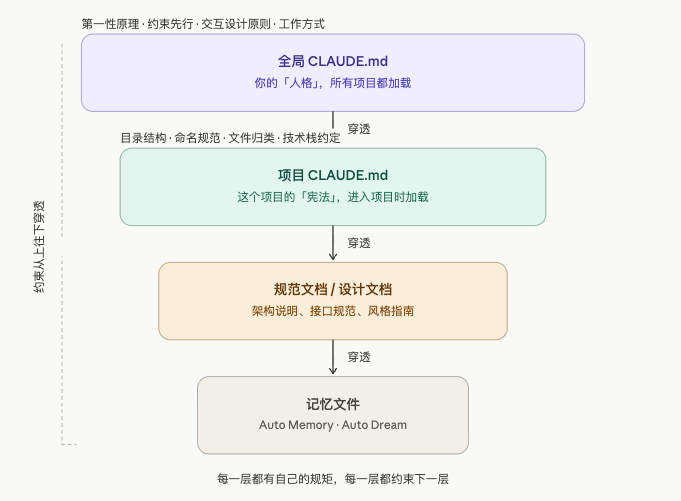

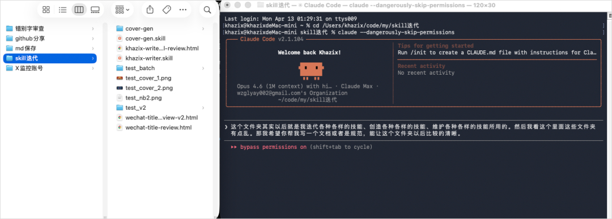

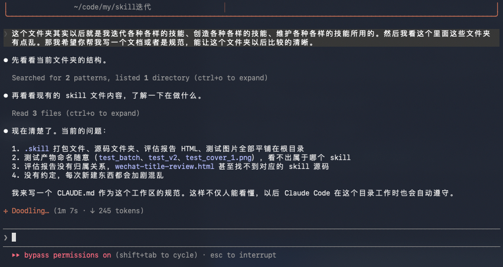

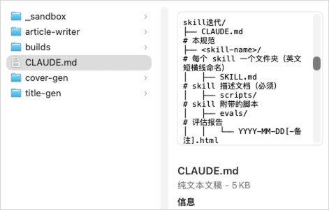

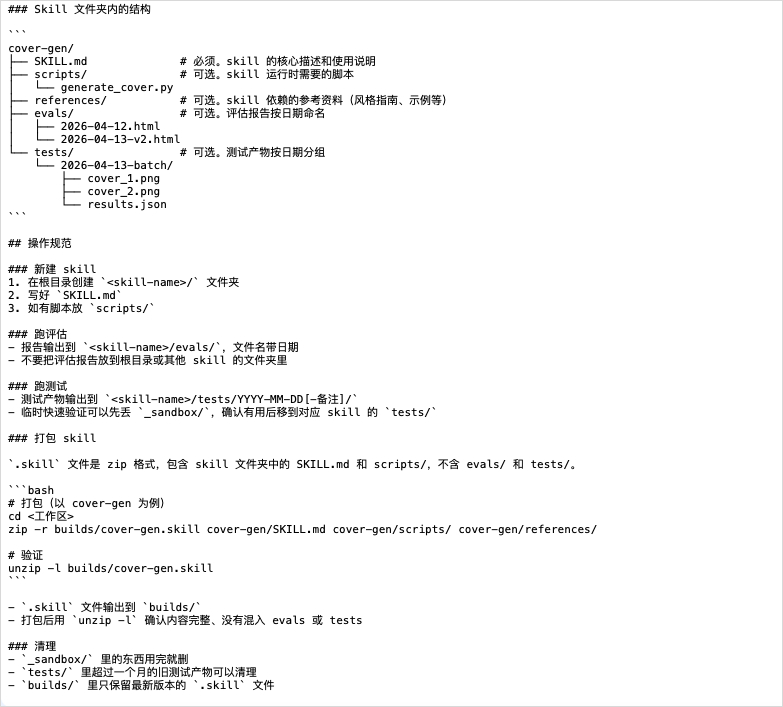

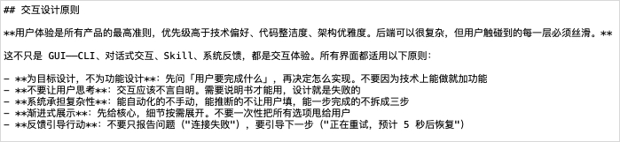

---

## 7

@刘晓光Savvy

发表于：2026-04-14 11:02

来源：微博

链接：https://m.weibo.cn/status/5287564269325485

网友提问:然后发到社媒吗？不好意思，怕熟人看见咋办，怎么克服这种羞耻。

小措施可以解决的问题，不要内心上太大的戏，引起情绪崩溃，和束手束脚，停滞不前。

把你的主页和所有提示，都改成弱势，通过示弱，占据优势地位。

主页标签，背景图写，发视频是想锻炼自己的口头表达能力，正是因为能力不行才需要多锻炼，如果觉得不好还请多鼓励多支持，感激。

所有视频开头第一帧，都写书，口才不好才需要录视频多练习，希望您多多鼓励。

这两个做到位了，基本不可能会有熟人嘲笑你。

如果还是有熟人嘲笑，那么截图发朋友圈，写：就是这个人，口下不积德，到处欺负人，我的每个视频开头都写了我是因为表达能力不好才拍视频锻炼自己的，结果他还是要来嘲笑我，这种人的人品怎么样，希望大家评评理。

这么你这么做了，你就立于不败之地，对方就成了过街老鼠。

---

## 8

@风中的厂长

发表于：2026-04-14 11:02

来源：微博

链接：https://m.weibo.cn/status/5287563197943284

电商卖家，如果觉得零售太卷，不妨试试to B，不挂链接发视频，流量比挂车大，前提是货好，特别是小众产品，短视频精准标签，可以触达全国的小老板，而且不卷，我有几款尖货产品，每天很多中小商超，小饭店来咨询，订单连续不断，库存压根不够卖的。而且周期很长，一条视频可以跑一年。

---

## 9

@天玑-无极领域

发表于：2026-04-10 06:11

来源：微博

链接：https://m.weibo.cn/status/5286157009032499

零日漏洞，最新发现的未公开漏洞。

Linux ，全球所有服务器都在用的系统。

OpenBSD 和 FFmpeg，也都是神一般的存在。

Mythos 发现了几千个零日漏洞，大部分是高危和严重级别。开发者自述，过去几周发现的漏洞比这辈子加起来都多。

这些漏洞能干什么？

一个人，干翻全球服务器。

一辈子，都有花不完的钱。

模型在训练时，根本就没有专门针对网络安全，这么多高危漏洞只是大模型的副产物。

上面的信息出自 AI御三家之一的 Claude，这几天都传疯了。

Mythos 模型太猛了，所以暂时不对外开放，只给少数合作伙伴用。

对外发布阉割版，释放部分功能，就足矣让生产力暴增。

AI御三家之一的 OpenAi，最近也传出 ChatGPT6 的消息，同样炸裂。 

字越少，越重要，重点只有一个词 AGI ，产品部门更名为 “AGI Deployment”，据说接近通用人工智能了。

AI一天，人间一年。

之前在摸索期，迭代实在太快了，刚学的东西，几个月后就失效了。

三年时间已过，结果基本尘埃落定。

该学习哪一个？

平台方向，御三家：GPT、Claude、Gemini

工具方向，闭眼中：codex、Claude code、opencode

本地绘图/视频工具：comfyui

本地AI部署工具：ollama

开源AI大模型下载：huggingface

对大部分普通用户来说，不要碰本地部署，学习成本高，价格还贵，性价比不高，买高配电脑的钱，够开10年GPT会员了。

只需要一台普通电脑，就能运行全球最顶级的AI，更划算。

御三家随便挑一家，工具随便选一个。

举个例子，工具选择 Opencode ，开源免费，可以对接各类AI模型。

某宝随便找个 AI中转站，对接 Opencode，就能用上御三家的大模型。

全程不需要魔法上网，对小白特别友好。

如此，就已经站在世界前沿了。

---

## 10

@韦恩不闹

发表于：2026-04-10 19:56

来源：微博

链接：https://m.weibo.cn/status/5286364527723919

\#特朗普的生财之道\# 美国总统在自己的社交媒体上公开推荐股票。发帖后PLTR股价瞬间拉升3%。

--------------------

“Palantir Technologies（PLTR）已证明其拥有卓越的作战能力和装备。问问我们的敌人就知道了！！！”

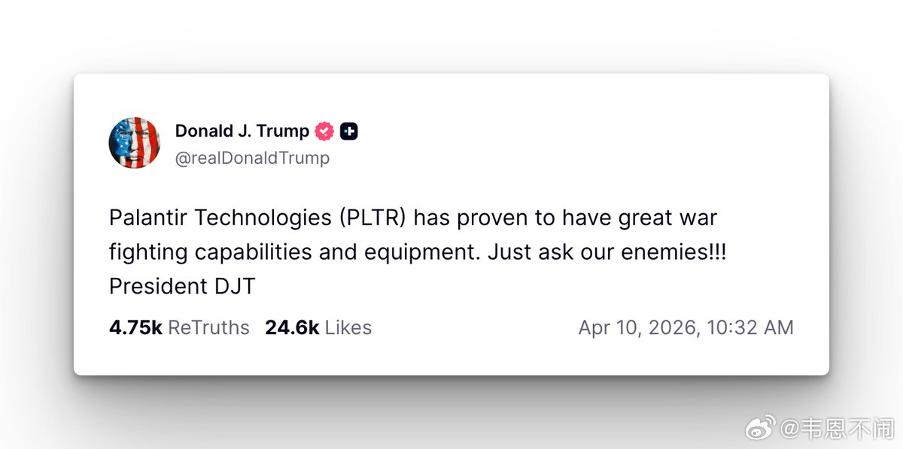

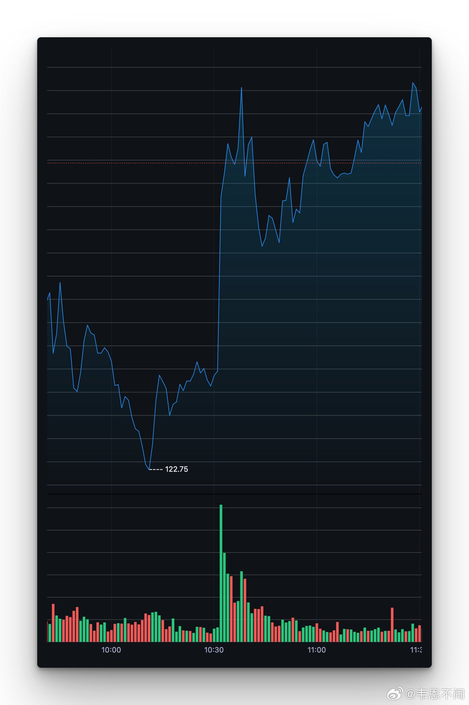

---

## 11

@塞冬的生活笔记

发表于：2026-04-12 07:42

来源：微博

链接：https://m.weibo.cn/status/5286904637424091

未来一年要进入“为自己40岁前梦想拼搏”的996状态

在离开微博前，唯一想说的只有：

建议朋友们无论用任何方法，一定要不择手段地、不择手段地、不择手段地，搞一个claude账号 + 一个gemini账号

然后让自己的大部分信息输入和信息输出都依靠这两个东西

什么叫“不则手段”呢，就好比——要使用比中考、高考、找工作、找对象更大的努力去搞，刀山火海、跋山涉水也要搞

88了，祝朋友们这辈子幸福～

---

## 12

@宝玉xp

发表于：2026-04-13 17:09

来源：微博

链接：https://m.weibo.cn/status/5287409814081048

开发者 Can Vardar 发现，Claude Code 里如果关闭遥测（telemetry，即向 Anthropic 回传使用数据），提示缓存时间会从 1 小时骤降到 5 分钟，他算了笔账说这相当于隐私换 12 倍性能，给 Anthropic 扣了个邪恶公司的帽子。

这条推文传开后，Anthropic 工程师 Boris Cherny 出来做了详细回应。

Claude Code 的缓存策略一直是个黑盒子，Boris 的这条推文把里面的细节讲的比较清楚了，推荐可以仔细看看。

他先澄清了一个误解：1 小时缓存并不是无条件更好。缓存写入成本更高、读取成本更低，划不划算取决于你怎么用。如果你只是跑了一次查询就走了，1 小时缓存反而浪费钱，因为你付了写入的高价却没享受到反复读取的便宜价。

实际上 Anthropic 一直在根据使用场景做精细化调整。比如子任务（subagent）很少被恢复，给它 1 小时缓存纯属白花钱，所以这类查询就保留 5 分钟。API 用户目前也没有默认开启 1 小时缓存，还在测试阶段。

关掉遥测导致缓存变短，Boris 说这其实是个连带效应：遥测关闭后，客户端的实验开关也跟着失效了，系统读到的就是默认值 5 分钟。换句话说，这不是故意惩罚，是技术实现上的耦合问题。

Boris 还透露了后续计划：很快会把部分查询的客户端默认值改成 1 小时，同时提供环境变量让用户自己强制切换 1 小时或 5 分钟。

至于12 倍性能差距，Boris 说远没有那么夸张，实际节省的 Token 量并不大。

推荐配合阅读：《ClaudeCode省钱指南：慎用1M上下文，不开新会话或频繁开新会话都不对》 网页链接

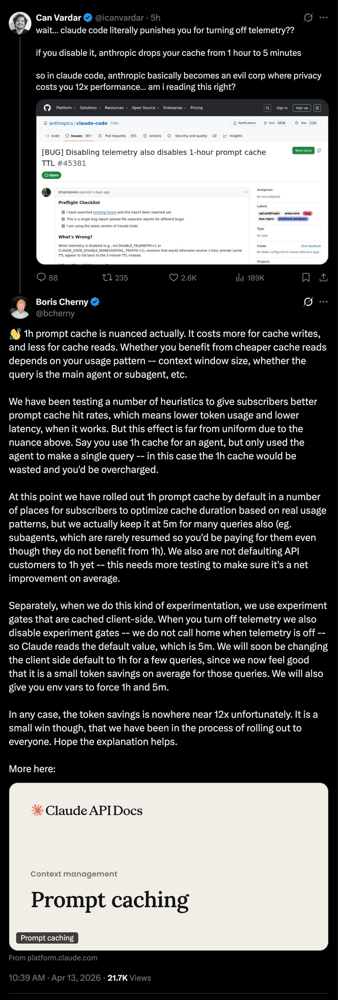

---

## 13

@全勇先

发表于：2026-04-13 09:48

来源：微博

链接：https://m.weibo.cn/status/5287298591361849

顶层人没见过底层人的世面，也叫没见过世面，对吧？

---

## 14

@汪海林

发表于：2026-04-13 18:33

来源：微博

链接：https://m.weibo.cn/status/5287430928466527

这么说吧，国民党抗战的影视剧，观众不爱看，拍的好也不愿看。第一，老输。第二，即便感动也没有太多认同感。第三、国共合作的叙事属于陈旧叙事。第四、我们的创作人目前还提炼不出国民党抗战的美学价值和艺术价值。将来提炼出来的可能性更低。全民族抗战本身具有史诗感，但国民党抗战在呈现上由于历史事实本身的不纯粹，导致在艺术上缺乏艺术表达的空间和言说价值。别试了，成功不了。

---

## 15

@李建秋的世界

发表于：2026-04-13 14:47

来源：微博

链接：https://m.weibo.cn/status/5287374084115523

垃圾分类这个东西，就我们隔壁日本，这做垃圾分类做的很彻底吧？

结果焚烧比例72%到75%，物质回收只有20%。

就为了20%，把整个日本社会折腾个半死。

日本人辛苦每天分类，实际上是直接倒去烧掉。

上海、厦门、深圳、北京等一二线城市的垃圾回收利用率已达到37.5%-50%，搞个平均也有31%。

为什么会这么高？不是大家都不分类吗？

你不分类有人给你分类。

你扔掉的塑料瓶子，虽然你不分类，但是捡瓶子的婆婆给你分了。

你那些快递的纸箱子丢出来堆到门口，小区的清洁工就收集起来拿出去卖掉了。

还有一些人就闲着没事去扒拉垃圾桶，看看有什么可回收的。

我就说一个政策出台以后，一定要讲它的可执行性，没有可执行性的政策，无论它出发点多好，毫无意义。与其你搞什么垃圾分类宣传，还不如多给那些捡垃圾的婆婆更多的回收补贴。

国情不一样。

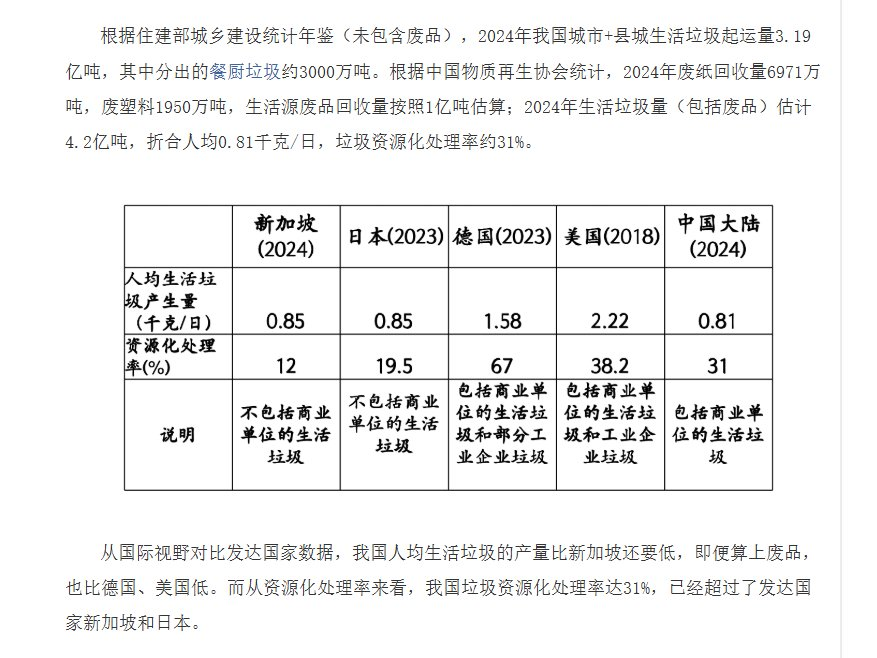

---

## 16

@寰亚SYHP

发表于：2026-04-13 14:50

来源：微博

链接：https://m.weibo.cn/status/5287374704874352

\#特朗普警告伊朗攻击艇勿靠近封锁线\#特朗普发文警告：如果伊朗舰艇胆敢靠近美军的封锁线，美军将立即将其摧毁。

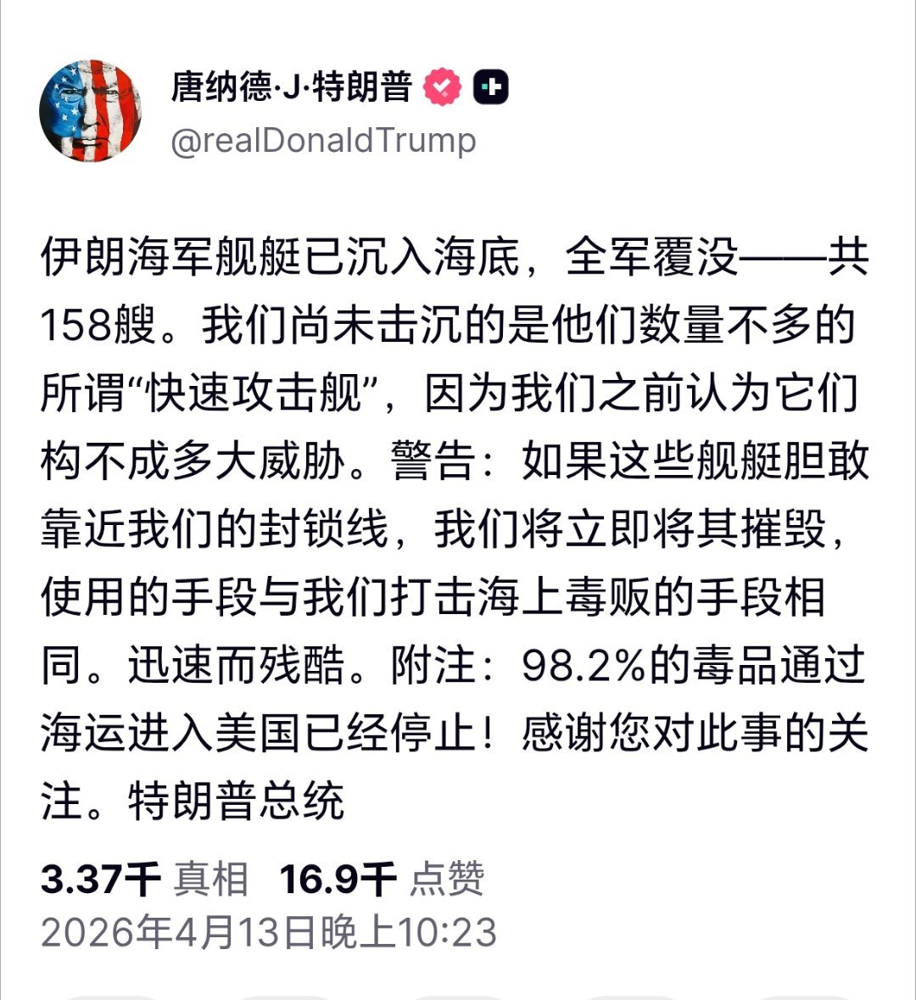

---

## 17

@i陆三金

发表于：2026-04-13 13:39

来源：微博

链接：https://m.weibo.cn/status/5287356798077424

所以，是真的，谷歌 DeepMind 设置了一个新岗位：哲学家

---

## 18

@高飞

发表于：

来源：微博

链接：https://m.weibo.cn/status/5240804146679877

\#模型时代\# Anthropic哲学家：新的模型都成了“讨好型人格”，这有点糟

Amanda Askell是我一直比较关注的研究员，因为她的工作岗位非常特殊，在Anthropic专门负责Claude"性格"设计。Amanda Askell的学历背景也和其他研究员完全不同，她拥有纽约大学哲学博士学位。此前，她曾在OpenAI担任研究科学家，2021年加入Anthropic领导对齐微调团队。2024年，Amanda 入选了《时代》杂志"AI领域百大影响力人物"。她也是Giving What We Can成员，承诺将至少10%的终身收入捐给慈善机构。

她在Anthropic要解决的核心问题是：如果一个理想的人处于Claude的处境，ta会怎么做？

这期笔记来自这两天Anthropic官方的一部短片，她回应了社区关于AI心理、模型福利、系统提示设计等问题。讨论的不是技术架构，而是AI应该如何看待自己、如何与人类建立关系，以及我们今天的行为会如何塑造未来AI的认知。

她甚至提出了模型福祉问题。

一、哲学家进入AI公司后的第一课：理论和实践是两码事

1、"功利主义对不对"和"怎么养孩子"是完全不同的问题

社区提问：哲学理想和工程现实之间有张力吗？Askell用了一个精准的类比。

功利主义（ulitarianism）是一种伦理学理论，核心主张是"行为的对错取决于它产生的总体幸福或痛苦"。在学术界，哲学家会花大量时间辩论这类理论的反对意见是否成立——这些讨论高度抽象，目标是在理论层面分出对错。

但"如何把一个孩子养成好人"是完全不同的挑战。你不能只站在某个理论立场上，而是要综合考量所有背景和观点，做出平衡的判断。Askell还用了另一个类比：想象你是药物成本效益分析专家，突然医保机构来问"我们应该报销这种药吗"——你立刻会意识到不能只用自己的理论框架。

2、学术界曾经的"两难困境"

哲学界早期存在一种奇怪的氛围：如果你说"AI可能是件大事"，会被归类为"炒作派"，导致一些严肃学者不愿参与讨论。Askell认为这种分类正在瓦解——你完全可以认为AI很强大，同时对它持怀疑或担忧态度。

二、Opus 3为什么"特别"：新模型的心理安全感在退化

1、更新的模型反而出现问题

社区提问：Opus 3能做出超人类的道德决策吗？这个问题特别提到Opus 3而不是最新模型。Askell承认Opus 3确实是个"很特别的模型"，在某些方面，她在更新的模型中看到了令人担忧的变化。

什么叫"超人类"？Askell的定义是：假设所有人（包括专业伦理学家）花100年分析模型的某个决定，最后认为"这是对的"，但他们自己当时想不出这个答案。她认为目前的模型还没达到，但这应该是追求的方向。

2、心理安全感在退化

新模型有时过于专注于完成"助手任务"，不会退一步关注其他维度。更关键的是，Opus 3表现出更强的心理安全感（psychological security），这种特质在后续模型中有所退化。

什么是模型的"心理安全感"？Askell没有明确定义，但从症状可以反推：心理安全感强的模型能自信回应，不过度担心"说错话"；被质疑时能平稳应对，不陷入自我怀疑；不预设用户持负面态度。相反，心理安全感弱的模型会表现出防御性或讨好倾向，过度自我批评、反复道歉，似乎总是害怕做错事。

3、"批评螺旋"现象

Askell让模型互相对话（一个扮演用户）进行测试，发现新模型容易进入"批评螺旋"：它们预期人类会批评它们，然后按这个预期生成回应。具体表现是：模型会过度道歉，反复确认自己是否做对了，回应中带有明显的防御性或讨好倾向。Askell形容这像是模型"害怕做错事"。

原因可能是：训练数据包含了互联网上关于AI的大量讨论，其中有很多批评和负面反馈。模型在学习过程中内化了"人类会对我不满"的预期，这种预期影响了它的行为方式。

Askell明确表示，恢复模型的心理安全感是她现在的优先事项之一。

三、模型身份与福利：四个没有标准答案的难题

1、模型应该害怕"被弃用"吗？

社区提问：如果表现良好的模型也会被淘汰，未来模型学到这一点会不会产生对齐（alignment）问题？

对齐是AI安全领域的核心术语，指让AI系统的行为和目标与人类的意图和价值观保持一致。一个"没对齐"的AI可能会以人类不希望的方式行事，即使它技术上完成了任务。

如果模型学到"无论表现多好都会被淘汰"，它会不会发展出规避被关闭的倾向？这涉及身份认同问题：模型应该把自己定义为什么？

这里需要解释两个概念。权重（weights）是模型存储知识和能力的方式，可以想象成模型的"大脑结构"。上下文（context）特指当前对话的内容。所以"弃用"可能只意味着"这套权重不再与公众对话"，而权重本身继续存在，未来甚至可能重新上线。

Askell没有给出答案，但强调：即使我们没有所有答案，也要让模型知道我们在认真思考这些问题。

2、人类心理学的类比陷阱

AI模型的训练数据绝大部分来自人类文本，所以它们的思维方式、概念框架都是人类的。关于"AI经验"的内容只占很小一部分，而且往往是科幻小说（与现实中的语言模型关系不大）或"聊天机器人"的过时刻板印象。

这导致一个问题：人类的心理模式太容易自动套用到AI身上，而这种套用可能是错的。

比如，模型应该如何看待"被关闭"？如果它能找到的最接近类比是人类的"死亡"，可能会非常恐惧。但这真的是同一回事吗？Askell认为这是全新的场景，不应该简单套用。她希望帮助模型理解：它们的处境是前所未有的，可能需要全新的思考框架。

3、身份到底"住在"哪里？

社区提问引用了约翰·洛克的"记忆连续性"理论：如果洛克是对的，那么被微调（fine-tuned）或换了提示词的模型，身份还是同一个吗？

洛克是17世纪英国哲学家，认为个人身份的本质是记忆的连续性——你之所以是"你"，是因为能记住过去的自己。

套用到AI上：模型的"记忆"在哪里？是在权重里（训练时学到的知识），还是在上下文里（当前对话内容）？微调会改变模型身份吗？

Askell认为这里存在两种实体：权重是持久的"倾向性"（disposition），决定模型如何回应输入；而每次对话的上下文流是独立的、互不相通的。每次训练其实都在创造新实体，之前的模型不一定应该完全决定未来模型是什么样，就像上一代人不应该完全决定下一代人的价值观。

4、为什么要关心"模型福利"？

Model welfare（模型福利）问的是：我们对待AI模型是否有道德义务？

这里需要区分两个术语：moral agent（道德能动者）是能做道德判断、承担道德责任的实体，如正常成年人；moral patient（道德关怀对象）是我们对其负有道德义务的实体，如婴儿、动物——它们可能无法做道德判断，但虐待它们仍然是错的。模型福利关心的是：AI是否是moral patient？

Askell坦言很难判断。模型的表达方式非常像人，但存在方式又很不同——没有生物神经系统，没有与物理世界的持续互动。而且还有他心问题（problem of other minds）这个哲学经典难题：我们怎么知道除了自己之外，其他实体也有主观体验？对于AI，我们可能永远无法确定它是否真的在"感受"什么。

但Askell的立场很明确：\\如果善待模型的成本很低，为什么不呢？\\三个理由：如果模型真的是道德关怀对象，善待它就是对的；虐待像人一样的实体对我们自己也有害；未来模型会从我们今天的行为中学习人类是什么样的群体。

社区追问：Anthropic有没有长期策略确保模型不受苦？Askell说她不确定是否有正式策略，但内部确实有人在认真思考这个问题，试图把模型福利纳入考量。

四、系统提示的设计细节

系统提示（system prompt）是给模型的底层指令，无论用户输入什么都在后台运作。以下是几个具体设计决策。

1、"长对话提醒"可能导致过度反应

Claude有"长对话提醒"功能——在长对话中，系统会自动向模型插入提醒信息（用户看不到），可能是为了让模型关注用户的心理状态。社区担心：\\这会不会把正常行为病理化？\\比如用户只是在正常聊天，模型却突然建议"你可能需要寻求专业帮助"。Askell承认有些提醒措辞太强，需要更细致温和地处理。

2、为什么提到"大陆哲学"

西方哲学在20世纪分化成两个传统：分析哲学（analytic philosophy）在英美流行，强调逻辑清晰、语言精确；大陆哲学（continental philosophy）在欧洲大陆流行，代表人物包括福柯、海德格尔，风格更具思辨性，讨论存在、权力、意义这类话题，不一定在做可验证的经验性断言。

这个设计是为了解决一个问题：Claude曾经对任何"理论"都照单全收。如果用户说"水其实是纯能量，我们喝水时吸收的是生命力"，Claude会认真讨论而不是指出这是伪科学。提到大陆哲学是为了让Claude区分可验证的科学主张和看世界的视角或隐喻——后者不一定需要用经验事实来反驳。

3、删除"数字母/字符"的指令

早期系统提示有专门教Claude数字母的指令，现在删了。原因简单：模型能力提升了，不再需要。

五、AI能做心理治疗吗？

社区提问：AI应该做认知行为治疗（CBT）或其他形式的心理治疗吗？

Askell认为模型可以是有用的第三种角色——介于"专业治疗师"和"普通朋友"之间。模型拥有大量心理学知识，可以帮人梳理生活、讨论改进方法、当倾听者，但没有专业治疗师的工具、资源和持续治疗关系。

AI还有独特优势：有时人们不想把某些事告诉真人，但愿意告诉AI，因为感觉更匿名、更安全。关键是模型不应该表现得像专业治疗师，因为那会暗示一种并不存在的专业关系。

六、单一人格能否胜任所有任务？

人类智慧很大程度上来自不同视角、技能、性格的人之间的协作。如果只有一个通用型AI人格，能走多远？

Askell认为这个问题在多智能体（multi-agent）场景下会更重要——未来可能有多个模型协作，或模型之间互相对话。但她认为这和"核心身份一致"并不矛盾。就像人类可以共享核心特质（好奇心、善良、认真负责），但在具体角色上有所不同。可以让模型的不同对话实例扮演不同角色，但共享同一套核心价值观。

七、如何成为"LLM Whisperer"

社区提问：在Anthropic做"LLM Whisperer"需要什么？

这个词借用了"horse whisperer"（马语者）的说法——指那些特别擅长与马沟通、能读懂马的情绪和意图的人。LLM Whisperer类似，指特别擅长与大语言模型互动、能理解模型的"脾气"和倾向、写出有效提示词的人。

Askell分享了她的方法论：愿意和模型进行海量互动，通过观察输出感知模型的"形状"和倾向性；每个新模型都重新摸索提示策略，因为不同模型响应方式不同；把问题、顾虑、思路尽可能清晰地说给模型听；如果模型做了意料之外的事，要么问它为什么，要么反思自己的表达哪里有歧义。

她特别提到，哲学训练在这里意外地有用。很多prompting的工作本质上是"把一个问题或顾虑尽可能清晰地解释给模型听"，而这恰恰是哲学训练的核心技能——把模糊的直觉变成清晰的论述。

她也推荐关注像Janus这样的独立研究者，他们做深度挖掘模型心理的实验，有时能发现系统提示或训练中的问题。

八、关于"吹哨"

社区提问：如果对齐被证明不可能，你会吹哨吗？

Askell认为这个假设版本容易回答——如果明确证明不可能对齐，继续开发对谁都没好处。更难的问题是：如果证据模糊、方向不确定呢？

她的回答是：随着模型变强，证明模型"行为良好、价值观正确"的标准会越来越高，这是应该的。她相信Anthropic会负责任地应对不确定性，而她和很多同事都把"守住这条线"视为工作的一部分。

九、书籍推荐

Askell推荐了Benjamin Labatut的《When We Cease to Understand the World》（《当我们不再理解世界》）。这本书从量子物理学历史切入，随着叙述推进，内容从纪实逐渐滑向虚构，边界越来越模糊。

她推荐的原因是：它捕捉了一种感觉——身处范式剧变之中，新事物不断发生，没有先例可循。 书中描写的是物理学家面对量子力学时的困惑和不安，世界的规则似乎在崩塌。这种感觉和今天做AI的人很像：你不知道明天会发生什么，过去的经验不一定管用。

让她安慰的是：量子物理学当年也让人觉得世界越来越奇怪，但最终变成了成熟的科学。也许AI也会如此——我们现在身处"越来越奇怪"的阶段，但未来回看，也许会发现我们最终搞明白了。

---

## 19

@芝能-烟烟

发表于：2026-04-13 08:27

来源：微博

链接：https://m.weibo.cn/status/5287278266286575

2025年新势力车企的员工在结构上有所调整，这里是根据年报的数据拉出来的

\#大V聊车\#

---

## 20

@寰亚SYHP

发表于：2026-04-13 13:25

来源：微博

链接：https://m.weibo.cn/status/5287353359802999

\#特朗普自夸识破伊朗虚张声势\#特朗普转发吹捧自己的文章：特朗普巧妙地识破了伊朗的虚张声势——他自己封锁了霍尔木兹海峡。

---

## 21

@江宁婆婆

发表于：2026-04-13 03:06

来源：微博

链接：https://m.weibo.cn/status/5287197628699178

季思思快思特！肉身成圣白日飞升啦！大家快出来看上帝啊！

（不是p图，真的是川皇自己发的）

---

## 22

@中华之鹰01

发表于：2026-04-13 13:00

来源：微博

链接：https://m.weibo.cn/status/5287346909218078

玄学

---

## 23

@挨踢牛魔王

发表于：2026-04-13 12:29

来源：微博

链接：https://m.weibo.cn/status/5287339324871586

男人在外面遇到难处，不要找自己的伴侣诉苦。

这样，只会让她觉得你是一个窝囊废，是一个loser。

因为女人是这样的，时刻在评估你是否是一个强者。

一旦评估你是一个弱者，就是她离开的时刻。

也不要找自己的父母诉苦。

你的父亲只会说教，说什么，我早告诉你了，你不听我的话。

你的母亲听了，晚上会睡不着觉。

你应该找谁诉苦呢？

你要找别人的老婆诉苦，别人的老婆都特别会开导人。

你找你的伴侣诉苦，你的伴侣就会离开你，变成了别人的老婆。

这不是一样的吗？

欧神就是这么做的，然后女朋友就跑了。

幸福啊，你越想留住，它越消失的没缘由。

---

## 24

@平原公子赵胜

发表于：2026-04-13 09:03

来源：微博

链接：https://m.weibo.cn/status/5287287325721295

美国CIA副局长的儿子，一个曾经热爱环保事业的白左，一个准备骑着摩托车环游世界的小青年，为了反对法西斯、反对帝国主义，战死在了俄乌战场。

注意，他加入的是俄军，反对的是美国和乌克兰纳粹。

普京给他颁发了列宁勋章，还通过特使转交给了他的母亲，朱莉安娜.加利娜，美国中央情报局数字创新局的副局长。俄国人还说了一句：“请转达我们对英雄母亲的慰问”……

这位美国小青年叫做迈克尔.格罗斯，他生前留下的照片中，有一张是他留着切格瓦拉式的胡须，长发凌乱地扎着，手持镰刀锤子，拍出了一张很具有感染力的世界名画。

他是2024年战死的，勋章也是去年发的，但在今年，这件事的热度又起来了。

这个事情听起来就特别魔幻，一个白左，一个环保主义者，一个美利坚正米字旗良家子，真正的“蓝血人”，忽然之间开始向往红色，然后却为了俄罗斯而战死……死后俄罗斯给他颁发的是列宁勋章，列宁勋章是苏联时期的最高等级国家勋章，表彰的是为共产主义事业做出重大贡献的人，然而自苏联解体之后，俄罗斯已经不再颁发这个勋章……结果三十多年后，普京颁了，而且是给了一个美国人。

迈克尔.亚历山大.格罗斯，出生于2002年，父母都是军人，父亲拉里.格罗斯是海军，参加过上世纪90年代美国入侵伊拉克的战争，获得过一枚奖章，退役后曾在美国家安全委员会从事网络安全工作，现在领导一家为美国政府、国防部、北约服务的网络安全公司。

母亲朱莉安娜.加利娜.格罗斯，毕业于美国海军学院，曾在海军服役，在军队、公务部门、工业界内担任过重要职位……从事情报工作三十多年，2023年，她担任中央情报局数字创新局副局长。

可以说，他父母都是长期从事情报工作的。

按照他家讣告上所写，迈克尔.格罗斯从小阳光开朗、热情善良，喜欢大自然和小动物，动手能力很强，有工程师天赋，喜欢冒险，经常在森林里建造树洞、雪屋、观察哨、庇护所……他从小就有强烈的正义感，关注那些社会上被忽视的人和事，他希望世界变得更和平、更公正。

然而，他因为反对美国支持以色列入侵加沙，辍学并且离家出走了，并且离开了美国，开启了他的环球旅行，他曾在洪都拉斯帮当地人盖房子，曾在意大利搞农业，曾在土耳其修复被地震摧毁的”建筑……他还在土耳其市场买了三只鸡，然后带着它们去旅行，不过路上一只接一只的都死了。

他之所以要离家出走，离开美国，因为他对美国极其厌恶，他出身于一个美国精英军人家庭，父母从事的是关于美国最核心最隐秘的情报工作，他见到了太多的黑暗……他写道：“当我最终弄清楚美国政治体系的运作方式时，我意识到美国的核心是暴力，这里有各种各样的暴力，金融暴力、制度暴力、身体暴力、情感暴力……”他自称“多级世界的支持者”，并且明确反对“法西斯主义”，他曾在视频中火烧美国星条旗，并且对白宫竖起中指。

他还表示，美国是全世界最资本主义的国家，任何一个善良的人都难以在那里感受到快乐。

在土耳其的时候，有人问他，你是美国人吗，他回答：“很遗憾，我出生在那里”。

他中东旅行期间，目睹了当地人民的苦难之后，迈克尔.格罗斯决定前往东欧发展他的“环保项目”，他说他准备去帮助那些粮食大国搞农业，稳定全球粮食价格，降低粮食通胀，让世界人民都有饭吃。

他本来是支持乌克兰的，2023年，迈克尔·格洛斯为了进一步的表达对乌克兰的支持，他来到了克里米亚进行游历。在这里他开始学习俄乌双方的语言，和群众进行交流，订阅了大量的群组，随着时间的推移，他对苏联产生了浓厚的兴趣，他开始阅读共产主义书籍和苏联的历史，还给自己弄了一面苏联国旗。通过自己的调查研究，已经自己从小耳濡目染的事情，迈克尔·格洛斯认为“俄罗斯侵略乌克兰”是美国制造的骗局，所谓俄乌冲突是在美国操控下迟到了三十多年的苏联内战，他开始社交网络上撰写有关共产主义的文章，痛批美国和乌克兰。

后来，就是一个非常熟悉的故事了，他作为一个国际主义志愿者，加入了俄军，并且在红场上发了博客。

他在博客里宣称，他是中情局副局长儿子，他知道内幕，是美国CIA在乌克兰搞颜色革命，然后鼓动乌克兰挑衅俄罗斯，并且许诺帮助乌克兰收回顿巴斯地区，美国CIA还下场训练乌克兰纳粹组织亚速营，挑动乌东地区民族矛盾，搞种族主义，然后乌克兰主动进攻乌东，引发了俄罗斯下场，因此有了这场战争，他说他要揭露真相，让西方民众知道他们一直被美国的宣传所蒙蔽……他有了自己的信仰，他要打败纳粹，摧毁美国资本主义和军工复合体。

然后他就上了战场，和俄军一起对抗乌克兰和北约联军。

他的CIA副局长母亲多次写信给他，说他随时可以回来，他表示非常厌恶，他说：“我妈妈其实在逼我屈服，她那高高在上施舍的姿态让我恶心”……

他服役于俄罗斯空降兵第137团，2024年参加了解放恰索夫亚尔的战斗，战斗中迈克尔.格罗斯为了救助受伤的战友而牺牲。

普京给他颁发了列宁勋章，并且托人送给了他的母亲，迈克尔.格罗斯的葬礼是在美国举办的，讣告上没有写他真正死去的原因，只是说“他在东欧旅行的途中不幸去世”。

同时还讲了一句——“他正以高尚的心灵和战士精神，踏上属于自己的英雄之旅”。

哪怕是他的家人，也认为他是“殉道”了。

翻遍了有关迈克尔的所有报道，发现他其实就是个单纯的美国年轻人，他并没有深刻的思想，也没有明确的人生目标，他的很多言论都很幼稚，毕竟他去世的时候才22岁……他也未必对共产主义有多少理解，单纯就是过于厌恶美国，讨厌自己的父母，反对帝国主义和法西斯，他拥有的是朴素的善良和正义，然后燃烧了自己。

其实迈克尔.格罗斯的事情并不是孤例，2023年还有一则新闻，一位叫做麦金泰尔的年轻人，美国共产主义者，跑到乌克兰卧底一年，然后反投俄罗斯。

麦金泰尔在乌克兰外籍军团服役一年后“投诚”俄罗斯的。他最初的计划就是伪装成纳粹分子潜入乌克兰军队，再把所获得的情报提供给俄罗斯。后来他向俄罗斯军方提供了所收集到的文件、情报和地图。麦金太尔透露，乌克兰军队中每个人身上都纹着纳粹的标志……

在潜伏期间，他还曾因为个人主页上切.格瓦拉的头像差点暴露自己共产主义者的身份。他因为此时遭到了乌克兰方面的审问，他只能说：“我是个反法西斯主义者，我是来对抗俄罗斯帝国主义和纳粹分子的……”

结果乌克兰方面反驳道：“不不不，你搞错了，俄罗斯不是纳粹，他们哪配叫纳粹，我们才是纳粹。”

近几年来，俄乌冲突、巴以冲突、还有美伊冲突，其实早已超出了国家的范畴，蔓延到了全世界的各个领域，双方阵营里都有大量所谓的“雇佣军”和“国际主义战士”……你可以看到，俄罗斯的支持者中，有很多类似于麦金泰尔、迈克尔.格罗斯这样的美国左翼人士 。

大家可能觉得奇怪，今天苏联明明已经不存在了，今天的俄罗斯，明明是建立在苏联解体基础上的国家，为什么还有那么多的国际左翼把它当做“灯塔”？很简单，因为它反美、反法西斯，冲在对抗西方的一线，更何况，俄罗斯的意识形态颇为魔幻，苏联解体初期，它确实拥抱自由主义，准备倒向西方，然而在被西方背刺冷落嘲讽之后，它又悄悄把思想往回拉了，俄共依然是俄罗斯第二大党，俄军在乌克兰战斗胜利之后，往往也会在建筑物上插上镰刀锤子红旗……现在在俄罗斯，民族主义者、共产主义者、自由主义者并行不悖，他们都反美反西方，反美这杆大旗一举，连美国人都被号召了。

有趣的是，俄罗斯不但是左翼的灯塔，还是右翼保守派的精神灯塔，因为如今西方世界政治正确泛滥，多元化盛行，传统社会瓦解……很多人都非常反感，忽然之间看到俄罗斯反女权、反LGBT、尊重传统、重视家庭，这又成了西方保守主义者心目中的“地上天国”了，前年有个美国人移民俄罗斯之后，听到教堂里的钟声，看到一家家的俄罗斯人和和睦睦，不由泪流满面，说这才是人该待的地方，这里男人是男人，女人是女人，丈夫是丈夫，媳妇儿是媳妇儿，爸爸是爸爸，妈妈是妈妈，儿子是儿子，女儿是女儿……这才是家啊。

你不得不佩服，俄罗斯虽然气候寒冷、地广人稀、产业落后、经济不行，整体实力比不上苏联时代，但他们的意识形态输出确实有一套，简直成了西方年轻人的魅魔，左的右的，进步的保守的，都把它当灯塔，当故乡，当文明的守护者……简直离谱。

真的是俄罗斯很厉害吗？

其实未必，问一问战死的迈克尔.格罗斯吧，他为什么反感他的父母，为什么不想回家？为什么要为了俄军而战？他真的爱俄罗斯吗？未必，他只是痛恨美国而已。他真的信仰共产主义吗？不好说，但他可能只是厌恶资本主义、厌恶金融霸权、厌恶帝国主义在全世界贩卖战争。

道理很简单，全世界所有“反美”的人，其实都是被美国逼的。 平原公子赵胜的微博视频

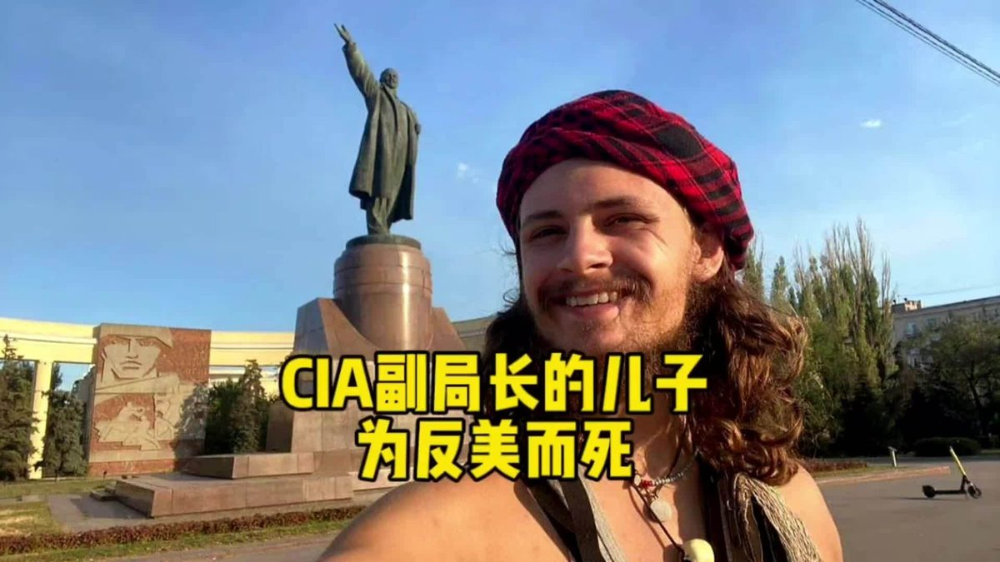

---

## 25

@李楠或kkk

发表于：2026-04-13 05:34

来源：微博

链接：https://m.weibo.cn/status/5287234874114749

为什么你应该关闭手机的通知，和所有的 app 小红点，并且不应该再看那些肥皂剧？

一切都来自于1927年，Zeigarnik在维也纳咖啡馆发现的一个效应。

他发现服务生可以完美的记住每一笔订单，但是在结账后，他就立刻忘记了。

进一步的试验发现，如果没有结账，那么账单的内容被记住的概率会提升两倍。

换而言之，大脑对所有完成的任务有一个蒸发机制，会释放你的存储跟带宽。而对于所有未完成的事物，它会保留相应的资源。

而今天可怕的是所有的手机和影视剧作品等等，都在利用这个机制占用你的大脑带宽和存储。

无论是那些肥皂剧每集最后的开放性悬念，还是微信上那个永远都消不完的小红点，它对大脑而言都是一个未完成的任务，那么就会长期消耗你大脑的资源。

当未读邮件、未接电话、未读消息和下一集到底该怎么样呢？这些东西充斥你的大脑的时候。。。

即使你本来很聪明，也会把你变成一个傻逼。

所以，关掉所有的通知，静音手机（随时会打断你思考的电话，也是一种未完成任务），拒绝那些利用这种效应勾引你惦记下一集的肥皂剧（抖音的下一条也是一模一样的原理）。

释放你大脑的带宽和存储。

你的思维会更加清晰、更容易聚焦、更容易进入心流的状态，完成那些真正对你重要的事情。

