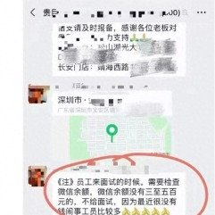

@头条新闻
发表于：2026-04-14 13:01
来源：微博
链接：https://m.weibo.cn/status/5287594592045533

\#公司要求微信余额没三五百不给面试\#\#多方回应公司要求查看余额才能面试\# 近日，一段提及“微信余额没有三百至五百元的，不给面试”的聊天记录引发关注。记者搜索发文工作人员微信，其名称为“贵巨，聚蓝领”，疑似是一名劳务中介。
记者联系到该工作人员。他说，因为应聘的员工动不动就闹事，说没钱吃饭了、要报警之类，所以用人单位有这样的要求，“上个一两天，自己没钱吃饭，就要去报警、投诉等。我们也只是负责发这个通知。”关于具体是哪一家用人单位，对方未明确回复。
另一名“贵巨，聚蓝领”的工作人员则透露，该用人单位系深圳市双翼科技股份有限公司，该厂还在招聘，“查看余额主要是担心你做两天就跑路（离职），这是公司要求。”公司担心工人干两天不干了就要工资。  网页链接

---

