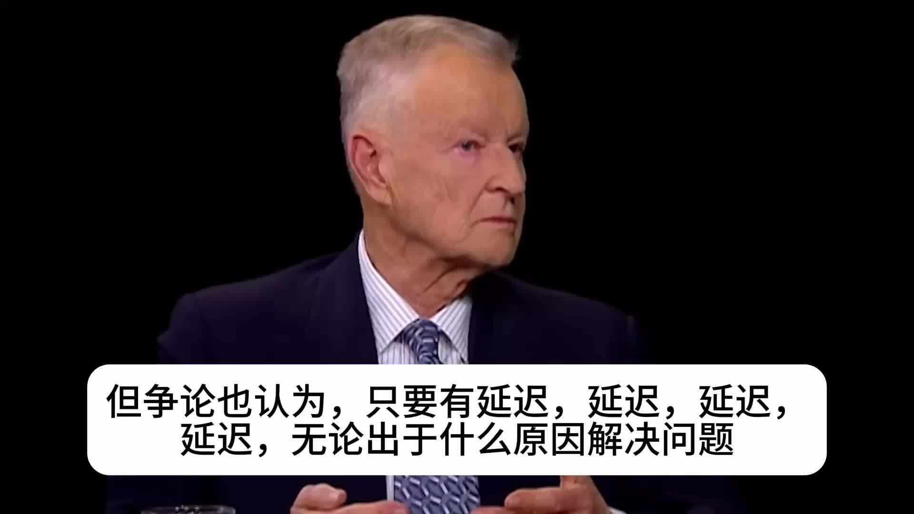

@飞扬军事铁背心

发表于：2026-04-13 05:25

来源：微博

链接：https://m.weibo.cn/status/5287232579567814

2012年初，当时已84岁的布热津斯基接受采访，主持人查理·罗斯抛出了一个当时听起来像假设题的问题：以色列会袭击伊朗吗？

布热津斯基的回答里有五个判断：

1、如果以色列要动手，他们会自己干，几乎不会提前通知美国。“可能就在行动开始的那一刻才告诉我们。”

2、但战略目的不会是真的摧毁伊朗的核能力。“他们知道做不到。”

3、以色列人的真正的目的，是逼伊朗反击美国。“我们没有阻止它，我们武装了以色列让他们能做这件事。所以他们的反击会指向我们。我们会是那个明显的目标。” 

4、伊朗的反击会落在霍尔木兹海峡、巴林、伊拉克、阿富汗、油价、全球经济。

5、这场战争的真正代价是由美国来承担的。

布热津斯基2017年5月26日去世。

\#烽火问鼎计划\#\#中东局势\#\#美伊谈判未达成协议\# 飞扬军事铁背心的微博视频

---

