# 2026-04-15

## 1

@阑夕

发表于：2026-04-15 14:02

来源：微博

链接：https://m.weibo.cn/status/5287970902903372

2026Q1手机出货份额：

---

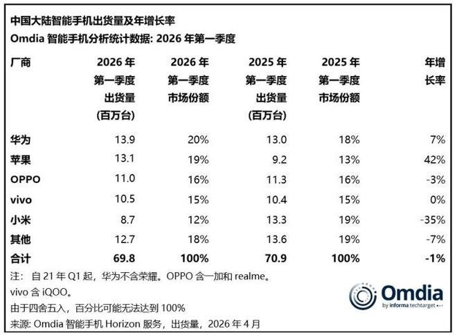

## 2

@皇城根下刀笔吏

发表于：2026-04-15 09:02

来源：微博

链接：https://m.weibo.cn/status/5287891896895107

看到有人留言聊司法独立这个话题。

司法独立的前提，是司法有独立的能力。

不是说让别人给你一个独立的权力，而是说，自己首先要有独立的能力。

我以前看过美国最高法院一个大法官写的一本书，讲美国法治的演化和进展。很多人有个误区，以为美国的先贤们在建国时，便建立了一套精密的三权分立体制，其中包含司法独立。

其实不是的。

说美国最高法院在刚成立时，连个办公场所都没有。

这个大法官在书里吐槽说，当时几乎没有任何人，鸟法院系统。几乎没有人，拿正眼看他们，甚至连个办公场所都不给。

他们只能自己找个板凳，临时找个场所，给自己找点大法官的感觉。

有点像是网络调侃的那句话，出门在外，身份都是自己给的。

美国的法院系统逐渐获得各方势力尊重的一个基本过程是，非常讲道理，判决书动不动便写几百页，把各种道理，掰开了揉碎了讲，甚至讲了主流判决观点后，还有少数不同意见的法官，讲少数观点。

有时候，少数意见的页数，比主流意见的页数，写得还要多。

没有什么副卷，都是公开的，包括少数意见，也是公开的。

在这种长期婆婆妈妈、啰里啰嗦的讲道理过程中，有利益冲突的各方，发现在遇到分歧或矛盾时，找法官解决分歧或矛盾，比自己通过恶斗来解决分歧或矛盾，成本要低。

就好比村口有个老大爷，喜欢给人解决分歧或矛盾。

以前，村里的人发生纠纷后，通过互相斗争，来进行解决。今天你打我，明天我打你。但冤冤相报何时了哈，互相斗争没个头，于是某天便去找大爷来评理。

这个大爷也比较公正，基本能做到不偏不倚、童叟无欺。

时间长了之后，大家遇到纠纷的话，便都愿意去找大爷评理。久而久之，这个大爷便在村里有了一个相对比较高的名望。他平时一般不掺和村里的各种事，主要职责是在村口搬个板凳，给遇到纠纷的人评理。

这个过程很漫长，但慢慢地，便有了一个所谓司法独立的状态。

所以，司法独立，不是从天上掉下来的，也不是别人赋予你的，而是因为你自己先有了独立的能力、名望，然后才有了独立的现状。

就好比女性独立一样，首先要有独立的能力，然后才有独立的地位。

是能力在先，地位在后，而不是说给你一个地位，你便能独立了。

自己先要有能顶半边天的能力，然后才有半边天的权利，而不是让别人硬给你一个半边天的权利。

所以，伟人讲的是“妇女能顶半边天”，而不是“妇女应有半边天”。

基于这样的逻辑演化，大家可以去看美国的法院系统，它们的内部没有像中国这样的执行机构。它们的底层逻辑，不是靠暴力推动执行，而是靠其他各机构和单位的认可，以及整个社会对这种认可的共识，来推动执行。

中国的法院系统，需要先看自己有没有这样的能力。

如果能力不足，而硬给一个独立的地位，最后便可能会迎来无数的嘲讽、吐槽等，让自己很难受。\#司法独立\#\#热点观点\#

---

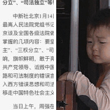

## 3

@亟兮般若

发表于：2026-04-12 10:12

来源：微博

链接：https://m.weibo.cn/status/5286942439640836

很多人在说，你们穷操心，美伊战争关你们什么事儿？今天翻看到小朋友买炸鸡架的群，老板大喊遭不住了，煤气罐涨价，连日常的用油也在涨价，摊子都撑不下去了。

不要觉得自己无关痛痒，这个世界的关联度太大了，没有谁能够逃过。

谁都不行！

---

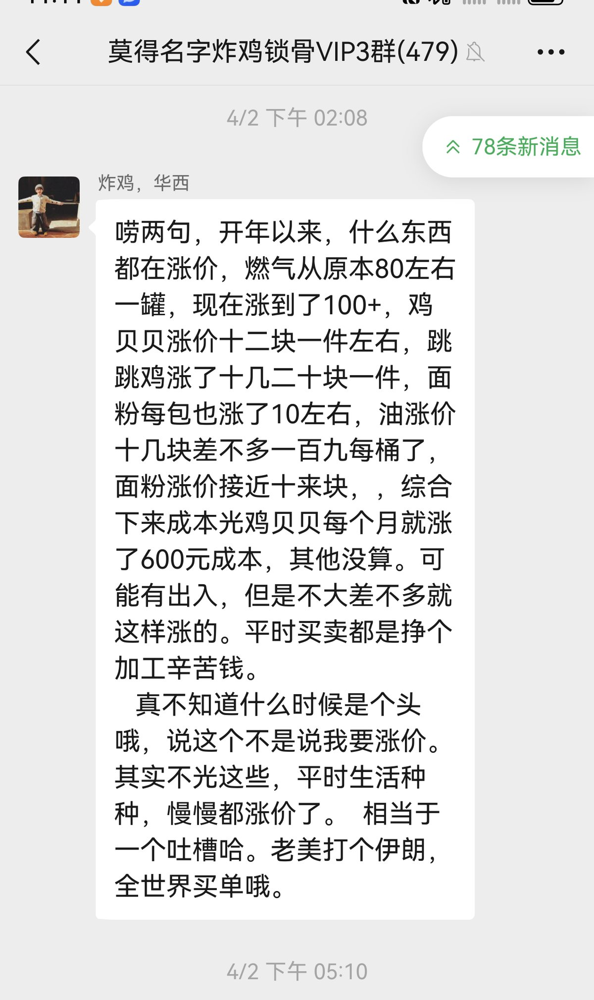

## 4

@那些珍贵老照片

发表于：2026-04-14 20:00

来源：微博

链接：https://m.weibo.cn/status/5287814993282559

1919年，假如世界是间教室，各国都在干什么

---

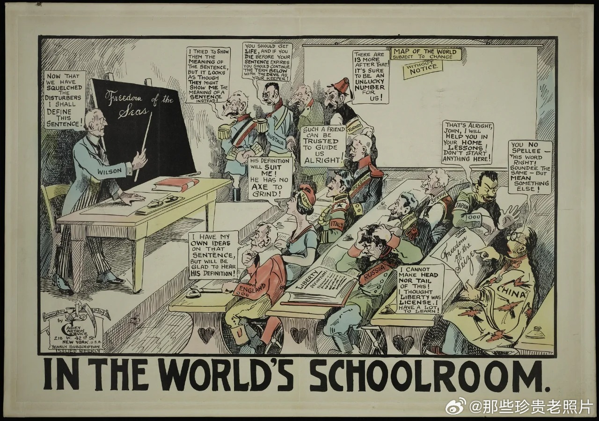

## 5

@寰亚SYHP

发表于：2026-04-14 15:33

来源：微博

链接：https://m.weibo.cn/status/5287747964373876

\#伊朗总统称赞多国文化历史底蕴\#伊朗总统佩泽希齐扬：文明的本色在历史的关键时刻得以彰显。西班牙、中国、俄罗斯、土耳其、意大利和埃及反对犹太复国主义政权好战行径与罪行的立场，根植于其深厚的文化和历史底蕴。

---

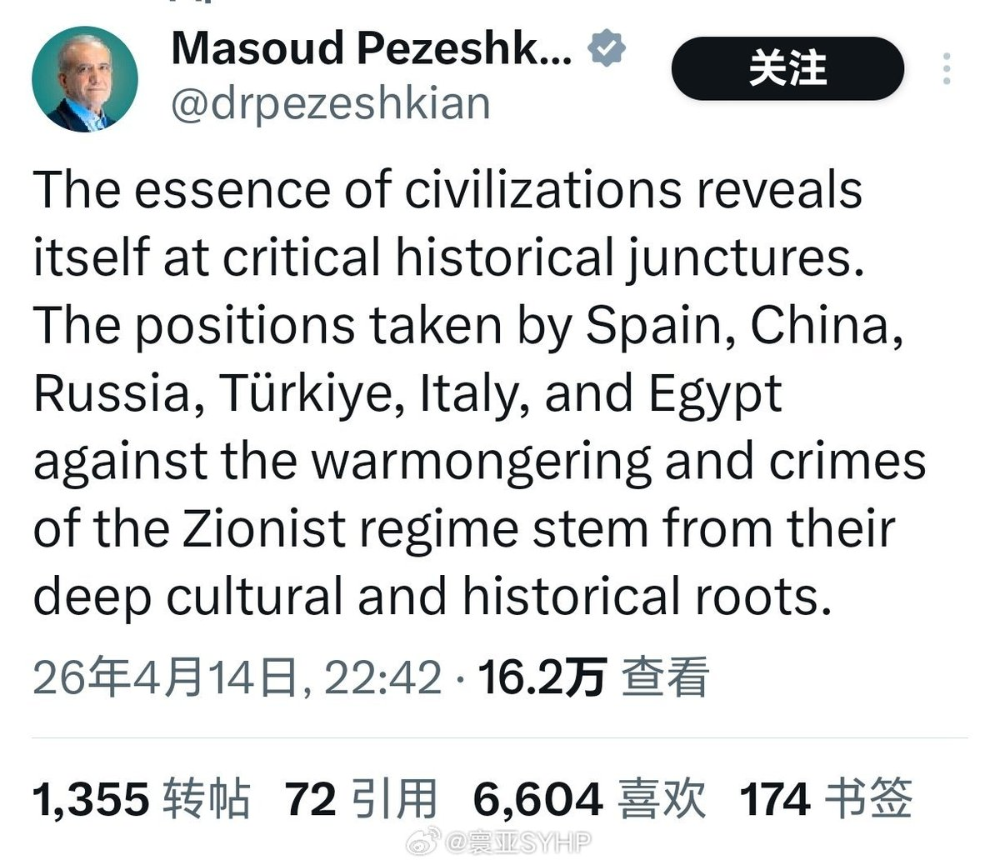

## 6

@少年伯爵

发表于：2026-04-14 15:36

来源：微博

链接：https://m.weibo.cn/status/5287748707287693

为什么现在的孩子看不进去书呢？为什么现在上班族的专注度下降这么明显？如何快速改善孩子的专注度？

\#伯爵冷知识\# 不知大家有没有留意过，北大的数学教授韦东奕，这个35岁的韦神，无欲无求，浑身上下唯一的外挂装备就是——手里总拿着一瓶清水……是的，这就是学神的秘诀，他的大脑前额叶皮层的负荷几乎拉满，副作用就是对脱水极其敏感，所以他经常处于需要补水的状态。

这不是瞎编和瞎猜的，而是如图1~图11所示的全球科学家多年的核磁扫描实锤了的——只要我们人类稍微少喝一些水，甚至是少喝一点点➠虽然我们根本感觉不到脱水和口渴，但实际上就是脱水了➠脑部血容量（脑组织无法随意收扩的特殊性质）极其敏感➠很快出现下降/渗透压上升➠脑供血与细胞环境改变➠脑部Na⁺/K⁺/ Ca²⁺梯度异常+膜电位（-70mV）神经信号效率下降➠最终导致人类注意力/记忆/疲劳异常。

所以，不管是在象牙塔里上学的小孩子，还是在江湖里上班的大孩子，为了提升专注度，请每天记得喝水补水，多个实验证明补水改善认知（注意力/记忆力）很快的。

从数据上来看，8岁以前的孩子，一天需要保证有1.6升的水。9岁到18岁的青少年需要1.9升水。成年人一天至少需要2升水，有些时候大体重者需要3升。

2升水也就是4瓶矿泉水的量。

话说回来，为什么我们现在更容易隐性脱水+感知不到口渴了呢？

其实根源就是我们的生活/工作/学习节奏越来越快了，越来越卷，再加上手机的多巴胺干扰，每天大脑前额叶忙于处理越来越多的外部任务➠导致岛叶处理身体口渴信号能力下降➠根本不觉得渴，而此时身体和大脑其实早就脱水了……

红尘炼狱里，请多喝温水（<60℃），对了，最后告诉大家一个小秘密——在2010年前，清华校园里的那些做题型学霸，他们每天的三点一线里，水房是必经地，大号保温壶也是必备。

---

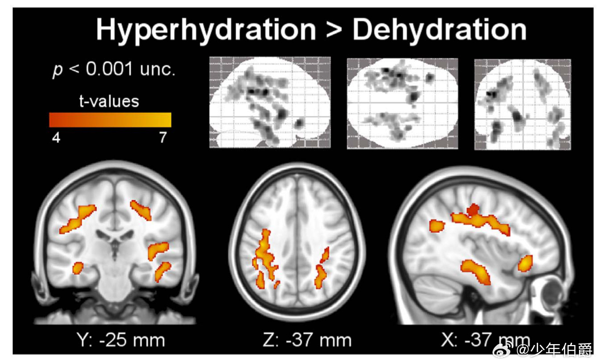

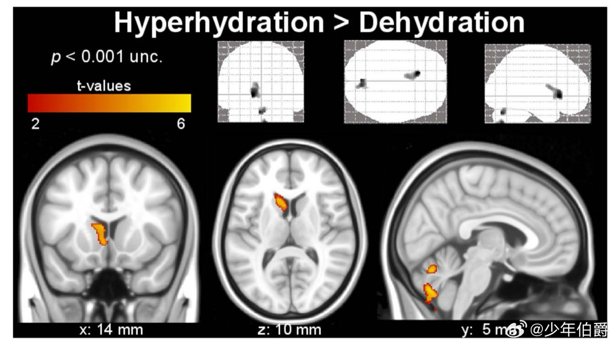

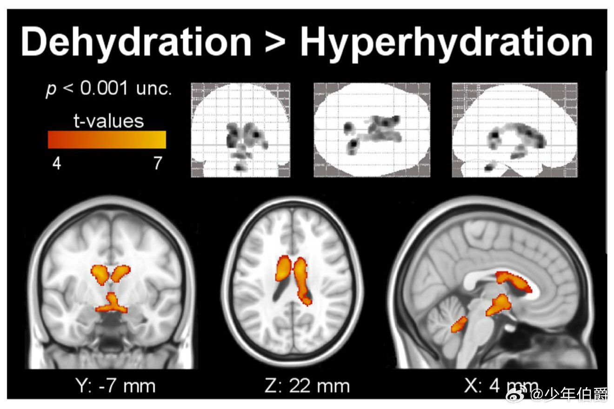

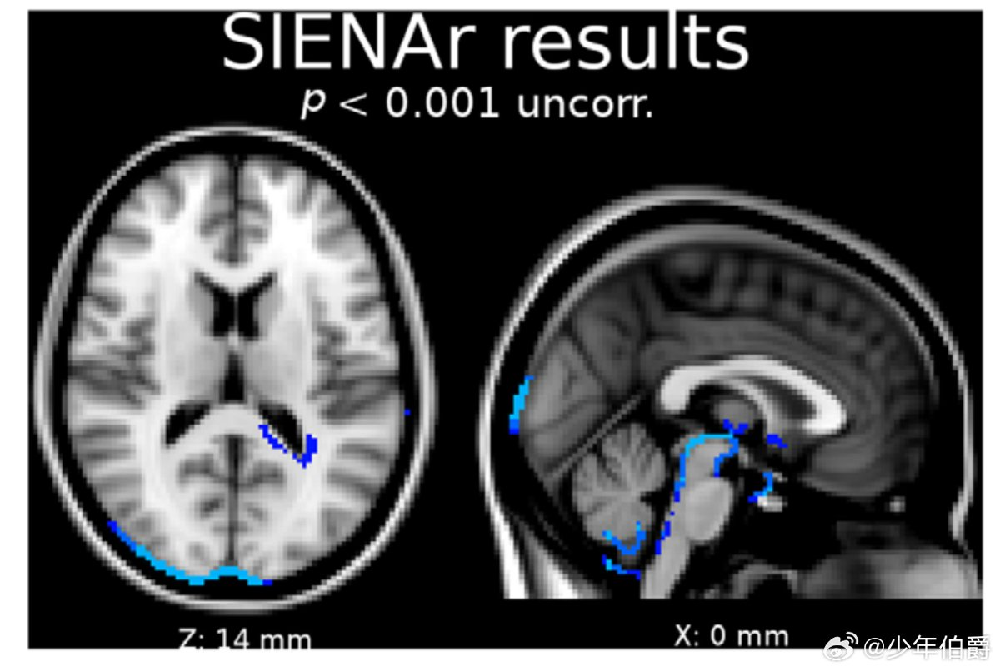

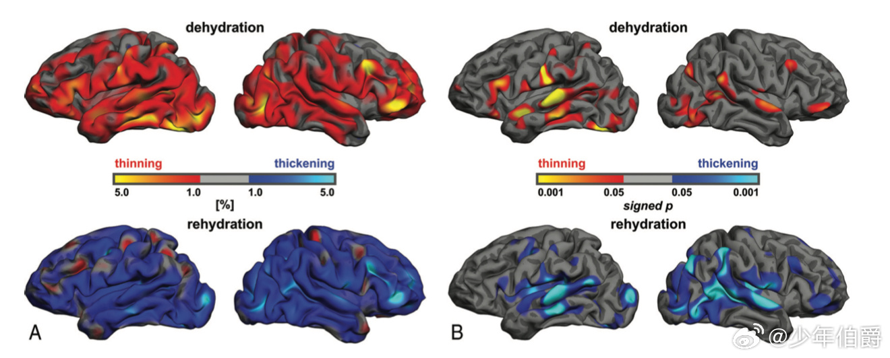

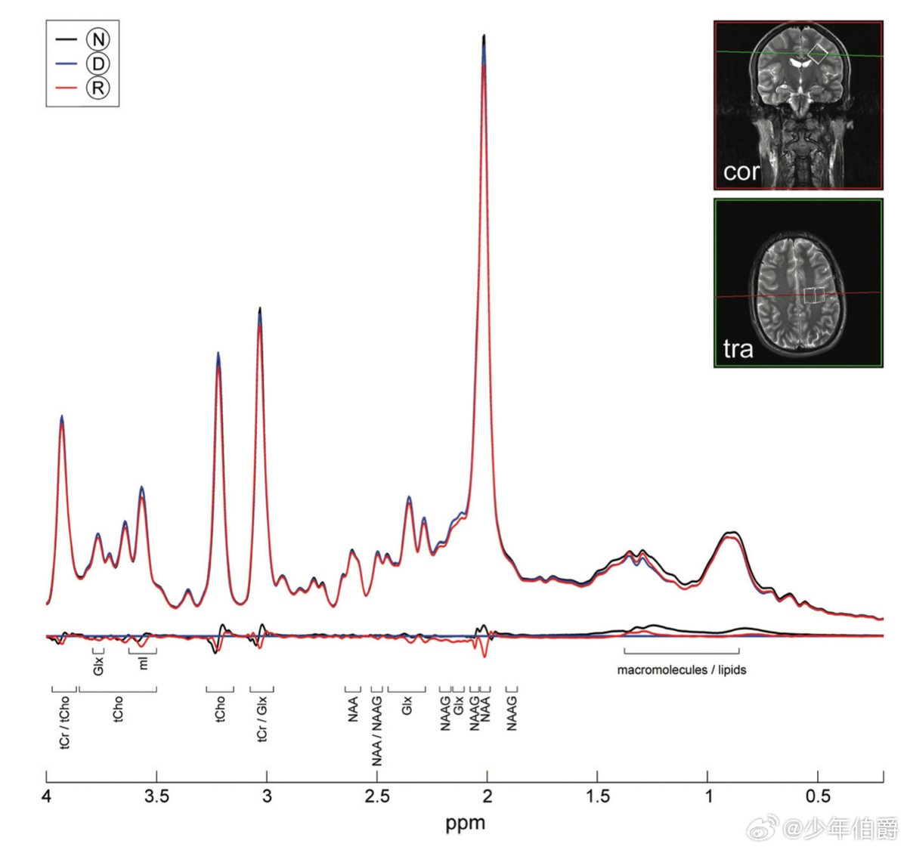

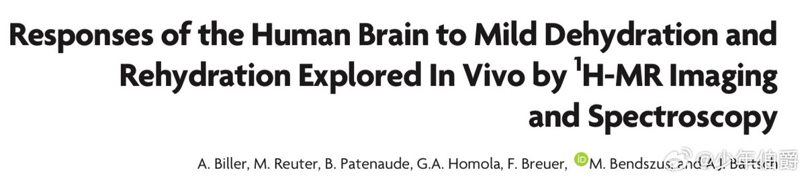

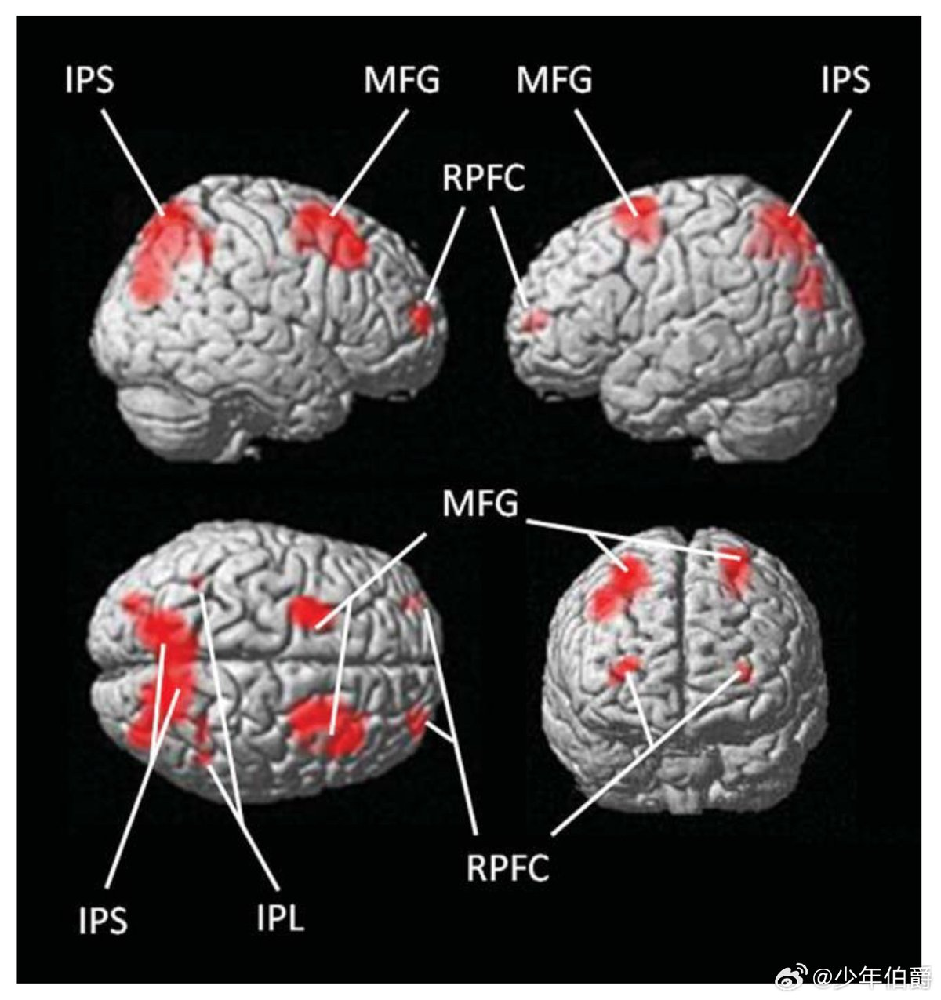

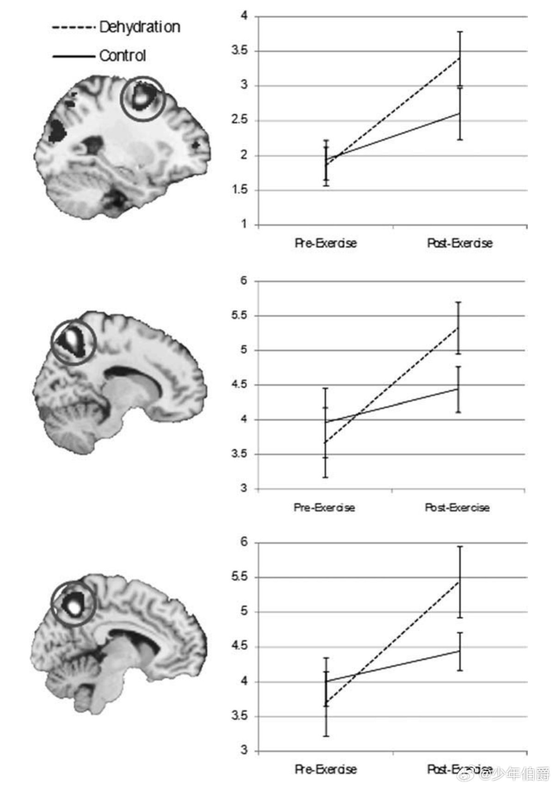

## 7

@那些珍贵老照片

发表于：2026-04-14 13:00

来源：微博

链接：https://m.weibo.cn/status/5287709297086384

1970年的美国波士顿

---

## 8

@财联社APP

发表于：2026-04-14 13:18

来源：微博

链接：https://m.weibo.cn/status/5287713834009036

【五一假期国际航班遭大规模取消？专家：燃油成本大涨为主因 国际低成本航司压力更大】财联社4月14日电，多位网友在社交平台上发文称，五一假期期间以及假期前后飞往东南亚以及大洋洲的航班被取消。民航专家林智杰表示，近期国际航线，尤其是往返东南亚、澳洲等区域的航班出现大规模取消，核心原因在于航空燃油成本大幅攀升。当前航空燃油价格较此前已出现翻倍上涨，而国际机票票价并未同步大幅上调，航司执飞相关航线陷入“执飞班次越多、亏损幅度越大”的经营困境。 (澎湃新闻)\#油价\#

---

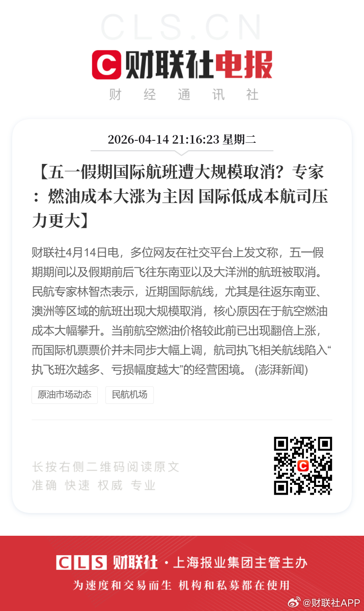

## 9

@李楠或kkk

发表于：2026-04-14 09:58

来源：微博

链接：https://m.weibo.cn/status/5287663662797151

在川皇宣布封锁海峡之后，

一艘中国超级油轮（COSCO Pearl Lake）通过海峡的具体日期和背景如下：

通过日期： 2026 年 4 月 14 日（即今天）。

航行状态： 根据最新的 AIS（自动识别系统）数据，该船已于今日成功穿越霍尔木兹海峡，目前正航行于北阿拉伯海区域，正远离波斯湾向东航行。

感谢挂在 H-6 下的鹰击，感谢 054A 大庆号。

（该舰在 4月7日至今一直在阿拉伯海北部水域 / 霍尔木兹海峡西口外海域）

中国船只正在航行，也将继续航行。

ps

截图这条，可以看到上一个停泊地在海峡内的阿曼一侧

---

## 10

@明浩-rosicky311

发表于：2026-04-14 02:03

来源：微博

链接：https://m.weibo.cn/status/5287543970468152

斯坦福每年更新一次的AI index报告2026刚刚发布了，

网页链接

相较于那些业界已经是共识的观点（模型能力发展越来越快、中美差距缩小、数据中心建设、应用拓展速度、医疗/教育/法律/金融行业渗透等等），我其实着重看了报告中提及的公众/舆论对于AI的担心上，单独有一章就叫public-opinion，这里：

网页链接

一些数字（可能都算不上结论）

1、公众和所谓的专家在统计数字上有巨大的差异；

2、56%的专家认为AI在未来20年对美国产生的影响是正向的，而公众只有10%；

3、84%专家认为AI对于未来的医疗有正向影响，公众只有44%；

4、73%专家认为对于工作有正向影响，公众只有23%；

5、在全球范围内，认为人工智能产品和服务利大于弊的人数比例从 2024 年的 55% 略微上升到 2025 年的 59%

6、人工智能让他们感到“紧张”的受访者比例在同一时期从 50% 上升到 52%；

这些调研数据还仅仅只是截止到2025年年底的，过去的这个Q1，因为模型能力的进一步提升，笼罩在关于就业、AI替代人类、软件股/SaaS暴跌的主叙事似乎已经是某种“挡不住”的共识，我们人类到底该怎么做，政府、行业、公司，甚至微观到每一个个体的人身上，似乎都没有什么“标准答案”……

🤷

---

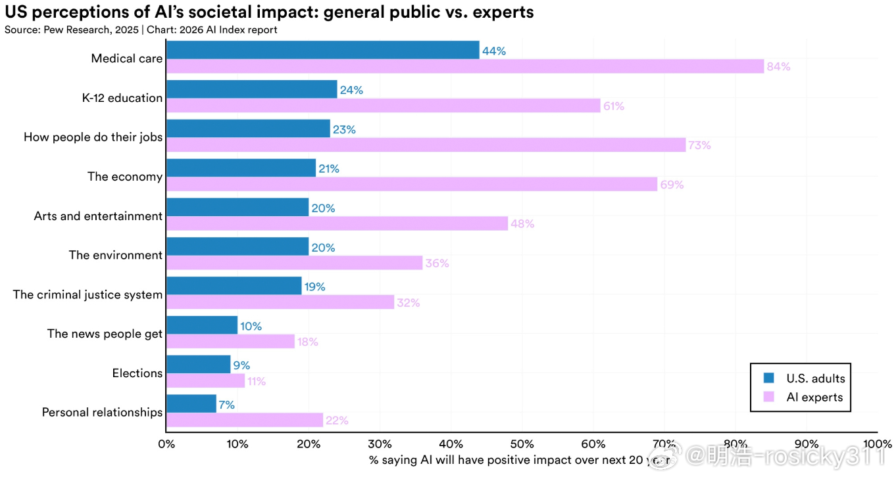

## 11

@高飞

发表于：2026-04-14 08:48

来源：微博

链接：https://m.weibo.cn/status/5287646018407067

\#模型时代\# 世界量子日：为什么量子计算机找东西比普通电脑快？

刚才打开Google首页，才发现意识到今天是4月14日，世界量子日。于是找来一个3Blue1Bronw的科普讲座，讲讲何为量子计算。去年吧，黄仁勋就在GTC做了一场量子计算的圆桌，今年展区也有这个部分内容。或许，快了？

从头说起哈。这个日子是怎么来的？全球一群量子科学家在2021年发起倒计时，2022年开始每年这天一起做科普。选4月14日是因为普朗克常数h约等于4.1356677×10⁻¹⁵ eV·s，前三位数字正好是"4.14"。去年（2025年）还恰逢量子力学诞生一百周年，被联合国定为"国际量子科学与技术年"。

每年今天，世界各地会有面向公众的讲座、实验室开放日、艺术展。但对大多数人来说，关于量子计算的知识还停留在一句话："经典计算机一次只能试一种可能，量子计算机能一次试所有可能。"

这句话几乎到处都在被说。问题是，它错了。

3Blue1Brown的Grant Sanderson（他也是YouTube上最受欢迎的数学科普作者之一）在2025年4月30日发布了一支35分钟的视频，专门回应这类误解。他给斯坦福学生、给国际数学奥林匹克选手、给YouTube上10万名投票者出过同一道题，每次结果都很相似：选错的人远远多于选对的人。

这篇文章把这支视频拆成一条完整的认知路径。

读完之后，世界量子日这天朋友圈里那些关于量子计算的流行解读，大家应该能看出哪些是在抄近路、哪些不够诚实。

一、为什么这件事值得今天讲

1、量子计算正在被夸大，也正在被轻视

这几年量子计算的新闻越来越多。Google、IBM、中国的合肥实验室、各种初创公司都在做。新闻标题动不动就是"量子计算机几秒钟破解RSA密码"、"量子计算机即将颠覆制药业"。

实际情况是：量子计算机确实能做一些经典计算机做不到的事，但它能做什么、做到什么程度、什么时候能做到，这三件事常常被混为一谈。要看穿哪些是真进展、哪些是营销辞令，你得对量子计算的工作原理有一点真正的认识——不多，只要一点。

2、一支视频可以给你这个入口

Grant的这支视频选了一个很巧的切入点：Grover算法。它是1996年印度裔美国科学家Lov Grover在贝尔实验室提出的搜索算法，适用于一大类日常问题——密码破解、数独求解、地图染色、区块链挖矿，凡是"能快速验证一个答案对不对、但不容易找到答案"的问题，Grover算法都能用。

更重要的是，Grover算法的原理可以用几何画出来。只要你能看懂平面上两根箭头的运动，你就能理解它。这是少有的能把量子计算讲清楚又不偷懒的题材。

3、我们要回答的问题

读完这篇文章，你应该能回答这几个问题：

  · 量子计算机为什么比经典计算机快？

  · 它到底快多少？是所有问题都快，还是只有某些问题快？

  · "把所有可能性一次跑完"这个流行说法为什么是错的？

  · 普通人的一天里，有哪些时刻能用得上量子计算的思维方式？

二、先感受一下"快"和"慢"差在哪

要看懂后面的讨论，我们得先建立一个基本感觉：同样是"要试很多次"，不同的"试法"可以差到天上地下。

1、想象一个找钥匙的游戏

你走进一个房间，墙上有一排柜子，其中只有一个柜子里有钥匙。你必须把钥匙找出来。

  · 10个柜子：平均试5次能找到

  · 100个柜子：平均试50次

  · 10000个柜子：平均试5000次

  · 100万个柜子：平均试50万次

每当柜子数量翻10倍，你要试的次数也翻10倍。这种"柜子翻n倍，时间也翻n倍"的增长方式，计算机科学家给它起了个名字，叫 O(N)。这里的N就是柜子数量。你读这个符号的时候就想成"跟N一样快地增长"。

2、有时候，柜子翻10倍，时间只翻√10 ≈ 3倍多

这是一种完全不同的游戏节奏。我们还没解释清楚是怎么做到的，先感受一下它意味着什么：

  · 100个柜子：10次找到（√100 = 10）

  · 10000个柜子：100次（√10000 = 100）

  · 100万个柜子：1000次

  · 1亿个柜子：10000次

柜子数从100万变到1亿，翻了100倍，但你只需要从1000次变到10000次，只翻了10倍。柜子越多，这个游戏的优势就越明显。这种增长方式叫 O(√N)。

3、还有更快的游戏：柜子翻10倍，时间只多加一点点

再想象一种更神奇的情形：

  · 100个柜子：约7次

  · 10000个柜子：约14次

  · 100万个柜子：约20次

  · 1亿个柜子：约27次

柜子每翻10倍，你只多试几次。哪怕柜子数量是天文数字，你也能几十次就搞定。这种增长方式叫 O(log N)。

字典查字就是这样的——不管字典多厚，你打开中间，判断你要找的字在前半还是后半，再打开中间，再判断……20次就能从百万词里定位一个。

4、还有一种游戏，根本不管柜子数量

最快的游戏是这样：不管柜子有多少，永远只试固定几次。10个柜子试3次找到，100亿个柜子还是试3次。这叫 O(1)。这相当于你不用真的去试，直接就知道答案在哪里。

这四种速度对比，是后面一切讨论的基础。记住它们的手感：O(N)线性慢吞吞，O(√N)明显更快，O(log N)非常快，O(1)瞬间完成。

【延伸阅读】大O符号的正式含义

计算机科学里"大O"记号是一种描述算法运行时间如何随输入规模增长的语言。O(N)意味着"存在某个常数c，使得算法的运行时间不超过c·N"，其中N是输入规模。关键是比较"增长速度"，而不是精确步数——如果一个算法要3N+100步，另一个要10N+5步，两者都算O(N)，因为当N很大时常数不重要。

同理，O(√N)里即使藏着一个看起来不小的系数（比如π/4·√N），只要它不影响随N增长的节奏，整体还是O(√N)。

三、现在可以回到那道让大多数人选错的题了

Grant在视频开头出了一道题：一台量子计算机做"N选1找钥匙"的搜索任务，最快需要多少步？

选项是：O(N)、O(√N)、O(log N)、O(1)。

  · 大多数人选O(1)——"它不是可以一次试所有可能吗？"

  · 第二多的选O(log N)——"它总该比经典快得多吧？"

  · 正确答案是O(√N)。相当于：100万个柜子里找1把钥匙，经典计算机平均要开50万次，量子计算机用Grover算法大约1000次就能找到，差距500倍；1亿个柜子的时候，经典要5000万次，量子只要1万次，差距5000倍。柜子越多，量子的便宜占得越大——但这种"越大越便宜"是有代价的，它不是一步到位，它是另一个级别的"勤奋工作"。

1、"一次试所有可能"这个说法错在哪

流行说法是：量子计算机里有一个神奇的"superposition（叠加态）"盒子，能同时装下所有N种可能的输入。把验证函数往这个盒子上一套，答案就出来了。

听起来像O(1)——一步搞定。但后面你会看到，这个盒子本身确实可以"装下所有可能性"，但一旦你打开盒子看答案，盒子就塌了，而且塌成什么样子是随机的。你只能通过一堆精密的、一步步的操作，让盒子倾向于塌到正确答案上，才能高概率看到那个答案。

这个"一步步操作"要做多少次？恰好是√N次左右。

2、1994年就有人证明，不可能比√N更快

这是一个很硬的数学结论：任何量子算法做这类搜索，不可能快过O(√N)。这个下界证明比Grover算法本身还早两年。两年后，Grover给出了一个恰好达到这个下界的算法——意思是他的算法已经是理论上最快的，再也没有改进空间了。

3、√N加速不如指数加速惊人，但它适用范围极广

你可能听过另一个著名的量子算法——Shor的整数分解算法。那是真正的指数加速（O(log N)级别），可以在多项式时间内分解大整数，从而理论上威胁RSA加密。

但Shor只对"整数分解"这一个特定问题有效。Grover虽然只有√N加速，但它适用于整个NP问题类——也就是一切"能快速验证答案但不容易找到答案"的问题。这是一个极其宽广的范畴：

  · 数独求解（验证答案只需检查每行每列每宫，找答案要试很多填法）

  · 地图染色（验证只需看相邻区域是否同色）

  · 密码学破解（验证候选密钥只需试解一次密文）

  · 区块链挖矿（验证哈希值只需算一次）

换句话说，Grover给了这一大类问题一个统一的提速工具。这是它的真正意义。

【延伸阅读】π/4这个藏在√N里的小数

Grover算法的精确步数是π/4·√N。为什么是π/4？因为算法的本质是在一个平面里做一次旋转，要转过去的角度是π/2弧度（90度），而每一步只能转一个微小角度。后面讲到几何图景时，这个π会自然冒出来。

四、把一个qubit装进脑子里

要理解Grover算法，你得先理解量子计算机的最小组成单位——qubit（量子比特）。别急，下面会一步步来。

1、先想一枚普通的硬币

普通计算机的最小单位是bit（比特）。一个bit就像一枚已经落地的硬币：要么正面朝上（代表1），要么反面朝上（代表0）。没有中间态。

8个bit可以表示256种组合（2⁸=256），足够编码一个字母或一个小数字。一串bit拼起来，就能表示任何你想表示的数据。

2、qubit像一根能指向任何方向的指针

qubit就不一样了。想象桌面上有一根指针，钉在中心可以自由转动。它可以指向任何方向——正北、东北、正东、东南……360度任何角度都行。

我们约定两个特殊方向的含义：

  · 指针正正指向东方：代表"读出来肯定是0"

  · 指针正正指向北方：代表"读出来肯定是1"

那么当指针指向东北方（东方和北方的中间）时呢？这就是qubit真正有趣的地方——它代表"读出来有可能是0、也有可能是1"，各占50%。

指针越靠近东方，读到0的概率越大；越靠近北方，读到1的概率越大。指针的方向完整地编码了这台机器"倾向于"给你什么答案。

3、从"方向"到"向量"

把指针想象成从中心出发的一根箭头。这根箭头叫向量。向量有两个属性：长度和方向。

在我们的情形里，箭头的长度永远是1（之后会说为什么）。它只能转方向，不能变长变短。

我们可以用坐标来描述这根箭头。约定东方是x轴正方向，北方是y轴正方向：

  · 指向正东：x=1，y=0

  · 指向正北：x=0，y=1

  · 指向东北（45度）：x=1/√2，y=1/√2

这里的√2是什么？因为箭头长度必须是1，根据勾股定理 x²+y²=1，当x=y时解出来x=y=1/√2。

到这里，qubit这个名字可以交给你了：一个qubit就是一根长度为1、能指向二维平面任何方向的向量。物理学家和计算机科学家为了方便写，把"指向正东的箭头"记作|0⟩，"指向正北的箭头"记作|1⟩。那个像方括号的符号叫ket，是量子力学里通用的记号，你把它当成"这是一根向量"的标记即可。

4、读出qubit会看到什么？

这是qubit最反常识的一点。

你的指针现在指向东北方（x=y=1/√2）。但当你实际读出这台qubit时，你不会看到"东北方"这个答案。你看到的要么是0，要么是1——永远是这两个纯粹值之一。

看到哪个是随机的。具体概率由坐标的平方决定：

  · 看到0的概率 = x² = (1/√2)² = 1/2

  · 看到1的概率 = y² = (1/√2)² = 1/2

这叫Born rule（玻恩规则），是量子力学的基本法则。坐标的平方等于概率——所以坐标加起来平方必须是1（x²+y²=1），这解释了为什么指针长度永远是1：概率加起来必须等于1，因为一定会看到某个结果。

5、读完之后，指针就塌了

读完qubit看到具体值（比如0）之后，指针会瞬间跳到那个值对应的方向上（正东方）。你再读一次，还是0。再读一百次，都是0。

想让指针再次指向东北方，你得把整个程序从头再跑一遍。

这条规则带来一个根本限制：你永远不能直接看到指针的方向。你唯一能做的是读出，得到一个0或1。想知道指针指向哪里，你只能跑很多次同一个程序，看看0和1各出现多少次，反推出指针的原始方向。

写量子算法的人同样受这个限制——你在脑子里推理指针会怎么动，但你没法实时观察它。

【延伸阅读】为什么坐标平方等于概率？

这条规则（Born rule）不是人为规定的，而是量子力学与实验反复吻合的结果。它的物理根源可以追溯到波函数——在量子力学里，一个系统的状态用波函数描述，波函数的模平方给出测量到各种结果的概率密度。1926年德国物理学家Max Born首先提出这个解释，后来获得了诺贝尔奖。

直觉上可以这样理解：向量坐标是"概率幅"，不是概率本身。概率幅可以是负数甚至复数，但它们平方（模平方）后得到的才是真正的概率——必须是0到1之间的非负数。这种"平方才是概率"的结构是量子世界最基本的数学骨架。

五、多个qubit和那张看不见的清单

一个qubit只能答"是/否"。解决复杂问题要很多qubit一起工作。

1、k个qubit，有2ᵏ种可能的读出结果

如果一台量子计算机有4个qubit，读出时你会得到一串4位的0和1，比如"0011"或"1010"。这样的4位串一共有2⁴=16种。

100个qubit呢？2¹⁰⁰ ≈ 10³⁰种——比可见宇宙里的原子还多。

2、机器内部藏着一张"概率清单"

对于一台4-qubit机器，在你读出之前，机器内部"知道"每种可能输出的概率。可以把它想象成一张清单：

    0000  →  概率 p₁

    0001  →  概率 p₂

    0010  →  概率 p₃

    ……

    1111  →  概率 p₁₆

16个概率加起来等于1（反正一定会读到某个结果）。

但这张清单不是随便一张——它其实是一根16维的向量。每个分量的平方就是对应的概率（Born rule在多qubit情形下照样成立）。

现在可以把专业名字交给你了：这根看不见的向量叫 state vector（状态向量）。量子计算机内部真正在操作的，就是它。

3、state vector的三个关键事实

第一，你看不到它。它有2ᵏ个分量，但你永远读不出任何一个分量。你只能在某一刻"读出"，从里面随机采样一个bit串——概率由分量平方决定。

第二，分量的正负号是真正的状态信息。一个分量是+0.5还是-0.5，平方都等于0.25，读出时看到的概率完全一样。但这两个state vector是不同的状态，之后做任何操作都会产生不同结果。Grover算法的核心招式就是翻转某个分量的正负号。

第三，它是一个单位向量。所有分量平方加起来等于1（概率之和为1）。你可以想象它"住"在一个超高维的单位球面上，不能离开这个球面。

写量子算法的目标非常清楚：用一连串量子门操作，把这根看不见的向量慢慢挪到"几乎所有概率集中在某一个分量上"的方向。那个分量对应的bit串，就是你要的答案。

【延伸阅读】什么是量子门？

量子门是作用于state vector的基本操作。每个量子门相当于对这个16维向量做一次精确的旋转或翻转——用数学语言说，是一次酉变换（unitary transformation）。

六、Grover的问题：大海捞针

现在所有基础都铺好了，可以看Grover算法要解决什么问题。

1、问题设定

你有一个验证函数f。它的工作是：

  · 对唯一一个输入（我们称之为"钥匙"），返回真

  · 对所有其他输入，返回假

你不能看f的内部实现，只能把数字喂进去看它返回什么。你要找出那个钥匙。

总共有N个候选，其中只有一个是钥匙。

2、经典计算机怎么做

没有任何聪明办法，只能一个一个试。平均要试N/2次。如果N=100万，平均50万次。如果N=1亿，平均5000万次。

这是O(N)。

3、Grover算法要做的事

Grant在视频里给出了Grover算法的一段鸟瞰描述：

算法从一个所有可能性等概率的状态出发。然后反复做两件事。每做一次，正确答案那个分量的概率就会变大一点。做够一定次数之后，正确答案那个分量的概率几乎就是1，你读出来就能看到它。

这个"一定次数"是 π/4·√N 次。

如果N=100万，需要约785次（π/4 × 1000）。

如果N=1亿，需要约7854次（π/4 × 10000）。

从5000万次变成8000次不到——这是Grover算法的威力。

接下来的几节，我们把这个算法拆开来看。它有两把"刀"——两个基本操作——交替使用，就把state vector一步步推向正确答案。

七、Grover的第一把刀：翻一个符号

1、从"把所有可能性摊平"开始

算法的第一步是准备一个特殊的state vector：所有分量都相等。

对于N种可能的输出，每个分量都是1/√N（这样平方之后加起来才等于1）。这个状态叫"均匀叠加态"，我们称之为B（balance的首字母）。

从概率上看，此时读出任何一个bit串的概率都是1/N，完全平均。这一步什么答案都没暴露。它只是一个起点。

这一步怎么做？用一堆Hadamard门就行，具体细节不重要。

2、关键发现：任何经典验证函数都能翻译成量子操作

Grover的核心洞察是：

经典验证函数f是由AND、OR、NOT这些逻辑门搭出来的。每一种经典逻辑门都有对应的量子门（或量子门组合）。所以整条验证逻辑可以一砖一瓦地翻译过来，得到一组作用于state vector的量子操作。

翻译之后这组量子操作做什么？它的净效果是：

  · 对应钥匙的那个分量，符号翻转（比如从+1/√N变成-1/√N）

  · 其他所有分量，保持不变

3、用一个小例子看清楚

假设N=4，四种可能的输出是00、01、10、11，钥匙是"10"。

初始均匀态B：

    00  →   1/2

    01  →   1/2

    10  →   1/2

    11  →   1/2

（这里1/2是因为1/√4 = 1/2）

经过Grover第一把刀之后：

    00  →   1/2

    01  →   1/2

    10  →  -1/2    ← 只有这个翻了符号

    11  →   1/2

每个分量平方之后都是1/4。概率完全没变，读出时四个值各占25%。

那这一刀有什么用？

4、这一刀单独看没用，但它改变了向量的"方向"

概率没变，但state vector本身变了——它有了一个负号。这个负号不影响"如果你现在读出会看到什么"，但它改变了"如果你再做一次操作，结果会变成什么样"。

下一节的第二把刀，会利用这个方向的改变，把概率一点点推到钥匙上。

八、Grover的第二把刀：照镜子

1、第二把刀是沿B方向做一次镜像反射

这句话先放在这里，不懂没关系，下面一步步解释。

先回忆一下"镜像反射"是什么。你站在镜子前面，你的镜像和你本人关于镜面是对称的。如果你向右伸手，镜像向左伸手；你往后退，镜像也往后退（看起来是往镜子里走）。

数学上，镜像反射以一条直线为对称轴：对称轴两边的点一一对应，互为镜像。

2、几何上的镜像反射长什么样

假设对称轴是水平的x轴。你有一个点在x轴上方，比如(3, 2)。它关于x轴的镜像就是(3, -2)——x坐标不变，y坐标翻符号。

如果对称轴不是x轴，而是斜着的一条线（比如45度方向），镜像就没那么简单，但原理一样——关于这条线对称的点。

3、第一把刀其实就是一个镜像反射

把视角切换回我们的state vector。上一节讲第一把刀时，我们说它"翻转钥匙分量的符号"。

如果我们把钥匙方向画成一根坐标轴（比如y轴），把"所有其他方向"笼统地画成另一根坐标轴（x轴），那么"翻转钥匙分量的符号"就相当于——关于x轴做镜像反射！

这就是几何图景的起点。

4、第二把刀：关于B方向做镜像

第二把刀和第一把刀是同一类操作，只不过镜像的对称轴变了——不是x轴，而是B向量的方向。

B是初始均匀态，它在我们的坐标系里位于x轴和y轴的某个中间方向。沿B做镜像反射，就是以B所在的那条线为对称轴的反射。

怎么在量子计算机上实现这个镜像？视频里Grant没展开讲具体量子门怎么组合，他给了一个关键提示：只要你能清晰地描述某个state vector，你就能构造出"沿它做镜像"的量子操作。这是量子计算的一个基本工具集。

重要的是几何后果：连续做两次镜像反射（先沿x轴、再沿B方向），state vector会怎么动？

下一节会揭晓。

九、两面镜子拼出一次旋转

1、两次镜像等于一次旋转

几何里有一个经典事实，值得你记住一辈子：

连续做两次镜像反射（两条对称轴之间的夹角为θ），等价于绕它们交点做一次旋转，旋转角度是 2θ。

你可以在家验证：找两面镜子，摆成夹角45度。把一支笔放在它们之间，你会看到90度方向上的笔的镜像——刚好是2倍的45度。

这个事实在Grover算法里起到了决定性作用。

2、把Grover的两把刀画成一张图

在我们的二维平面里：

  · x轴代表"所有非钥匙方向的均匀混合"

  · y轴代表"钥匙方向"

  · B向量从原点出发，指向x轴和y轴之间的某个角度

B和x轴的夹角记作θ。根据上文的准备，B的钥匙分量是 1/√N，所以：

    sin θ = 1/√N

当N很大时，θ本身也很小，可以近似为 θ ≈ 1/√N 弧度。这个 1/√N 就是最终√N加速的数学来源。

3、每跑一轮Grover，state vector朝钥匙方向转 2θ

初始state vector就是B，位于x轴上方、和x轴夹角θ。

  · 第一把刀（沿x轴镜像）：B落到x轴下方，和x轴夹角 -θ

  · 第二把刀（沿B方向镜像）：根据"两次镜像 = 旋转 2θ"，整体效果等于绕原点逆时针旋转 2θ

所以跑一轮之后，state vector位于x轴上方、和x轴夹角 3θ。

再跑一轮：5θ。

再一轮：7θ。

……

state vector沿着一段圆弧，一步步逼近y轴（钥匙方向）。

4、需要跑多少轮？

目标是让state vector指向y轴，也就是和x轴夹角 π/2（90度）。

从B出发（夹角θ），每轮增加 2θ。设跑了k轮，角度变成 θ + 2kθ = (2k+1)θ。

要让这个角度接近 π/2，解出k：

    k ≈ (π/2 - θ) / (2θ) ≈ π/(4θ) ≈ (π/4)·√N

这就是 π/4·√N 的来源。

举个具体数字：N = 2²⁰（大约100万），需要20个qubit，最优迭代次数是 π/4·√(2²⁰) ≈ 804 次。跑完804轮，state vector几乎正好指向y轴。此时读出，你几乎一定看到钥匙值。

如果运气不好采到一个错误答案——经典地用f验证一下就知道，重跑一遍即可。重跑多次还中不了的概率低到可以忽略。

十、捷径：为什么是√N而不是别的

现在算法讲完了，回头看最初那个问题：量子计算的加速到底从哪来？

1、"并行处理所有输入"这个说法依然别扭

算法开头确实把state vector摆成均匀态B，听起来像"同时处理所有输入"。但你已经亲眼看到，这一步什么钥匙信息都没暴露——每个可能输出的概率完全相等。

真正让概率集中到钥匙上的是之后804次迭代。每一轮只转一个微小的角度 2θ ≈ 2/√N。说这是"并行"其实很勉强——它更像是在一个高维空间里一点一点摸索。

2、真正贴切的词：捷径

Grant在视频最后给了一个类比，是全片最好的认知抓手。

想象一个N维的单位立方体（N维空间里边长为1的"立方体"）。从一个顶点走到它对角的顶点：

  · 只能沿棱走：要走N步（每一维走一次）

  · 能走对角线：只要√N步（勾股定理）

经典计算机的每一步只能从一个确定状态跳到另一个确定状态，相当于"只能沿棱走"。量子计算机允许state vector经过那些"既不是这个值、也不是那个值"的中间方向，相当于"能走对角线"。

Grover算法里，state vector沿着一段圆弧从B转到钥匙方向——走的正是一条经典世界里根本不存在的捷径。

量子计算的加速，本质上是几何意义上的捷径。它来自一个比经典状态空间更丰富的几何结构，允许你走那些经典世界里看不见的路径。

3、一个坦白：真实的state vector分量是复数

为了讲清楚Grover算法，我们这篇文章里state vector的分量全部用了实数（有正有负）。但真实的量子计算里，分量是复数。

复数有两个属性：模和相位。模的平方给出概率（Born rule），相位则是"正负号"的更一般版本——不直接影响概率，但影响之后的演化。Grover算法很仁慈，全程只需要实数，所以可以回避这个复杂度。

但Shor的整数分解算法（真正的指数加速）离不开复数分量。它的加速本质上来自复数带来的"相位干涉"——在某些方向上，不同的相位会相互抵消，在另一些方向上会相互加强，从而快速地把概率集中到答案上。

十一、一个密码学惊悚片的最后一分钟

1、不是万能，也不是即将到来

今天是世界量子日，所以有必要讲一些清醒的事实：

  · 量子计算对大多数问题的加速是√N级别，不是指数级别

  · 即使是√N加速，也还要等硬件成熟（纠错、qubit数量、稳定性都没解决）

  · 那些"量子计算机即将颠覆XX行业"的新闻标题，大多数需要打问号

但这不意味着量子计算无足轻重。Grover算法的存在证明了一件事——经典计算之外真的有一个完全不同的计算范式。它不是经典计算的加速版，它是另一种游戏规则。

2、如果想继续往下学

Grant在视频末尾推荐了几个资源：

  · Michael Nielsen 和 Andy Matuschak 做的 quantum.country——一个针对长期记忆设计的交互式量子计算课程

  · Looking Glass Universe 频道的 Mithuna Yoganathan 在更新的量子力学入门系列，非常友好

  · Scott Aaronson 的博客和讲义，适合想看严肃理论的人

3、一个密码学惊悚片的最后一分钟

视频结尾，Grant放了一段他和量子计算理论家Scott Aaronson的对话录音。Aaronson说他一直想写一本科幻小说。高潮场景是这样的——

主角们在跑Grover算法，要找出一把关键的密码学密钥，整个世界的命运系于此。反派已经包围了基地，正在砸门。Grover算法还在运行，但此刻如果立即读出，大约只有30%的概率能得到正确答案。

问题来了：现在读？还是再让它跑一分钟？

如果现在读、没读中，一切前功尽弃，得从头再跑。如果再等一分钟，墙可能就塌了。

Aaronson说：这种剧情，用任何经典算法都写不出来。经典计算没有这种"再等一会儿，概率才会变高"的戏剧张力——经典算法要么已经找到，要么还没找到，没有中间地带。

这段小说构想让我想起一件事：技术的真正魅力，有时候不是它能做什么，而是它开辟了什么样的新叙事空间。 高飞的微博视频

---

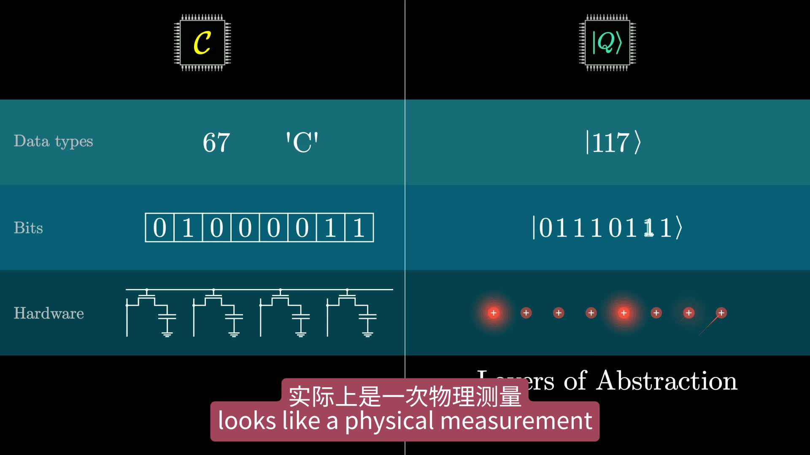

